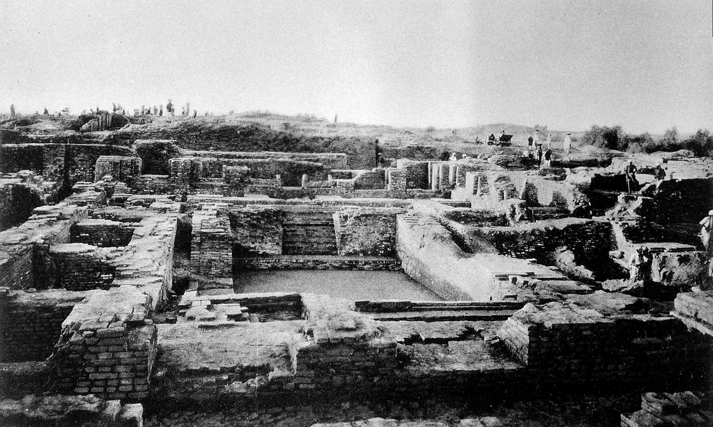
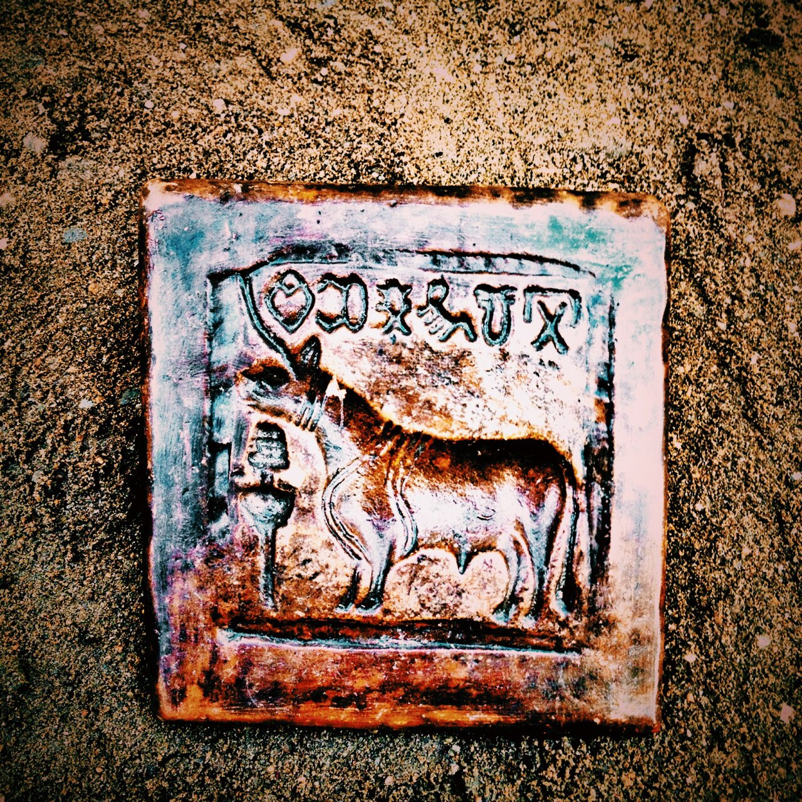
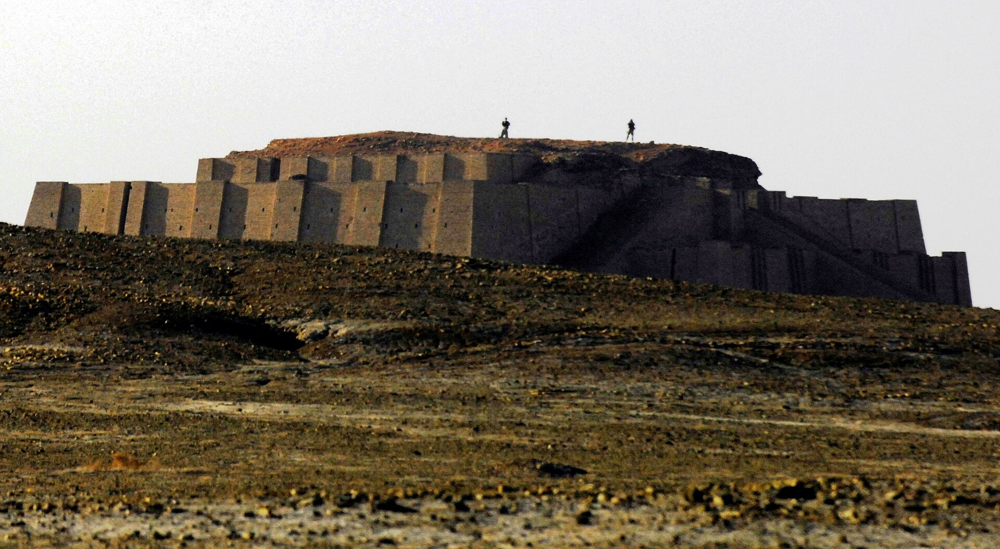
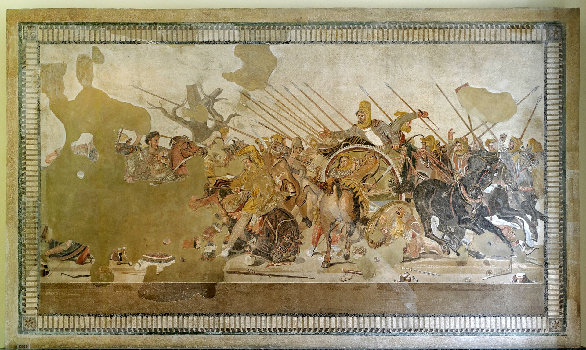

# Deep structures: a world without a centre {#sec-ch01}

::: {.callout-important appearance="simple"}
**Preliminary draft --- under review.** Published for review; content, figures and citations may still change.
:::

::: {.chapter-subtitle}
Before prices, the only measure of integration is the diffusion of goods and ideas.
:::

> "Ships from Meluhha, ships from Magan, and ships from Dilmun he made tie up alongside the quay of Agade."
> — inscription of Sargon of Akkad, c.2300 BCE

## Follow one thing {.unnumbered}

Follow a bead. Sometime around 2500 BCE an artisan in one of the Indus cities took a piece of hard orange carnelian, drilled it lengthwise with a slow stone drill, and etched a white pattern into its surface by a technique that was, for the moment, a Harappan monopoly. The bead travelled. It went down the Indus, along the coast of the Arabian Sea, up the Persian Gulf through the entrepots of Magan and Dilmun, and ended in a grave at Ur, hundreds of kilometres from the hand that made it. No contract survives to tell us who carried it, what was paid, or at what price. The bead itself is the evidence — that two distant economies had touched, that goods and standards moved between them, and that an exchange existed at all. This is how the whole of this chapter must be read: in a world before coins and price-lists, integration is visible only in things, in the diffusion of goods and shared measures rather than in any record of a market. And the bead carried one more clue, in the direction it travelled. Indus goods reached Sumer, and Meluhhan ships docked in Sumerian ports, but no Mesopotamian is recorded reaching the Indus. The Harappans came to their customers; the traffic ran one way. In a period with no prices to compare, that asymmetry is the crudest but clearest sign of who held the initiative — and it makes the Indus, in its first appearance in this book, the most striking agency-holder of a world that did not yet have a centre.^[**Sources:** Dalrymple (Loc 1163, 1168) on the Meluhha trade and the goods reaching Ur; Anthony (loc 4821) on carnelian moving west. **Read more:** Dalrymple, *The Golden Road* (2024).]

{#fig-greatbath width=80%}

## Where we are on the arc {.unnumbered}

This is the first chapter, and it is the one place in the book where the central question cannot yet be asked. The book exists to test a claim — that the weight of the world economy sat in Asia for far longer than we tend to assume — period by period, against the evidence. But "where did the weight sit?" only means something once there is a single connected economy whose weight can be located, and across these four millennia there was not one. There were several loosely linked riverine cores, trading at the edges, rising and falling on their own clocks, but no integrated system with a centre of gravity to find. So this chapter does not return a verdict on the spine; it builds the stage the spine will later stand on. It lays down the geography — the monsoon and the three great channels — that will eventually make the Indian Ocean the natural integrator, and it hands over the tools the rest of the book uses: the four questions, the two yardsticks, and the hard discipline of measuring an economy before it left any prices behind.^[**Sources:** Cunliffe (Loc 158) on the channels frame; Pearson (Ch.1) on the monsoon deep structure. **Read more:** Cunliffe, *By Steppe, Desert, and Ocean* (2015).]

{#fig-cog01 width=76%}

## The stage and the cast

The stage was built by geology and weather. A continental collision some fifty million years ago raised the Himalayas, and the mountains organised the climate of half the world: they created the monsoon, the great reversing wind that blows from the south-west in the northern summer and swings back from the north-east in winter, and they fed the river basins — the Indus, the Ganges, and by analogy the Yellow and Yangtze — where the first surplus-producing societies grew up. The monsoon's deepest gift was reliability. Because the wind reversed on a known schedule, a sailor could ride out on one season's breath and return on the other, which made predictable round-trip voyaging possible across the Indian Ocean in a way the Atlantic and Pacific could not match. That reliability is what the geographer Michael Pearson called the ocean's "deep structure," and it is the master variable of this whole book. But it set possibilities, not outcomes — a stage, not a script. Three corridors were born in these millennia and would carry goods, people and ideas for the next four thousand years: the maritime Indian Ocean, the desert-and-oasis route later called the Silk Road, and the great Eurasian steppe. Around them sat the cast — the riverine cores that could generate a tradable surplus.^[**Sources:** Cunliffe (Loc 158) on the steppe corridor and the three channels; Pearson (Ch.1) on the monsoon deep structure. **Read more:** Pearson, *The Indian Ocean* (2003).]

{#fig-channels width=92%}

::: {.callout-tip}
## Dramatis personae
The economic actors of c.3500--500 BCE, profiled east to west. There is no centre yet, so these are loosely linked cores rather than partners in one system. **India appears in every chapter at the fullest depth** --- here as the Indus civilisation, the period's most striking agency-holder. The steppe comes last not as a periphery but as the era's dynamic engine.
:::

::: {.callout-tip collapse="true"}
## The forming East Asian core

The Yellow and Yangtze valleys were taking shape as an agrarian world in their own right while the Gulf trade ran in the west, but they sat largely outside it. Rice domestication along the Yangtze ran back to roughly 9,500-7,500 BCE, and by 3000 BCE farming had spread across much of what would become the East Asian core; the first Chinese state emerged around 1800 BCE. This was a populous, river-fed agrarian base of the same broad type as Mesopotamia or the Indus, generating surplus and supporting dense settlement, but it grew up on its own metabolism rather than as a node in the western relay.^[**Sources:** Mithen (Loc 7945, 9095); Anthony (loc 7344). **Read more:** Mithen, *After the Ice* (2003).]

What marks the core out for this period is how late the western bronze-and-chariot package reached it. The chariot was invented at Sintashta in the Urals before 2000 BCE and was in the Near East by the nineteenth century BCE, yet it did not appear in China until about 1200 BCE — arriving by way of the steppe, not the Gulf. The same was broadly true of the metallurgy that defined the Bronze Age elsewhere. So the East Asian core was forming on a parallel track, connected to the wider system, if at all, only through the long grass corridor to its north and west.^[**Sources:** Anthony (loc 6171); Cunliffe (loc 1266, 2001). **Read more:** Anthony, *The Horse, the Wheel, and Language* (2007).]

A warning has to travel with all of this. The evidence is thin, and thin in a way that is not neutral: organic records rot in humid monsoon climates and survive in cool, dry ground, so the western record is fuller partly because of preservation and record-keeping, not only because the west was busier. The claims here are correspondingly tentative — absence of data is not absence of activity, and the East Asian core is under-documented for this era rather than demonstrably marginal.^[**Sources:** Mithen (Loc 7937); Scott (Page 100). **Read more:** Scott, *Against the Grain* (2017).]

**Trade profile**

- **Main exports** — little evidence of long-distance export into the western system this early; the core's surplus was consumed and circulated locally.
- **Main imports** — the bronze-and-chariot technology package, arriving overland from the steppe around 1200 BCE rather than by sea.
- **Export markets** — none securely attested in the Gulf or Mesopotamian record for this period.
- **Import sources** — the Eurasian steppe corridor to the north and west, the one channel that reached it.^[**Sources:** Anthony (loc 6171); Mithen (Loc 7945). **Read more:** Mithen, *After the Ice* (2003).]
:::

::: {.callout-tip collapse="true"}
## The Indus civilisation — the agency-holder

The Indus, or Harappan, civilisation grew up along the Indus and its tributaries from roughly 3000 BCE, when its first settlements appeared at much the same moment as the Early Dynastic cities of Sumer, and it reached its mature urban phase between about 2600 and 1900 BCE. Its base, like every economy in this chapter, was agrarian: the alluvium and the flood regime of a great river system fed grain and supported the herds, and the bulk of the population worked the land. What set the Harappans apart was the scale and the order of what they built on that base. Their large cities, Mohenjo-daro and Harappa foremost among them, were laid out to a plan, with gridded streets, fired-brick housing and elaborate covered drains — a degree of deliberate urban engineering with no contemporary equal. Cotton, which had been cultivated in the Indus borderlands at Mehrgarh from around 5500 BCE and woven into cloth on the subcontinent by roughly 5000 BCE, gave the region a textile tradition older than any other.^[**Sources:** Roy (p.20) on the Indus settlements beginning c.3000 BCE, contemporary with Early Dynastic Sumer; Mohan (Loc 531) on the end of the urban era c.1900 BCE; Mithen (Loc 9058) on cotton at Mehrgarh c.5500 BCE; Anthony (loc 4959) on cotton cloth on the subcontinent c.5000 BCE. **Read more:** Roy, *India in the World Economy* (2012).]

Two features of the internal economy stand out, and the second is genuinely puzzling. The first was standardisation. The Harappans used a system of cubical stone weights cut to a consistent ratio scale, and a corpus of inscribed seals, both of which recur across the whole settled zone — the apparatus of an economy in which goods were measured, marked and exchanged to common conventions over long distances. The second is what the cities lack. For all their size and order, the excavated record has yielded no clearly attested palaces, no royal tombs, no monuments to named kings — none of the concentrated display of personal power that defines contemporary Mesopotamia and Egypt. This was, by the standards of its age, an unusually flat urban civilisation, and how it was governed and how its surplus was mobilised without the visible apparatus of monarchy remain open questions rather than settled facts.^[**Sources:** the standardised Harappan weights and seals and the absence of attested palaces or kings follow the mainstream archaeology of the mature phase (c.2600--1900 BCE); Possehl, *The Indus Civilization* (2002), on the "flat" character of Harappan urbanism. **Read more:** Possehl, *The Indus Civilization* (2002).]

Because this period left no prices and no ledgers of the kind later chapters can use, the integration the Harappans achieved cannot be read off a market. It is read instead from the things themselves — from the diffusion of distinctively Indus goods and standards into the lands to the west. Harappan-style seals, the cubical weights, and above all the carnelian beads — including the elaborately etched beads that were a Harappan speciality — turn up in Mesopotamian contexts, and carnelian from the Indus borderlands had been moving north through the Caucasus along the Maikop conduit as early as the late fourth millennium. The presence of Indus craft and Indus measures in distant markets, not any record of transactions, is the evidence that a long-distance economy existed at all.^[**Sources:** Anthony (loc 4821, 4896) on carnelian from western Pakistan moving north via the Maikop conduit c.3700--3400 BCE; Dalrymple (Loc 1163, 1168) on teak, ivory and the Meluhha trade reaching Mesopotamia. **Read more:** Dalrymple, *The Golden Road* (2024).]

{#fig-indusseal width=48%}

Externally, the Harappans ran the period's great long-distance trade, the Gulf route that linked the Indus — the Meluhha of the cuneiform records — to Mesopotamia through the intermediary ports of Magan, on the Oman coast, and Dilmun, the entrepot on Bahrain. Indus exports moving west were craft and forest goods: carnelian and etched-carnelian beads, ivory, hardwoods such as teak, lapis lazuli carried on and re-exported from further north, and pearls; in return came silver, tin, wool, and oil and grain. The structure of the trade is the most telling thing about it. Meluhhan ships docked in Sumer, and Sumerian records even attest a "Meluhhan interpreter", but no Mesopotamian is recorded reaching the Indus. The Harappans came to their customers; their customers did not come to them. That asymmetry — ships moving west and not east — is the crudest but clearest indicator the period offers of who held the agency in the exchange, and it is why the Indus, though it sits in a thin and biased record, can be called the most striking agency-holder of the Bronze Age riverine world rather than a passive supplier at the far end of someone else's reach.^[**Sources:** Dalrymple (Loc 1163, 1168) on the Meluhha trade and the goods reaching Ur and Mesopotamia; Roy (p.27) on the long-run pattern of ships carrying goods to and from India. **Read more:** Dalrymple, *The Golden Road* (2024).]

The urban phase ended around 1900 BCE: the great cities were given up, the weights-and-seals apparatus fell out of use, and the settled population shifted east toward the Ganges plain. This decline was broadly coincident with the weakening of the monsoon around 2000 BCE, the so-called 4.2 ka event, and the temptation to read the one as the cause of the other is strong. It should be resisted as a clean story. The palaeoclimate record does not show a single sharp drought of the right timing and depth to topple a civilisation; the better-attested change was a gradual drying and shifting of the rivers that fed the Harappan heartland. Whether the end is best explained by abrupt climate forcing, by slow hydrological change, or as a multi-causal social transformation in which the cities were abandoned but the people and their culture were not destroyed, remains genuinely contested — and "de-urbanisation" fits the evidence better than "collapse".^[**Sources:** Williams (loc 1194, 1197) on reduced river flow c.4500--4200 years ago linked to the Indus and Akkad; Mithen (loc 9959) on c.2000 BCE drought disrupting the Mesopotamian and Indus civilisations; Mohan (Loc 531) on the end of the urban era c.1900 BCE. **Read more:** Possehl, *The Indus Civilization* (2002).]

**Trade profile**

- **Main exports** — carnelian and etched-carnelian beads, ivory, hardwoods (teak), pearls, and lapis lazuli carried on and re-exported from further north; cotton textiles from the world's oldest cotton tradition.
- **Main imports** — silver, tin, wool, and oil and grain.
- **Export markets** — Mesopotamia (Sumer and Akkad), reached through the Gulf intermediaries Magan (Oman) and Dilmun (Bahrain).
- **Import sources** — the same Gulf route in reverse, with Dilmun and Magan as the entrepots through which Mesopotamian silver and the metals of the wider Near East passed back to the Indus.^[**Sources:** Dalrymple (Loc 1163, 1168) on the Meluhha trade goods and the Gulf route; Roy (p.20, p.27) on the Indus settlements and the long-run trade pattern; Mithen (Loc 9058) on the Indus cotton tradition. **Read more:** Dalrymple, *The Golden Road* (2024).]

{#fig-mapindus01 width=85%}
:::

::: {.callout-tip collapse="true"}
## Dilmun — the Gulf entrepot

Dilmun, centred on Bahrain, was the hinge of the Gulf trade that linked the Indus world to Mesopotamia from about 3000 BCE. Goods moved up the Gulf in stages: the Indus (known to the Sumerians as Meluhha) supplied carnelian, ivory, hardwoods, lapis and etched beads; Magan, on the Oman side, supplied copper; and Dilmun sat in the middle, gathering these and passing them on into Sumer. Its position made it the natural meeting point between the seaborne traffic of the lower Gulf and the river cities at its head.^[**Sources:** Pearson (Ch.3); Frahm (Page 46). **Read more:** Pearson, *The Indian Ocean* (2003).]

The economic logic is the one the module returns to again and again. Dilmun produced little of what it traded. Its wealth came from controlling a chokepoint — re-exporting Indus and Magan goods into the Mesopotamian demand-core and taking a cut on the way through. Value was captured not by making the carnelian or smelting the copper but by sitting astride the route along which they had to pass. That is the bottleneck-and-toll pattern: whoever controls the narrow passage between a supplier and a hungry market can levy the difference, and the entrepot grows rich on other people's goods.^[**Sources:** Pearson (Ch.3); Kriwaczek (Page 49). **Read more:** Cunliffe, *By Steppe, Desert, and Ocean* (2015).]

The structure also reveals who held agency. Meluhhan ships docked in Sumer, and a Sumerian seal records a "Meluhhan interpreter," yet no Mesopotamian is known to have reached the Indus. The Harappans ran their end of the trade, and Dilmun ran the middle; the great demand-core at Uruk and its successors was the pole the system fed, not the party that organised the voyages. Reading the direction of the ships, in the absence of prices, is one of the few ways to infer who was active and who was being supplied.^[**Sources:** Pearson (Ch.3); Scott (Page 805). **Read more:** Pearson, *The Indian Ocean* (2003).]

**Trade profile**

- **Main exports** — re-exported goods rather than home produce: Indus carnelian, ivory and hardwoods; Magan copper passed upstream into Sumer.
- **Main imports** — silver, wool, oil and grain coming down from Mesopotamia, plus the goods it held in transit.
- **Export markets** — the Mesopotamian cities at the head of the Gulf, above all the Sumerian demand-core.
- **Import sources** — Meluhha (the Indus) and Magan (Oman) below it on the route.^[**Sources:** Pearson (Ch.3); Frahm (Page 46). **Read more:** Pearson, *The Indian Ocean* (2003).]
:::

::: {.callout-tip collapse="true"}
## Mesopotamia and Uruk — the demand core

Mesopotamia was the period's most commercially central node, and Uruk was its showpiece. Around 3000 BCE the city held perhaps 40,000 to 60,000 people behind walls that enclosed some 250 hectares — roughly twice the footprint of classical Athens three millennia later — and its population had tripled across the preceding two centuries. This was urbanism on a scale the world had not seen before, and it rested on an organised hinterland: a ring of perhaps twenty competing city-states replicated the Uruk form across the southern alluvium, each drawing grain from a tax reach of only about forty-eight kilometres and a levy unlikely to fall below a fifth of the harvest. The cuneiform that recorded all of this was not born as literature but as administration — the pictographic accounting tablets of around 3100 BCE registered transactions, rations and stores, so that writing itself was a by-product of running a redistributive economy.^[**Sources:** Scott (Page 805, 802, 796, 829); Frahm (Page 34); Goetzmann (loc 561). **Read more:** Scott, *Against the Grain* (2017).]

{#fig-ziggurat width=72%}

The clearest window onto how that economy worked was textile manufacture. Uruk's state workshops engaged as many as 9,000 women — on the order of a fifth of the whole city — spinning and weaving wool into cloth that the temple and palace then disbursed or traded. An establishment of that size, fed and housed from central stores and producing on central account, looks like a command economy: goods flowed up to the institution as grain and wool, and back down as rations and finished cloth, in the redistributive pattern Karl Polanyi placed at the heart of the early Near East. Whether that was the whole story is the live debate. The same society also ran private loans, partnerships and price-sensitive long-distance ventures, which point to genuine market exchange alongside the palace ledger; the honest position is that temple-and-palace redistribution and market dealing coexisted, and the balance between them remains contested rather than settled.^[**Sources:** Scott (Page 1040); on Polanyi's redistribution model and the market-exchange counter-reading. **Read more:** Scott, *Against the Grain* (2017).]

Money and credit were already mature, well before any coin was struck. Silver and barley served as units of account and means of payment — a white-sheep shearing tax assessed at five shekels of silver, a measure of grain priced against a fixed weight of metal — so that prices existed even though coinage did not. Interest-bearing debt had been invented by around 3000 BCE, helped along by a convenient 360-day reckoning of the year, and the rates were later codified under Hammurabi at 20 per cent on silver and 33 1/3 per cent on barley. Debt could spiral into bondage, and rulers periodically wiped the slate: in about 2400 BCE Enmetena of Lagash declared *amargi* — "freedom" — cancelling debts and standing as the first recorded use of the word "freedom" in a political document. Credit, in short, belonged to this economy from the start; what arrived later was minted coinage and the continuous price series that came with it.^[**Sources:** Graeber (Loc 8075, 4560); Goetzmann (loc 592, 836, 838); Kriwaczek (Page 101). **Read more:** Graeber, *Debt: The First 5,000 Years* (2011).]

What made Mesopotamia the demand pole was its geology. The southern alluvium was rich in silt and grain but had almost no metal, building stone or timber of its own, so the materials of an urban civilisation had to be imported. Even Uruk's monumental architecture leaned on stone hauled some eighty kilometres, and the metals, hard stones and fine woods came from much further. An integrated trading sphere — the "Uruk world system" — already linked the Iranian plateau to the eastern Mediterranean between about 3500 and 3100 BCE, then contracted around 3000 BCE as the lapis routes were cut and an era of warring city-states began. The luxuries it had carried travelled astonishing distances: lapis lazuli from Badakhshan in Afghanistan moved roughly 2,500 kilometres to reach Mesopotamia, and onward to Egypt. The resource-poor core, in other words, generated the demand that pulled goods across half a continent.^[**Sources:** Scott (Page 1199); Kriwaczek (Page 40, 49, 72); Frahm (Page 46). **Read more:** Kriwaczek, *Babylon* (2010).]

The mechanics of that import trade are best seen in the early second-millennium tin caravans between Ashur and the Anatolian colony at Kanesh. Donkey trains of fifty or more animals carried tin and textiles roughly 950 kilometres on a journey of about fifty days, exchanging them for silver. The arbitrage was the point: tin stood at about 15 units of silver per unit at Ashur but only about 7 in Anatolia, where it was scarcer and dearer, and the textiles fetched three to four times their Assyrian price. Merchants reckoned profits near 100 per cent on the ore and 200 per cent on the cloth — price differences read off and acted upon, arbitrage long before coinage. To the south-east, a separate maritime arm ran down the Gulf: Sumer drew copper from Magan (Oman) and exotic goods from Meluhha (the Indus), traded through the entrepot of Dilmun (Bahrain), with one Ur merchant, Ea-nasir, assembling fifty-one investors for a single Dilmun venture. Tin, copper, lapis and carnelian flowed in; the demand core sat at the western end of the longest exchange networks of the age.^[**Sources:** Frahm (Page 47, 48); Kriwaczek (Page 215, 216, 49); Goetzmann (loc 940). **Read more:** Frahm, *Assyria* (2023).]

**Trade profile**

- **Main exports** — silver and barley (also serving as money and units of account); woollen textiles from the state workshops; grain and other agricultural surplus of the irrigated alluvium.
- **Main imports** — the materials the alluvium lacked: tin and copper for bronze, building stone and timber, and high-value luxuries (lapis lazuli, carnelian, ivory, hardwoods).
- **Export markets** — Anatolia (textiles and silver through Kanesh); the Gulf trade with Magan and the Indus via the Dilmun entrepot; the wider Uruk-system sphere from the Iranian plateau to the eastern Mediterranean.
- **Import sources** — Anatolia and the eastern highlands (metals, silver); Badakhshan (lapis, ~2,500 km away); Magan/Oman (copper) and Meluhha/the Indus (carnelian, ivory, hardwoods) through Dilmun.^[**Sources:** Frahm (Page 46, 47, 48); Kriwaczek (Page 40, 49, 215); Scott (Page 1199). **Read more:** Kriwaczek, *Babylon* (2010).]

{#fig-mapmeso01 width=85%}
:::

::: {.callout-tip collapse="true"}
## Egypt — the Nile apart

Egypt was a riverine core of the first rank, but it stood largely outside the Gulf system that linked the Indus to Mesopotamia. Its wealth came from the Nile: a narrow ribbon of irrigated land whose predictable flood underwrote dense agriculture and a centralised state through the Old, Middle and New Kingdoms, from about 2686 BCE onward. Where Mesopotamia depended on uncertain rainfall and rivers, Egypt's annual inundation gave it an agrarian base reliable enough to sustain monumental building and a deep bureaucracy, a precocious complexity to rival anything in the Near East.^[**Sources:** Scott (Page 1064, 1076); Cline (loc 505). **Read more:** Scott, *Against the Grain* (2017).]

Egypt traded, but along its own axes rather than through the Gulf. It looked south to Punt for incense, ivory and exotic goods, and east through the Sinai and the Red Sea margins for copper, turquoise and contact with the Levant. Lapis lazuli from Afghanistan reached Egypt by overland relay, a reminder that it was tied into the wider Bronze Age web at the edges. But its trading face pointed down the Nile corridor and across the Sinai land bridge, not down the Persian Gulf, and the Indus-to-Sumer relay ran without it.^[**Sources:** Frahm (Page 46); Kriwaczek (Page 49). **Read more:** Cline, *1177 B.C.* (2014).]

So Egypt is best read as precocious but separate: an early, rich, highly organised state that developed in parallel with the Gulf system rather than as part of it. It mattered enormously in the later eastern-Mediterranean world — by the fourteenth century BCE its correspondence with Hatti, Babylon and the Aegean shows it deep in the palace-economy network whose collapse around 1177 BCE it barely survived. For the first integration of the Gulf, though, it is a neighbouring core, not a participant.^[**Sources:** Cline (loc 1065, 3285). **Read more:** Cline, *1177 B.C.* (2014).]

**Trade profile**

- **Main exports** — Nile agricultural surplus and manufactured goods; gold from the eastern deserts and Nubia.
- **Main imports** — incense and ivory from Punt; copper and turquoise from Sinai; lapis from Afghanistan by overland relay.
- **Export markets** — the Levant and, increasingly, the eastern-Mediterranean palace world.
- **Import sources** — Punt to the south, Sinai and the Red Sea to the east, the Levant to the north-east.^[**Sources:** Cline (loc 505, 1065); Frahm (Page 46). **Read more:** Cline, *1177 B.C.* (2014).]
:::

::: {.callout-tip collapse="true"}
## The steppe — the dynamic engine

The Eurasian steppe was no periphery but the era's main artery: an unbroken grass corridor of roughly 9,000 km running from the Hungarian Plain to Manchuria. What turned this ribbon of grass into a power-and-information highway was the horse. A herder on foot could manage about 200 sheep; mounted, the same herder could manage some 500, and could cross the open country at 50-60 km a day. Mobility on that scale gave the steppe peoples a reach the settled cores could not match, and made the corridor the fastest channel for moving people, animals and news across the continent.^[**Sources:** Cunliffe (loc 158, 909). **Read more:** Cunliffe, *By Steppe, Desert, and Ocean* (2015).]

A cluster of innovations compounded the advantage. The wheel and then the chariot — invented at Sintashta in the Urals before 2000 BCE — spread outward along the grass, reaching the Near East by the nineteenth century BCE and China only around 1200 BCE. Alongside these ran what Andrew Sherratt called a "secondary-products revolution": the use of animals for traction, wool and dairy rather than meat alone. That thesis is contested — whether it was a single fourth-millennium event or a gradual, patchy adoption is debated — but the underlying shift, animals exploited while alive, was real and it multiplied what a pastoral economy could yield.^[**Sources:** Anthony (loc 6171); Cunliffe (loc 1266). **Read more:** Anthony, *The Horse, the Wheel, and Language* (2007).]

The corridor was also a vector of migration. The Yamnaya expansion out of the Pontic-Caspian steppe around 3000 BCE has been associated, on present ancient-DNA readings, with the replacement of up to roughly 90 per cent of Europe's gene pool — a striking figure that should be held cautiously, since the genetics and its demographic interpretation are still moving. The steppe, then, was a channel and an engine at once: it raided the settled cores, traded with them, and at times poured into them, shaping the riverine worlds it bordered rather than merely lying beyond them.^[**Sources:** Spinney (Loc 754, 1338); Anthony (loc 5149). **Read more:** Anthony, *The Horse, the Wheel, and Language* (2007).]

**Trade profile**

- **Main exports** — horses, mounted mobility, and metal-working skill; above all the capacity to move goods, people and force at speed.
- **Main imports** — grain, textiles and finished metalwork drawn from the settled cores.
- **Export markets** — the riverine cores it raided, traded with and migrated into, from Mesopotamia to the forming East Asian core.
- **Import sources** — the same settled cores, supplying the agricultural and manufactured goods the grassland could not produce.^[**Sources:** Cunliffe (loc 158, 909); Anthony (loc 6171). **Read more:** Cunliffe, *By Steppe, Desert, and Ocean* (2015).]
:::

::: {.callout-note}
## How we know
Before coins there were no prices, and that single absence governs everything this chapter can claim. Integration, in every later period of this book, is read off price convergence: when the same good costs the same in two places, the two places are one market. For the Bronze Age that test cannot be run, because the machinery of mints and quoted prices lay a thousand years ahead. So integration had to be read a cruder way, archaeologically, from the diffusion of goods and the spread of shared standards. An Indus seal turning up in a Mesopotamian layer, a set of Harappan weights, a string of etched carnelian beads in a Sumerian grave: each was a physical trace that two distant economies had touched. The traffic also pointed a direction. Meluhhan ships docked in Sumer and a Sumerian seal even named a "Meluhhan interpreter," yet no Mesopotamian is recorded reaching the Indus, an asymmetry that works as a rough indicator of who held the agency in the trade. The record itself was biased, and the bias ran one way. Organic things rotted in the humid monsoon tropics but survived in cool, dry Europe and arid Egypt, so the surviving evidence systematically under-documented the ocean world this module centres on. The rule to carry from here is that absence of data was not absence of activity.

*Sources: on reading integration by the diffusion of goods, and the Indus weights, seals and carnelian beads in Mesopotamia, Frahm (Page 46); on the Meluhhan ships and interpreter and the survival bias, Cunliffe (Loc 158). Read more: Cunliffe, By Steppe, Desert, and Ocean (2015).*
:::

## The period on its own terms

The period ran not as one smooth arc but as a sequence of integrations that rose and then came apart, three times over, on a stage that geology had set tens of millions of years before the first city.

{#fig-cycles01 width=92%}

**Phase 0 — deep time: the stage is built.** Long before there was anything to call an economy, the board on which one would be played was assembled by a continental collision. Around fifty million years ago the Indian plate drove into Asia and threw up the Himalayas, and the mountains in turn organised the climate of half the world. The wall of high ground created the monsoon: a vast reversing wind-clock that blows from the south-west in the northern summer and swings back from the north-east in winter, and a system of meltwater and rainfall that fed the great river basins where the first surplus-producing societies would form. The same orogeny that filled the Indus and the Ganges shaped, by analogy, the Yellow and Yangtze cores further east. The monsoon's deep gift was not rain alone but reliability: because the wind reversed on a known schedule, a sailor could ride out on one season's breath and home on the other, which made predictable round-trip voyaging possible across the Indian Ocean in a way the Atlantic and Pacific could not match. This is the master variable of the whole module, but it must be read carefully. Geography here set possibilities, not outcomes; it built a stage, not a script. The same monsoon that later carried goods between coasts could, when it weakened, help hollow out a civilisation, and that tension runs through everything that follows. The determinism is real but bounded: deep structures shaped what could happen, while people still chose the moves, a caution worth holding against the harder geographic readings of Cunliffe and, before him, Diamond.^[**Sources:** Cunliffe (Loc 158); Pearson (Ch.1). **Read more:** Cunliffe, *By Steppe, Desert, and Ocean* (2015).]

**Phase 1 — the first integration and its contraction (c.3500–3000 BCE).** The earliest integrated trading sphere the record shows did not run through the Gulf at all, but overland across the northern Near East. From roughly 3500 to 3100 BCE a "Uruk world system" linked the Iranian plateau to the eastern Mediterranean, drawing distant materials toward the Mesopotamian alluvium where the world's first true cities were rising. Uruk itself was already a demand-core of startling size: by about 3000 BCE perhaps forty to sixty thousand people lived behind walls enclosing some 250 hectares, twice the footprint of classical Athens three millennia later, and its state textile workshops employed as many as nine thousand women, on the order of a fifth of the city. Such a place pulled goods from far away. Lapis lazuli from the mines of Badakhshan in north-eastern Afghanistan travelled roughly 2,500 kilometres to reach Mesopotamia, and the same blue stone had been carried as far as Egypt earlier still. This was integration in its archaic form, measurable not by prices but by the diffusion of materials far from their sources. Then it came apart. Around 3000 BCE the Uruk system contracted: the long-distance exchange network broke, and the routes that had carried Afghan lapis north and west were cut, opening an era of warring city-states in its place. The period's first paired peak-and-fall therefore happened before the Gulf trade that the older accounts foreground, which means the integration-then-disintegration rhythm that defines this whole story began one cycle earlier than is often assumed.^[**Sources:** Scott (Page 1199, 805, 1040); Kriwaczek (Page 49, 72); Frahm (Page 34). **Read more:** Scott, *Against the Grain* (2017).]

**Phase 2 — the Gulf trade, and the Harappans ran it (from c.3000 BCE).** As the overland system frayed, a maritime one took its place along the Gulf, and it ran east. From about 3000 BCE a sea trade connected the Indus cities, known to the Sumerians as Meluhha, to Mesopotamia by way of two intermediaries: Magan, on the Oman peninsula, and Dilmun, the entrepot on Bahrain through which goods were trans-shipped. The flows were two-way in commodity but lopsided in agency. The Indus exported carnelian, ivory, hardwoods, lapis, etched-carnelian beads and pearls, and took back silver, tin, wool and oil or grain. The most telling detail is not what moved but who moved it. Meluhhan ships docked in Sumerian ports, and a Sumerian seal even names a "Meluhhan interpreter", yet there is no sign of a Mesopotamian reaching the Indus. The Harappans ran the trade; they came west, and the Sumerians did not go east. In a period with no prices to convergence-test, this asymmetry serves as a crude indicator of who held the agency in the relationship, and it places India, in its first appearance in the story, as the most striking agency-holder of the age, even if it remains a bright spot in a thin record rather than the centre of anything. The value in such a system often sat not with producer or consumer but with whoever held the chokepoint: Dilmun re-exported Indus and Magan goods into Sumer and took a cut without producing them, a bottleneck-and-toll logic that recurs across the whole module.^[**Sources:** Kriwaczek (Page 49); Scott (Page 1551). **Read more:** Ratnagar, *Trading Encounters* (2004).]

**Phase 3 — the steppe revolution.** While the riverine cores traded, the great grass corridor to their north was being transformed into the era's main highway of mobility and power. The Eurasian steppe ran in an almost unbroken band of grassland some 9,000 kilometres from the Hungarian Plain to Manchuria, and a cluster of innovations turned it from barrier into channel. Horse domestication multiplied what a single person could control: a herder on foot managed perhaps two hundred sheep, but mounted he could handle five hundred and move at fifty to sixty kilometres a day. To this Sherratt's "secondary-products revolution" added traction, wool and dairy, drawing sustained value from living animals rather than only their carcasses, and the wheel and wagon gave the grassland its transport. The decisive military technology came from the steppe's own edge: the chariot was invented at Sintashta, east of the Urals, before 2000 BCE, reached the Near East within a century or two, and arrived in China only around 1200 BCE, a thousand years after its origin. These tools powered the great Indo-European expansions that reshaped the genetic and linguistic map of Eurasia; the Yamnaya migrations associated with this horizon are estimated to have replaced up to ninety per cent of Europe's gene pool around 3000 BCE, though the migration-and-linguistics detail is contested terrain best treated lightly. The steppe was no periphery in this period. The well-documented, well-connected system of the Bronze Age was overland and western-Eurasian, and the grass corridor was its dynamic engine.^[**Sources:** Cunliffe (Loc 158, 909, 1266); Anthony (Loc 6171); Spinney (Loc 754). **Read more:** Anthony, *The Horse, the Wheel, and Language* (2007).]

**Phase 4 — the first great unwinding (c.1900 BCE).** Around 1900 BCE the Harappan cities began to empty. The mature urban phase of the Indus civilisation gave way to de-urbanisation and an eastward shift of population, and the great planned cities lost the density that had defined them. This de-urbanisation was broadly coincident with the so-called 4.2 ka event, a weakening of the monsoon and a reduction of Indus discharge that pushed the region toward aridity. The temptation is to read the climate as the cause, and one influential line, associated with Staubwasser and with Gupta and colleagues, does treat abrupt climate forcing as the trigger. But the link should be taught as a debate, not a settled fact, because the evidence does not support a single clean story. A second account, from Giosan and others, emphasises gradual landscape and hydrological change as rivers shifted and dried, a slow drying rather than a sharp drought. A third, associated with Possehl, reframes the episode as multi-causal social transformation rather than "collapse" at all. The decisive caveat is that the palaeoclimate record does not cleanly show a sharp, sustained three-century drought of the kind a mono-causal climate story requires, which leaves the question of how much explanatory weight climate should carry genuinely open. What is clear is that the period's first great civilisational unwinding fell on the Indus, and that it did so as the monsoon that had built the stage turned, for a time, against the people living on it.^[**Sources:** Williams (Loc 1194). **Read more:** Possehl, *The Indus Civilization* (2002).]

**Phase 5 — the Late Bronze Age Collapse (c.1177 BCE), and the reset by 500 BCE.** Centuries later, the densely interconnected palace economies of the eastern Mediterranean failed together, and they failed as a system. By the thirteenth century these states had woven themselves into a tight web of exchange whose fragility was the price of its integration. Its dependence on long-distance metal makes the point: bronze needed tin, which sat almost nowhere near the cities that used it, so it had to travel, and a single cargo could carry extraordinary volumes. The Uluburun ship, wrecked off the Anatolian coast around 1350 BCE, went down with roughly ten tonnes of copper and about a tonne of tin, alongside glass, resin and ivory, with goods originating from at least seven countries; tin's role, one historian wrote, was probably not far different from that of crude oil today. When the web tore around 1177 BCE the cost was systemic. Mainland Greece may have lost forty to sixty per cent of its people, falling from perhaps six hundred thousand to around three hundred and thirty thousand, and Babylonia possibly as much as three-quarters before any recovery. Ugarit, destroyed around 1190 BCE, saw some eight thousand inhabitants flee and was not reoccupied for roughly six hundred and fifty years. This was integration's first systemic failure, and its lesson, inherited by the whole module, is that a tightly connected system can break in a way a loose one cannot. From the wreckage a new order slowly assembled. By about 500 BCE the Achaemenid Persian empire had knitted the Near East back together, iron had displaced bronze and loosened the old tin bottleneck, and early coinage had begun to give the world its first standardised money, resetting the board and handing the story on to the next chapter, where the channels would fuse into the first genuinely trans-Eurasian system.^[**Sources:** Cline (Loc 1646, 177, 507, 1335, 2393, 2400). **Read more:** Cline, *1177 B.C.: The Year Civilization Collapsed* (2014).]

## Reading the period: the four questions

The four millennia from about 3500 to 500 BCE can be put through the same four questions that drive the rest of this book, with the warning that the answers here are softer than any later chapter's, because the evidence is thinner and the system looser. They are worth running all the same, because this is where the questions themselves are forged.

The first question was about direction: was the system integrating or disintegrating? The honest answer was that it did both, repeatedly, and that no single arc ran through the period. An early integrated sphere, the so-called Uruk world system, reached from the Iranian plateau to the eastern Mediterranean around 3500 BCE and then contracted near 3000 BCE as its long lapis routes were cut. The Gulf trade that linked the Indus to Mesopotamia rose after that and unwound in its turn. The eastern-Mediterranean palace economies knit themselves tightly together across the second millennium and then came apart around 1177 BCE in the Late Bronze Age Collapse, when mainland Greece may have lost something between forty and sixty per cent of its people. The pattern was a sequence of integration-then-fragmentation cycles, the module's rhythm in miniature, and the lesson it bequeathed to every later chapter was that integration bred fragility: the routes that carried trade also carried shocks, and a more connected system was a more exposed one.^[**Sources:** Scott (Page 1199); Kriwaczek (Page 72); Cline (Loc 507). **Read more:** Cline, *1177 B.C.: The Year Civilization Collapsed* (2014).]

The second question was about channels, and this period's answer is that all three of the module's corridors were born here at once. The maritime Indian Ocean, the desert and oasis route that would later be called the Silk Road, and the great Eurasian steppe all took shape in these millennia. Of the three, the steppe was the era's dynamic engine, not its periphery: a band of unbroken grass running some nine thousand kilometres from the Hungarian plain to Manchuria, across which a mounted herder could move at fifty to sixty kilometres a day once the horse was domesticated and the wheel and chariot followed. The ocean, the corridor this book centres on, was still largely waiting, its monsoon geography laid down but its traffic thin. To see how the channels actually worked, it helps to follow one good through the system, and the most revealing is tin. Bronze, the period's defining metal, needed tin, yet tin lay almost nowhere near the cities that used it, so it had to travel long distances to reach them. Its price marked the route. Tin stood at roughly fifteen parts silver to one at Ashur but only about seven to one in Anatolia, a gap that pulled the metal across it, and at Mari the palace records valued tin at around ten times its weight in silver. This was arbitrage operating centuries before any coin existed to express it, visible only in the barter ratios that the cuneiform records preserve. The volumes were not trivial either: a single cargo such as the one lost off Uluburun around 1350 BCE carried perhaps a tonne of tin in one hull.^[**Sources:** Cunliffe (Loc 158, 909); Frahm (Page 47); Anthony (Loc 6829); Cline (Loc 1646). **Read more:** Cunliffe, *By Steppe, Desert, and Ocean* (2015).]

::: {.callout-important}
## Follow the money
With no coins yet, the period's bullion tracer was the relative price of metals, and tin is the clearest one to track. It had to travel because bronze needed it and it lay far from the cities that consumed it. The gap between its price at Ashur, around fifteen parts silver to one, and in Anatolia, nearer seven to one, was arbitrage before coinage, the metal flowing from where it was cheap toward where it was dear. This is the same "follow the metal" logic the module will use for millennia to locate the centre, except that here it shows up in barter ratios scratched onto clay rather than in the output of any mint.
:::

{#fig-tin width=72%}

It was not only raw metal that moved. High-value processed goods travelled too, and they mattered out of proportion to their bulk because the value lay in the labour locked into them. Ugarit, for one, paid its yearly tribute to the Hittites not only in gold but in dyed wool and finished garments, cloth being among the most concentrated stores of value a Bronze Age economy could ship. The vivid later case of such a luxury is Tyrian purple, the dye won at enormous labour from murex sea-snails, whose extreme cost made it a marker of rank for the rest of antiquity. Here a caution is needed. One scholar, Morris Silver, has read the Aegean Bronze Age textile and purple trade as evidence of a far more commercialised, market-like world than the orthodox picture allows, even casting the Trojan War as a trade war; that bolder reading is a contested hypothesis rather than settled fact, and is best treated as one provocative interpretation of the same material that more cautious accounts read as palace-administered exchange.^[**Sources:** Cline (Loc 2308); on the market-formalist reading of Aegean Bronze Age purple and textiles as a contested hypothesis, Silver, *The Purpled World* (2023). **Read more:** Cline, *1177 B.C.* (2014).]

{#fig-murex width=52%}

{#fig-uluburun width=66%}

The third question was about modes: which kinds of flow did the integrating? Goods and metals were the obvious answer, and the tin trade shows both. The answer students least expect is that mature credit belongs on the list from the very start. Far from a pre-monetary world waiting for coins, Mesopotamia ran interest-bearing debt by about 3000 BCE, with rates later codified by Hammurabi at twenty per cent on silver and a third on barley, and the practice was old and routine enough that recurring royal edicts cancelled debts to relieve the strain. The earliest of these, Enmetena of Lagash's *amargi* declaration around 2400 BCE, is the first recorded use of a word for "freedom" in any political document. Finance, in other words, was part of this period's economy and not something that arrived only with coinage; what was genuinely later was minted money and the price series it makes possible.^[**Sources:** Graeber (Loc 8075, 4560). **Read more:** Graeber, *Debt: The First 5,000 Years* (2011).]

The fourth question was about Europe, and the answer was that Europe sat on the far margin, a late and peripheral recipient rather than a maker of this world. It is worth being precise, because Europe was not simply backward: it was precocious in metal. The cemetery at Varna on the Black Sea coast, around 4500 BCE, yielded some three thousand gold objects weighing roughly six kilograms, more gold than all the other fifth-millennium finds in the world put together. But precocity in a single craft on the edge of the system is not centrality, and the riverine cores of the Near East and the Indus ran the integration that defined the age while Europe received its echoes. Behind all four questions stood the forces this module tracks. Geography was the master variable, the Himalayan uplift and the monsoon and the great rivers setting the board. Climate was the first dynamic driver, its swings bearing on the rise and fall of cores. And technology, the sail married to monsoon knowledge, the horse, the wheel, bronze, was the enabler that turned geographic possibility into movement.^[**Sources:** Anthony (Loc 3941); Spinney (Loc 547). **Read more:** Anthony, *The Horse, the Wheel, and Language* (2007).]

## The verdict: where was the centre?

The verdict for this period is that there was no single centre, and it is delivered with low confidence by design. What the evidence shows is several loosely linked riverine cores rather than one integrated world economy with a weight that can be located. The Near East, and Uruk above all, was the most central node, a large urban demand pole and the supplier of metals into the long-distance trade. The Indus was an active, agency-holding trader that actually ran the Gulf route west, but it survives as a bright spot in a thin record rather than as a documented centre. That thinness is the point, not a flaw in the argument: the Indus looks like a single bright patch precisely because the humid record under-documents it, which vindicates the survival warning of the opening rather than breaking it. Egypt and the forming East Asian core sat largely apart from the western-Eurasian system that the evidence actually documents.^[**Sources:** Scott (Page 805); Frahm (Page 46). **Read more:** Frahm, *Assyria* (2023).]

This is where the chapter must say plainly what it cannot do. The centre-of-gravity question that runs through the rest of the book — whether the weight of the world economy sat in Asia, and whether it was moving — is not yet applicable here. This period neither supports nor contradicts the claim that Asia was central, because it predates a connected system in which a centre of gravity is even a meaningful idea. There were cores, but they were not yet bound tightly enough into one economy for the question to be asked, let alone tested. The first chapter at which the question becomes answerable is the next one, when Alexander and the Achaemenid inheritance fuse the channels into something like a single trans-Eurasian system. What this chapter contributes is therefore structural rather than evidential. It lays down the monsoon and the channel geography that will later make the Indian Ocean the natural integrator and centre the very system the book goes on to track.^[**Sources:** Pearson (Ch.1) on the monsoon deep structure and the channels. **Read more:** Pearson, *The Indian Ocean* (2003).]

The denominator has to be kept honest. These were overwhelmingly agrarian subsistence economies in which the great majority farmed and never handled a trade good; the long-distance traffic described here was a thin and lucrative network laid over that mass, not the bulk of output. And a second caution governs what "success" can mean in this world. Whatever thriving the period shows was measured in numbers, not income per head: more food meant more people rather than richer people, the Malthusian condition humanity shared with every other species. The switch from measuring an economy by its scale to measuring it by the living standards of the people in it lies far ahead, at the Great Divergence of @sec-ch07. Hold the two apart from the start: aggregate weight now, per-capita prosperity much later.^[**Sources:** Scott (Page 631). **Read more:** Scott, *Against the Grain* (2017).]

::: {.callout-warning}
## The debate: how much weight should geography carry?
Cunliffe, and Diamond before him, lean hard on geography as the master variable — the mountains and monsoon and grass corridors setting what was possible. The counter stresses human agency and contingency, the choices that geography permitted but did not dictate. The climate-collapse story is contested in the same way. The 4.2 ka weakening of the monsoon is invoked behind the Harappan decline, and drought behind the Late Bronze Age Collapse, yet the palaeo-record does not cleanly show a sharp, sustained drought at the right moment, so mono-causal climate accounts overreach. The sensible posture is to hold both at once: deep structures shaped the board on which the period was played, but people still chose the moves. Name the positions, weigh them, and leave the question genuinely open.
:::

::: {.column-page}
**Data exhibit — the Uluburun cargo, a dataset of one.** With almost no quantitative records, a single well-excavated shipwreck does the work a price series does in later chapters. The Uluburun vessel, lost off the Anatolian coast around 1350 BCE, carried roughly 10 tonnes of copper and about 1 tonne of tin — close to the 10:1 ratio that bronze requires — together with glass ingots, ebony, ivory, resin and finished goods, with raw materials and objects originating from at least seven different polities. *What you could do with this:* itemise the cargo, infer how many separate economies one hull implicates, and ask what the copper-to-tin ratio implies about where the metals were sourced and where the bronze was to be made — reasoning from one rich object to a whole system, with the uncertainty stated.
:::

## Threads forward

This chapter's gift to the rest of the book is the toolkit, not a verdict. It introduced the four questions — direction, channels, modes, and Europe's place — and ran them on a period too loose to answer the centre-of-gravity question, precisely so that the questions are in hand when the next chapter can. It introduced the two yardsticks that travel the whole way: how to measure integration (price convergence later, the diffusion of goods now), and what "success" means (numbers now, income per head only after the Great Divergence of @sec-ch07). And it planted the lesson that integration breeds fragility, the thread that runs from the Late Bronze Age Collapse through every later disintegration the book meets.^[**Sources:** Scott (Page 631); Cline (Loc 507). **Read more:** Findlay & O'Rourke, *Power and Plenty* (2007).]

The hand-off to the next chapter is geographic and institutional at once. By about 500 BCE the Achaemenid empire had reunited the Near East, iron had loosened the tin bottleneck, and coinage had begun to standardise money. With Alexander as the hinge, the three channels born here would fuse into the first genuinely trans-Eurasian world system — Rome, Parthia, the Kushans and Han China strung along the routes — and the monsoon road this chapter laid down would become its maritime spine, with India at the fulcrum. At that point, for the first time, "where did the weight sit?" becomes a question the evidence can actually answer.^[**Sources:** on the Achaemenid reunification, iron and early coinage resetting the board, Cline (Loc 2400). **Read more:** Cunliffe, *By Steppe, Desert, and Ocean* (2015).]

{#fig-alexander width=88%}

---

## Classic research: the foundations {.unnumbered}

The questions this chapter raises — was Bronze Age trade a market or a redistribution; how much weight should geography carry — descend from a bench of historians, archaeologists and anthropologists.

- **Polanyi (ed., 1957)**, *Trade and Market in the Early Empires* — the substantivist thesis that early "trade" was administered and redistributive rather than market exchange. The reference point for this chapter's central debate; the recent cliometric work below is the market-side rebuttal. Pair them.
- **Algaze (1993; 2008)**, *The Uruk World System* and *Ancient Mesopotamia at the Dawn of Civilization* — the "Uruk world system" and the early peak-and-contraction that predates the Gulf trade.
- **Adams (1981)**, *Heartland of Cities* — the classic survey-archaeology of Mesopotamian urbanisation and settlement.
- **Sherratt (1981)**, "Plough and Pastoralism: Aspects of the Secondary Products Revolution," in *Pattern of the Past* — the traction/wool/dairy thesis; teach as contested (discrete event vs gradual adoption).
- **Possehl (2002)**, *The Indus Civilization: A Contemporary Perspective* — the standard synthesis and the "transformation, not collapse" reading of the Harappan decline.
- **Anthony (2007)**, *The Horse, the Wheel, and Language* — horse domestication, the Sintashta chariot, and the Indo-European expansions; the steppe-as-engine story.
- **Cline (2014)**, *1177 B.C.: The Year Civilization Collapsed* — the systemic-fragility reading of the Late Bronze Age Collapse; this chapter's first "integration creates fragility" case.
- **Graeber (2011)**, *Debt: The First 5,000 Years* — credit, debt and the *amargi* cancellations; the case that finance preceded coinage.

## At the research frontier: recent cliometric work {.unnumbered}

A striking amount of recent economics reaches back into deep prehistory — fitting trade models to cuneiform tablets, and testing the origins of states, farming and the Malthusian regime. Every entry verified.

- **Barjamovic, Chaney, Coşar & Hortaçsu (2019)**, "Trade, Merchants, and the Lost Cities of the Bronze Age," *Quarterly Journal of Economics* 134(3): 1455–1503 — a structural gravity model fit to ~12,000 Old Assyrian merchant tablets from Kanesh that recovers trade costs and even triangulates the locations of lost cities. The chapter's proof that Bronze Age long-distance trade was a genuine, estimable market. [DOI 10.1093/qje/qjz009]
- **Mayshar, Moav & Pascali (2022)**, "The Origin of the State: Land Productivity or Appropriability?" *Journal of Political Economy* 130(4): 1091–1144 — hierarchy and taxation arose from the *appropriability* of storable cereals, not from higher farm productivity; the institutional micro-foundation under the riverine cores. [DOI 10.1086/718372]
- **Matranga (2024)**, "The Ant and the Grasshopper: Seasonality and the Invention of Agriculture," *Quarterly Journal of Economics* 139(3): 1467–1504 — rising climatic seasonality pushed foragers into storage and sedentism, the precondition for farming and surplus; grounds the chapter's "geography and climate as master force" in recent data. [DOI 10.1093/qje/qjae012]
- **Ashraf & Galor (2011)**, "Dynamics and Stagnation in the Malthusian Epoch," *American Economic Review* 101(5): 2003–2041 — the canonical empirical statement that, before 1800, technology and land raised population density rather than income per head. The frontier anchor for this chapter's quantity-vs-quality yardstick, and the thread it hands to @sec-ch07. [DOI 10.1257/aer.101.5.2003]

::: {.callout-note}
## Keeping this current (verification gate)
Sweep date 2026-06-25; repositories searched: Crossref, RePEc/EconPapers, NBER, journal tables of contents. Every entry above was citation-verified (Crossref DOI); none is a fabricated or unverified working paper. Where the discipline's action actually sits for this period: a remarkable recent turn that applies the tools of trade economics and growth theory to cuneiform and archaeological data — strongest on Mesopotamia (the tablet record), thinner on the Indus and the East Asian core, exactly mirroring the survival bias this chapter warns about. Refresh before publication.
:::

::: {.callout-note}
## Research in focus — Barjamovic, Chaney, Coşar & Hortaçsu (2019): a gravity model on cuneiform
- **Aim** — to show that Bronze Age long-distance trade obeyed the same economic regularities as modern trade, and to use them to locate cities now lost.
- **Question** — can a structural gravity model, fit to ancient merchant records, recover trade costs and even the geographic position of unknown trading posts?
- **Data & method** — roughly 12,000 clay tablets from the Old Assyrian merchant colony at Kanesh (early second millennium BCE), recording shipments between named cities; a structural gravity model in which trade falls with distance is fit to the recorded flows, and the locations of lost cities are estimated as the coordinates that best rationalise the trade pattern.
- **Findings** — trade fell with distance just as the modern gravity equation predicts; the model recovers sensible trade costs and places several lost cities close to where independent historical guesses had put them, with a few testable new predictions.
- **Caveats** — the data are one merchant network in one region and period, heavily weighted to tin and textiles; the gravity structure is imposed, not proven, and the city-location estimates are probabilistic.

*Sources: Barjamovic, Chaney, Coşar & Hortaçsu, "Trade, Merchants, and the Lost Cities of the Bronze Age," Quarterly Journal of Economics 134(3), 2019 [DOI 10.1093/qje/qjz009].*
:::

::: {.callout-note}
## Research in focus — Ashraf & Galor (2011): the Malthusian regime, and why "success" meant numbers
- **Aim** — to test the central prediction of the Malthusian model for the pre-industrial world: that productivity gains raised population, not living standards.
- **Question** — across the long pre-1800 era, did better technology and land translate into higher income per head, or simply into more people?
- **Data & method** — assembled cross-country data on population density and income for the pre-industrial period and related them to measures of technological and land productivity, testing the Malthusian mechanism.
- **Findings** — places with better technology and more productive land supported denser populations but not higher income per head; prosperity was converted into numbers, exactly as Malthus predicted, until the regime broke around 1800.
- **Caveats** — deep-history income and population figures are reconstructions with wide error bands; the result characterises the regime on average, not every local episode.

*Sources: Ashraf & Galor, "Dynamics and Stagnation in the Malthusian Epoch," American Economic Review 101(5), 2011 [DOI 10.1257/aer.101.5.2003]. The quantity-vs-quality distinction it formalises is the yardstick paid off at @sec-ch07.*
:::

---

### Questions for consideration {.unnumbered}

*Essay / exam style — reward the four-questions toolkit and the live debate, not recall.*

1. *"Before prices, how can we know a 'world economy' existed?"* Answer with Bronze Age evidence — the diffusion of goods, shared standards, and the direction of the ships.
2. *"Integration creates fragility."* Assess this claim using the Late Bronze Age Collapse and the contraction of the Uruk world system.
3. The Harappans ran the Gulf trade, yet the Indus survives as "a bright spot in a thin record." Explain how that thinness can *support* rather than undermine the claim that the record under-documents the East.
4. How much explanatory weight should climate carry in the end of the Harappan urban phase? Distinguish abrupt-forcing, gradual-hydrological, and multi-causal accounts.
5. *"Was Bronze Age trade a market, or redistribution?"* Use Mesopotamia (Polanyi) and the Kanesh tablet evidence (Barjamovic et al.) to frame both sides.

::: {.callout-tip}
## Cross-cutting questions (collected at the end of the book)
The book closes with a bank of questions spanning several chapters. Those this chapter opens:
- **Quantity vs quality.** This chapter introduces the distinction between aggregate ("more people") and per-capita ("richer people") success. Trace it through @sec-ch03, @sec-ch04 and @sec-ch07: when is a big economy legitimately a *rich* one?
- **Measuring integration.** Compare measuring integration by the diffusion of goods (this chapter) with measuring it by price convergence (@sec-ch08): what does each method see that the other misses?
:::

### Data exercise {.unnumbered}

```{r}
#| label: ch-01-exercise
#| eval: false
# The Uluburun wreck as a dataset of one, and population as a prosperity proxy.
# 1. Itemise the Uluburun cargo (~10 t copper, ~1 t tin, glass, ivory, resin;
#    raw materials/objects from >=7 polities). How many economies does one hull imply?
# 2. What does the ~10:1 copper:tin ratio say about the intended bronze recipe?
# 3. Load a long-run population series (HYDE 3.3 or Our World in Data) for one region.
# 4. Discuss why "more people" did NOT mean "richer people" — the quantity-vs-quality
#    yardstick — and state the uncertainty in deep-history population estimates.
```

### Key data {.unnumbered}

| Figure | Value | Source |
|---|---|---|
| Uruk population, c.3000 BCE | ~40,000–60,000 (~250 ha walls, ~2x Athens) | Scott (2017); Frahm (2023) |
| Uruk state textile workshops | up to ~9,000 women (~a fifth of the city) | Scott (2017) |
| Badakhshan lapis, distance to Mesopotamia | ~2,500 km | Kriwaczek (2010) |
| Tin:silver ratio | ~15:1 at Ashur vs ~7:1 in Anatolia | Frahm (2023) |
| Ashur–Kanesh caravan | 50+ donkeys, ~950 km / ~50 days; ~200% textile profit | Frahm (2023) |
| Chariot diffusion | Sintashta (before 2000 BCE) $\to$ China (~1200 BCE) | Anthony (2007) |
| Interest-bearing debt / Hammurabi rates | by c.3000 BCE; 20% silver, 33 1/3% barley | Graeber (2011) |
| Uluburun cargo, c.1350 BCE | ~10 t copper, ~1 t tin; goods from >=7 countries | Cline (2014) |
| LBA collapse, mainland Greece | -40–60% (~600,000 $\to$ ~330,000) | Cline (2014) |
| Varna gold, c.4500 BCE | ~3,000 objects, ~6 kg (> all other 5th-millennium finds) | Anthony (2007) |

*This is the data-poorest chapter; the transferable skill is reasoning from proxies and single rich objects with the uncertainty stated, not from continuous series.*

### Further reading {.unnumbered}

- **Core:** Cunliffe, *By Steppe, Desert, and Ocean* (2015); Pearson, *The Indian Ocean* (2003), ch. 1; Scott, *Against the Grain* (2017).
- **Supplementary:** Anthony, *The Horse, the Wheel, and Language* (2007); Cline, *1177 B.C.* (2014); Possehl, *The Indus Civilization* (2002); Graeber, *Debt* (2011); Frahm, *Assyria* (2023); Kriwaczek, *Babylon* (2010).
- **The debate:** Polanyi (1957) and Barjamovic, Chaney, Coşar & Hortaçsu (2019) on market vs redistribution; on geography and climate as master forces, Mayshar, Moav & Pascali (2022), Matranga (2024) and Ashraf & Galor (2011); on the Harappan decline, the palaeoclimate work of Staubwasser, Giosan and Gupta and colleagues, with Possehl's caution.
