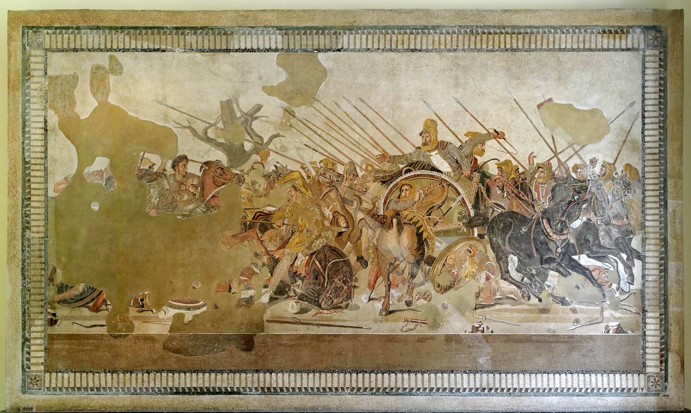

# Deep structures: a world without a centre {#sec-ch01}

::: {.callout-important appearance="simple"}
**Preliminary draft --- under review.** Published for review; content, figures and citations may still change.
:::

::: {.chapter-subtitle}
Before prices, the only measure of integration is the diffusion of goods and ideas.
:::

> "Ships from Meluhha, ships from Magan, and ships from Dilmun he made tie up alongside the quay of Agade." --- inscription of Sargon of Akkad, c.2300 BCE

## Follow one thing {.unnumbered}

Follow a bead. Sometime around 2500 BCE an artisan in one of the Indus cities took a piece of hard orange carnelian, drilled it lengthwise with a slow stone drill, and etched a white pattern into its surface by a technique that was, for the moment, a Harappan monopoly. The bead travelled. It went down the Indus, along the coast of the Arabian Sea, up the Persian Gulf through the entrepots of Magan and Dilmun, and ended in a grave at Ur, some two thousand kilometres from the hand that made it, and a good deal further by the route it actually took. No contract survives to say who carried it, what was paid, or at what price. The bead itself is the evidence: that two distant economies had touched, that goods and standards moved between them, and that an exchange existed at all. This is how the whole chapter has to be read, because in a world before coins and price-lists, integration is visible only in things.

The bead carried one more clue, in the direction it travelled. Indus goods reached Sumer, and Meluhhan ships docked in Sumerian ports, while much less Mesopotamian material has been found in the Indus. In a period with no prices to compare, an asymmetry like that is the crudest available sign of who held the initiative. It is also a treacherous one, and this chapter takes it apart later, beginning with the observation that a carnelian bead is exactly the kind of thing that survives to be counted. But it does place the Indus, in its first appearance in this book, among the most active traders of a world that did not yet have a centre.^[**Sources:** Dalrymple (Loc 1163, 1168) on the Meluhha trade and the goods reaching Ur; Anthony (loc 4821) on carnelian moving west. **Read more:** Dalrymple, *The Golden Road* (2024).]

{#fig-greatbath width=80%}

## Where we are on the arc {.unnumbered}

This is the first chapter, and it is the one place in the book where the central question cannot yet be asked. The book exists to test a claim, that the weight of the world economy sat in Asia for far longer than we tend to assume, period by period against the evidence. But "where did the weight sit?" only means something once there is a single connected economy whose weight can be located, and across these three thousand years there was not one. There were several loosely linked riverine cores, trading at the edges, rising and falling on their own clocks. So this chapter returns no verdict on the spine. It builds the ground the spine will later stand on, laying down the geography --- the monsoon and the three great channels --- that will eventually make the Indian Ocean the natural integrator.^[**Sources:** Cunliffe (Loc 158) on the channels frame; Pearson (Ch.1) on the monsoon deep structure. **Read more:** Cunliffe, *By Steppe, Desert, and Ocean* (2015).]

{#fig-cog01 width=100%}

## The stage and the cast

The stage was built by geology and weather. A continental collision some fifty million years ago raised the Himalayas, and the mountains organised the climate of half the world: they created the monsoon, the great reversing wind that blows from the south-west in the northern summer and swings back from the north-east in winter, and they fed the river basins --- the Indus, the Ganges, and by analogy the Yellow and Yangtze --- where the first surplus-producing societies grew up. The monsoon's deepest gift was reliability. Because the wind reversed on a known schedule, a sailor could ride out on one season's breath and return on the other, which made predictable round-trip voyaging possible across the Indian Ocean in a way the Atlantic and Pacific could not match. That reliability is what the geographer Michael Pearson called the ocean's "deep structure", and it is the master variable of this whole book. But it set possibilities rather than outcomes. Three corridors were born in these millennia and would carry goods, people and ideas for the next four thousand years: the maritime Indian Ocean, the desert-and-oasis route later called the Silk Road, and the great Eurasian steppe. Around them sat the cast, the riverine cores that could generate a tradable surplus.^[**Sources:** Cunliffe (Loc 158) on the steppe corridor and the three channels; Pearson (Ch.1) on the monsoon deep structure. **Read more:** Pearson, *The Indian Ocean* (2003).]

{#fig-channels width=100%}

::: {.callout-tip}
## Dramatis personae
The economic actors of c.3500--500 BCE, profiled east to west. There is no centre yet, so these are loosely linked cores rather than partners in one system. **India appears in every chapter at the fullest depth** --- here as the Indus civilisation, the period's most active long-distance trader on the evidence that survives, a qualification the chapter goes on to make good. The steppe comes last as the era's dynamic engine rather than as a periphery.
:::

Six profiles follow, and they can be skipped without losing the thread, because what each establishes is carried forward here. Four findings carry forward into the narrative. The first is that a large economy does not need a visible sovereign. The Harappans left no royal tombs, no palace quarter, no royal iconography and no depictions of warfare, and they built more urban public infrastructure per head than any of their contemporaries --- house-by-house wells, bathing platforms, covered drains --- with nobody's name attached to any of it, across a territory the size of western Europe in which only five of more than a thousand known sites count as urban. The second is that the state can arrive before the market rather than after it. Western Zhou China ran on obligation between aristocratic lineages, with markets in any ordinary sense absent, and it was the Warring States contest that ground out conscription, censuses, uniform weights and deliberate grain-price smoothing. The instinct is to assume markets came first and states arrived later to regulate them; here the sequence runs the other way.

The third finding is that writing follows the money, and does so differently in different hands. Mesopotamian cuneiform began as accounting and stayed institutional for a very long time, producing a scribal class; Shang China's oracle bones were made to record divination rather than transactions; and Egypt expanded writing for a fiscal reason, then found, in Brian Muhs's account, that documented and enforceable titles lowered the cost of a private transaction relative to going through the institution, so that the state's own revenue interest pushed it into underwriting the exchange that competed with its redistribution. The Phoenician alphabet later in this chapter completes the set by putting writing in a merchant's hands. The fourth is a warning the [Introduction](00-introduction.qmd) sets up and this period makes concrete. Mesopotamia kept its accounts on clay, which survives when a city burns, while early China kept its on bamboo and wood slips, which do not begin to survive until about the fifth century BCE, so a comparison between a bureaucratic, account-keeping Mesopotamia and a ritual, divining China may substantially be a comparison between clay and bamboo. Dilmun sharpens the same point from the other side, having run complex repeated long-distance transactions in contact with three literate civilisations without any Dilmun script ever being identified.

One comparison cuts across the six. Three societies of roughly the same era each generated a large agricultural surplus, and each put it somewhere different. Uruk put it into the city itself and into the apparatus for running one: walls, workshops, ration bowls turned out in the millions, and the accounting that became writing. The Harappans put it into infrastructure that nobody signed, with the seals that recorded claims on resources sitting in ordinary households rather than in palaces. Egypt put it into monuments to named individuals, spread along a river. None of these is a market economy, and the differences between them are not differences of wealth. They are differences in who could command the surplus and what they wanted it for, which is a question this book asks in every later chapter with better data and rarely a clearer contrast.

::: {.callout-tip collapse="true"}
## The forming East Asian core

The Yellow and Yangtze valleys were taking shape as an agrarian world in their own right while the Gulf trade ran in the west, but they sat largely outside it. Wild rice was being gathered along the Yangtze from about 8000 BCE, cultivated from about 6000, and fully domesticated in the lower Yangtze only around 4000 to 3000 BCE; by 3000 BCE farming had spread across much of what would become the East Asian core, and the first Chinese state emerged around 1800 BCE. This was a populous, river-fed agrarian base of the same broad type as Mesopotamia or the Indus, but it grew up on its own metabolism rather than as a node in the western relay. What marks it out for this period is how late the western bronze-and-chariot package reached it. The earliest known chariots come from Sintashta graves in the Urals, before 2000 BCE, and the type was in the Near East by the nineteenth century BCE, yet it did not appear in China until about 1200 BCE, arriving by way of the steppe rather than the Gulf. The same was broadly true of the metallurgy that defined the Bronze Age elsewhere.^[**Sources:** Fuller, Qin et al., "The domestication process and domestication rate in rice", *Science* 323 (2009), and Kingwell-Banham, Petrie and Fuller in *The Cambridge World History*, vol. 2, for the staged chronology; Anthony (loc 7344, 6171); Cunliffe (loc 1266, 2001). **Note on a date corrected:** an earlier draft gave 9,500-7,500 BCE for rice, following Mithen (2003); that is the Diaotonghuan-era dating and has been superseded. **Read more:** Fuller, Qin et al. (2009).]

Two states then carried the core through the rest of this chapter's span. The Shang (c.1600--1046 BCE) were northern China's first securely documented state, and they cast bronze at something close to industrial scale: foundries at Zhengzhou and Anyang, ritual vessels surviving in the thousands, the largest weighing over 800 kilograms. Their expansion followed commodities, north-east toward the Bohai salt and south toward metal, with jade, ivory, cowries and turquoise moving on top of that. They also left the oracle bones, the earliest Chinese writing, and the contrast with Mesopotamia is worth pausing on: cuneiform began as accounting, while the oracle bones are records of divination. The two earliest writing systems in this book were made to preserve different things, which shapes what each civilisation can now be asked about.^[**Sources:** Liu & Chen (2012) on Shang bronze casting at Zhengzhou and Anyang; Anthony (loc 6171) on the chariot reaching China c.1200 BCE. **Note on a figure clarified:** the very large surviving vessel (the Houmuwu ding, over 800 kg) is Shang and from Anyang; the often-quoted figure of some twelve thousand inscribed vessels is Zhou-era, and the two should not be merged. **Read more:** Liu & Chen, *The Archaeology of China* (2012).]

The Zhou who followed show state capacity arriving well before anything an economist would call a market. Western Zhou (1045--771 BCE) was a patrimonial arrangement in von Glahn's reading: the king shared authority with noble houses and lived off rights over land and labour, a domain state rather than a tax state, its three ministries named for Lands, Construction and Horses. Exchange ran between aristocratic lineages, and markets in any ordinary sense were absent. Eastern Zhou (770--256 BCE), and the Warring States contest that ran on to Qin's unification in 221, then ground capacity out of endemic war --- conscription, censuses, uniform weights, deliberate grain-price smoothing by about 400 BCE, primogeniture abolished in the 350s --- while iron lifted farm output and coinage pulled interregional trade and specialisation, iron in Hann, salt in Qi, gold in Chu. The sequence is the counter-intuitive part. The instinct is to assume markets came first and states arrived later to regulate them; here the state came first, by a wide margin.^[**Sources:** von Glahn (2016) on the Western Zhou as a patrimonial domain state and on Warring-States fiscal and administrative capacity; Scott (Page 631) on early state formation. **Read more:** von Glahn, *The Economic History of China* (2016).]

A warning has to travel with all of this, and it is sharper than a general complaint about thin evidence, because the bias is in the writing medium. Mesopotamia kept its accounts on clay, which survives when a city burns; early China kept its on bamboo and wood slips, which do not begin to survive until about the fifth century BCE. What we have from Shang China is therefore inscriptions meant for display, above all the oracle bones, and Wang Haicheng's point is that the vast majority of bones cracked for divination were never inscribed at all, while everyday administrative documents were almost certainly written on perishable materials and are gone. The graph for a bundle of writing slips appears in the divination texts themselves, so the Shang were keeping records on slips; we cannot read them. A comparison between a bureaucratic, account-keeping Mesopotamia and a ritual, divining China may therefore be substantially a comparison between clay and bamboo. That does not make the western record false, but it does mean the eastern core is under-documented for this era rather than demonstrably marginal.^[**Sources:** Wang Haicheng, "Writing and the city in early China", in *The Cambridge World History*, vol. 3 (2015), pp. 131-57, on perishable media, the survival threshold of about the fifth century BCE, display writing, and the uninscribed divination bones; Mithen (Loc 7937) and Scott (Page 100) on the general preservation asymmetry. **Read more:** Wang (2015).] **Trade profile**

- **Main exports** --- little evidence of long-distance export into the western system this early; the core's surplus was consumed and circulated locally.
- **Main imports** --- the bronze-and-chariot technology package, arriving overland from the steppe around 1200 BCE rather than by sea.
- **Export markets** --- none securely attested in the Gulf or Mesopotamian record for this period.
- **Import sources** --- the Eurasian steppe corridor to the north and west, the one channel that reached it.^[**Sources:** Anthony (loc 6171); Mithen (Loc 7945). **Read more:** Mithen, *After the Ice* (2003).]
:::

::: {.callout-tip collapse="true"}
## The Indus civilisation --- the agency-holder

The Indus, or Harappan, civilisation grew up along the Indus and its tributaries from roughly 3000 BCE, when its first cities appeared at much the same moment as the Early Dynastic cities of Sumer, and it reached its mature urban phase between about 2600 and 1900 BCE. Its base was agrarian, like every economy in this chapter. What set the Harappans apart was how much of what they built on it had been *designed*: Mohenjo-daro and Harappa were laid out to a plan, with gridded streets, fired-brick housing and elaborate covered drains, at a degree of urban engineering with no contemporary equal. Mohenjo-daro covered more than 200 hectares, within reach of Uruk's 250, and Harappan urban sites ran from about 50 hectares to over 200. The distinguishing feature was deliberation rather than size. The settlement pattern is the stranger fact. Mature Harappan material turns up at more than a thousand sites spread over more than a million square kilometres, and of those only five count as urban: Harappa, Mohenjo-daro, Ganweriwala, Rakhigarhi and Dholavira, with the rest typically around five hectares. Those five stand far apart, 280 kilometres from Mohenjo-daro to Ganweriwala and 600 from Harappa to Mohenjo-daro, across a territory the size of western Europe, where Mesopotamia in the same centuries was a crowded landscape of neighbouring cities within a few days' walk of one another. Whatever held the Indus together was not proximity.

Two of the things this economy stood on were domesticated locally, which matters for a region routinely written up as a recipient of other people's innovations: zebu cattle at or around Mehrgarh, and the earliest evidence anywhere for Indian tree cotton, on which a textile tradition rests that later chapters follow for four thousand years.^[**Sources:** Roy (p.20) on the Indus settlements beginning c.3000 BCE, contemporary with Early Dynastic Sumer; Mohan (Loc 531) on the end of the urban era c.1900 BCE; Kingwell-Banham, Petrie and Fuller, "Early agriculture in South Asia", in *The Cambridge World History*, vol. 2 (2015), pp. 261–309, on zebu domestication at Mehrgarh and on the tree-cotton evidence, which rests on Moulherat et al., "First evidence of cotton at Neolithic Mehrgarh", *Journal of Archaeological Science* 29 (2002); on the redating, Mutin et al., "New radiocarbon dates of human tooth enamel reveal a late appearance of farming life in the Indus Valley", *Scientific Reports* 15 (2025), 11345, doi:10.1038/s41598-025-92621-5, whose co-authors include one of the original excavators; Sinopoli, "Ancient South Asian cities in their regions", in *The Cambridge World History*, vol. 3 (2015), pp. 319–42, at pp. 322, 324–25 and 330, for the urban site count, the 50-to-200-plus hectare range, Mohenjo-daro's extent, the intercity distances and the five-hectare norm for non-urban sites. Older syntheses give appreciably smaller figures for the great cities --- Chakrabarti (1979), pp. 210–11, via Allchin (1995), p. 202, puts Harappa and Mohenjo-daro at about 85 hectares each --- but Sinopoli's are the current figures and are used here. **Note on a date corrected:** Mehrgarh's dating has moved sharply, to an aceramic Neolithic of 5250 to 4650 BCE rather than a start around 7000 or 8000, on tooth enamel rather than the root-contaminated charcoal the old chronology rested on; the cotton grave moves with it. Nothing about the local-domestication argument depends on the older dates, but a great deal of popular writing about Mehrgarh does. **Read more:** Kingwell-Banham, Petrie and Fuller (2015).] Two features of the internal economy stand out, and the second is genuinely puzzling. The first was standardisation, and it went further than the phrase usually implies. Harappan cubical stone weights double in a binary sequence up to a standard of about 13.7 grams and then continue in decimal multiples, the largest at Mohenjo-daro reaching almost eleven kilograms --- a system, not a convention, and one exported as far as the Gulf. Fired bricks hold a 1:2:4 ratio across the whole settled zone, and that last uniformity is where the state instinct should be resisted, since Kenoyer's explanation is a class of brickmakers whose craft tradition spread from settlement to settlement rather than a building code. Alongside the weights ran a corpus of inscribed seals, and the two together are the apparatus of an economy in which goods were measured, marked and exchanged to common conventions over long distances.^[**Sources:** Kenoyer, *Ancient Cities of the Indus Valley Civilization* (1998), on the weight sequence, the brick ratio and the brickmakers' craft tradition. Cited by chapter where the held edition lacks pagination. **Read more:** Kenoyer (1998).]

The second feature is what the cities lack, and the usual shorthand overstates it. There are no royal tombs, no monumental religious architecture, no royal iconography and no depictions of warfare. Two entries on that list need care: temples are not securely absent, since Kenoyer allows that House AI at Mohenjo-daro may have been one, and no depictions of warfare is not the same as no warfare, because skeletal remains from Harappa carry clear evidence of interpersonal violence. What is absent is a palace *quarter*, the largest buildings being scattered across the mounds rather than gathered into a royal precinct, and the structures long called granaries have gone too, having produced no charred grain, no storage vessels and no sealings. What these cities were reticent about was the display of personal power, which is not the same as being socially flat: Possehl, who denies this was a state, still writes of upper ranks and a social pyramid, and remarks that the Great Bath was not the playground of the Indus *hoi polloi*.^[**Sources:** Possehl, *The Indus Civilization: A Contemporary Perspective* (2002), on Mohenjo-daro's largest buildings, the social pyramid and the Great Bath, and on the rejection of the granaries; Kenoyer (1998) on House AI. **Read more:** Possehl (2002).]

How such a civilisation was governed, and how its surplus was gathered without the visible apparatus of monarchy, is the liveliest question in Indus archaeology. Three positions run as a spectrum rather than a quarrel --- Kenoyer's rulers of a kind, Possehl's elites without a state, and Adam Green's collective governance by many intersecting institutions --- and [Appendix E](appendix-e-disputes.qmd) sets them out with the evidence that divides them, which turns largely on where the seals were found. One fact cuts across all three: no Indus seal has ever been found in a burial, which is exactly where Egypt and Mesopotamia put the marks of individual status. What the three agree on is enough to carry the economic argument. There were no kings, no royal display and no depictions of warfare; there was extensive investment in urban public goods, from house-by-house wells to bathing platforms and covered drains; and there was a standardisation apparatus reaching from villages to the Gulf. A society can build all of that without anyone's name on it, and that matters beyond the Indus.

The chapters that follow spend a great deal of time on states that taxed, borrowed, minted and spent, and it is easy to slide from that into assuming an economy needs a visible sovereign before it can build anything. The Harappans built more urban infrastructure per head than any of their contemporaries and left no king's name attached to any of it.^[**Sources:** Kenoyer (1998) for rulers and the weight system; Possehl (2002) for the no-state-but-elites position and the reading of seal findspots; Green, "Of Revenue Without Rulers: Public Goods in the Egalitarian Cities of the Indus Civilization", *Frontiers in Political Science* 4 (2022), open access, for collective governance, the Mohenjo-daro seal count after Mackay and the household distribution after Franke-Vogt, and the Harappa gateway weights after Kenoyer and Miller (2007); Kenoyer (1998) on the absence of seals from burials. Green's comparative framework is Blanton and Fargher's, in which societies drawing on internal revenue such as agrarian taxation tend to produce more public goods and wider political participation than those living off external resources. **Read more:** Green (2022), open access.] With no prices and no ledgers, the integration the Harappans achieved is read from the things themselves: Harappan seals, cubical weights and above all etched carnelian beads turn up in Mesopotamian contexts, and carnelian from the Indus borderlands was moving north through the Caucasus by the late fourth millennium. Externally the Harappans ran the period's great long-distance trade, the Gulf route that linked the Indus --- the Meluhha of the cuneiform records --- to Mesopotamia through the intermediary ports of Magan, on the Oman coast, and Dilmun, the entrepot on Bahrain. Two qualifications matter more than the inventory. Few ships sailed the whole way: the traffic moved in stages, and in the Ur III period Mesopotamian boats went only as far as Magan, and later only to Dilmun, even though most of what they collected there had started in India, so Dilmun grew rich precisely because the route was broken in the middle. And the westward flow was not the whole story.

Meluhhan boats put in at Sargon's quay at Akkad, and an Akkadian seal inscription names an interpreter of Meluhha, so there were Harappans in Mesopotamia and enough of them to need translating; but Mesopotamian weights have turned up at Harappa and Mohenjo-daro, and in one Harappan cemetery a young woman was buried wrapped in a reed shroud inside a wooden coffin, a rite unknown in the Indus world and familiar from Ur and Kish. Somebody from Mesopotamia lived, and died, in India.^[**Sources:** Anthony (loc 4821, 4896) on carnelian from western Pakistan moving north via the Maikop conduit c.3700--3400 BCE; Ratnagar, *Encounters: The Westerly Trade of the Harappa Civilization* (1981), on transshipment and the staged character of the route, the dragoman inscription (after Gelb 1968), the Mesopotamian weights, and the Cemetery R 37 burial (after Wheeler 1947); Dalrymple (Loc 1163, 1168) on the goods reaching Ur. Note Edzard's caution, reported by Ratnagar, that not every textual mention of Dilmun or Meluhha need refer to the people of those lands. **Read more:** Ratnagar, *Encounters* (1981).] What survives is a changing asymmetry rather than a clean one. Through the mature phase the initiative ran west: Harappan goods, standards and people are far more visible in Mesopotamia than the reverse, and no Mesopotamian commercial text records trade with Meluhha at all, the references being royal and tributary. Later the balance shifted, once Harappan ports on the Makran coast came within reach of sailors who did not have to cross open-ocean monsoon water, and the carrying passed increasingly to Mesopotamians and Dilmunites. Agency followed the sailing conditions and the position of the ports rather than belonging to anyone, and who carried the goods is in any case a fact about shipping capability and voyage risk rather than about who captured the gains. Two cautions therefore govern the asymmetry. The first is that the gains turn on each side's alternatives, and Mesopotamia had the deeper pockets, so the safer proposition, and the one the rest of this book uses, is that whoever could reach the other party on their own terms was better placed to take the larger share.

The second is about what each side sent. Indus exports were carnelian beads, seals, ivory and stone weights: hard, distinctive, durable objects that survive four thousand years and are identifiable at a glance as Harappan, where Mesopotamia sent back silver, tin, wool, oil and grain, which were consumed, remelted, rotted, or survive without being identifiable as Mesopotamian at all. An exchange of exactly equal value in both directions would leave a lopsided record, tilted the way this one is tilted. That does not dissolve the asymmetry, since the Harappan presence includes people and standards and not only goods, but the record cannot carry the weight the strong version of the claim puts on it.^[**Sources:** Ratnagar, *Encounters* (1981), for the absence of Meluhha from Mesopotamian commercial texts, the tributary character of the Akkadian-period references, and the argument that trade handling passed to Mesopotamians and Dilmunites once the Makran ports were in use; Roy (p.27) on the long-run pattern of ships carrying goods to and from India. **Read more:** Ratnagar, *Encounters* (1981).]

The urban phase ended around 1900 BCE: the great cities were given up, the weights-and-seals apparatus fell out of use, and the population shifted east toward the Ganges. The decline was broadly coincident with the weakening of the monsoon at the 4.2 ka event, and the temptation to read one as the cause of the other should be resisted, starting with the arithmetic. The 4.2 ka event is around 2200 BCE and the de-urbanisation around 1900, three centuries apart, which is a long time for a cause to take effect. The palaeoclimate record shows no drought of the right timing and depth, and both standard authorities decline the climate explanation anyway, Possehl for an internal ideological failure and Kenoyer for flooding routed through a crisis of legitimacy. Both attribute the drying of the Ghaggar-Hakra to tectonic change rather than monsoon failure, which detaches the most-cited piece of hydrological evidence from the climate story altogether. [Appendix E](appendix-e-disputes.qmd) sets the four readings against each other. On all of them, "de-urbanisation" fits better than "collapse".^[**Sources:** Possehl (2002), for the rejection of environmental causation and the ideological reading; Kenoyer (1998), for flooding mediated by a crisis of legitimacy, and both for the tectonic account of the Sarasvati; Williams (loc 1194, 1197) on reduced river flow c.4500--4200 years ago and Mithen (loc 9959) on c.2000 BCE drought, both representing the climate reading these authorities argue against; Staubwasser and Gupta et al. for the abrupt-forcing reading, Giosan et al. for gradual hydrological change, and Possehl for multi-causal social transformation. **Read more:** Possehl (2002).] **Trade profile**

- **Main exports** --- carnelian and etched-carnelian beads, ivory, hardwoods (teak), pearls, and lapis lazuli carried on and re-exported from further north. Cotton is deliberately left off this list: the Indus had the world's oldest cotton tradition, but no cuneiform record places cotton among the Meluhha goods and no textile survives to show it moving west.
- **Main imports** --- silver, tin, wool, and oil and grain.
- **Export markets** --- Mesopotamia (Sumer and Akkad), reached through the Gulf intermediaries Magan (Oman) and Dilmun (Bahrain).
- **Import sources** --- the same Gulf route in reverse, with Dilmun and Magan as the entrepots through which Mesopotamian silver and the metals of the wider Near East passed back to the Indus.^[**Sources:** Dalrymple (Loc 1163, 1168) on the Meluhha trade goods and the Gulf route; Roy (p.20, p.27); Mithen (Loc 9058) on the Indus cotton tradition. **Read more:** Dalrymple, *The Golden Road* (2024).]
:::

{#fig-indusseal width=48%}

{#fig-mapindus01 width=85%}

::: {.callout-tip collapse="true"}
## Dilmun --- the Gulf entrepot

Dilmun, centred on Bahrain, was the junction of the Gulf trade that linked the Indus world to Mesopotamia, at its height between about 2600 and 1700 BCE. The early third-millennium Dilmun of the cuneiform texts most likely lay in eastern Arabia, around Tarut, while Bahrain's own urban sites --- Qal'at al-Bahrain, Saar, Diraz --- come in from the middle of the third millennium and Bahrain becomes the centre later still, so the identification shifts across the period. Goods moved up the Gulf in stages: the Indus supplied carnelian, ivory, hardwoods, lapis and etched beads; Magan, on the Oman side, supplied copper; and Dilmun sat in the middle, gathering these and passing them on into Sumer. Its wealth came from controlling a chokepoint rather than from making anything, taking a cut on goods it never produced, which is the bottleneck-and-toll pattern the module returns to again and again: whoever controls the narrow passage between a supplier and a hungry market can levy the difference. Few vessels ran the whole route, so the middle of the chain was where the goods changed hands and the margin was taken, and that is why the entrepot mattered more than its own production ever warranted.^[**Sources:** Pearson (Ch.3); Frahm (Page 46); Kriwaczek (Page 49); Ratnagar, *Encounters* (1981), on transshipment and the staged route. **Read more:** Pearson, *The Indian Ocean* (2003).]

Two things about Dilmun cut against what an entrepot is supposed to look like. The first is that it was not culturally derivative. Harriet Crawford's summary is that Dilmun's material culture owed "remarkably little either to its immediate neighbours, or to the trading partners at either end of the trade routes", and the seals make the point concretely: Dilmun used round stamp seals with its own iconography, Mesopotamia used cylinder seals, the Indus used square stamps. Three partners in one trading system, three different ways of sealing a transaction. The second is stranger and bears on an argument this chapter has been building. Dilmun was in sustained contact with three literate civilisations --- Mesopotamia, Susa and the Indus --- and ran exactly the kind of complex, repeated, long-distance transactions that writing is supposed to have emerged to keep track of. Yet no Dilmun script has been identified. Crawford finds it hard to believe that such canny operators managed without one, and allows that the need may have been met in other ways. Either way the case is a useful check: if writing came out of the need to track transactions, here is a society with the transactions and, so far as anyone can show, without the writing.^[**Sources:** Crawford, *Dilmun and its Gulf Neighbours* (Cambridge University Press, 1998), on the distinctiveness of Dilmun's material culture, the contrast between round, cylinder and square seals across the three partners, and the absence of an identified Dilmun script despite contact with three literate neighbours; the argument she invokes about writing emerging to track economic transactions is Nissen's, used elsewhere in this chapter for Uruk. **Read more:** Crawford (1998).] **Trade profile**

- **Main exports** --- re-exported goods rather than home produce: Indus carnelian, ivory and hardwoods; Magan copper passed upstream into Sumer.
- **Main imports** --- silver, wool, oil and grain coming down from Mesopotamia, plus the goods it held in transit.
- **Export markets** --- the Mesopotamian cities at the head of the Gulf, above all the Sumerian demand-core.
- **Import sources** --- Meluhha (the Indus) and Magan (Oman) below it on the route.^[**Sources:** Pearson (Ch.3); Frahm (Page 46). **Read more:** Pearson, *The Indian Ocean* (2003).]
:::

::: {.callout-tip collapse="true"}
## Mesopotamia and Uruk --- the demand core

Mesopotamia was the period's most commercially central node, and Uruk was its showpiece. The scale of what happened there is easier to grasp as a rate than as a size. Through the proto-urban centuries, settlements in the region seldom passed 20 hectares, and counters and stamp seals were enough to keep track of what they produced. Then, by the end of the Late Uruk period, Uruk expanded to at least 250 hectares, some 2.5 square kilometres, holding perhaps 40,000 to 50,000 people, with Nissen putting the city at that size around 3300 BCE. That is more than a twelvefold increase in built area, and the world had not seen anything like it. It rested on an organised hinterland whose size is routinely overstated, since the radii in circulation are limits on early states in general rather than measurements of Uruk, and the tax share usually quoted is an inference from agrarian history at large rather than a figure from any Sumerian record. What can be said is that river transport extended the catchment for bulk goods enormously, which is why the alluvium's cities sat on watercourses. Two cautions. These are reconstructions, and the specialists are more reticent than the synthesis: Emberling opens his own chapter with cities that "may have housed 50,000 people or more" and then declines to say what population *makes* a settlement a city at all.

And the southern alluvium was not the only place cities were forming, since Tell Brak, 750 kilometres north, had reached about 130 hectares before 3500 BCE, so any account making southern irrigation the *cause* of Mesopotamian urbanism has a northern problem.^[**Sources:** Nissen, "Urbanization and the techniques of communication: the Mesopotamian city of Uruk during the fourth millennium BCE", in *The Cambridge World History*, vol. 3 (2015), pp. 113–30, on the growth from under 20 to at least 250 hectares and the population estimate; Scott, *Against the Grain* (2017), ch. 4, for Uruk's 250 hectares, the Postgate/Abu Salabikh hinterland calculation and the one-fifth grain levy, and ch. 6 for the forty-eight-kilometre requisition radius and the transport logic. (Cited by chapter: the held text is an EPUB without pagination. An earlier draft gave a "ring of perhaps twenty competing city-states"; that count appears in neither Scott nor Emberling and has been removed.) Emberling, "Mesopotamian cities and urban process, 3500-1600 BCE", in *The Cambridge World History*, vol. 3 (2015), pp. 253-78, at p. 253 for the 50,000 figure, p. 254 for his refusal to set a population threshold, and p. 263 on markets, walls and temples developing fully only later. Population figures per hectare are themselves a contested method: see Postgate, "How Many Sumerians per Hectare?", *Cambridge Archaeological Journal* 4 (1994). **Read more:** Nissen (2015).] Growth on that scale had to be administered, and the administrative technology is what survives. Beveled-rim bowls, mould-made in the millions and mostly holding the same amount, imply a standard unit of measure and, on the usual reading, the issue of rations; the cylinder seal answered the same problem of keeping track of a large and stratified population. Writing came out of that effort, and the earliest tablets did not represent spoken language at all, being in Hans Nissen's phrase barely more than an extension of the techniques of accounting. That writing was invented to do bookkeeping and only later learned to carry literature is one of the more useful things this period has to say about how economies build the tools they need.^[**Sources:** Nissen (2015), pp. 113–30, on the beveled-rim bowls as mass production with a standard capacity, the cylinder seal, and writing as an extension of accounting; Goetzmann (loc 561) and Frahm (Page 34) on the accounting tablets. **Read more:** Nissen (2015).]

The clearest window onto how that economy worked was textile manufacture. Uruk's state workshops are credited with as many as 9,000 women, on the order of a fifth of the whole city, spinning and weaving wool into cloth that the temple and palace then disbursed or traded. That figure needs handling with care, since it comes from Scott, who writes a few paragraphs later that reading such evidence back from the Ur III archives to the Uruk period "is highly questionable", and the archaic Uruk tablets are largely undeciphered administrative accounts that will not support a headcount of that precision. An establishment of that size, fed and housed from central stores and producing on central account, looks like a command economy, in the redistributive pattern Karl Polanyi placed at the heart of the early Near East. Whether that was the whole story is the live debate, because the same society also ran private loans, partnerships and price-sensitive long-distance ventures. Two cautions belong with that. The first is chronological: the archives documenting administered redistribution most fully are not Uruk's but those of the Third Dynasty of Ur, around 2100 BCE, more than a millennium later, and Emberling treats the great collection-and-redistribution centres as an innovation of that empire rather than a feature of the first cities. The second is that the strongest version of the redistributive case has already been walked back, on the evidence of the very archive it was built from. [Appendix E](appendix-e-disputes.qmd) has both.^[**Sources:** Scott (Page 1040) on the workshops and the Polanyi reading; Emberling, *CWH* vol. 3 (2015), pp. 253-78, at p. 261 on the redistributive model requiring revision, p. 262 on the temple-city model and the Ba'u archive, p. 263 on markets, walls and temples as late developments, and pp. 272, 275 on collection and redistribution as an Ur III innovation. **Read more:** Emberling (2015).]

Money and credit were already mature, well before any coin was struck. Silver and barley served as units of account and means of payment, so prices existed even though coinage did not. Interest-bearing debt is securely attested from the later third millennium and may reach back to around 3000 BCE, and the rates were later codified under Hammurabi at 20 per cent on silver and 33 1/3 per cent on barley. Debt could spiral into bondage, and rulers periodically wiped the slate: in about 2400 BCE Enmetena of Lagash declared *amargi*, cancelling debts, the first recorded use of the word in a political document. Credit belonged to this economy from the start. What arrived later was minted coinage, and the continuous price series that came with it.^[**Sources:** Graeber (Loc 8075, 4560); Goetzmann (loc 592, 836, 838); Kriwaczek (Page 101). **Read more:** Graeber, *Debt: The First 5,000 Years* (2011).] What made Mesopotamia the demand pole was its geology. The southern alluvium was rich in silt and grain but had almost no metal, building stone or timber of its own, so the materials of an urban civilisation had to be imported, and even Uruk's monumental architecture leaned on stone hauled some eighty kilometres. An integrated trading sphere, the "Uruk world system", already linked the Iranian plateau to the eastern Mediterranean between about 3500 and 3100 BCE, then contracted around 3000 BCE as the long-distance networks thinned and an era of warring city-states began. The luxuries it carried travelled astonishing distances: lapis lazuli from Badakhshan in Afghanistan moved roughly 2,500 kilometres to reach Mesopotamia, and onward to Egypt. The resource-poor core generated the demand that pulled goods across half a continent.

The mechanics of that import trade are best seen in the early second-millennium tin caravans between Assur and the Anatolian colony at Kanesh, where donkey trains of fifty or more animals carried tin and textiles roughly 950 kilometres on a journey of about fifty days, exchanging them for silver. Merchants reckoned gross mark-ups near 100 per cent on the metal and 200 per cent on the cloth --- mark-ups rather than profits, since the fifty-day journey, the fodder, the drivers, the tolls, the agent's commission and something like a hundred days of tied-up capital all came out of them first. To the south-east a separate maritime arm ran down the Gulf, with Sumer drawing copper from Magan and exotic goods from Meluhha through Dilmun, and one Ur merchant, Ea-nasir, known from the Dilmun copper trade and from the most famous complaint tablet in the ancient world.^[**Sources:** Scott (Page 1199); Kriwaczek (Page 40, 49, 72, 215, 216); Frahm (Page 46, 47, 48); Goetzmann (loc 940). **Note on a figure withdrawn:** an earlier draft credited Ea-nasir with fifty-one investors in a single venture; that count is not sourced to a page in the held corpus and has been removed. **Read more:** Kriwaczek, *Babylon* (2010).] **Trade profile**

- **Main exports** --- silver and barley (also serving as money and units of account); woollen textiles from the state workshops; grain and other agricultural surplus of the irrigated alluvium.
- **Main imports** --- the materials the alluvium lacked: tin and copper for bronze, building stone and timber, and high-value luxuries (lapis lazuli, carnelian, ivory, hardwoods).
- **Export markets** --- Anatolia (textiles and silver through Kanesh); the Gulf trade with Magan and the Indus via the Dilmun entrepot; the wider Uruk-system sphere from the Iranian plateau to the eastern Mediterranean.
- **Import sources** --- Anatolia and the eastern highlands (metals, silver); Badakhshan (lapis, ~2,500 km away); Magan/Oman (copper) and Meluhha/the Indus (carnelian, ivory, hardwoods) through Dilmun.^[**Sources:** Frahm (Page 46, 47, 48); Kriwaczek (Page 40, 49, 215); Scott (Page 1199). **Read more:** Kriwaczek, *Babylon* (2010).]
:::

{#fig-ziggurat width=72%}

{#fig-mapmeso01 width=85%}

Even the urbanisation rate is a construction rather than an observation. Adams put the region's urbanised share at as much as 78 per cent across Sumer around 2400 BCE, while his own survey figures for Ur III Umma implied nearer 25; Steinkeller, working from the place-names in the administrative texts rather than from surface survey, put 70 to 80 per cent of Umma's people outside the city. Neither is careless, and the gap between them is mostly a gap between methods, though not wholly, since the two estimates also cover different places and different centuries. The derivation is set out in [Appendix D](appendix-d-numbers.qmd).

::: {.callout-tip collapse="true"}
## Egypt --- the Nile apart

Egypt was a riverine core of the first rank, but it stood largely outside the Gulf system that linked the Indus to Mesopotamia. Its wealth came from the Nile: a narrow ribbon of irrigated land whose predictable flood underwrote dense agriculture and a centralised state from unification around 3100 BCE, and through the Old, Middle and New Kingdoms from about 2686, with the two Intermediate Periods as genuine interruptions to that centralisation rather than footnotes to it. Where Mesopotamia depended on uncertain rainfall and rivers, Egypt's annual inundation gave it an agrarian base reliable enough to sustain monumental building and a deep bureaucracy. It traded along its own axes rather than through the Gulf, looking south to Punt for incense, ivory and exotic goods, and east through the Sinai and the Red Sea margins for copper, turquoise and contact with the Levant. Lapis lazuli from Afghanistan reached Egypt by overland relay, a reminder that it was tied into the wider Bronze Age web at the edges, but its trading face pointed down the Nile corridor and across the Sinai land bridge, and the Indus-to-Sumer relay ran without it.

Where Egypt put its surplus is the more interesting question, and the answer is not "into cities". John Baines argues that the values of early Egyptian rulers and elites seem not to have focused on cities at all: power was presented across a landscape rather than concentrated in an urban form, through dispersed mortuary monuments and necropolis sites, movement between them, and a careful interplay of display and concealment. Egyptian cities were constrained by the floodplain and overshadowed by those monuments, and only by the New Kingdom did the society become more city-focused.
There is a further reason to keep Egypt in this chapter rather than filing it as a magnificent irrelevance, and it comes from the economics of its record-keeping. Brian Muhs argues that the Egyptian state expanded the use of writing over three millennia for a straightforward fiscal reason, to document and exact taxes more efficiently. But the writing did something its promoters did not intend. Once titles and transfers could be documented and enforced, the cost of making a private transaction fell relative to the cost of going through the institution, and private exchange grew at redistribution's expense; silver, coming into use as a common measure of value, lowered those costs again for high-value dealings, and the state then began taxing transfers in silver, which gave it a direct fiscal interest in documenting and enforcing private property rights still further. That loop runs through the rest of this book. An administrative technology adopted to make extraction work better ended up lowering the transaction costs of the private exchange that competed with extraction, and the state's own revenue interest then pushed it into underwriting the competition.

Set beside Uruk, where writing began as accounting and stayed institutional for a very long time, and beside the Phoenician alphabet later in this chapter, which put writing in a merchant's hands, the point is that the same technology can push an economy in opposite directions depending on who can afford it and what the state wants from it.^[**Sources:** Baines, "Ancient Egyptian cities: monumentality and performance", in *The Cambridge World History*, vol. 3, on the non-urban focus of early Egyptian elite values; Muhs, *The Ancient Egyptian Economy, 3000-30 BCE* (Cambridge University Press, 2016), whose central argument the second half of this paragraph follows: writing expanded for fiscal reasons, then lowered the transaction costs of private property transfers relative to redistribution, with silver as a unified measure of value lowering them again and giving the state an incentive to document and enforce private titles. Muhs frames the book explicitly in New Institutional Economics terms, and the organisation-versus-market question is Coase's. **Read more:** Muhs (2016).] So Egypt is best read as precocious but separate: an early, rich, highly organised state that developed in parallel with the Gulf system rather than as part of it. It mattered enormously in the later eastern-Mediterranean world, and by the fourteenth century BCE its correspondence with Hatti, Babylon and the Aegean shows it deep in the palace-economy network whose collapse around 1177 BCE it barely survived. For the first integration of the Gulf, though, it is a neighbouring core rather than a participant. **Trade profile**

- **Main exports** --- Nile agricultural surplus and manufactured goods; gold from the eastern deserts and Nubia.
- **Main imports** --- incense and ivory from Punt; copper and turquoise from Sinai; lapis from Afghanistan by overland relay.
- **Export markets** --- the Levant and, increasingly, the eastern-Mediterranean palace world.
- **Import sources** --- Punt to the south, Sinai and the Red Sea to the east, the Levant to the north-east.
:::

::: {.callout-tip collapse="true"}
## The steppe --- the dynamic engine

The Eurasian steppe was the era's main artery rather than a periphery: an unbroken grass corridor running some 7,000 km from eastern Europe to the Great Wall of China. What turned this ribbon of grass into a power-and-information highway was the horse. A herder on foot could manage about 200 sheep; mounted, the same herder could manage some 500, ranging 50 to 60 kilometres in a working day around them. Read that figure carefully, because it is a herdsman's daily range rather than the pace of a migration. Households moving with their animals covered something closer to 10 to 20 kilometres on a day they moved, and nearer nine or ten averaged across a whole migration, held to the speed of the herd and to the grass it had to stop and eat. What mounted herding bought was reach, and reach is what made the corridor the fastest channel for moving people, animals and news across the continent.^[**Sources:** Cunliffe, *By Steppe, Desert, and Ocean* (2015), p. 77, for the 200-to-500 herding gain and the 50-60 km working range, and p. 17 for a rider's daily distance. **Note on a figure clarified:** Cunliffe's sentence makes the herdsman, not the flock, the thing covering 50-60 km; earlier drafts of this chapter read it as a migration rate. Cunliffe gives no source for the number, and it should be treated as an authorial assertion. **Read more:** Cunliffe (2015).]

A cluster of innovations compounded the advantage. The wheel, and then the chariot --- the earliest known examples of which come from Sintashta graves in the Urals, before 2000 BCE --- spread outward along the grass, reaching the Near East by the nineteenth century BCE and China only around 1200 BCE. Alongside these ran what Andrew Sherratt called a "secondary-products revolution": the use of animals for traction, wool and dairy rather than meat alone. That thesis is contested, since whether it was a single fourth-millennium event or a gradual, patchy adoption is debated, but the underlying shift, animals exploited while alive, was real and it multiplied what a pastoral economy could yield. The corridor was also a vector of migration. The Yamnaya expansion out of the Pontic-Caspian steppe around 3000 BCE has been associated, on present ancient-DNA readings, with a large influx of steppe-derived ancestry into Europe --- as much as 90 per cent of the gene pool in Britain at the Bell Beaker transition around 2450 BCE, and about 75 per cent in Corded Ware burials in Germany, rather than a single figure for the continent --- a striking figure that should be held cautiously, since the genetics and its demographic interpretation are still moving. The steppe was a channel and an engine at once: it raided the settled cores, traded with them, and at times poured into them.^[**Sources:** on the chariot's spread, Anthony (loc 6171) and Cunliffe (loc 1266); Olalde et al., *Nature* 555 (2018), for the British figure and Haak et al., *Nature* 522 (2015), for Corded Ware Germany; Spinney (Loc 754, 1338); Anthony (loc 5149). An earlier draft gave "up to roughly 90 per cent of Europe's gene pool", which takes the highest regional number and generalises it. **Read more:** Anthony, *The Horse, the Wheel, and Language* (2007).] **Trade profile**

- **Main exports** --- horses, mounted mobility, and metal-working skill; above all the capacity to move goods, people and force at speed.
- **Main imports** --- grain, textiles and finished metalwork drawn from the settled cores.
- **Export markets** --- the riverine cores it raided, traded with and migrated into, from Mesopotamia to the forming East Asian core.
- **Import sources** --- the same settled cores, supplying the agricultural and manufactured goods the grassland could not produce.
:::

::: {.callout-note}
## How we know
This period leaves no price series at all, and that single absence governs everything the chapter can claim. The test the book uses from [Chapter 8](08-first-global-economy.qmd) onward --- a price gap bounded by the cost of carriage, narrowing as that cost falls --- can barely be run here. What the period does leave, in the Assyrian merchant archives, is a handful of exchange ratios at either end of one route, and those turn out to be more useful than they look. Everything else has to be read archaeologically, from the diffusion of goods and shared standards: an Indus seal in a Mesopotamian layer, a set of Harappan weights, a string of etched carnelian beads in a Sumerian grave. Each is a physical trace that two distant economies had touched. None of them says how much, how often, or at what price. And the record is biased the way the introduction warns: organic things rotted in the monsoon tropics and survived in dry Egypt and cool Europe, so what we have systematically under-documents the ocean world this book centres on. *Sources: on reading integration by the diffusion of goods, and the Indus weights, seals and carnelian beads in Mesopotamia, Frahm (Page 46); on the Meluhhan ships and interpreter and the survival bias, Cunliffe (Loc 158). Read more: Cunliffe, By Steppe, Desert, and Ocean (2015).*
:::

## The period on its own terms

Before the cycles, a word about what the base cost. Every economy in this chapter stood on farming, and farming was not obviously a bargain for the people who did it. The skeletal record across the agricultural transition, read at sites worldwide, mostly shows the same direction of travel: shorter stature, more dental caries as fermentable carbohydrates displaced a mixed forager diet, more enamel defects from childhood stress, and heavier loads of infectious disease as people settled at density alongside their animals and their refuse. Sedentism brought contaminated water, vermin, poor sanitation, harvest failure and soil exhaustion, and it narrowed the variety of what was eaten, with social inequality appearing alongside all of it. The finding is not universal, and bioarchaeologists are careful about it, since any one skeletal marker can have several causes and a minority of studies run the other way. But the broad pattern is the physical counterpart of the Malthusian result set out at the end of this chapter: the gains from better technology and better land went into more people rather than into better-fed ones.^[**Sources:** Roberts, "What did agriculture do for us? The bioarchaeology of health and diet", in *The Cambridge World History*, vol. 2 (2015), pp. 93–123, on stature, dental caries, enamel hypoplasia, infectious disease loads and the living conditions of settled communities, and on the studies that do not follow the trend. The econometric counterpart is Ashraf and Galor (2011), discussed at the end of this chapter. **Read more:** Roberts (2015).]

The period ran as a sequence of integrations that rose and then came apart, three times over, rather than as one smooth arc. The three cycles are worth naming at the outset, because the shape returns in every later chapter. An early Uruk sphere reached from the Iranian plateau to the Mediterranean and then contracted. The Gulf trade that the Harappans ran followed it, and ended with their cities. Then the Late Bronze Age system of the eastern Mediterranean, the tightest of the three, broke the hardest. Between the second and the third sits a gap of some three centuries that no maritime cycle fills, and what carried that gap was a technology rather than a trade: the horse, the wheel and the chariot, remaking on the steppe what movement cost. The geography underneath all three was set long before any of them, and it left a tension behind. The same monsoon that made predictable round-trip voyaging possible could, when it weakened, help hollow out a civilisation, and both faces appear in the cycles below. The determinism is real and bounded: deep structures shaped what could happen, and people still chose the moves, which is a caution worth holding against the harder geographic readings of Cunliffe and, before him, Diamond.^[**Sources:** Cunliffe (Loc 158); Pearson (Ch.1). **Read more:** Cunliffe, *By Steppe, Desert, and Ocean* (2015).]

{#fig-cycles01 width=92%}

Cycle one, the first integration and its contraction, ran from about 3500 to 3000 BCE, and it did not run through the Gulf at all but overland across the northern Near East. From roughly 3500 to 3100 BCE a "Uruk world system" linked the Iranian plateau to the eastern Mediterranean, drawing distant materials toward the Mesopotamian alluvium where the world's first true cities were rising. Uruk itself was already a demand-core of startling size, covering some 250 hectares by around 3300 BCE and holding perhaps forty to fifty thousand people, and such a place pulled goods from far away: lapis lazuli from the mines of Badakhshan in north-eastern Afghanistan travelled roughly 2,500 kilometres to reach Mesopotamia, and the same blue stone reached Egypt at roughly the same period. This was integration in its archaic form, measurable by the diffusion of materials far from their sources rather than by prices. Then it came apart. Around 3000 BCE the Uruk system contracted, the long-distance exchange network thinned, and an era of warring city-states opened in its place. Lapis itself kept coming --- the greatest concentration of it outside Afghanistan is the Royal Cemetery of Ur, five centuries after the supposed break --- so what changed was the scale and the politics of the traffic rather than its existence. The period's first paired peak-and-fall therefore happened before the Gulf trade that older accounts foreground, which means the integration-then-disintegration rhythm that defines this whole story began one cycle earlier than is often assumed.^[**Sources:** Scott (Page 1199, 805, 1040); Kriwaczek (Page 49, 72); Frahm (Page 34). **Read more:** Scott, *Against the Grain* (2017).]

Cycle two, the Gulf trade the Harappans led, ran from about 2600 to 1900 BCE, and as the overland system frayed a maritime one took its place. From about 2600 BCE a sea trade linked the Indus cities, Meluhha to the Sumerians, to Mesopotamia through Magan on the Oman peninsula and Dilmun, the entrepot on Bahrain where goods were trans-shipped. The Indus profile above sets out what moved and which way; what matters for the sequence is that agency was not a fixed property of either side. Through the mature phase the initiative ran west, and later, once Harappan ports on the Makran coast could be reached without crossing open-ocean monsoon water, the carrying passed increasingly to Mesopotamians and Dilmunites. The value sat, as it will so often in this book, with whoever held the chokepoint rather than with producer or consumer: Dilmun took a cut on goods it never made. One qualification on the end of this cycle, because it is usually got wrong. What stopped around 1900 BCE was Indus participation rather than the Gulf system, since Dilmun's commerce with Mesopotamia ran on through the Isin-Larsa and Old Babylonian periods and revived again under the Kassites. The network survived the loss of its eastern terminus by re-sourcing.^[**Sources:** Kriwaczek (Page 49); Scott (Page 1551). **Read more:** Ratnagar, *Encounters* (1981).]

Cycle two ended when the Harappan cities emptied around 1900 BCE, and the Indus profile above gives that debate in full. Two things belong in the sequence. The 4.2 ka event, invoked as the cause, is around 2200 BCE, three centuries earlier, and the palaeoclimate record does not show the sharp, sustained drought a mono-causal climate story would need. And "collapse" is the wrong word, as the languages show: the cities went, the people did not. Steppe-derived ancestry entered South Asia between about 2000 and 1500 BCE, and the core of the *Rig Veda* is conventionally placed between about 1500 and 1200 BCE. Keep the genetic and the linguistic evidence distinct, because an individual from Rakhigarhi, sequenced in 2019, carried no steppe ancestry at all, so whatever arrived did not arrive early enough to be Harappan. Separately, and from the other direction, a migration out of China after 2000 BCE brought Austroasiatic speech and a new variety of rice in from the east.

Present-day Indian languages still carry that layering --- a Dravidian population formed long before, an Indo-Aryan layer arriving after the cities emptied, an Austroasiatic layer from the east --- so the movement that the archaeology only gestures at is legible in how the descendants of those people speak. When the material record thins, other records sometimes do not.^[**Sources:** Narasimhan et al., "The formation of human populations in South and Central Asia", *Science* 365 (2019), for the 2000--1500 BCE window on steppe-derived ancestry; Shinde et al., *Cell* 179 (2019), for the Rakhigarhi genome; Mohan (Loc 531, 649, 3292) on the end of the urban phase, the influx, and the Austroasiatic migration and rice after 2000 BCE; Williams (Loc 1194) on reduced river flow. **Note on dates corrected:** an earlier draft placed the Arya at 1700 BCE and the *Rig Veda*'s composition with them, both following Mohan; neither sits inside the consensus range, and this is contested and politically charged ground on which a textbook should be more careful than usual, not less. **Read more:** Narasimhan et al. (2019).] Between the cycles, the steppe remade what movement cost --- but the claim that no trading system occupies the interval will not survive a look at this chapter's own evidence. The Assyrian tin trade between Assur and Kanesh ran from about 1950 to 1750 BCE, squarely inside it, and it is the best-documented commercial network anywhere in these three thousand years: the price ratios, the caravan logistics, the credit and the merchant families all come from there, and the Mari archives and the Old Babylonian Gulf trade sit in the same window. What the interval lacks is a *maritime* cycle of the kind that brackets it, and the Assyrian material is vivid because a merchant quarter's private papers happened to survive, which is a fact about archives rather than about the economy. Read the three cycles, then, as three horizons of surviving evidence that coincide with three real expansions, rather than as an account of when trade did and did not happen.

What the interval does carry, and the bracketing cycles do not, is a change in what movement cost. The steppe profile above sets out the technology; the point to take forward is its pace and its character. The domestic horse lineage that spread across Eurasia expands only from about 2200 BCE, which makes horse and chariot near-contemporaries, and the earliest known chariots, from Sintashta graves east of the Urals before 2000 BCE, reached the Near East within a century or two and China only around 1200. Nine hundred years for one technology to cross a continent is the diffusion speed of this world, and it is the baseline against which every later chapter's should be read. What riding changed was range rather than speed, and the difference is where the usual story goes wrong. Daily rates barely moved: a household travelling with its herds made nine to twenty kilometres on a day it moved, a party on foot eighteen to twenty-five, and a rider travelling light thirty to forty-five. What changed by an order of magnitude was reach: Anthony's Yamnaya herders moved within an annual orbit of under 50 kilometres, while mounted raiding parties struck hundreds of kilometres out and drove livestock home. The economy's orbit stayed small; the reach of force and information did not, and the two never rejoin.

The spectacular courier speeds this period is often credited with --- the Persian road, the Roman post, the Mongol relay --- belong to later societies that built stations and kept remounts at them.^[**Sources:** Librado et al., "The origins and spread of domestic horses from the Western Eurasian steppes", *Nature* 598 (2021), for the DOM2 lineage and its expansion from c.2200 BCE, and Outram et al., *Science* 323 (2009), for Botai horses belonging to the Przewalski rather than the domestic line; Cunliffe (Loc 158, 909, 1266); Anthony (Loc 6171). **Note on a date corrected:** earlier drafts gave domestication at c.4800 BCE, which is Anthony's 2007 position and has since been substantially revised, by Anthony's own acknowledgement. **Note on figures corrected:** earlier drafts gave three daily travel rates (ten to thirty kilometres on foot, fifty to sixty driving herds, a hundred to a hundred and fifty riding light) and cited Anthony among the sources. None of the three appears anywhere in his book. The rates given above replace them: households with herds 10-20 km on a moving day and 9-11 km/day of net advance across a migration (Kartaeva, *bilig* 90, 2019, on Kazakh seasonal migration --- 800-1,000 km in 90-110 days with some seventy halts; Tawfiq, "'Asayer", *Encyclopaedia Iranica* II/7, giving a Bala Geriva move of 90 km as a ten-day trek; Barth, *Nomads of South Persia*, 1961; and the American cattle drives in McCoy 1874, which run 16-24 on a moving day but 13-14 door-to-door), foot travel 18-25 (Herodotus 5.53 at 27.8 on the Royal Road; Clausewitz's one-third rest-day discount), and a light rider 30-45 (US *Cavalry Drill Regulations*, 1916, pp. 387-88, at 40 km per marching day). The 100-150 figure is a two-to-four-day forced march or a relay rate, not a sustained one. Denis Sinor, "Horse and Pasture in Inner Asian History", *Oriens Extremus* 19 (1972), sets out the grazing arithmetic that caps herd movement. Herd-size gain from mounted herding: Cunliffe (2015), p. 77. **Read more:** Librado et al. (2021).] Two distinctions inside the word "nomad" matter here, and the second is a warning. Ingold's is between living off a dead animal and living off a live one: milk, blood and wool are a renewable yield where meat is terminal, and the move to secondary products is what turns a herd from a larder into an income. The second is against reading any of this as environmental destiny. Specialist pastoralism tends to dominate where other farming cannot succeed, but the forest steppes of southern Russia and northern Kazakhstan grow wheat without irrigation today and were held by herders from the Eneolithic to the twentieth century anyway. Farming was possible there, and herders kept the ground for two thousand years regardless. That bears directly on this chapter's closing debate about how much weight geography should carry. The consequences of horsemanship ran outward from there: bigger herds needed more land, land meant conflict, conflict meant alliances, and alliances were bought with elite goods, so long-distance exchange was partly a by-product of horsemanship. These tools also powered the Indo-European expansions that reshaped the genetic and linguistic map of Eurasia, though the migration-and-linguistics detail is contested terrain and best treated lightly.^[**Sources:** Outram, "Pastoralism", in *The Cambridge World History*, vol. 2 (2015), pp. 161-85, for Ingold's four modes, the primary and secondary products distinction, and the forest-steppe counter-case that warns against simple environmental determinism; Cunliffe (Loc 909, 1266) and Spinney (Loc 754) on the wider consequences. **Read more:** Outram (2015).]

Cycle three, the Late Bronze Age, was already an age of globalisation. By the fourteenth century BCE the eastern Mediterranean and the Near East ran as one working system: Egypt, Hatti, Babylonia, Assyria, Mittani, Mycenaean Greece, Cyprus --- the Alashiya of the records, a metal-rich island famous for its copper --- and the Syrian port of Ugarit were all in sustained contact with each other, and their post survives. The Amarna letters, some 350 of them from a corpus of 382 tablets, written between about 1365 and 1335 BCE, carry correspondence reaching from Nubia to the Aegean to Iran, and they are written in Akkadian, the diplomatic lingua franca of the day, which almost none of the senders spoke at home. A shared script, a shared protocol and a shared honorific vocabulary, with kings addressing one another as "my brother", are together the strongest single indicator of system-hood the period offers. Specialisation was visible in what moved: Cypriot copper, Nubian gold, Afghan lapis, Baltic amber in Mycenaean graves.

Hittite iron belongs on a different list, being rare, prestigious, and known largely from a single royal letter about a dagger blade rather than traded as a commodity. The system had rules, too. Its conflicts were wars of readjustment rather than annihilation, and its kings married each other's daughters, complained in writing about late consignments of gold, and went on trading. What that correspondence describes is trade wearing court dress: royal "gifts" carried explicit reciprocity, stated weights and complaints about quality, and the line between gift-exchange and commerce is one worth refusing to draw too sharply. Cline calls the result a golden age of internationalism, and puts the globalised economy that defined it at three hundred years and more.^[**Sources:** Cline (2014), prologue on Alashiya and Cypriot copper, chs. 1-2 on Akkadian as the diplomatic language and on the "Golden Age" of internationalism and globalization, (Loc 2260) on three centuries of globalised economy, (Loc 3810) on the first great international era. **Read more:** Cline, *1177 B.C.* (2014).] The physical counterpart of that correspondence is a single hull, and the [Introduction](00-introduction.qmd) has already run the book's four questions across it. The Uluburun ship went down off the Anatolian coast in the late fourteenth century BCE, conventionally around 1300 and on some recent readings nearer 1320, carrying roughly ten tonnes of copper and an estimated tonne of tin --- close to the ten-to-one ratio bronze requires, so the cargo was a bronze industry in kit form --- along with glass ingots, terebinth resin, ebony, ivory, Baltic amber, Mesopotamian bitumen and Cypriot pottery, the products of at least nine or ten cultures.

Two things about that hull matter more than the inventory. The first is when it sank: the ship is easily filed under the collapse it actually precedes by roughly 120 years, and it dates the system at its height. The second is what kind of voyage it was, and here the chapter should not get ahead of the evidence. The wreck carried gold cups of a type kings sent one another as diplomatic gifts, and a cargo whose components are the very goods the Amarna letters list as royal presents; its 354 oxhide ingots amount to something like 325 talents of copper, against shipments of 100 and 200 talents that those letters record passing between courts. Cemal Pulak, who excavated it, reads the ship as an official dispatch rather than a merchant venture. But it also carried several sets of pan-balance weights on the Syrian shekel of about 9.3 grams, the working tools of perhaps three merchants, and copper ingots of varying weight that had to be weighed at each transaction. His own conclusion is that an official carried the king's goods and did some private trading on the side. The economically interesting point is that administered court-to-court exchange and weighed, priced, transaction-by-transaction commerce were running in the same hold.^[**Sources:** Pulak, "The Uluburun shipwreck: an overview", *International Journal of Nautical Archaeology* 27 (1998), pp. 188, 193, 199, 201-2, 204, 209-10, 214-15, 219-20. The date rests on a tree-ring reading giving a last observable ring at 1305 BCE, with the ship sinking after that but probably not much later; note that the absolute anchoring of the Aegean dendrochronology was explicitly provisional in 1998 and has been revisited since, so the year should be treated as approximate. Cline (2014), ch. 2, on the ship as a microcosm of international contact. **Read more:** Pulak (1998).]

Cycle three ended with the Collapse around 1177 BCE, when the densely interconnected palace economies of the eastern Mediterranean failed together, and failed as a system. Their dependence on long-distance metal shows the exposure plainly: bronze needed tin, tin sat almost nowhere near the cities that used it, so it had to travel, and its role, as Carol Bell put it, was probably not far different from crude oil's today. When the web tore, the cost was systemic. Mainland Greece may have lost forty to sixty per cent of its people, falling from perhaps six hundred thousand to around three hundred and thirty thousand, and Babylonia possibly as much as three-quarters before any recovery; Ugarit, destroyed around 1190 BCE, saw some eight thousand inhabitants flee and was not reoccupied for roughly six hundred and fifty years. The collapse was over-determined --- earthquake swarm, drought, the movements conventionally called the Sea Peoples, internal rebellion, the cutting of the trade routes --- and that is precisely Cline's argument, that once a system is this tightly coupled no single cause is needed. The Sea Peoples in particular need handling with care: Cline calls them a convenient scapegoat, a construct assembled by nineteenth-century scholarship, and the tide has turned against reading them as the agent of the collapse rather than one of its symptoms. This was integration's first systemic failure, and its lesson, inherited by the whole module, is that a tightly connected system can break in a way a loose one cannot.^[**Sources:** Cline, *1177 B.C.: The Year Civilization Collapsed* (2014), ch. 4 for the destruction of Ugarit and the flight of some eight thousand inhabitants, and ch. 5 for the over-determined, systems-collapse reading of the causes. Cited by chapter: the held edition is an EPUB without pagination. **Read more:** Cline (2014).]

## After the collapse: the Phoenician centuries, c. 1177--500 BCE

The wreckage took a long time to clear, and what replaced the palaces did not look like them. Iron changed the metals arithmetic, because iron ore is nearly everywhere and the tin bottleneck that had made bronze a strategic problem simply dissolved. But iron did not rebuild the trading world. That was done by a handful of small coastal cities on the Levantine shore --- Byblos, Sidon, Arwad and above all Tyre --- whose Canaanite inhabitants the Greeks called *Phoinikes*, and by the Cypriots alongside them. Why those two and not others is a question with an answer. The Canaanites of the Levantine coast were not newcomers but the survivors of the Bronze Age cities, carrying on in the same places under a new name. What they were not was imperial. Carol Bell states it directly: Cyprus and Phoenicia "were able to seize the day when crisis struck the region", being "unencumbered by imperial agendas, and already familiar with operating within a decentralised trading environment", so that their traders "remained open for business, with their primary objective being to generate sufficient returns to continue to trade".

Eric Cline goes further and calls both societies anti-fragile, flourishing in the chaos rather than merely surviving it, the Phoenicians taking the sack of Ugarit and the other port cities as their opportunity to win control of the Mediterranean routes and the Cypriots doing the same with iron goods and iron technology. The economies that failed in 1177 were centralised, redistributive and tightly coupled. What replaced them at the centre of Mediterranean exchange was a set of merchant cities with no empire and no great king, which is the chapter's lesson about coupling, restated from the other side.^[**Sources:** Cline, *After 1177 B.C.: The Survival of Civilizations* (2021), ch. 3, "The Mediterranean Became a Phoenician Lake", for the continuity of the Canaanite population, the anti-fragile reading of Phoenicia and Cyprus, and the Carol Bell quotation; Pilkington, *The Carthaginian Empire, 550-202 BCE*, on the Levantine cities after the collapse. Cited by chapter: the held edition is an EPUB without pagination. **Read more:** Cline (2021).] One document shows the change better than any argument about it. Around 1075 BCE an Egyptian temple official named Wenamun was sent from Karnak to Byblos to buy cedar for a ceremonial barge. In the Amarna world of two centuries earlier this would have been a matter between courts. It was not any more. Wenamun was robbed at Dor on the way; the prince of Byblos, Tjekkerbaal, received him with open hostility; and the timber was not cut until payment had been shipped from Egypt and inspected. The payment is itemised, and reads like an invoice: four gold bowls and another gold vessel, five bowls of silver, ten pieces of clothing, five hundred mats of smooth linen, five hundred ox hides, five hundred ropes, twenty sacks of lentils and five baskets of fish.

Only then did the prince detail three hundred men and three hundred oxen to fell the trees, which lay through the winter before being hauled to the shore. An Egyptian priest could no longer requisition Lebanese cedar on the strength of who he served. He had to buy it, in advance, from a man who was free to be rude to him. That is the shift from the gift economy the Uluburun ship was carrying to a price economy, recorded in one bad-tempered voyage.^[**Sources:** Cline, *After 1177 B.C.* (2021), ch. 3, quoting and discussing the Tale of Wenamun, with the itemised payment and the felling of the timber; the voyage is dated to about 1075 BCE. The Tale is a literary text of uncertain historicity, and should be taught as a story that reflects commercial conditions rather than as a transaction record. **Read more:** Cline (2021), ch. 3.] The most famous thing they made was a colour, and it is perhaps the clearest illustration the ancient world offers of a price set by scarce supply meeting status-driven demand rather than by the cost of the raw material. Purple dye comes from a gland that has to be cut from a living sea snail, with the shell broken to reach it, which is why the archaeological signature of a dye-works is a bed of crushed shells rather than whole ones. The quantities are brutal: experimental archaeology puts about two hundred snails into a square of wool 125 centimetres on a side to reach a deep purple, and at least five thousand into a whole cloak, while older estimates ran to twenty thousand animals for a garment's trim alone. A batch took four days at minimum, and the work stank badly enough that Strabo, centuries later, thought it made Tyre unpleasant to live in. It would be wrong to conclude that the labour made the value, because if effort made things valuable every laborious process would be lucrative.

What made purple dear was that an inelastic, labour-bound supply met courts that would pay almost anything for a colour only they were permitted to wear. States knew exactly where that left them. In a Hittite letter of the early thirteenth century a vassal complains that a raid has cost him his purple-dyers --- three groups of them, one his own, one the king's, one belonging to a god --- and the diplomatic effort to recover them is the substance of the letter. Skilled dyers were capital, and were treated as such.^[**Sources:** Silver, *The Purpled World* (2023), reporting Ruscillo's experimental work on murex yields and the Hittite correspondence on captured dyers. Note that the held copy of Silver lacks book pagination, so these are cited by section; the underlying experimental figures are Ruscillo (2005). Silver also reads the Aegean Bronze Age textile and purple trade as evidence of a far more commercialised world than the orthodox picture allows, even casting the Trojan War as a trade war; that bolder reading is a contested hypothesis rather than settled fact. **Read more:** Silver (2023).]

{#fig-murex width=52%}

From the tenth century these cities founded settlements westward --- Cyprus first, then North Africa, Sardinia and Sicily, and by about 800 to 780 BCE, on radiocarbon dates, southern Spain --- and among them was *Qart Hadasht*, New City, which is Carthage. The traditional foundation date of 814 BCE is a Greek chronographer's arithmetic rather than an excavated one; the archaeology says late ninth or early eighth century and declines to say more. Carthage was nobody yet: through this chapter's period it was a modest, peripheral, largely mud-brick town, one of the least archaeologically visible of the western foundations, and the empire it later built belongs to the next chapter. What drove them west is the interesting question, and it is genuinely open. The traditional answer is metals. Silver was becoming a proto-currency across the Iron Age Near East, with thirty-four silver hoards recovered from Cisjordan alone, and demand for it was sharpened by three things at once: the collapse of the Bronze Age exchange networks, the Levant's own lack of silver, and the rise of the Neo-Assyrian empire with its appetite for tribute. On this reading, first argued at length by Susan Frankenstein and developed by Maria Eugenia Aubet, the western settlements were commercial factories and the whole diaspora was a response to Assyrian pressure on Tyre, and the mining frontiers do open when the model predicts, in south-western Spain and at Laurion in the Aegean.

The case against is archaeological, and it is not that the metals trade did not happen but that it does not explain the settlements, since the excavated colonies look like farms, agricultural towns from their foundation. [Appendix E](appendix-e-disputes.qmd) sets out the argument. This chapter takes the position the evidence supports and no more: the metals demand was real, the settlements were more than trading posts, and the westward silver flow that the tidiest version of the story wants remains an inference rather than a demonstrated fact.^[**Sources:** Pilkington, *The Carthaginian Empire*, on the western foundation sequence, the radiocarbon dating of the Iberian settlements, the status of the 814 BCE tradition, Carthage's archaeological invisibility before about 650 BCE, and at p. 61 for the negative case and for the Huelva sherd counts, sailing distances and agricultural character of the settlements; López-Ruiz and Doak (eds), *The Oxford Handbook of the Phoenician and Punic Mediterranean* (2019), for the Iron Age silver economy and the Cisjordan hoards, for the Frankenstein thesis and Aubet's commercial-diaspora development of it, and for the shift away from exclusively commercial explanations of colonization. **Read more:** López-Ruiz and Doak (2019).] A word about the people already there, because this section has so far been told from the ships. The society the Phoenicians met in south-western Iberia is known as Tartessos, and the temptation is to file it as the native partner in a colonial encounter. Sebastián Celestino and Carolina López-Ruiz argue that this gets the thing backwards. Tartessos, on their account, cannot be understood as an impermeable entity separate from the contact: it *is* the cultural horizon that the contact produced, formed from an indigenous substratum meeting several waves of Phoenician settlement, with contributions from elsewhere in the Mediterranean at different stages. There was no fixed Tartessian culture that the Phoenicians then traded with; the two made a third thing together. It is also, they note, a society known almost entirely through other people's writing, having left no historical narrative of its own, which is the same evidential predicament as the Phoenicians themselves and a reason to be careful about who gets described as the active party.^[**Sources:** Celestino Pérez and López-Ruiz, *Tartessos and the Phoenicians in Iberia* (Oxford University Press), for the argument that Tartessos is the product of contact rather than a pre-existing entity encountered by it, and for the absence of self-generated written narratives. **Read more:** Celestino Pérez and López-Ruiz.]

Two other things travelled with the pots, and the first was a script. Short Phoenician inscriptions, mostly personal names and ownership marks, turn up scratched on ordinary locally made jars in the harbour houses of Castillo de Dona Blanca near Gadir --- thirty-eight of them from the eighth and seventh centuries --- and by the seventh century the Iberians around Gadir were writing too, on objects of trade. This is writing as a merchant's tool rather than a bureaucracy's, and it is the counter-case to Uruk. Cuneiform was expensive: it took hundreds of signs, a scribal career to learn them, and it grew out of running a large institution's accounts. The Phoenician script was a consonantal alphabet of twenty-two letters, one for each consonantal phoneme in the language, and a trader could carry it in his head. A consonantal alphabet had been adapted to the cuneiform technique at Ugarit in the fourteenth and thirteenth centuries BCE, but the schematised, reduced form that became the Phoenician script came into common use around the twelfth century or a little later, in the specialists' own phrasing with the reopening of trade links after the collapse.

From there it went everywhere: to the Israelites, Moabites, Ammonites, Edomites and Aramaeans, whose national scripts are all essentially its children; westward with the settlements; and into the Aegean, where the Greeks adapted it, adding vowels, with the oldest Greek alphabetic inscriptions dating to about the second quarter of the eighth century BCE. The economic point is the one to carry forward. When the cost of learning to record a transaction falls from a career to an afternoon, record-keeping stops being a function of the state. Uruk's accounting produced a scribal class; Tyre's produced a merchant class that could write. Both are answers to the same problem, and the second is very much cheaper.^[**Sources:** López-Ruiz and Doak (eds), *The Oxford Handbook of the Phoenician and Punic Mediterranean* (2019), on the twenty-two-letter consonantal alphabet and its match to Phoenician phonology, the Ugaritic cuneiform antecedent, the schematised script emerging around the twelfth century with the reopening of trade links, its spread through the Levantine national scripts, and the dating of the Greek adaptation by grapheme comparison; Pilkington, *The Carthaginian Empire*, on the Castillo de Dona Blanca inscriptions and indigenous Iberian writing at Gadir. The claim that the script's cheapness had economic consequences is this book's inference from those facts, not a finding the handbook states. **Read more:** López-Ruiz and Doak (2019).] The other thing that travelled was competition. Within two centuries the neighbours had learned the writing, the farming and the politics, and Greek settlement in the western Mediterranean came to outnumber Phoenician. Settler counts measure presence rather than commercial advantage, so read that as a sign and not a measurement; but what it points at, advantage decaying by imitation once the technique is cheap to copy, is a pattern this book will meet again in Venice, in Amsterdam and in Lancashire. By 500 BCE the pieces of the next order were in place. Persia had reunited the Near East, iron had loosened the tin bottleneck, the Lydians had struck the first coins and the Greeks were already minting small change, and Carthage, still a modest city, had founded its own first colony, Ebusus, in 654 BCE. The board was reset.^[**Sources:** Pilkington, *The Carthaginian Empire*, on the relative numbers of Greek and Phoenician settlers by 600 BCE and on Ebusus. **Note on a gap:** the held corpus supports the archaeology of merchant literacy but not the history of the alphabet itself --- its letter count, its date, or the mechanism of its transmission to Greek. **Read more:** Pilkington.]

## Reading the period: the four questions

The three thousand years from about 3500 to 500 BCE can be put through the same four questions that drive the rest of this book, with the warning that the answers here are softer than any later chapter's, because the evidence is thinner and the system looser. They are worth running all the same, because this is where the questions themselves are forged. The first question was about direction, and the answer is that the system did both, repeatedly, with no single arc running through the period. The three cycles narrated above --- the Uruk sphere, the Gulf trade, the Late Bronze Age palace economies --- each integrated and then came apart, which is the module's rhythm in miniature. The lesson the sequence bequeathed to every later chapter is that integration bred fragility: the routes that carried trade also carried shocks, and a more connected system was a more exposed one. The Collapse of 1177 BCE is the clearest instance in the book, because the palace economies that failed together were the most tightly coupled thing the ancient world had built.^[**Sources:** Scott (Page 1199); Kriwaczek (Page 72); Cline (Loc 507). **Read more:** Cline, *1177 B.C.: The Year Civilization Collapsed* (2014).]

The second question was about channels, and this period's answer is that all three of the module's corridors were born here at once: the maritime Indian Ocean, the desert and oasis route that would later be called the Silk Road, and the great Eurasian steppe. Of the three, the steppe was the era's dynamic engine rather than its periphery, a band of unbroken grass running some seven thousand kilometres from eastern Europe to the Great Wall of China. The ocean, the corridor this book centres on, was still largely waiting, its monsoon geography laid down but its traffic thin. To see how the channels actually worked it helps to follow one good, and the most revealing is tin. Bronze, the period's defining metal, needed it, yet tin lay almost nowhere near the cities that used it, so it had to travel long distances to reach them --- and its price marked the route, in barter ratios that the cuneiform records preserve centuries before any coin existed to express them. The volumes were not trivial either: a single cargo such as the one lost off Uluburun around 1300 BCE carried perhaps a tonne of tin in one hull.^[**Sources:** Cunliffe (Loc 158, 909); Frahm (Page 47); Anthony (Loc 6829); Cline (Loc 1646). **Read more:** Cunliffe, *By Steppe, Desert, and Ocean* (2015).]

::: {.callout-important}
## Follow the money
With no coins yet, the period's bullion tracer was the relative price of metals, and tin is the clearest one to track. It had to travel because bronze needed it and it lay far from the cities that consumed it. The gap between its price at Assur, about 6.7 shekels of silver per 100 shekels of tin, and in Anatolia, about 14.3, moved the metal from where it was cheap toward where it was dear, centuries before coinage. The gap is also a measurement: roughly a doubling over 950 kilometres is what carriage cost in this technology, and later chapters watch that wedge narrow. On the [Introduction](00-introduction.qmd)'s test --- a gap bounded by the cost of carriage --- that makes Assur and Kanesh about as integrated as the technology of the day allowed, and the measure of later integration is not that such gaps disappear but that they shrink toward the physical cost of carriage. This is the same "follow the metal" logic the module will use for millennia to locate the centre, except that here it shows up in barter ratios scratched onto clay rather than in the output of any mint.
:::

{#fig-tin width=72%}

{#fig-uluburun width=66%}

The third question was about modes: what crossed the connection? Two kinds of thing did, and the chapter is clearer if they are kept apart. On one side are real flows, and the production function names them: output itself moves as goods, useful knowledge as technique, people as labour, produced assets as capital. On the other side run monetary and financial flows, things that settle a transaction and claims that carry purchasing power across time. Silver sits on both sides at once, which is the complication this period is best at teaching. The evidence for each is a different instrument. Goods are somebody else's land, arriving in usable form. A cargo of tin is a mineral endowment that Mesopotamia did not have, and that is what makes tin and not grain the story: a small flow of an input nothing can substitute for has more structural consequence than a large flow of something anybody can grow. High-value processed goods travelled too, and mattered out of proportion to their bulk, because a supply that could not easily be expanded met a demand that would pay almost anything --- Ugarit paid its yearly tribute to the Hittites not only in gold but in dyed wool and finished garments, cloth being among the most concentrated stores of value a Bronze Age economy could ship, and the Tyrian purple described above is the vivid later case.

There is also one piece of evidence here for the other side of the equation, and the archaeology of trade almost never reaches it: demand. Ancient proteins recovered from dental calculus at Bronze Age Megiddo, around 1650 to 1320 BCE, record what individual people actually put in their mouths --- cereals, sesame and dates as expected, and then soybean in one individual, turmeric in one, probable banana in one. At least one person in the second-millennium Levant ate a South Asian spice and a South Asian pulse. What that licenses is narrow. It establishes contact and is silent on commerce; it cannot say how many, how often, or whether a market existed, and every exotic in the study rests on a single person. The study's authors read it less cautiously than this and write of a pattern of established trade, and the gap between what evidence licenses and what is claimed from it, including by the people who produced it, is worth more to an economist than the finding.^[**Sources:** Scott et al. (2021) on the Megiddo and Tel Erani dental calculus; the identifications rest on two and three peptides respectively, at or barely above the standard authentication threshold; Cline (Loc 2308) on Ugarit's tribute in cloth. **Note:** there is no published rebuttal of these identifications --- the caution here is this book's reading of a general methodological standard, not a critique in the literature. **Read more:** Scott et al., "Exotic foods reveal contact between South Asia and the Near East", *PNAS* 118 (2021).]

Technology moved, and it moved slowly. The chariot took something like eight hundred years to cross a continent, from Sintashta graves east of the Urals before 2000 BCE to China around 1200, and that is the diffusion speed of this world. People moved, and two studies measure it in a way no document can. The Harappan cemeteries are the first. Strontium and lead isotopes in tooth enamel, seventy-seven teeth from fifty-five individuals at Harappa and Farmana, and the design is what makes the result strong: the three molars form at different ages, so one skeleton yields an ordered sequence of childhood residences rather than an average. First molars fall outside the local range; second and third converge on it, at Farmana around three to five years of age. These were first-generation immigrants. The economics is in where they came from. The migrants point north-west to the upper Indus and north-east to the Punjab plains, and the lead in the Farmana burials points at the Khetri copper belt about a hundred and fifty kilometres south, so migrants and metals travelled the same corridors. Resource peripheries exported the material and the people who knew how to get it, which is a relationship this chapter meets again at its far end, in Cornwall.

The sample will not carry a migration rate, and the reason is a selection rule rather than a small sample size: fewer than six hundred Indus skeletons exist from a century of excavation across some 680,000 square kilometres, and formal cemetery burial is rare within that. A cemetery here is a complete sample of a small institution rather than a thin random sample of Indus society.^[**Sources:** Valentine et al. (2015) on strontium and lead isotopes at Harappa and Farmana. **Caveats the authors state:** the local range is defined from faunal samples whose spread suggests some of the animals were themselves imported, which makes the non-local verdict conservative but is an inference; breastfeeding by immigrant mothers and childhood exposure to imported lead-bearing cosmetics are argued against rather than eliminated; the South Asian ore and slag reference data are in the authors' own word equivocal. **Read more:** Valentine et al., *PLOS ONE* 10 (2015).] The second study is in Britain, and it measures a flow of people with no price attached to it at all. Five isotope systems run on 131 pigs from four Late Neolithic henge complexes in southern Britain, around 2800 to 2400 BCE, and the strontium range at Durrington Walls is wider than at any other published British site, wider than a Roman legionary fortress sitting on far more varied geology, while three kilometres away Middle Neolithic animals from West Amesbury Farm show the narrowest range of any British assemblage. So the wide catchment is not a property of the landscape; it is new, and it is institutional. The economics turns on the animal, because pigs drive badly over distance and there is no reason to walk one for hundreds of kilometres rather than carry the meat, unless the animal and the people who raised it are meant to arrive together. The isotopes are therefore measuring the geographic reach of a mobilisation organised without money, writing, prices or a market. Hold it in mind for the fourth question: peripheral in a network is not the same thing as simple.^[**Sources:** Madgwick et al. (2019), the largest fully published multi-isotope faunal dataset in archaeology. **Caveat:** provenance here is by exclusion --- the animals are shown not to be local, not traced to farms --- and with thin British comparative data for sulfur and oxygen, most of the geographic weight rests on strontium. **Read more:** Madgwick et al., *Science Advances* 5 (2019).]

Capital was present and thin. Ships, pack animals, irrigation works, workshops and stores are the capital of this world, and there is nothing in it that could be called a capital market. That point needs care, because finance in this period was sophisticated without being broad, and the two are easy to confuse. Money and credit are not capital; they are what let capital be assembled and what bridges the delay between committing resources and getting them back. That delay is the thing to picture: perhaps a hundred days between committing goods at Assur and seeing any silver return, with the donkeys, fodder, drivers and tolls all paid for in advance. A trade with that shape cannot run on cash in hand. So it ran on credit, and we know it did because the Kanesh archive is a merchant archive: some twelve thousand private letters and account tablets from the trading families themselves rather than from a palace.

For once in this period we are reading the traders, and the claims and obligations in those letters are denominated in silver, across households and across a political frontier, with no coin anywhere in the system. The institutional depth goes back further. Interest-bearing debt is securely attested from the later third millennium and may reach to about 3000 BCE, and rulers periodically wiped the slate: the earliest recorded is Enmetena of Lagash, around 2400 BCE, and the Sumerian word for what he granted was *amargi*, literally a return to the mother, debtors going home. It is the earliest attested word for freedom in any written language, and the first freedom in the written record is freedom from debt.

One last flow belongs here, and it complicates this book's own spine before the spine has started. Before coinage, silver in the Levant circulated as hacksilver, cut and weighed, and because it was not endlessly remelted its lead-isotope signature reads onto the ore field that was worked. Seventy-five items from three dated Phoenician hoards show the source moving: Anatolian silver is prominent in the tenth and ninth centuries, but by the ninth-century hoard at Ein Hofez only two of twenty-nine items are consistent with Anatolian ore and most point to Iberia. The metal is running west to east. The expectation set up by [Chapter 5](05-world-becomes-one.qmd) and [Chapter 6](06-companies-coercion.qmd) is that silver flows toward Asia. The first traceable flow in the record does the opposite. Direction is a function of where the ore sits and where the demand sits, and both of those move.^[**Sources:** Eshel et al. (2019) on lead isotopes in hacksilver from Dor, Akko and Ein Hofez; Frahm (Page 47) and Goetzmann (loc 592, 836) on Old Assyrian credit; Graeber (Loc 8075, 4560) on the *amargi* cancellations; Barjamovic, Chaney, Cosar and Hortacsu (2019), *QJE* 134(3), on the Kanesh corpus. **Caveats:** many hacksilver items are mixtures rather than single-source, and copper-alloyed hoards were excluded from the study, which is a selection rule of unknown direction. Graeber's wider debt-before-barter thesis is contested; the specific Mesopotamian facts here are not, and Goetzmann is the safer citation for the finance-history framing. **Read more:** Goetzmann, *Money Changes Everything* (2016).] The fourth question was about Europe, and this is the answer that has changed most. The old line was that Bronze Age Europe sat outside the world system whose cores were in West Asia and the Indian Ocean. That is not right, and the thing that changed it is tin. The obstacle had never been the artefacts but the absence of a reference base: nobody had characterised the ores, so there was nothing to compare an ingot against. A Durham-led programme built one, and the discrimination runs in two steps.

Cornish and Devon cassiterites carry up to 176 parts per million of indium where Iberian and French ores are under ten, and indium survives smelting, which is what makes it readable on an ingot rather than on a rock; that removes Iberia and France. Lead-isotope model age then separates the two survivors, the Erzgebirge coming out at 318 to 323 million years against Cornwall and Devon at 274 to 293, and tin from three radiocarbon-dated Israeli wrecks gives 290. One sentence keeps that honest in a seminar: tin isotopes alone cannot do this job, because the tin provinces overlap too much, and the work is done by indium and by lead-isotope model age. What is settled is the Cornish case for those wrecks. What is not settled is Uluburun, where two laboratories read the same cargo and reach incompatible answers, one programme putting the ingots inside Cornish and Devon ranges and another attributing roughly two-thirds to the Taurus and a third to Central Asia, three thousand kilometres east. Concede the strongest point against the Cornish reading rather than smoothing it: the Uluburun ingots measure 2 to 7 parts per million of indium against up to 176 in Cornish ore, and indium is the discriminator. The verdict here rests on the Israeli wrecks.^[**Sources:** Williams et al. (2025) for the Durham ore programme, the indium discrimination and the model ages; Powell et al. (2022) for the Taurus and Musiston attribution of 105 Uluburun ingots; Berger et al. (2023) for the indium measurements that cut against the Cornish reading of that cargo. **Worth knowing:** Berger is a co-author on two of the three, so the lines of evidence are less independent than they look, and lead-isotope provenancing at Uluburun is compromised by lead contamination running from 22 ppm to 11.5 per cent. **Read more:** Williams et al. (2025).]

So the answer is not "peripheral" in the sense students expect. Britain supplied tin, without which there is no bronze, to a network whose demand, capital, weights, writing and organisation all sat in West Asia. That is a resource periphery *inside* the system, which is a different thing from being outside it, and the production model is what makes "periphery" precise rather than dismissive. The tin came from decentralised small alluvial workings, worked part-time alongside farming, handed to coastal trading places and passed down the line. There was no direct contact of any kind between Britain and the Levant: nobody in Cornwall knew where the metal ended up and nobody in Ugarit knew where it started. Britain supplied an input; it did not organise, price or capture the trade in it. Which is this chapter's sharpest instance of N as power, and the pattern recurs at Potosi, at Banda and at every commodity exporter in the twentieth century: the holder of the scarce resource was not the holder of the rents.

The scale needs care. Perhaps 100 to 200 tonnes of tin a year across all of Europe and the Mediterranean in the mid-second millennium BCE --- and say the caveat in the same breath, because the authors call the figure speculative. It is scaled from copper output at three mines on an assumed ten per cent tin-to-copper ratio, then extrapolated across more than a hundred known mines, and a number built by multiplying an uncertain quantity by an assumed coefficient inherits the uncertainty of both. For proportion: Cornwall and Devon produced about 400 tonnes a year in 1200 CE on substantially the same technology with some six thousand mainly part-time workers. A strategic flow, then, and not a large one. None of which makes Europe simple. Varna on the Black Sea, around 4500 BCE, yielded some three thousand gold objects weighing roughly six kilograms, more gold than every other fifth-millennium find in the world put together, and the Durrington pigs above show the same island mobilising animals across most of its length to one place. Organisational sophistication and peripheral position are independent facts, and this period has both. Behind all four questions stood the forces this module tracks: geography came first, with the Himalayan uplift, the monsoon and the great rivers setting the board; climate was the first dynamic driver, its swings bearing on the rise and fall of cores; and technology --- the sail married to monsoon knowledge, the horse, the wheel, bronze --- turned geographic possibility into movement.^[**Sources:** on scale and the production model, Williams et al. (2025); Anthony (Loc 3941) on Varna; Madgwick et al. (2019) on the Durrington catchment. **Read more:** Anthony, *The Horse, the Wheel, and Language* (2007).]

## Which input was binding?

Every chapter closes its analysis on the second half of the ledger: which of A, K, L and N was the binding constraint? N was binding everywhere, and it bound in two different ways. As a level, there was no tin in Mesopotamia and Uruk hauled its stone eighty kilometres, so a bronze-using city had to be connected to a continent whether it wanted to be or not. As variance, the river under the Indus cities was not short of water so much as unreliable about it. Two kinds of scarcity in one input, and the second is the one most often missed. A moved, and moved slowest, at eight hundred years for the chariot to cross a continent. L was the residual claimant, since a better technique or a windfall of land was captured as more people rather than as higher income per head, which is Malthus written in this book's notation and why the period's thriving is counted in cities and populations. K was real but thin, and finance was sophisticated without being broad: credit crossed a political frontier at Assur and Kanesh centuries before anyone struck a coin, and it was relationship-based, running between known households and named agents, with nothing in this world resembling an impersonal capital market. And control of N is where the economic power sat, with Dilmun taking a cut at a chokepoint without producing anything, Cyprus with its copper and Cornwall with its tin. Britain had the tin; West Asia had the trade.

## The verdict: where was the centre?

The verdict for this period is that there was no single centre, and it is delivered with low confidence by design. What the evidence shows is several loosely linked riverine cores rather than one integrated world economy with a weight that can be located. The Near East, and Uruk above all, was the most central node, a large urban demand pole and the supplier of metals into the long-distance trade. The Indus led the Gulf trade through its mature phase, and it survives as a bright spot in a thin record rather than as a documented centre. Which way that thinness cuts matters. Because the humid tropics destroy organic evidence, what survives from the Indus is a lower bound on its activity rather than an estimate of it, which licenses a claim about direction and nothing about magnitude. What it does not license is treating the sparseness of the record as though it were evidence for the argument, a move this chapter made in an earlier draft and should not make. Egypt and the forming East Asian core sat largely apart from the western-Eurasian system that the evidence actually documents.^[**Sources:** Scott (Page 805); Frahm (Page 46). **Read more:** Frahm, *Assyria* (2023).]

The centre-of-gravity question that runs through the rest of the book is therefore not yet applicable. This period neither supports nor contradicts the claim that Asia was central, because it predates a connected system in which a centre of gravity is a meaningful idea. The first chapter at which the question becomes answerable is the next one, when Alexander and the Achaemenid inheritance fuse the channels into something like a single trans-Eurasian system. What this chapter contributes is structural rather than evidential: it lays down the monsoon and the channel geography that will later make the Indian Ocean the natural integrator. Two cautions govern how the period's own thriving should be read. The denominator has to be kept honest, since these were overwhelmingly agrarian subsistence economies in which the great majority farmed and never handled a trade good, and the long-distance traffic described here was a thin and lucrative network laid over that mass rather than the bulk of output. And whatever thriving the period shows was measured in numbers rather than income per head: more food meant more people rather than richer people, the Malthusian condition humanity shared with every other species. The switch from measuring an economy by its scale to measuring it by the living standards of the people in it lies far ahead, at the Great Divergence of [Chapter 7](07-great-divergence.qmd).^[**Sources:** Pearson (Ch.1) on the monsoon deep structure and the channels; Scott (Page 631) on the agrarian denominator. **Read more:** Pearson, *The Indian Ocean* (2003).]

::: {.callout-warning}
## The debate: how much weight should geography carry?
Cunliffe, and Diamond before him, lean hard on geography as the deciding force --- the mountains and monsoon and grass corridors setting what was possible. The counter stresses human agency and contingency, the choices that geography permitted but did not dictate. The climate-collapse story is contested in the same way. The 4.2 ka weakening of the monsoon is invoked behind the Harappan decline, and drought behind the Late Bronze Age Collapse, yet the palaeo-record does not cleanly show a sharp, sustained drought at the right moment, so mono-causal climate accounts overreach. The sensible posture is to hold both at once: deep structures shaped the board on which the period was played, but people still chose the moves. Name the positions, weigh them, and leave the question genuinely open.
:::

**Data exhibit --- the Uluburun cargo, a dataset of one.** With almost no quantitative records, a single well-excavated shipwreck does the work that a price series does in later chapters. The cargo is itemised above, and @fig-uluburun plots the two metals. *What you could do with this:* infer how many separate economies one hull implicates, and ask what the copper-to-tin ratio implies about where the metals were sourced and where the bronze was to be made --- reasoning from one rich object to a whole system, with the uncertainty stated.

## Threads forward

What this chapter hands on is a period fully described rather than a verdict: a world of loosely linked riverine cores, three cycles of integration and collapse, and the first evidence that connection carries shocks as well as goods. That last lesson runs from the Late Bronze Age Collapse through every later disintegration the book meets. The hand-off to the next chapter is geographic and institutional at once. By about 500 BCE the Achaemenid empire had reunited the Near East, iron had loosened the tin bottleneck, and coinage had begun to standardise money. Alexander is where it turns, and the three channels born here would fuse into the first genuinely trans-Eurasian world system --- Rome, Parthia, the Kushans and Han China strung along the routes --- with the monsoon road this chapter laid down as its maritime spine and India at the fulcrum. At that point, for the first time, "where did the weight sit?" becomes a question the evidence can answer.^[**Sources:** Scott (Page 631); Cline (Loc 507) on the fragility lesson. **Citation withdrawn:** the Achaemenid reunification, iron and early coinage claim was attributed to Cline, *1177 B.C.*, but that book does not discuss the Achaemenid reunification and the word "coinage" does not appear in it; the claim needs a source that carries it. Schaps, *The Invention of Coinage and the Monetization of Ancient Greece* (2004), covers the coinage half. **Read more:** Findlay & O'Rourke, *Power and Plenty* (2007).]

{#fig-alexander width=88%}

---

## Classic research: the foundations {.unnumbered}

The questions this chapter raises — was Bronze Age trade a market or a redistribution; how much weight should geography carry — descend from a bench of historians, archaeologists and anthropologists.

- **Polanyi (ed., 1957)**, *Trade and Market in the Early Empires* — the substantivist thesis that early "trade" was administered and redistributive rather than market exchange. The reference point for this chapter's central debate; the recent cliometric work below is the market-side rebuttal. Pair them.
- **Algaze (1993; 2008)**, *The Uruk World System* and *Ancient Mesopotamia at the Dawn of Civilization* — the "Uruk world system" and the early peak-and-contraction that predates the Gulf trade.
- **Adams (1981)**, *Heartland of Cities* — the classic survey-archaeology of Mesopotamian urbanisation and settlement.
- **Sherratt (1981)**, "Plough and Pastoralism: Aspects of the Secondary Products Revolution," in *Pattern of the Past* — the traction/wool/dairy thesis; teach as contested (discrete event vs gradual adoption).
- **Possehl (2002)**, *The Indus Civilization: A Contemporary Perspective* — the standard synthesis and the "transformation, not collapse" reading of the Harappan decline.
- **Anthony (2007)**, *The Horse, the Wheel, and Language* — horse domestication, the Sintashta chariot, and the Indo-European expansions; the steppe-as-engine story.
- **Cline (2014)**, *1177 B.C.: The Year Civilization Collapsed* — the systemic-fragility reading of the Late Bronze Age Collapse; this chapter's first "integration creates fragility" case.
- **Graeber (2011)**, *Debt: The First 5,000 Years* — credit, debt and the *amargi* cancellations; the case that finance preceded coinage.

## At the research frontier: recent cliometric work {.unnumbered}

A striking amount of recent economics reaches back into deep prehistory — fitting trade models to cuneiform tablets, and testing the origins of states, farming and the Malthusian regime. Every entry verified.

- **Barjamovic, Chaney, Coşar & Hortaçsu (2019)**, "Trade, Merchants, and the Lost Cities of the Bronze Age," *Quarterly Journal of Economics* 134(3): 1455–1503 — a structural gravity model fit to ~12,000 Old Assyrian merchant tablets from Kanesh that recovers trade costs and even triangulates the locations of lost cities. The chapter's proof that Bronze Age long-distance trade was a genuine, estimable market. [DOI 10.1093/qje/qjz009]
- **Mayshar, Moav & Pascali (2022)**, "The Origin of the State: Land Productivity or Appropriability?" *Journal of Political Economy* 130(4): 1091–1144 — hierarchy and taxation arose from the *appropriability* of storable cereals, not from higher farm productivity; the institutional micro-foundation under the riverine cores. [DOI 10.1086/718372]
- **Matranga (2024)**, "The Ant and the Grasshopper: Seasonality and the Invention of Agriculture," *Quarterly Journal of Economics* 139(3): 1467–1504 — rising climatic seasonality pushed foragers into storage and sedentism, the precondition for farming and surplus; grounds the chapter's "geography and climate as master force" in recent data. [DOI 10.1093/qje/qjae012]
- **Ashraf & Galor (2011)**, "Dynamics and Stagnation in the Malthusian Epoch," *American Economic Review* 101(5): 2003–2041 — the canonical empirical statement that, before 1800, technology and land raised population density rather than income per head. The frontier anchor for this chapter's quantity-vs-quality yardstick, and the thread it hands to [Chapter 7](07-great-divergence.qmd). [DOI 10.1257/aer.101.5.2003]

::: {.callout-note}
## Research in focus — Barjamovic, Chaney, Coşar & Hortaçsu (2019): a gravity model on cuneiform
- **Aim** — to show that Bronze Age long-distance trade obeyed the same economic regularities as modern trade, and to use them to locate cities now lost.
- **Question** — can a structural gravity model, fit to ancient merchant records, recover trade costs and even the geographic position of unknown trading posts?
- **Data & method** — roughly 12,000 clay tablets from the Old Assyrian merchant colony at Kanesh (early second millennium BCE), recording shipments between named cities; a structural gravity model in which trade falls with distance is fit to the recorded flows, and the locations of lost cities are estimated as the coordinates that best rationalise the trade pattern.
- **Findings** — trade fell with distance just as the modern gravity equation predicts; the model recovers sensible trade costs and places several lost cities close to where independent historical guesses had put them, with a few testable new predictions.
- **Caveats** — the data are one merchant network in one region and period, heavily weighted to tin and textiles; the gravity structure is imposed, not proven, and the city-location estimates are probabilistic.

*Sources: Barjamovic, Chaney, Coşar & Hortaçsu, "Trade, Merchants, and the Lost Cities of the Bronze Age," Quarterly Journal of Economics 134(3), 2019 [DOI 10.1093/qje/qjz009].*
:::

::: {.callout-note}
## Research in focus — Ashraf & Galor (2011): the Malthusian regime, and why "success" meant numbers
- **Aim** — to test the central prediction of the Malthusian model for the pre-industrial world: that productivity gains raised population, not living standards.
- **Question** — across the long pre-1800 era, did better technology and land translate into higher income per head, or simply into more people?
- **Data & method** — assembled cross-country data on population density and income for the pre-industrial period and related them to measures of technological and land productivity, testing the Malthusian mechanism.
- **Findings** — places with better technology and more productive land supported denser populations but not higher income per head; prosperity was converted into numbers, exactly as Malthus predicted, until the regime broke around 1800.
- **Caveats** — deep-history income and population figures are reconstructions with wide error bands; the result characterises the regime on average, not every local episode.

*Sources: Ashraf & Galor, "Dynamics and Stagnation in the Malthusian Epoch," American Economic Review 101(5), 2011 [DOI 10.1257/aer.101.5.2003]. The quantity-vs-quality distinction it formalises is the yardstick paid off at [Chapter 7](07-great-divergence.qmd).*
:::

---

### Questions for consideration {.unnumbered}

*Essay / exam style — reward the four-questions toolkit and the live debate, not recall.*

1. *"Before prices, how can we know a 'world economy' existed?"* Answer with Bronze Age evidence — the diffusion of goods, shared standards, and the direction of the ships.
2. *"Integration creates fragility."* Assess this claim using the Late Bronze Age Collapse and the contraction of the Uruk world system.
3. The Harappans ran the Gulf trade, yet the Indus survives as "a bright spot in a thin record." Explain how that thinness can *support* rather than undermine the claim that the record under-documents the East.
4. How much explanatory weight should climate carry in the end of the Harappan urban phase? Distinguish abrupt-forcing, gradual-hydrological, and multi-causal accounts.
5. *"Was Bronze Age trade a market, or redistribution?"* Use Mesopotamia (Polanyi) and the Kanesh tablet evidence (Barjamovic et al.) to frame both sides.

::: {.callout-tip}
## Cross-cutting questions (collected at the end of the book)
The book closes with a bank of questions spanning several chapters. Those this chapter opens:
- **Quantity vs quality.** This chapter introduces the distinction between aggregate ("more people") and per-capita ("richer people") success. Trace it through [Chapter 3](03-maritime-apogee.qmd), [Chapter 4](04-high-medieval-mongol.qmd) and [Chapter 7](07-great-divergence.qmd): when is a big economy legitimately a *rich* one?
- **Measuring integration.** Compare measuring integration by the diffusion of goods (this chapter) with measuring it by price convergence ([Chapter 8](08-first-global-economy.qmd)): what does each method see that the other misses?
:::

### Data exercise {.unnumbered}

```{r}
#| label: ch-01-exercise
#| eval: false
# The Uluburun wreck as a dataset of one, and population as a prosperity proxy.
# 1. Itemise the Uluburun cargo (~10 t copper as 354 oxhide + 121 bun ingots; ~1 t tin,
#    estimated; ~175 glass ingots; >=149 Canaanite jars holding ~1 t terebinth resin;
#    135 Cypriot vessels; ebony, ivory, Baltic amber, Mesopotamian bitumen; products of
#    at least nine or ten cultures). How many economies does one hull imply?
# 1b. The 135 Cypriot vessels aboard are twice the number known from the whole Aegean for
#    the entire Late Bronze Age (Pulak 1998: 204). If one wreck doubles the record, what
#    does the surviving record measure - trade, or the accidents of preservation?
# 2. What does the ~10:1 copper:tin ratio say about the intended bronze recipe?
# 3. Load a long-run population series (HYDE 3.3 or Our World in Data) for one region.
# 4. Discuss why "more people" did NOT mean "richer people" — the quantity-vs-quality
#    yardstick — and state the uncertainty in deep-history population estimates.
```

### Key data {.unnumbered}

| Figure | Value | Source |
|---|---|---|
| Uruk population, c.3300 BCE | ~40,000–50,000 over ~250 ha; not walled at this date (the wall is Early Dynastic) | Scott (2017); Frahm (2023) |
| Uruk state textile workshops | up to ~9,000 women (~a fifth of the city) | Scott (2017) |
| Badakhshan lapis, distance to Mesopotamia | ~2,500 km | Kriwaczek (2010) |
| Price of tin, in silver | ~6.7 shekels silver per 100 shekels tin at Assur vs ~14.3 in Anatolia | Frahm (2023) |
| Assur–Kanesh caravan | 50+ donkeys, ~950 km / ~50 days; ~200% gross mark-up on cloth (not profit --- costs come out first) | Frahm (2023) |
| Chariot diffusion | Sintashta (before 2000 BCE) $\to$ China (~1200 BCE) | Anthony (2007) |
| Interest-bearing debt / Hammurabi rates | by c.3000 BCE; 20% silver, 33 1/3% barley | Graeber (2011) |
| Uluburun cargo, c.1300 BCE | ~10 t copper (354 oxhide + 121 bun ingots), ~1 t tin (est.); products of >=9-10 cultures | Pulak (1998) |
| LBA collapse, mainland Greece | -40–60% (~600,000 $\to$ ~330,000) | Cline, *After 1177 B.C.* (2021) |
| Varna gold, c.4500 BCE | ~3,000 objects, ~6 kg (> all other 5th-millennium finds) | Anthony (2007) |

*This is the data-poorest chapter; the transferable skill is reasoning from proxies and single rich objects with the uncertainty stated, not from continuous series.*

### Further reading {.unnumbered}

- **Core:** Cunliffe, *By Steppe, Desert, and Ocean* (2015); Pearson, *The Indian Ocean* (2003), ch. 1; Scott, *Against the Grain* (2017).
- **Supplementary:** Anthony, *The Horse, the Wheel, and Language* (2007); Cline, *1177 B.C.* (2014); Possehl, *The Indus Civilization* (2002); Graeber, *Debt* (2011); Frahm, *Assyria* (2023); Kriwaczek, *Babylon* (2010).
- **The debate:** Polanyi (1957) and Barjamovic, Chaney, Coşar & Hortaçsu (2019) on market vs redistribution; on geography and climate as master forces, Mayshar, Moav & Pascali (2022), Matranga (2024) and Ashraf & Galor (2011); on the Harappan decline, the palaeoclimate work of Staubwasser, Giosan and Gupta and colleagues, with Possehl's caution.
