# The first world system: Rome was the customer, Asia the workshop {#sec-ch02}

::: {.callout-important appearance="simple"}
**Preliminary draft --- under review.** Published for review; content, figures and citations may still change.
:::

> *India, the Seres and the Arabian peninsula take from our empire, at the lowest reckoning, a
> hundred million sesterces every year — so dearly do we pay for our luxury and our women.*
> — Pliny the Elder, *Natural History* 12.84 (mid-first century CE)

> *The beautiful ships of the Yavanas came with gold and left with pepper, churning to white foam
> the waters of the Periyar, the river of Kerala.*
> — *Akananuru* 149, Tamil Sangam poetry (1st–2nd century CE)

## Follow one thing: a stream of Roman silver running east {.unnumbered}

The complaint above is the elder Pliny's, written around the middle of the first century CE:
the Roman empire was haemorrhaging precious metal to pay for the luxuries of the East. The
number was rhetorical and much argued over, but the direction was not. Across the early
centuries CE, Roman silver and gold flowed steadily eastward across the Indian Ocean and,
having arrived, largely stayed: it was melted, re-struck by the Kushan and Saka rulers of
north-west India, and absorbed into Asian economies that valued it as metal. Follow that one
stream of metal and you have the argument of this chapter. The richest, hungriest consumer of
the ancient world paid, in hard coin, an economy whose workshops sat not on the Tiber but on
the Tamil coast and beyond. Rome was the customer. Asia was the workshop.^[**Sources:** Pliny, *Natural History* 6.101, 12.84, via Dalrymple, *The Golden Road* (2024); McLaughlin, *The Roman Empire and the Indian Ocean* (2014). **Read more:** De Romanis, *The Indo-Roman Pepper Trade and the Muziris Papyrus* (2020) on what the figures can and cannot bear.]

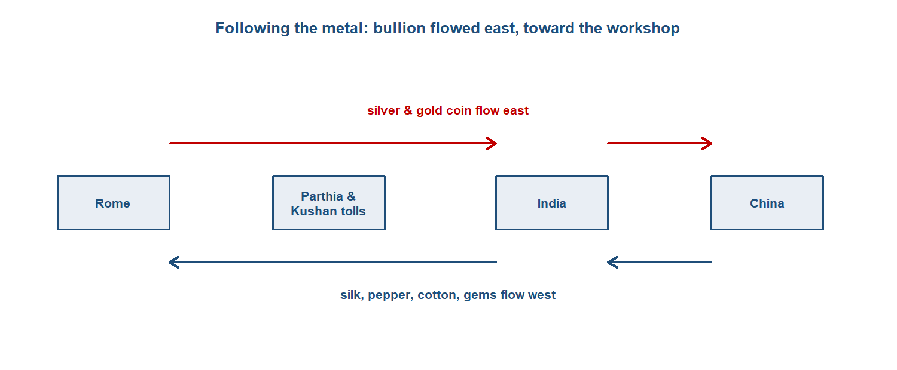{#fig-bullion width=88%}

## Where we are on the arc {.unnumbered}

In @sec-ch01 there was no centre to find — only loosely linked riverine cores and the slow
diffusion of metals and crops along three nascent channels. This chapter is where, for the
first time, the question of where the centre of gravity lay can actually be asked, because for
the first time the channels fused into a single, measurable trans-Eurasian relay running from
Roman Britain to Han China. The conventional answer was "Rome." This chapter tests that answer
by following the goods and the money, and finds that the connected economy's productive core
lay in Asia, with Rome as its structurally dependent western terminus.^[**Sources:** Findlay & O'Rourke, *Power and Plenty* (2007), ch. 1. **Read more:** Beaujard, *The Worlds of the Indian Ocean*, vol. 1 (2019).]

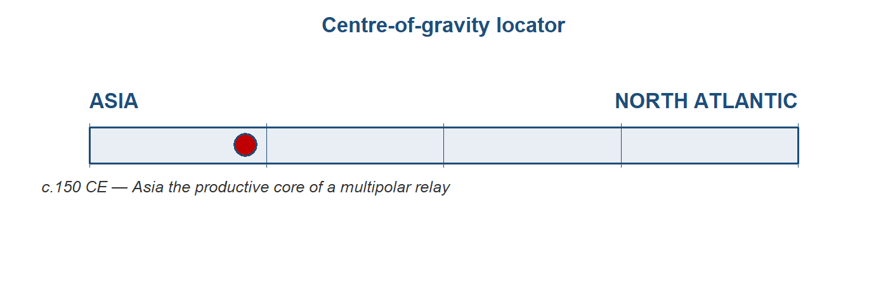{#fig-cog02}

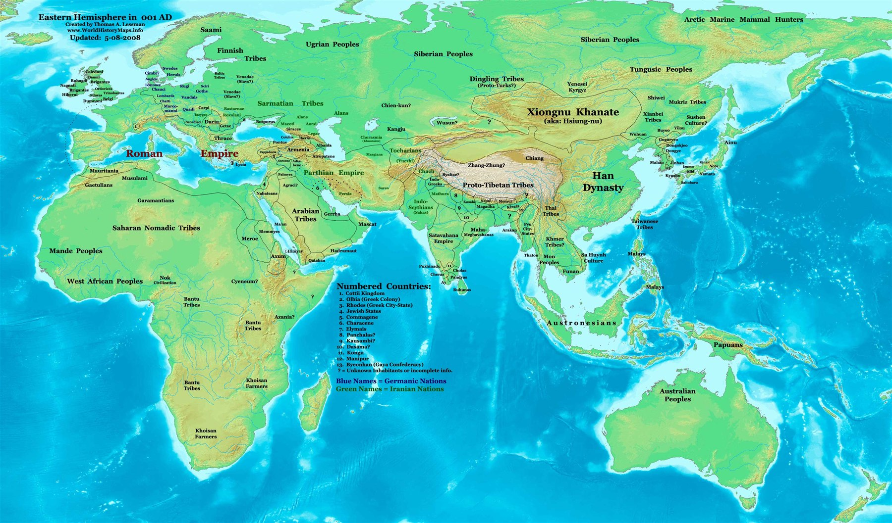{#fig-empiresmap width=92%}

## The stage and the cast

The right mental picture is not a wheel with Rome at the hub and spokes running out to
the provinces and beyond. It is a triangle — Rome, India and China — connected by a relay
of intermediary empires, each of which took its cut. The main chain ran Rome to Parthia and the
Kushans to Han China; Aksum (in the Red Sea), the Arabian incense kingdoms, and the Indian
states rounded out the cast. No single merchant or polity ran the system end to end. It was a
relay of empires, not one market — a distinction we will need when we ask, later, whether
this was really "one" world economy.^[**Sources:** Findlay & O'Rourke (2007), ch. 1; McLaughlin (2014). **Read more:** Abu-Lughod, *Before European Hegemony* (1989), on the "relay" structure of pre-modern world systems.]

The cast of this chapter — India, Han China, Parthia and the Kushans, Rome, and the smaller
players around the rim — is profiled below. Following the module's vantage, the profiles run
from east to west: the direction in which the system's goods were made and toward which its
bullion flowed. Click any actor to expand how its economy worked, at home and in the relay;
India, present in every chapter of this book, is given the fullest treatment.

::: {.callout-tip collapse="true"}
## India — the production core
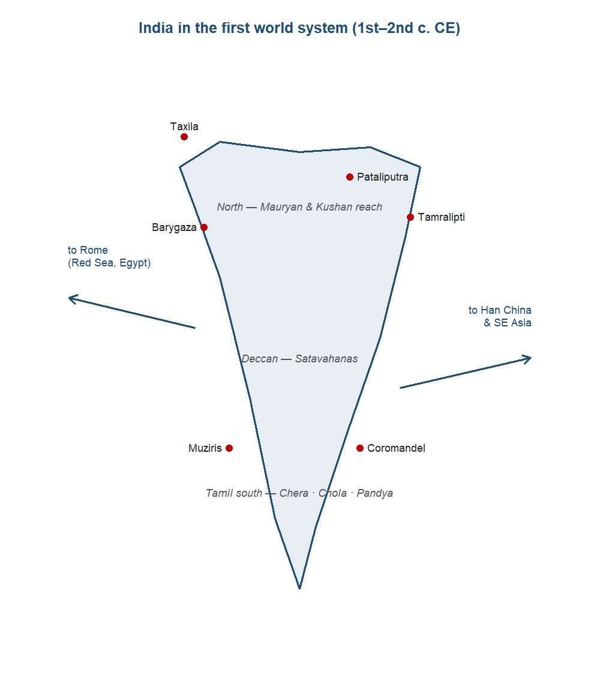{#fig-india-t2 width=66%}

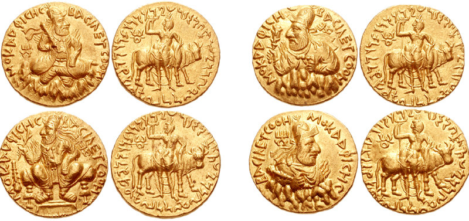{width=55%}

India in this period was not a single polity but a layered economy spread across the
subcontinent. In the north, the Mauryan empire (c.320–185 BCE) had built South Asia's first
centralised administrative-fiscal state, governed from Pataliputra — a city of perhaps 200,000
people, around twice the size of early Rome — and tied together by royal roads running from
Taxila in the north-west to the Bay of Bengal port of Tamralipti. After the Mauryas fragmented,
economic weight shifted south and west: the Satavahanas held the Deccan, while the Tamil
kingdoms of the far south — Chera, Chola and Pandya — commanded the Malabar pepper coast that
Rome most wanted. To the north-west, the Kushans straddled the Hindu Kush and the overland road
to China.^[**Sources:** Roy (p.24) on the Mauryan state; Dalrymple (Loc 713) on Pataliputra's size; Dalrymple (Loc 799) on Ashoka's roads; Roy (p.32) and Dalrymple (Loc 1550) on the southern kingdoms and the Kushan passes. **Read more:** Dalrymple, *The Golden Road* (2024).]

As everywhere in this period, the base of the economy was agriculture and the village. What set
India apart was the unusually developed commercial and craft sector built on top of it — and, in
particular, the two export industries that would define the subcontinent for the next eighteen
centuries: cotton textiles and pepper. The Malabar coast was the world's principal source of
pepper for roughly fifteen centuries, a spice so woven into Roman cooking that around four-fifths
of the 478 recipes in the cookbook of Apicius called for it; the Latin and Greek words for pepper
and ginger were themselves Tamil loans. Production and long-distance exchange were organised
through merchant guilds (the *śreṇi*) and, distinctively, through Buddhist monasteries placed on
the trade routes, which took perpetual endowments (*akshaya-nivi*) and lent at interest —
proto-financial institutions endowed by the merchant class, and known from the donative
inscriptions at Nasik and Karle.^[**Sources:** Eaton (Loc 3659) on Malabar pepper; Dalrymple (Loc 1294, 1298) on Apicius and the Tamil loan-words; on guilds and monastic finance, Schopen (1997, 2004), Ray (1994) and Neelis (2011), with the Nasik (Ushavadata) and Karle (Bhutapala; Yavana donors) inscriptions. **Read more:** Neelis, *Early Buddhist Transmission and Trade Networks* (2011).]

India's monetary arrangements told the centre-of-gravity story in miniature. Indian states
minted their own coin — punch-marked silver in the north, local issues in the south — but they
treated incoming Roman gold and silver less as foreign currency to be spent than as bullion to be
valued by weight and, increasingly, melted and re-struck. The incentive was structural: gold
stood at roughly 10 to 1 against silver in India and on the Kushan and Saka frontier, against
about 12 to 1 in Rome, so a given weight of silver carried east bought something like a fifth
more goods. That arbitrage pulled Roman metal in and kept it. The clearest measure of how deep it
ran was that the Kushan ruler Vima Kadphises struck India's first gold coinage on the weight
standard of the Roman aureus — the empire's own bullion, re-minted as the subcontinent's coin.^[**Sources:** McLaughlin, *Indian Ocean* (Loc 4323), on the 10:1-versus-12:1 ratio and the resulting margin; Dalrymple (Loc 1634, 1636) on Vima Kadphises's gold coinage.]

Externally, India was the fulcrum of the whole system — the hinge where its maritime and overland
arms met. Its trade with Rome ran through three coasts: Barygaza in Gujarat to the north-west,
Muziris and Nelkynda on the Malabar pepper coast, and the Coromandel ports facing the Bay of
Bengal. The same merchants and the same monsoon knowledge also worked the leg eastward to
Southeast Asia and Han China — the third side of the Rome–India–China triangle, and the part of
the system least visible through Roman eyes. The balance of this trade ran heavily in India's
favour, because Rome wanted Indian pepper, cotton, gems and ivory while India wanted little that
Rome made, so the exchange settled in precious metal. So lopsided was it that, on Pliny's
telling, Indian goods resold in Rome for up to a hundred times their price at source, and the
Pandya and Chera kings of the south judged the relationship worth cultivating with embassies to
Rome. India was, in short, where the system's most valued goods were made and where its bullion
came to rest: the production core of the first world system.^[**Sources:** Roy (p.32) on the three coasts; Dalrymple (Loc 1323, 1326, 1335, 1338) on the hundredfold markup and the southern embassies. **Read more:** Dalrymple, *The Golden Road* (2024).]

**Trade profile**

- **Main exports** — pepper and other spices, cotton and fine textiles, gems and semi-precious stones, ivory, pearls.
- **Main imports** — gold and silver coin above all, with smaller volumes of wine, coral, glass and base metals.
- **Export markets** — the Roman Mediterranean to the west (via the Red Sea and Egypt); Han China and Southeast Asia to the east; Arabia and the Gulf.
- **Import sources** — Rome and the wider Mediterranean (bullion, wine, coral, glass); the Gulf and Arabia.^[**Sources:** Casson (ed.), *The Periplus Maris Erythraei* (1989), for the cargo lists; McLaughlin (2014); Dalrymple (2024).]
:::

::: {.callout-tip collapse="true"}
## Han China — the agrarian mirror
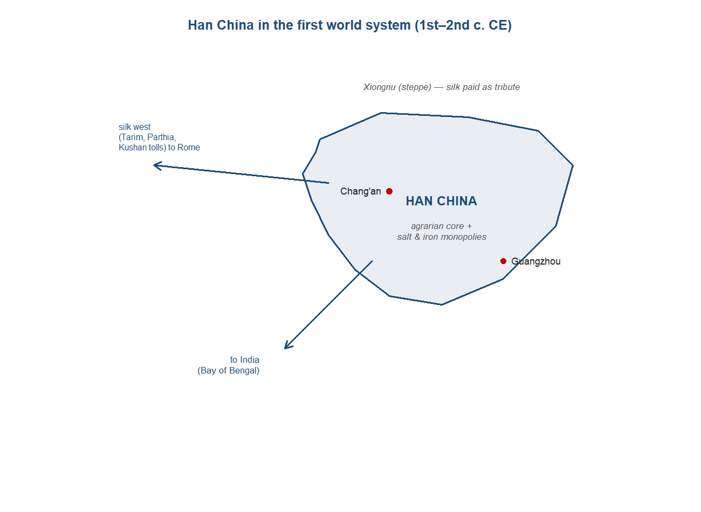{#fig-han-t2 width=78%}

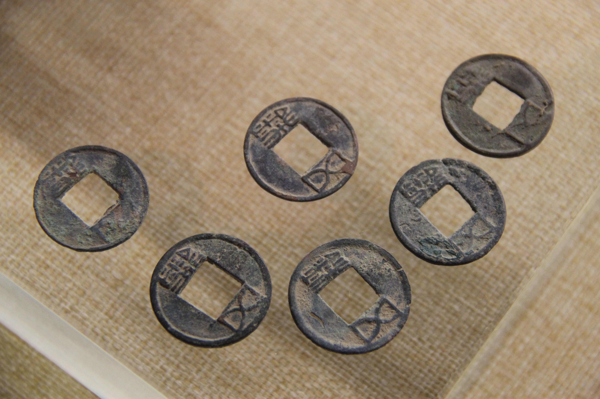{width=55%}

Han China was Rome's structural opposite, and the eastern anchor of the whole chain. Where Rome leaned on the customs of trade, the Han ran an agrarian-fiscal order that contemporaries and later historians have called "physiocratic-military": its wealth came from the land and the peasant household, and its revenue from a light land tax of one-thirtieth of the harvest, a poll tax in cash, and — decisively — state monopolies on salt and iron established under Emperor Wu in 119 BCE. Those monopolies were no sideline. At their height the salt and iron revenues supplied more than half of central government income, run through a network of state foundries staffed in part by convict labour. The state declared agriculture "the basis of the whole world" and taxed commerce as a thing to be managed rather than courted — the mirror image of Rome's consumer empire, which produced little the East wanted and paid for its appetites in coin.^[**Sources:** von Glahn (Loc 1261) on the salt and iron monopolies as over half of central revenue; Lewis (p.110) on the land tax and the typical farm; on the "physiocratic-military" contrast. **Read more:** von Glahn, *The Economic History of China* (2016).]

The scale of the thing was extraordinary. The census of 2 CE returned 12.2 million households and 59.6 million people — a population on the order of the Roman empire's, governed from a single administrative centre rather than a ring of provinces. The capital, Chang'an, anchored a network of cities and registered markets: its eastern market alone covered some 500,000 square metres, the western market half that, the commercial heart of an empire whose imperial highways ran for thousands of miles. This was a world of free smallholders — a typical free farm supported a family of four or five on around eleven acres — overlaid by a state bureaucracy of roughly 120,000 staff, larger and costlier than Rome's civilian administration.^[**Sources:** von Glahn (Loc 1657) on the 2 CE census; Lewis (p.83) on the Chang'an markets and (p.110) on the smallholding farm; McLaughlin, *Silk Routes* (Loc 5758) on the size of the Han bureaucracy. **Read more:** Lewis, *The Early Chinese Empires: Qin and Han* (2007).]

Money told the same comparative story as everything else. The Han minted on a vast scale — roughly 28 billion wu zhu bronze coins in the last century of the Western Han, each a coin of about five zhu — yet the per-capita money supply ran at perhaps half of Rome's, and it was almost entirely low-value bronze, where Rome's was around three-fifths gold and a third silver by value. A monetised economy, then, but a shallow-denomination one, suited to a peasantry making small transactions rather than to long-distance bullion settlement. Wealth, too, was far flatter than at the western end of the chain: the largest Han family estates stood at under a tenth of the size of a great Roman one. At the bottom, tenants handed over half to two-thirds of their crop and the destitute borrowed at interest rates reaching 200 per cent — but the towering private fortunes of the Roman senatorial class had no real Han equivalent.^[**Sources:** Lewis (p.65) on the ~28 billion wu zhu coins and (p.111, p.115) on tenancy, interest, and the estate comparison; von Glahn (Loc 1291, 1294) on the per-capita money supply and the bronze-versus-gold composition. **Read more:** Lewis (2007); von Glahn (2016).]

The good the rest of Eurasia wanted from China was silk, woven in workshops and households across the empire and used by the state itself as a currency of tribute — in one year the Han sent 30,000 bales of it to buy off the Xiongnu of the steppe. Silk's road west was overland, and it ran through other people's hands. The opening came with the missions of Zhang Qian, dispatched around 138 BCE to seek allies against the Xiongnu; he reached Transoxiana and Bactria, returned after some fourteen years, and brought back the first Chinese knowledge of the Western Regions. The Han then fought their way into the Hexi Corridor and the Tarim oasis kingdoms, garrisoning the route. But beyond the frontier the silk passed into the hands of Parthian and Kushan intermediaries, each of whom taxed the flow and took a cut, which is why no single merchant ever ran the route from end to end. A direct India–China leg ran alongside it, by the Bay of Bengal and the Kushan passes. The faintest, most telling trace of the whole system came in 166 CE, when an embassy claiming to come from the Roman emperor "Antun" — Marcus Aurelius — was recorded reaching the Han court: the two ends of Eurasia, however indirectly, in contact at last.^[**Sources:** Lewis (p.115) on the 30,000 bales of silk tribute and (p.143) on the relay structure; McLaughlin, *Silk Routes* (Loc 1734, 2838) on Zhang Qian's missions and the Western Regions, and (Loc 5501) on the 166 CE "Antun" embassy. **Read more:** McLaughlin, *The Roman Empire and the Silk Routes* (2016).]

**Trade profile**

- **Main exports** — silk above all, raw and woven; lacquerware and other fine manufactures in smaller quantities.
- **Main imports** — horses (the prized "Heavenly Horses" of Ferghana), jade and other Central Asian goods; little of Roman make, which reached the court only as curiosities.
- **Export markets** — westward overland through the Tarim, Parthia and the Kushan lands toward Rome; the steppe peoples to the north, paid in silk as tribute; India and Southeast Asia to the south.
- **Import sources** — the steppe and the Western Regions (horses, jade); India, by the southern leg.^[**Sources:** Lewis (p.115, p.143); McLaughlin, *Silk Routes* (Loc 1945) on the Ferghana horses. **Read more:** McLaughlin (2016); von Glahn (2016).]
:::

::: {.callout-tip collapse="true"}
## Parthia and the Kushans — the middlemen

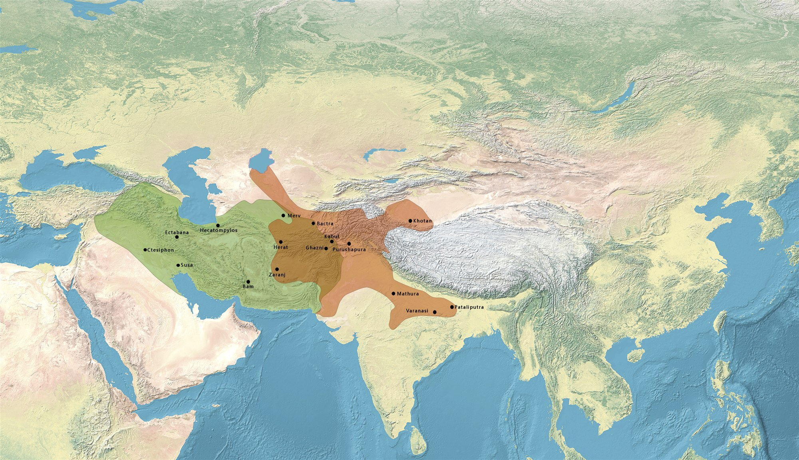{#fig-parthiamap width=88%}

Between Rome at one end of the relay and India and Han China at the other stood the two
empires that held the overland middle, and neither was a producer of the goods that crossed
it. Parthia rose in the 240s BCE from a nomadic people near the Caspian and, expanding west
under Mithridates I, came to straddle the routes running from the Euphrates across Iran toward
Central Asia. The Kushans were a later arrival and, in a sense, a by-product of war further
east: displaced when Han pressure on the Xiongnu set off a chain of steppe migrations, the
Yuezhi were pushed into north-west India, where Kujula Kadphises united them around 50 CE into
the Kushan kingdom. By about 90 CE the Kushans had taken the Indus ports as well, so that a
single power now commanded both the passes of the Hindu Kush and a gateway to the sea — the
hinge between Rome, India and Han China.^[**Sources:** McLaughlin, *Silk Routes* (Loc 2303), on Kujula Kadphises and the founding of the Kushan kingdom; Dalrymple (Loc 1550) on Kushan control of the Hindu Kush passes. **Read more:** Beckwith, *The Scythian Empire* (2023), on the steppe migrations behind the Kushans.]

What these states sold was not goods but passage. The overland route west of the Euphrates and
through the mountains was not a single road run end to end by anyone; it was a relay, and at each
stage an intermediary empire took its cut. No merchant ever travelled the length of it, so the
Chinese silk that reached a Roman market had changed hands and paid a toll many times over —
which is why the same bolt could be worth a small fortune in the West while costing far less at
source. That structure of stacked rents was the economic substance of Parthia and the Kushans:
they lived off the flow they sat astride, not off anything they made.^[**Sources:** Lewis, *The Early Chinese Empires* (p.143), "no merchant ever travelled the length"; McLaughlin, *Silk Routes* (Loc 2671), on the markups along the route. **Read more:** Findlay & O'Rourke, *Power and Plenty* (2007), ch. 1, on intermediary rents in pre-modern relays.]

The Kushans did more than tax the traffic, though; they absorbed a share of the bullion it
carried and turned it into their own coin. The metal that Rome paid eastward for pepper, silk
and gems did not stop at India's coasts but reached the north-western frontier, where the
favourable gold-to-silver ratio — roughly 10 to 1 against Rome's 12 to 1 — gave incoming Roman
metal more purchasing power and an incentive to stay. The clearest sign of how deep that
absorption ran was that the Kushan ruler Vima Kadphises, conquering northern India in the early
second century CE, struck India's first gold coinage on the weight standard of the Roman aureus.
The empire's own bullion, in other words, was re-minted as the subcontinent's coin under a Kushan
king — the middleman not merely passing the metal along but coining it.^[**Sources:** McLaughlin, *Indian Ocean* (Loc 4323), on the 10:1-versus-12:1 ratio and its pull; Dalrymple (Loc 1634, 1636) and McLaughlin, *Silk Routes* (Loc 2715), on Vima Kadphises's gold coinage on the aureus standard. **Read more:** Dalrymple, *The Golden Road* (2024).]

Their position also carried more than goods and coin. Kushan control of the Hindu Kush passes
opened the road north for Buddhist monks, who moved out of India into Bactria and on through the
oasis kingdoms of Central Asia — Uzbekistan, Tajikistan, Xinjiang — toward China. Sited along the
same routes the merchants used, monasteries followed the trade, so that the religion travelled
the relay alongside the silk and the silver. This was the overland counterpart to the merchant-
and-monastery pairing that bound commerce to Buddhism in India itself, and it set the stage for
the faith's later passage into China, which opened in earnest after the Han collapse.^[**Sources:** Dalrymple (Loc 1550, 1572, 1624) on Kushan control of the passes and Buddhist monks moving north into Bactria and Central Asia. **Read more:** Neelis, *Early Buddhist Transmission and Trade Networks* (2011), on the northern routes.]

The two empires were not equivalent. Parthia was the more purely overland gatekeeper, locked in
recurrent tension with Rome along the Anatolian and Mesopotamian frontier, while the Kushans —
bordering Parthia, Han China and the steppe at once, and reaching the sea through the Indus —
were better placed to draw on the large consumer markets at both ends of Eurasia. But the role
was the same in kind. Neither was the customer Rome was, nor the workshop India was. They were
the states that made the relay a relay: the reason the system was a chain of empires rather than
one market, and the reason no single hand ever ran it from end to end.^[**Sources:** on Parthia's frontier tension with Rome and the Kushans' position between large consumer markets west and east; McLaughlin, *Indian Ocean* (Loc 5839), on the synchronised crisis that destroyed Parthia, the Kushans and the rest together by the third century. **Read more:** McLaughlin, *The Roman Empire and the Indian Ocean* (2014).]

**Trade profile**

- **Goods passing through** — Chinese silk above all, moving west; pepper, gems, cottons and other Indian goods reaching the overland leg; Roman gold and silver coin moving east.
- **What they extracted** — transit tolls and stacked rents at each stage of the relay, taken in kind and in coin; for the Kushans, in addition, the re-minting of absorbed Roman bullion into their own gold and copper coinage.
- **Westward connections** — Parthia to the Roman frontier in Anatolia and Mesopotamia; the Kushans, via the Indus ports, to the maritime route and so to Rome.
- **Eastward connections** — the Kushans to Han China through the Hindu Kush passes and the Tarim oasis kingdoms, and to India to the south; Parthia onward to the Central Asian caravan network.^[**Sources:** McLaughlin, *Silk Routes* (Loc 2433, 2612), on Kushan links to Han and the Tarim, and on Sogdian carriage and the Parthian–Roman frontier trade in silk and glassware. **Read more:** McLaughlin, *The Roman Empire and the Silk Routes* (2016).]
:::

::: {.callout-tip collapse="true"}
## Rome — the wealthy consumer

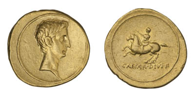{width=52%}

Rome in this period was an unusual state for its time: a commercial-fiscal empire whose treasury leaned, to a degree no other ancient great power matched, on the customs of long-distance trade. Its land taxes were comparatively light — a poll tax of a single denarius a year, a Syrian land tax of around one per cent of assessed wealth — while the duties on trade did the heavy lifting. By the first century CE foreign trade supplied something like a third of imperial revenue, the bulk of it from the *tetartē*, a quarter-rate (25 per cent) customs duty levied on eastern luxuries as they entered the empire, against a mere one-fortieth (2.5 per cent) *portorium* on goods moving between the provinces. The fiscal machine ran on what came in from outside, not on what was grown at home.^[**Sources:** McLaughlin, *Indian Ocean* (Loc 25, 173) on the one-third share and the tetartē-versus-portorium contrast; McLaughlin, *Silk Routes* (Loc 5695, 5698) on the light poll and land taxes. **Read more:** McLaughlin, *The Roman Empire and the Indian Ocean* (2014).]

What that revenue paid for, above all, was the army. At its height the Roman military stood at roughly 300,000 professional soldiers, costing more than 330 million sesterces a year — the single largest charge on the state, swallowing the greater part of an imperial budget of around a thousand million sesterces. The army was not only the empire's great expense but its great redistributive engine. Britain and Gaul ran as a deficit periphery, importing more than they sent out and held in place by army pay — pay funded from the customs of the eastern trade and from the silver and gold of the imperial mines, the Iberian and Dacian workings that gave Rome the metal it needed. Power and plenty were bound together: a professional army that both depended on trade revenue and secured the frontiers within which that trade could be taxed.^[**Sources:** McLaughlin, *Indian Ocean* (Loc 179, 436) on the 300,000-strong army and its >330M-sesterce cost; McLaughlin, *Indian Ocean* (Loc 469, 474, 497) on Britain and Gaul as a subsidised deficit periphery and on mine bullion. **Read more:** McLaughlin, *The Roman Empire and the Indian Ocean* (2014).]

Rome's money told the same story from the other side. The empire coined heavily in silver and gold, and the relative price of the two metals sat at roughly 12 to 1 — silver to gold — at home. That ratio mattered because it differed from the East's: gold stood at about 10 to 1 against silver in India and on the Kushan and Saka frontier, so a given weight of silver carried east bought something like a fifth more goods than it did in Rome. The arbitrage pulled Roman metal outward and gave the bullion drain a monetary motive on top of the appetite that drove it. Underwriting the whole period of Mediterranean prosperity was a benign climate — the Roman Climate Optimum, a warm, wet and stable spell from roughly 200 BCE to 150 CE that coincided with the empire's maximum extent and the parallel flourishing of Rome and Han.^[**Sources:** McLaughlin, *Indian Ocean* (Loc 4323) on the 12:1-versus-10:1 ratio and the resulting margin; on the Roman Climate Optimum (c.200 BCE–150 CE) and the Rome–Han parallel. **Read more:** Harper, *The Fate of Rome* (2017), on climate and the empire's trajectory.]

Externally, Rome was the system's wealthy terminus — its hungriest consumer, paying in coin. Its artery to the East ran by sea, down the Red Sea from the Egyptian ports of Berenike and Myos Hormos and across the open ocean on the monsoon to the Indian coast, the route Rome controlled only after annexing Ptolemaic Egypt in 30 BCE. What came back filled the holds: pepper and other spices, fine Indian cottons, gems and pearls, silk relayed from China, and incense from Arabia. What Rome sent out was thinner — some wine, coral, glass and base metals, but above all gold and silver coin, because the East wanted little that Rome made. The imbalance entered the Roman imagination as a grievance. Pliny complained that India, China and Arabia drained 100 million sesterces a year from the empire, with 50 million or more going to India alone — figures that were rhetorical and are much argued over, but that point in a direction the coin hoards of southern India confirm. Rome was, structurally, a consumer dependent on a flow it could neither control nor reproduce, paying for it in a finite stock of bullion that, once shipped east, was melted down and did not come back.^[**Sources:** McLaughlin, *Indian Ocean* (Loc 4994, 1657) on Pliny's 100M / 50M+ figures and their rhetorical character; on Berenike, Myos Hormos and the cargo lists, and on glass, wine and pottery as Rome's few real exports. **Read more:** De Romanis, *The Indo-Roman Pepper Trade and the Muziris Papyrus* (2020), on what the figures can and cannot bear.]

**Trade profile**

- **Main exports** — gold and silver coin above all, with smaller volumes of wine, coral, glass and base metals.
- **Main imports** — pepper and other spices, fine cottons, gems and pearls, silk (relayed from China), incense and aromatics.
- **Export markets** — India and Arabia to the east (via the Red Sea and Egypt), and indirectly Han China; the empire's own western and northern provinces.
- **Import sources** — India (spices, cottons, gems) above all; Arabia (incense); China (silk, via Parthian and Kushan intermediaries).^[**Sources:** Casson (ed.), *The Periplus Maris Erythraei* (1989), for the cargo lists; McLaughlin (2014).]
:::

::: {.callout-tip collapse="true"}
## The smaller players — Aksum, Arabia, Alexandria

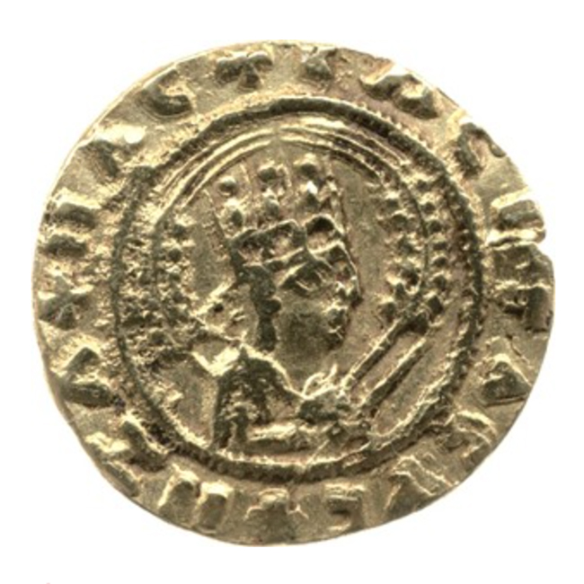{width=50%}

Three smaller powers ringed the system's western end, and one of them mattered out of all
proportion to its size. The most important were the incense kingdoms of Arabia. The southern
corner of the peninsula — the "Arabia Felix" of Roman writers — and the Horn of Africa held a
near-monopoly on the world's frankincense and myrrh, the aromatic resins that Rome burned in
great quantities at its altars and funerals. The trees grew in a narrow band around Dhofar,
perhaps 1.3 million hectares of them, yielding on the order of a thousand tons of frankincense and
two hundred of myrrh in a single harvest — a crop McLaughlin values at more than fifty million
sesterces. The Sabaean kingdom alone was reckoned to produce over forty million sesterces of
incense a year, and Rome paid for it, as it paid the East, in coin: by Pliny's account more than
fifty million sesterces of bullion went to Arabia annually for aromatics. Here was a second
eastward drain running in parallel with the Indian one, and a clear case of regional
specialisation — a whole economy organised around a single high-value export to Rome.^[**Sources:** McLaughlin, *Indian Ocean* (Loc 3384–3386) on the Dhofar groves and the >50M-sesterce harvest, (Loc 352) on the Sabaean kingdom's >40M-sesterce annual output, and (Loc 1657) on the >50M sesterces of bullion Rome sent to Arabia for incense. **Read more:** Pliny, *Natural History*, book 12, on the incense lands.]

The middlemen of that trade were the Nabataeans of Petra, whose wealth the Greeks had remarked on
since the fourth century BCE. They controlled the overland Incense Trail up the western flank of
Arabia and taxed it at every stage — some 688 denarii were levied on a single camel-load on the
stretch between southern Arabia and Nabataea — and they could field thousands of camel-mounted
fighters to guard it; in 312 BCE a raiding Greek army carried off five hundred talents of their
silver along with a store of incense. As the maritime Red Sea route thickened in the first century
CE, much of the aromatic traffic shifted from their caravans to ships — the Nabataeans themselves
ran cord-sewn vessels of up to thirty tons — and the overland road lost its grip; Rome annexed the
Nabataean kingdom outright in 106 CE.^[**Sources:** McLaughlin, *Indian Ocean* (Loc 1450–1456) on Nabataean wealth, (Loc 290) on the 688-denarii camel-load toll, (Loc 1463, 1471) on the 312 BCE raid and the camel cavalry, (Loc 1622–1625) on the cord-sewn dhows, and (Loc 1659) on the annexation of 106 CE. **Read more:** McLaughlin, *The Roman Empire and the Indian Ocean* (2014).]

Aksum, on the African shore of the Red Sea, was the third. It rose in the first century CE as it
took the port of Adulis, the great outlet for African ivory, and grew into a trading power that
struck its own coinage and dealt in ivory, gold and aromatics — at once a partner and a rival to
the South Arabians across the water. Alexandria, finally, was less a producer than a valve: Rome's
western emporium and the customs choke point through which the eastern goods entered the empire
and were taxed, and where the Muziris-papyrus loan was registered. The rim, then, was not mere
backdrop. Arabia ran a parallel luxury drain of its own, and Alexandria was the gate at which Rome
turned the whole eastern trade into revenue.^[**Sources:** McLaughlin, *Indian Ocean* (Loc 3030, 3337) on Aksum's seizure of Adulis; on Alexandria as the western emporium and customs point. **Read more:** McLaughlin, *The Roman Empire and the Indian Ocean* (2014).]

**Trade profile**

- **Main exports** — frankincense and myrrh (Arabia); ivory, gold and aromatics (Aksum); for Alexandria, customs revenue rather than goods of its own.
- **Main imports** — gold and silver coin above all, paid by Rome for incense and ivory.
- **Export markets** — Rome and the Mediterranean, reached by the Incense Trail and the Red Sea.
- **Import sources** — Rome (bullion); India and the wider Indian Ocean, whose goods passed through on the way west.^[**Sources:** McLaughlin, *Indian Ocean* (Loc 352, 1657, 3384–3386). **Read more:** McLaughlin, *The Roman Empire and the Indian Ocean* (2014).]
:::

::: {.callout-note}
## How we know
Our evidence for this system is thin, indirect and skewed. It came mainly from three
sources: merchant handbooks (above all the *Periplus of the Erythraean Sea*); coin hoards,
especially the Roman coins that pile up in southern India; and a single, astonishing commercial
document, the Muziris papyrus, recording the financing and valuation of one ship's cargo. The
trouble is that almost all of it was written through Roman eyes — which is how the trade came to
be read as a Roman story. A useful corrective sits on the island of Socotra, in the mouth of the
Gulf of Aden, where a cave preserved graffiti left by ancient sailors: of 219 inscriptions, 192
were Indic — Brahmi and Indian names — against a handful of others. Whose ocean was it? The
sailors answered the question themselves.

*Sources: Casson (ed.),* The Periplus Maris Erythraei *(1989); De Romanis (2020) on the Muziris papyrus; Strauch (ed.),* Foreign Sailors on Socotra *(2012) on the cave graffiti. Read more: Strauch (ed.),* Foreign Sailors on Socotra *(2012).*
:::

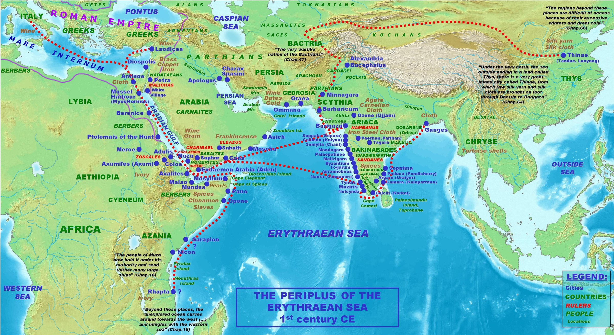{#fig-periplus width=92%}

### Inside the economies: three machines, all agrarian

All three economies were overwhelmingly agrarian: the vast majority of people, everywhere,
farmed, and never touched a trans-Eurasian trade good. What differed was the commercial and
fiscal machinery built on top of the farms — Rome's customs-fed treasury, the Han monopolies on
salt and iron, India's merchant guilds and monastic finance — set out for each economy in the
actor panels above. Keep the distinction in view: when we later locate the centre of gravity, we
are locating the centre of the connected economy, not of total output, which was agrarian
everywhere.^[**Sources:** McLaughlin (2014) on the customs share of Roman revenue; von Glahn (2016) on Han monopolies and wealth distribution. **Read more:** Scheidel & Friesen, "The size of the economy and the distribution of income in the Roman Empire," *Journal of Roman Studies* 99 (2009).]

## The period on its own terms: one rise, one fall, in five phases

The first world system had a life-cycle — a single rise and a single fall — that can be read
in five phases.^[**Source:** this five-phase framing draws on Findlay & O'Rourke (2007) and McLaughlin (2014).]

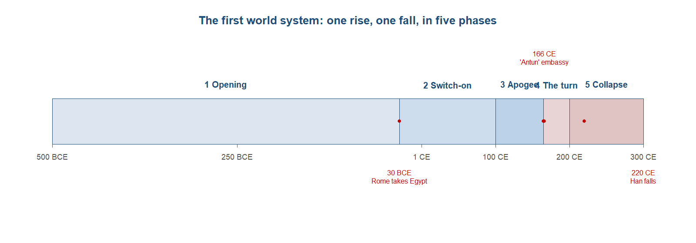{#fig-phases width=92%}

**Phase 1 — the opening (c.500–30 BCE).** The first world system did not switch on in a single moment; it was prised open over four centuries, as the channels laid down earlier were welded into administered space. The first welder was Achaemenid Persia, which from the sixth century BCE bound the Near East into one tributary zone governed through satrapies, moving goods, gold and information along the royal roads from the Aegean to the Indus. Onto that frame came the hinge event of the period. Alexander's conquests of 336–323 BCE swept away the Persian empire and fused the Mediterranean, the Near East and north-western India into a single Hellenistic ecumene, a world of Greek-speaking cities that ran from the Jaxartes to the Nile. The most durable of these was Alexandria, which became the western emporium of the whole system and the point at which Greek knowledge of India — its geography, its goods, and eventually the rhythm of the monsoon — entered the Mediterranean for good. Alexander himself is best read as the hinge, not the substance: he opened the doors, but the trade that flowed through them was built by others over the following centuries. With the Persian and then the Macedonian order broken up among successors, the durable poles of the future system took shape, each independently and roughly at once. Parthia rose in the third century BCE from a nomadic base near the Caspian to straddle the overland route west of the Euphrates. In China, the Qin unification of 221 BCE and the long Han dynasty that followed from 206 BCE built a centralised agrarian empire at the eastern end of Eurasia. In India, Chandragupta Maurya founded the subcontinent's first centralised state (c.322–185 BCE), governed from Pataliputra and tied together by Ashoka's royal roads from Taxila in the north-west to the Bay of Bengal port of Tamralipti; the depth of the Mauryan order was visible at its very birth, when Chandragupta settled his frontier with Seleucus around 303 BCE by ceding the eastern provinces in exchange for 500 war elephants — a transfer that says as much about Indian resources as about Greek reach. To the south, the Tamil kingdoms of the far peninsula commanded the pepper coast that the West would soon crave. The maritime arm thickened in step with the poles. The Greek navigator Eudoxus of Cyzicus opened regular sailings to India around 118 BCE, after a shipwrecked Indian mariner was found on the Red Sea coast and supplied the route, and over the following century Indian Ocean traffic grew from sporadic ventures into something approaching a regular trade. By the time Rome arrived as a Mediterranean power, the apparatus of the system already existed; what it lacked was a wealthy western customer with direct control of the Red Sea coast. Rome's drive toward Egypt — completed when Octavian annexed the Ptolemaic kingdom in 30 BCE — supplied exactly that, and set up the switch-on that followed.^[**Sources:** on Achaemenid Persia, Alexander as hinge, Alexandria and the Hellenistic ecumene; on the poles, Parthia (McLaughlin, *Silk Routes*, Loc 5049), Qin and Han (Lewis, p.16), the Maurya (McLaughlin, *Indian Ocean*, Loc 5308); on the 303 BCE cession, Grainger, *Rise of the Seleukid Empire* (Loc 1346, 1363), and on the figure of 500 of 9,000 war elephants, Dalrymple (Loc 698); on Eudoxus and the ~118 BCE opening, McLaughlin, *Indian Ocean* (Loc 2086); Dalrymple (Loc 799) on Ashoka's roads. **Read more:** Cunliffe, *By Steppe, Desert, and Ocean* (2015), on the opening of the channels.]

**Phase 2 — the switch-on (30 BCE to the first century CE).** What turned sporadic contact across
the Indian Ocean into a high-volume artery was, first of all, a political event: Rome's annexation
of Ptolemaic Egypt in 30 BCE. Egypt handed Rome direct control of the Red Sea coast and its
India-facing ports, together with the accumulated Ptolemaic experience of the eastern trade. The
Greek navigator Eudoxus of Cyzicus had opened regular sailings to India around 118 BCE, and over
the following century Greco-Roman skippers learned to use the monsoon — the seasonal reversal of
winds, traditionally credited to a pilot named Hippalus — to run straight across the open ocean
rather than creep around its rim.^[**Sources:** Dalrymple (Loc 1227, 1234) on Eudoxus and the Hippalus monsoon crossing. **Read more:** Sidebotham, *Berenike and the Ancient Maritime Spice Route* (2011).]

The change in volume was dramatic. Where the Ptolemies had sent perhaps twenty ships a year to
India, Strabo recorded around 120 leaving the single Red Sea port of Myos Hormos in the early
imperial period — more than a sixfold rise.^[**Source:** McLaughlin, *The Roman Empire and the Indian Ocean* (2014), Loc 2106, citing Strabo, *Geography* 2.5.12.]

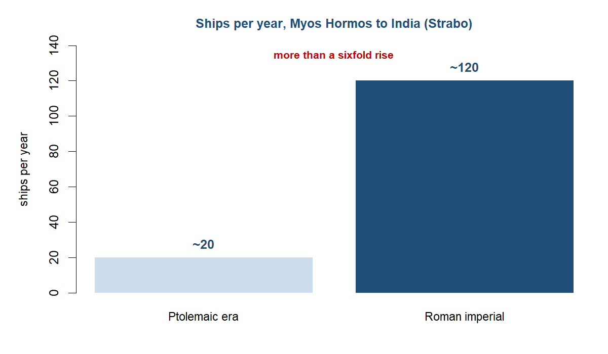{#fig-ships width=52%}

The infrastructure behind that figure is
unusually well documented for the ancient world. Two Red Sea ports, Berenike and Myos Hormos,
were the Roman points of departure; the prize destination was Muziris, the Malabar pepper
emporium. A merchant's handbook, the *Periplus of the Erythraean Sea*, written around the middle
of the first century CE, set out the ports, cargoes and sailing seasons of the whole
route — the closest thing the period has left us as a commercial manual. And the cargoes were large:
a single returning pepper ship of around 200 tons could carry goods worth more than six million
sesterces, enough to pay six thousand legionaries for a year.^[**Sources:** Casson (ed.), *The Periplus Maris Erythraei* (1989); McLaughlin, *Indian Ocean* (Loc 2766), on the 200-ton cargo and its value.]

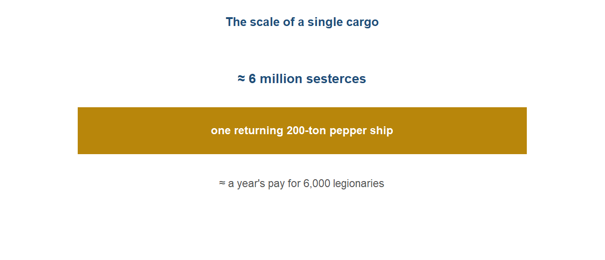{#fig-cargo width=70%}

The defining feature of the switch-on, though, was the direction in which payment flowed. Rome
bought pepper, fine cottons, gems, silk and incense, and paid for them overwhelmingly in gold and
silver coin, because the East wanted little that Rome made. The monetary arbitrage worked in the
same direction — roughly 10 to 1 gold-to-silver in India against 12 to 1 in Rome — giving the
metal a further reason to move east. And move east it did, in quantities large enough to enter the
Roman imagination as a grievance: this was the period in which the eastward bullion drain that
defines this chapter began in earnest.^[**Source:** McLaughlin, *Indian Ocean* (Loc 4323), on the arbitrage and the drain.]

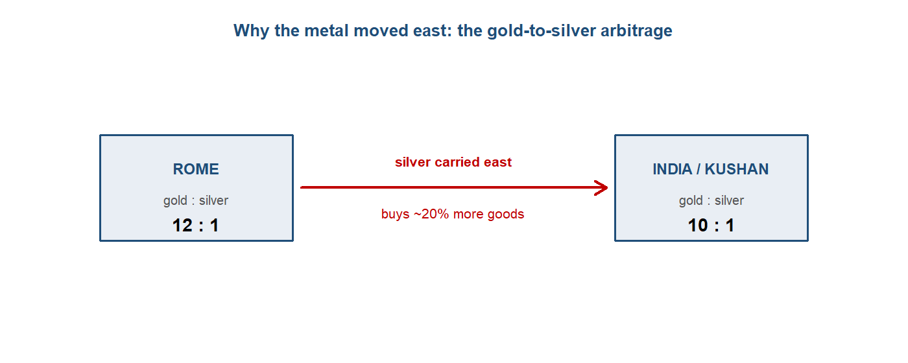{#fig-arbitrage width=76%}

It was also the period in which pepper crossed from luxury to
near-staple — the spice appeared in some four-fifths of the recipes in Apicius, a reach that
pointed to a broad market rather than only an elite one, and the empirical seed of the
luxury-versus-mass-trade debate taken up later in this chapter.^[**Sources:** Dalrymple (Loc 1294) on Apicius; on the debate, De Romanis (2020) and Cobb (2018).]

By the end of the first century CE the route was regular, mature and fiscally important — customs
on the eastern trade would come to supply something like a third of imperial revenue — and the
stage was set for the apogee, when all four poles of the system flourished at once.

**Phase 3 — the apogee (1st–2nd c. CE).** From the late first century CE the system reached its height, with all four poles flourishing at once and the densest evidence the ancient world has left for any of this. It is the moment when the volume of the eastern trade peaks and, by good fortune, the documentation thickens enough to argue about. Eastern Indian Ocean imports ran on the order of more than a thousand million sesterces a year, of which the Roman treasury raised over two hundred and fifty million through the *tetartē*, the 25 per cent duty levied on eastern luxuries at the Red Sea ports — a customs stream large enough that trade came to supply something like a third of imperial revenue. The single richest document is the Muziris papyrus, a second-century commercial contract recording the financing and fiscal assessment of one returning Indiaman, the *Hermapollon*, laden with some 220 tons of pepper, textiles, spices and ivory. Its value is genuinely disputed and is best left so: different reconstructions put the full cargo near 9.2 million sesterces with around 7 million after the duty was taken, while the papyrus itself records the taxable three-quarters at 1,151 talents and change — figures that do not reconcile cleanly and should not be silently merged. Around this one document sits a wider archive of the apogee. The *Periplus of the Erythraean Sea*, a merchant's handbook of the mid-first century, set out the ports, cargoes and sailing seasons of the entire route. The South-Indian coin hoards make the bullion flow physical: roughly twenty hoards of Roman silver and gold across the peninsula, among them the Kottayam hoard of more than 8,000 gold aurei, the latest struck under Nero. The excavated Red Sea port of Berenike supplies the material backbone at the Roman end, with Indian pottery, peppercorns and South Asian textiles recovered from its warehouses and rubbish. And the most evocative emblem of the system's reach came in 166 CE, when an embassy claiming to come from the Roman emperor "Antun" — Antoninus Pius or Marcus Aurelius — was recorded reaching the Han court, the two ends of Eurasia in faint but direct contact at the very peak. Underneath all of this lay a benign environment: the Roman Climate Optimum, a warm, wet and stable phase running roughly from the second century BCE to the mid-second century CE, which underwrote Mediterranean prosperity and helped the apogee along. This was the high-water mark — the fullest flow of goods and the densest evidence of connection — and it was also, precisely because the routes now ran so densely, the moment before the turn, when the same arteries that carried pepper and silk would carry plague.^[**Sources:** on the >1,000M-sesterce imports and >250M in *tetartē*, McLaughlin, *Indian Ocean* (Loc 535); on the 25 per cent duty and the customs share of revenue, McLaughlin (Loc 173, 25); on the *Hermapollon* and its disputed value, McLaughlin, *Indian Ocean* (Loc 2403, 4941); on the Kottayam hoard (>8,000 aurei) and the ~20 hoards, McLaughlin (Loc 4931); on the 166 CE "Antun" embassy, McLaughlin, *Silk Routes* (Loc 5501); the Roman Climate Optimum from Harper, *The Fate of Rome* (2017). **Read more:** De Romanis, *The Indo-Roman Pepper Trade and the Muziris Papyrus* (2020), on what the *Hermapollon* figures can and cannot bear.]

**Phase 4 — the turn (c.165–200 CE).** What ended the apogee was not a rival or a market but a pathogen. In 165 CE Roman legions under Lucius Verus stormed Seleucia on the Tigris and occupied Babylonia; as they withdrew, they carried west a disease that the sources describe with a black, pustular rash, and which most modern readers take to have been smallpox. The Antonine Plague that followed was, on one account, the first genuinely intercontinental outbreak — and it travelled the same arteries that had carried pepper and silver, moving from the eastern frontier through the army and the ports into the heart of the empire by 166. The lesson was the one this chapter keeps returning to: the routes that integrated a system also transmitted its shocks, and a connected world was a vulnerable one. Disease here entered the narrative not as a local misfortune but as a world-historical force, striking the poles of the relay at roughly the same moment. The plague was not confined to Rome; it ran east along the steppe and frontier as well, and in 162 CE the Han are reported to have lost something like a third of their northern frontier army to disease in a single year, hollowing out the military machine on which the dynasty's order rested. The mortality, though, is precisely where the evidence thins and the historians divide. Kyle Harper has read the Antonine Plague as a true demographic catastrophe — urban death rates above fifteen per cent, a population that did not recover, an empire knocked off its trajectory — and points to suggestive local traces, among them Egyptian land-lease records in which the plots a single tenant worked shrank from around twenty *arouras* before 165 to roughly seven after, and a village register at Socnopaiou Nesos that lost seventy-eight of 244 men in a few months. His critics answer that these are scattered, ambiguous fragments, that ancient mortality cannot be reconstructed from a handful of papyri, and that a severe but survivable epidemic has been inflated into an empire-breaking event; the figure of seven million deaths sometimes attached to the outbreak is an estimate built on thin foundations, not a measured total. This book takes the dispute as exactly that — a live and unresolved methodological quarrel about how to infer demographic disaster from fragmentary records — rather than settling on a single number. What is not in dispute is the direction of travel and the shape of the turn: the plague moved with the trade, both ends of Eurasia were struck within a few years of one another, and the integration that had defined the apogee now began to read as a liability. By the end of the century the frontiers were under pressure, the mints were debasing their silver, and the system that had peaked in living memory had started, quietly, to come apart.^[**Sources:** Harper, *The Fate of Rome* (2017), pp. 18, 133, and Harper, *Plagues upon the Earth* (Loc 1672, 1675), on smallpox and the first intercontinental outbreak; McLaughlin, *Indian Ocean* (Loc 5479) and *Silk Routes* (Loc 5553) on the Han army loss of 162 CE and the Socnopaiou Nesos register; on the ~15 per cent urban mortality and the *arouras* 20-to-7 land-record shift, and on the contested mortality. **Read more:** Harper (2017), ch. 3, for the strong reading and its critics.]

**Phase 5 — the synchronised collapse (c.220–300 CE).** The decisive feature of the system's end was not that any one pole fell but that all of them fell together. In 220 CE the last Han emperor abdicated and China broke into the Three Kingdoms, opening the long Period of Disunion. Within a few years the other anchors went the same way: the Satavahana kingdom of the Deccan disintegrated in the 220s, the Parthian empire was overthrown by the Sasanians in 224, the Kushan empire — the great re-minter of Roman gold — collapsed around 230, and in the far south the Chera and Pandya dynasties that had supplied Rome's pepper were destroyed. Rome itself entered the crisis of the third century from 235, a half-century of usurpation, debasement, frontier breach and fresh epidemic — the Plague of Cyprian, an outbreak of uncertain cause, swept its territories from around 249. By the period between 220 and 284, McLaughlin observes, Han China, Parthia, the Satavahanas, the Kushans, the Tamil dynasties and Rome had all been destroyed or thrown into crisis. That near-simultaneity is the single strongest piece of evidence in the whole chapter that this had been one connected system rather than a set of regional economies that happened to trade: poles that rose together and fell together were, in some real sense, parts of one whole, bound by the same arteries and exposed to the same shocks along them. The mechanics of the unwinding reinforced the point. The overland route decayed as the empires that had policed its tolls fragmented, and the long-distance trade that had measured the system's integration thinned with them. By around 300 the first world system had frayed past the point of recovery. Its western end did not vanish so much as relocate: as the Roman West fragmented, the Mediterranean's centre of gravity shifted east to Constantinople, the new capital on the Bosphorus, leaving the old core hollowed and the centre displaced toward Asia once more. That displacement is the hand-off to the next chapter. The relay built around Rome and Han had run its single rise and single fall; what came next was not its restoration but a new integrating order, coalescing in the centuries after 300 around the rise of Islam and a resurgent Tang China — two fresh cores around which the Indian Ocean would knit itself together again, with Europe, for a long while yet, on the rim.^[**Sources:** McLaughlin, *Indian Ocean* (Loc 5839) on the synchronised destruction of Han, Parthia, Satavahana, Kushan, the Tamil dynasties and Rome by AD 220–284, and (Loc 5841, 5842) on the fall of Han (220), the Sasanian overthrow of Parthia (224), and the Satavahana and Kushan collapses; Harper, *The Fate of Rome* (pp. 18, 130) on the Plague of Cyprian (c.249); on the fraying by ~300 and the eastward shift to Constantinople. **Read more:** Findlay & O'Rourke, *Power and Plenty* (2007), ch. 1, on the synchrony argument.]

## Reading the period: the four questions

The narrative above can be condensed into answers to the four questions that drive this book.
Taken together they convert the rise-and-fall story into an argument about where the system's
weight lay.

The first question was about direction (Q1): was the system integrating or disintegrating? The
honest answer was both, in sequence — it integrated across the opening and apogee, then
disintegrated from the turn onward. What made the integration claim more than an impression was
the synchrony of the two movements. The poles did not rise and fall one by one, as separate
regional economies buffeted by separate local shocks would have; they rose together across the
first centuries CE and fell together across the third, and that near-simultaneity was the
strongest single sign that they had been parts of one whole rather than a set of neighbours who
happened to trade. The same synchrony carried the first of the book's running lessons. The
Antonine Plague travelled the very arteries that had carried pepper and silver, reaching both
ends of Eurasia within a few years; the integration that defined the apogee was also what
exposed every pole to the same shock. Integration bred fragility, and it was not costless.^[**Sources:** McLaughlin, *Indian Ocean* (Loc 5839) on the synchronised collapse of Han, Parthia, the Satavahanas, the Kushans, the Tamil dynasties and Rome by 220–284 CE; Harper, *The Fate of Rome* (2017), pp. 18, 133, on the plague's spread along the routes. **Read more:** McLaughlin, *The Roman Empire and the Indian Ocean* (2014).]

The second question was about channels (Q2): which routes carried the integration? Sea and land
worked as complements rather than rivals, each suited to a different kind of cargo. The sea
carried bulk — pepper above all, with gems and textiles — by the shipload, and it was far cheaper
than land carriage; McLaughlin put the maritime advantage at roughly thirtyfold, which is why a
heavy, relatively cheap good like pepper could only ever travel that way. (How much cheaper sea
was than land is itself contested, our sources supporting a range from about fivefold to
thirtyfold, and the chapter leaves that gap open rather than resolving it.) The overland route
carried the opposite kind of good: high-value, low-bulk silk, moving west through a relay of
Parthian and Kushan tolls, each intermediary taking its cut, which is why no single merchant ran
its length and why a bolt cheap at source was worth a small fortune in the West. A third leg ran
directly between India and China, by the Bay of Bengal and the Kushan passes, bypassing the
Mediterranean altogether. The triangle, then, had three legs — and Rome sat at only one corner.^[**Sources:** McLaughlin, *Indian Ocean* (Loc 2984) on sea transport as roughly thirty times cheaper than land; Lewis, *The Early Chinese Empires* (p.143) on the overland relay and "no merchant ever travelled the length." **Read more:** Diocletian's *Edict on Maximum Prices* (301 CE); Sen, *Buddhism, Diplomacy, and Trade* (2003) on the India–China leg.]

The third question was about modes (Q3): which flow did the actual integrating? The sharpest way
to see it was to treat bullion not as money but as a good in its own right, flowing toward the
workshop that made what everyone wanted. Roman precious metal moved east and stayed east, and the
reason was partly monetary. Gold stood at roughly ten to one against silver in India and on the
Kushan frontier, against about twelve to one in Rome, so a given weight of silver carried east
bought something like a fifth more goods than it did at home. That arbitrage gave the metal a
reason to move on top of the appetite that already drove it, and the scale of a single voyage
shows what was at stake: one returning pepper ship of around 200 tons could carry goods worth
more than six million sesterces, enough to pay six thousand legionaries for a year. The traders
who carried it, moreover, were substantially Indian, for all that our sources were written
through Roman eyes — the cave graffiti on Socotra, at the mouth of the Gulf of Aden, ran to 219
inscriptions, of which 192 were Indic. Follow the bullion and the workshop sat in Asia.^[**Sources:** McLaughlin, *Indian Ocean* (Loc 4323) on the 10:1-versus-12:1 ratio, and (Loc 2766) on the 200-ton cargo worth more than six million sesterces; Strauch (ed.), *Foreign Sailors on Socotra* (2012) on the 192-of-219 Indic graffiti. **Read more:** De Romanis, *The Indo-Roman Pepper Trade and the Muziris Papyrus* (2020).]

::: {.callout-important}
## Follow the money
Treating bullion as a good is the move that makes this chapter's argument visible, and it is the
first turn of a tracer the book uses all the way through. Roman precious metal flowed east and
stayed there, melted down and re-struck by Kushan and Saka rulers who valued it as metal rather
than as foreign coin. It moved toward the production centre, the place where the goods the rest
of the world wanted were made — and the direction of the metal is, throughout this book, the
running indicator of where that centre lay. Hold the device in mind: in later chapters the same
tracer follows New World silver east to China, and then, once bullion becomes money and capital
in the nineteenth century, follows the capital to London and New York instead.

*Read more: the bullion tracer is introduced in the Introduction ("the bullion tracer, and why it flips") and runs through @sec-ch05 and @sec-ch08.*
:::

The fourth question was about Europe (Q4): what, then, was Rome's role? Rome was the system's
wealthy consumer, its fiscal base resting on a flow of eastern goods and the customs they
generated — a flow it neither controlled nor could reproduce. It was powerful, rich and
militarily dominant within its own sphere, but in the economic relay of Eurasia it was the
structurally dependent western terminus, paying in a finite stock of bullion for goods made
elsewhere. Behind the whole cycle stood forces larger than any of the actors: a benign climate,
the Roman Climate Optimum, that helped the apogee along, and then a disease that took it away.
Climate gave, and disease took.^[**Sources:** McLaughlin, *Indian Ocean* (Loc 25) on trade customs as about one-third of imperial revenue; on Rome as the structurally dependent consumer. **Read more:** Harper, *The Fate of Rome* (2017).]

## The verdict: where was the centre?

This was the first period in which the centre-of-gravity question could actually be tested, and
the answer it returned was measure-dependent rather than single. The first world system had no
single political centre. It was a multipolar relay of states — Rome, Parthia, the Kushans and Han
China — comparable in weight, and on aggregate size Rome was the largest single economy of the
four. On political and military measures, then, there was no centre to find, only poles.^[**Sources:** on the multipolar relay and Rome as the largest single economy. **Read more:** Scheidel, *Escape from Rome* (2019), on ancient polycentrism.]

On a different measure the picture tilted firmly. By the value of production and the direction of
bullion, Asia was the system's productive core. India and China made the goods the rest of
Eurasia wanted, and the precious metal flowed toward them and stayed, which on a "locus of valued
production plus bullion accumulation" reading placed the centre of gravity in Asia. Rome's
position, read the same way, was the structurally fragile one. It was not merely a wealthy
consumer but a deficit-financed one, its treasury leaning on trade customs that supplied about a
third of imperial revenue — a dependence on a flow it could not control, settled in a finite
metal that did not come back, which made the position precarious rather than commanding.^[**Sources:** McLaughlin, *Indian Ocean* (Loc 25) on trade customs as about one-third of imperial revenue; on Asia as the production and creditor core and Rome as the deficit consumer. **Read more:** McLaughlin, *The Roman Empire and the Indian Ocean* (2014).]

So the verdict turned on the question asked. Measured by demand and consumption, the peak was
Rome; measured by production and the bullion sink, it was Asia. Both answers were correct on their
own terms, and the chapter's task was to keep them distinct rather than collapse them into a
single winner. What gave the verdict its confidence was that the direction was well triangulated,
resting on three independent traces that pointed the same way: Pliny's complaint of an eastward
drain, the South-Indian coin hoards that made the drain physical, and the Muziris papyrus that
priced a single cargo of it. What remained genuinely contested was not the direction but the
scale. Pliny's figures were rhetorical and much argued over, and the value of the *Hermapollon*
cargo recorded in the Muziris papyrus was reconstructed very differently by different scholars.
The direction was solid; only the magnitude was open. *(Confidence: moderate-to-good — the
direction well triangulated, the scale genuinely contested.)*^[**Sources:** on the measure-dependent verdict; McLaughlin, *Indian Ocean* (Loc 4994) on Pliny's rhetorical figures and (Loc 2403, 4941) on the disputed *Hermapollon* value. **Read more:** De Romanis (2020) on what the figures can and cannot bear.]

One caution belongs at the close, because it governs everything that follows. The "success"
measured here was aggregate scale, not income per head. To say that Asia was the productive core
of the connected economy was a statement about the quantity and value of what flowed, not about
how well the average farmer at either end of Eurasia lived — and on that the whole system was
overwhelmingly agrarian and poor, much alike across its poles. The switch from quantity to
quality, from the size of an economy to the income of the people in it, was the thing that would
eventually make European dominance possible, and it did not arrive in this period or for long
after. It comes only with the Great Divergence in @sec-ch07. Holding the two apart — scale now,
living standards much later — is the discipline the rest of the book will need.^[**Sources:** the scale discussion drawing on Scheidel and on Temin, *The Roman Market Economy* (2013). **Read more:** the quantity-versus-quality distinction in the Introduction.]

::: {.callout-note}
## Research in focus — did the Roman economy grow per head?
- **Aim** — to test whether a pre-industrial economy could generate sustained *intensive* growth (rising output per person), and not only *extensive* growth from larger, denser settlements.
- **Question** — did Roman Britain experience intensive growth between the Late Iron Age and the end of the Roman period?
- **Data and method** — excavation records from Romano-British settlements (coin-loss rates, fine-pottery consumption, residential building area, and building counts as a population proxy) across four periods, analysed with settlement-scaling theory, which separates productivity gains from the effects of settlement size.
- **Findings** — the scaling relationships matched the theory's prediction, and baseline productivity roughly doubled from the early to the late Roman period — an average intensive-growth rate, in the authors' words, "on the order of a fraction of a percent per year." Slow beside modern rates, but not zero.
- **Caveats** — the excavation samples are partial and non-random; settlement sizes are often poorly known; the result may be specific to a frontier province being drawn into the Roman economy, and the growth reversed after Rome withdrew.

*Source: Ortman, Lobo, Lodwick, Wiseman, Bulik, Harbison & Bettencourt, "Identification and measurement of intensive economic growth in a Roman imperial province," Science Advances 10(27): eadk5517 (2024). [DOI](https://doi.org/10.1126/sciadv.adk5517).*
:::

::: {.callout-warning}
## The debate: a luxury haemorrhage, or high-volume mass trade?
Was the Indo-Roman trade a thin trickle of ruinously expensive luxuries for a tiny elite — the
"haemorrhage" of Pliny's complaint — or a high-volume commerce in goods like pepper and ordinary
textiles that reached well down the social scale? The older view emphasised luxury and elite
consumption; a revisionist line (De Romanis; Cobb) read the Muziris papyrus and the scale of the
pepper trade as evidence of something much closer to a mass market. The dispute matters because it
changes how economically significant the system was, and it is bound up with a second, unresolved
quarrel — the value of the *Hermapollon* cargo recorded in that papyrus, which different scholars
reconstruct very differently (a full value around 9 million sesterces, on one reading, with duty
above 2 million). This book does not quietly pick a winner. The gap in the cost-of-carriage
figures (roughly 5× versus 30×) and the *Hermapollon* reconstruction are presented as what they
are: open questions where the evidence underdetermines the answer.

*Sources: De Romanis,* The Indo-Roman Pepper Trade and the Muziris Papyrus *(2020); Cobb,* Rome and the Indian Ocean Trade from Augustus to the Early Third Century CE *(2018).*
:::

::: {.callout-note}
## Research in focus — was it really one market?
- **Aim** — to measure how far the Roman transport network knit the empire into an integrated economy, and whether that integration left a long-run imprint.
- **Question** — did better-connected regions trade more with one another in Roman times, and does Roman-era connectivity still predict economic integration today?
- **Data and method** — a reconstruction of the Roman multi-modal network (roads, navigable rivers, sea lanes) combined with spatially fine-grained finds of excavated Roman ceramics as a proxy for interregional trade; network-connectivity measures are related to trade intensity, and, as a long-run test, to modern cross-regional firm investment.
- **Findings** — regions better connected within the Roman network traded more with each other, and those ancient connectivity differentials still help predict economic integration two millennia later.
- **Caveats** — ceramics are an imperfect proxy for total trade; the network's routes were not laid down at random, which complicates causal claims; and the modern persistence result is a correlation.

*Source: Flückiger, Hornung, Larch, Ludwig & Mees, "Roman Transport Network Connectivity and Economic Integration," The Review of Economic Studies 89(2): 774–810 (2022); CEPR Discussion Paper 14884. [DOI](https://doi.org/10.1093/restud/rdab036).*
:::

::: {.column-page}
**Data exhibit — Roman coin hoards in southern India.** The densest physical trace of the
bullion drain is the distribution of Roman silver and gold coins found in hoards across the
Indian peninsula, clustering in the Tamil south and trailing off north and east. Plotted against
the *Periplus*'s port list and the Muziris papyrus, the hoards turn a literary claim ("metal
flowed east") into a mappable pattern. *Caveats:* hoards record deposition and non-recovery, not
flow — a coin buried and never retrieved is over-represented relative to one that kept
circulating; and find-spots reflect where modern archaeology has looked. *What you could do with
this:* combine published hoard catalogues with port locations to ask whether coin density tracks
the *Periplus*'s emporia, and test how sensitive the picture is to the deposition bias.

*Sources: published Roman-coin-hoard catalogues for South Asia (e.g. Turner, 1989; updated finds); Casson (1989) for the* Periplus *ports.*
:::

::: {.callout-note}
## Research in focus — how big was a single cargo?
- **Aim** — to reconstruct the economics of the Indo-Roman trade from its single richest document, the Muziris papyrus.
- **Question** — how large and how valuable was one Indiaman's cargo, and does it point to an elite-luxury trade or a high-volume one?
- **Data and method** — a close documentary reconstruction of the Muziris papyrus (the loan contract and customs assessment of the *Hermapollon*), read against the *Periplus* and the surviving price evidence.
- **Findings** — a cargo of roughly 220 tons, its taxable three-quarters recorded at 1,151 talents and change (a full value on the order of several million sesterces), much of it pepper and ordinary textiles — evidence, De Romanis argues, of a high-volume, partly mass-market trade rather than a trickle of luxuries.
- **Caveats** — it is a single document; the conversion into sesterces is a contested reconstruction; and one cargo cannot simply be scaled up to the whole trade.

*Source: Federico De Romanis, The Indo-Roman Pepper Trade and the Muziris Papyrus (Oxford University Press, 2020).*
:::

## Threads forward

This chapter set three of the book's threads running. The centre-of-gravity verdict gets its
first real entry (Asia the productive core of a multipolar relay; moderate-to-good confidence).
The quantity-versus-quality thread is introduced with a warning we will need for every "thriving"
empire to come: aggregate scale is not income per head. And integration-breeds-fragility got its
first demonstration in the Antonine Plague.^[**Read more:** the six cross-cutting threads are set out in the Introduction.]

One actor deserves a closing look, because it carries us into @sec-ch03. In India, Buddhism and
long-distance trade reinforced one another. Congenial to mobile merchants because it sat lightly
on the caste-ritual barriers that constrained others, it was endowed by merchant guilds — the
donative inscriptions at Nasik (the financier Ushavadata) and Karle (the *setthi* Bhutapala;
named Yavana, that is Greek or Roman, donors) record the flow of commercial wealth into the
monasteries. Sited on the trade routes, those monasteries became proto-financial institutions:
they took perpetual endowments (*akshaya-nivi*) and lent at interest, supplying credit and trust
along the roads, and carrying Buddhism itself on toward China. The careful claim is
proto-banks, not "the first banks"; and the once-common story that a Brahmanical "sea taboo" drove
merchants into Buddhism is dropped, because the evidence does not support the causal link. Hold on
to that pairing of religion and trade, because the next chapter opens a new order built around two
faiths — Islam and a Tang-Chinese world — in which religion again lubricated the exchange.^[**Sources:** Schopen, *Bones, Stones, and Buddhist Monks* (1997) and *Buddhist Monks and Business Matters* (2004) on monastic endowments and lending; Ray, *The Winds of Change* (1994) and Neelis, *Early Buddhist Transmission and Trade Networks* (2011) on monasteries and routes; Gernet, *Buddhism in Chinese Society* (1995). **Read more:** Neelis, *Early Buddhist Transmission and Trade Networks* (2011).]

---

## Classic research: the foundations {.unnumbered}

The modern debate sits on top of a century-old argument among economic historians about *what
kind of economy* antiquity even had — an argument worth knowing, because this chapter's "one
market or a chain of empires?" question is its direct descendant.

- **Rostovtzeff (1926)**, *The Social and Economic History of the Roman Empire* — the
  **"modernist"** foundation: a Roman world of vigorous trade, investment and a quasi-bourgeois
  commercial class. [Internet Archive](https://archive.org/details/rostovtzeff-1926-sehre)
- **Tenney Frank, ed. (1933–40)**, *An Economic Survey of Ancient Rome* (5 vols) — the
  foundational compilation that first assembled the scattered quantitative evidence.
- **Polanyi, Arensberg & Pearson, eds (1957)**, *Trade and Market in the Early Empires* — the
  **"substantivist"** view: ancient exchange was *embedded* in social and political institutions,
  not a self-regulating market. The intellectual root of "relay of empires, not one market."
- **Finley (1973)**, *The Ancient Economy* — the **"primitivist"** classic that dominated for a
  generation: status, not markets, organised ancient economic life; long-distance trade was
  marginal. The paradigm the quantitative turn was built to test.
  [UC Press](https://www.ucpress.edu/book/9780520219465/the-ancient-economy)
- **Hopkins (1980)**, "Taxes and Trade in the Roman Empire (200 B.C.–A.D. 400)," *Journal of
  Roman Studies* 70: 101–125 — the **seminal quantitative model** linking taxation, money and
  trade; the hinge between Finley's qualitative world and modern cliometrics.
  [JSTOR](https://www.jstor.org/stable/299558)
- *On this chapter's exact subject* — **Warmington (1928)**, *The Commerce between the Roman
  Empire and India*, the classic synthesis of the Indo-Roman trade
  ([Internet Archive](https://archive.org/details/in.ernet.dli.2015.282092)); and **Wheeler,
  Ghosh & Krishna Deva (1946)**, "Arikamedu," *Ancient India* 2 — the excavation that put the
  trade on a material footing.

## At the research frontier: recent cliometric work {.unnumbered}

A quantitative ("cliometric") literature now tries to put **numbers** on the ancient economy —
output, living standards, market integration — and it is moving quickly. The list below reflects
a sweep of **NBER, CEPR and RePEc/IDEAS** (plus the leading archaeology/ancient-history venues),
recent first. *One honest result of the sweep:* NBER surfaced no ancient-economy working paper;
the economics-discipline action is in **CEPR / *Review of Economic Studies*** and **JEP / EHR**,
while the field's empirical depth sits in **OXREP / JRS / *Science Advances***.

- **Flückiger, Hornung, Larch, Ludwig & Mees (2022)**, "Roman Transport Network Connectivity and
  Economic Integration," *Review of Economic Studies* 89(2): 774–810 — the headline
  economics-discipline paper: uses spatially disaggregated excavated-ceramics data to show Roman
  transport connectivity drove **market integration** (and still shapes integration two millennia
  on). Squarely on this chapter's **Q2 (channels)**. Circulated as a CEPR Discussion Paper.
  [DOI](https://doi.org/10.1093/restud/rdab036) · [RePEc](https://ideas.repec.org/a/oup/restud/v89y2022i2p774-810..html) · [CEPR column](https://cepr.org/voxeu/columns/how-roman-transport-network-connectivity-shapes-economic-integration)
- **Ortman, Lobo, Lodwick, Wiseman, Bulik, Harbison & Bettencourt (2024)**, "Identification and
  measurement of intensive economic growth in a Roman imperial province," *Science Advances*
  10(27): eadk5517 — settlement-scaling methods find *modest per-capita* (intensive) growth in
  Roman Britain over four centuries. A direct test for this book's **quantity-vs-quality** thread.
  [DOI](https://doi.org/10.1126/sciadv.adk5517)
- **Kessler & Temin (2007)**, "The organization of the grain trade in the early Roman Empire,"
  *Economic History Review* 60(2): 313–332 — uses grain-price gradients to argue for an
  **integrated** Mediterranean market; a key plank of the "modernist/market" revival.
- **Temin (2006)**, "The Economy of the Early Roman Empire," *Journal of Economic Perspectives*
  20(1): 133–151 — the accessible economics-discipline statement of the market case, expanded in
  his *The Roman Market Economy* (2013). [DOI](https://doi.org/10.1257/089533006776526148)
- **De Romanis (2020)**, *The Indo-Roman Pepper Trade and the Muziris Papyrus* (OUP) — the
  definitive quantitative reconstruction behind this chapter's central document; the empirical core
  of the luxury-vs-mass-trade debate.
- **Bowman & Wilson, eds (2009– )**, *Quantifying the Roman Economy* and the ongoing **Oxford
  Roman Economy Project** — the standing programme turning proxies (shipwrecks, amphorae, coins,
  mining pollution) into economic indicators; the methodological backbone of the field.
- **Scheidel & Friesen (2009)**, "The size of the economy and the distribution of income in the
  Roman Empire," *Journal of Roman Studies* 99: 61–91 — the benchmark Roman-GDP estimate behind
  this chapter's "~5% of output" sizing.
- **Milanović, Lindert & Williamson (2011)**, "Pre-industrial inequality," *Economic Journal* 121:
  255–272 — places Rome in a comparative inequality frame (the "inequality possibility frontier").


---

### Questions for consideration {.unnumbered}

*Essay / exam style — each rewards the four-questions toolkit and the chapter's live debate, not recall.*

1. *"Rome was the consumer, Asia the centre."* Assess this claim using the eastward bullion drain.
2. Was the first Eurasian system **one market** or **a chain of empires**? Use the synchrony of
   its rise and fall, and the role of the middlemen, in your answer.
3. *"The Indo-Roman trade was a luxury sideshow, not a structural feature of either economy."*
   How would you test this — and how far do the data (the ~5%-of-output estimate; the Muziris
   papyrus) let you?
4. How much explanatory weight should **climate and disease** carry in the rise and fall of the
   first world system? Discuss with reference to the Antonine Plague and the third-century crisis.
5. *"Absence of evidence is not evidence of absence."* Using the Socotra graffiti and the Roman
   coin hoards, discuss how the **survival and bias** of the sources shapes what we can claim about
   who ran this trade.

::: {.callout-tip}
## Cross-cutting questions (collected at the end of the book)
The book closes with a bank of questions that span several chapters. Two that this chapter feeds:
- **Bullion as tracer.** Compare the eastward Roman drain (this chapter) with the eastward
  early-modern silver flow (@sec-ch05): in what sense does "follow the bullion" locate the same
  kind of centre in both, and where does the analogy break down?
- **Quantity vs quality.** Across @sec-ch02, @sec-ch06 and @sec-ch07, when is it legitimate to call
  a "thriving" empire *rich*, and when only *big*? Build your answer from aggregate-vs-per-capita
  evidence.
:::

### Data exercise {.unnumbered}

```{r}
#| label: ch-02-exercise
#| eval: false
# Indo-Roman coin hoards vs Periplus ports (published hoard catalogues + Periplus emporia).
# 1. Load a published catalogue of Roman coin hoards in South Asia (find-spot, count, date-range).
# 2. Load Periplus emporia coordinates.
# 3. Map hoard density; test whether it tracks the port list.
# 4. Discuss the deposition/non-recovery bias before drawing inferences about "flow".
```

### Key data {.unnumbered}

| Figure | Value | Source (to wire to `references.bib`) |
|---|---|---|
| Roman drain east (rhetorical) | ~100m sesterces/yr | Pliny, via Dalrymple 2024 |
| Customs share of Roman revenue | ~1/3 | McLaughlin 2014 |
| Sea vs land carriage cost | ~5×–30× cheaper (disputed) | Dalrymple 2024 / McLaughlin 2014 |
| Monsoon-era shipping increase | ~6× | Strabo, via McLaughlin 2014 |
| Eastern trade as share of Roman output | ~5% | Scheidel (est.) |
| *Hermapollon* cargo value | ~9m sesterces full; duty >2m (disputed) | De Romanis 2020 |
| Socotra graffiti | 192 of 219 Indic | Strauch 2012 |
| Direct Rome–Han contact | "Antun" embassy, 166 CE | *Hou Hanshu*, via von Glahn 2016 |
| Pataliputra population | ~200,000 | Dalrymple 2024 |

*The two figures flagged "disputed" are presented in the Debate, not silently resolved. Formal
citation keys are added in the bibliography pass.*

### Further reading {.unnumbered}

- **Core:** Findlay & O'Rourke, *Power and Plenty* (2007), ch. 1; McLaughlin, *The Roman Empire
  and the Indian Ocean* (2014).
- **Supplementary:** Dalrymple, *The Golden Road* (2024); von Glahn, *The Economic History of
  China* (2016), on the Han anchor; Casson (ed.), *The Periplus Maris Erythraei* (1989, primary).
- **The debate:** De Romanis (2020) and Cobb (2018) on the Muziris papyrus and luxury-vs-mass
  trade; on Buddhism and commerce, Ray (1994), Schopen (1997, 2004), Neelis (2011).
