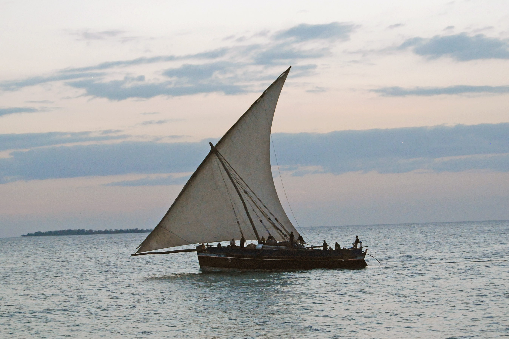
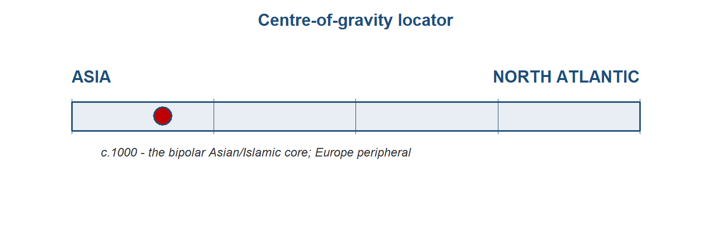
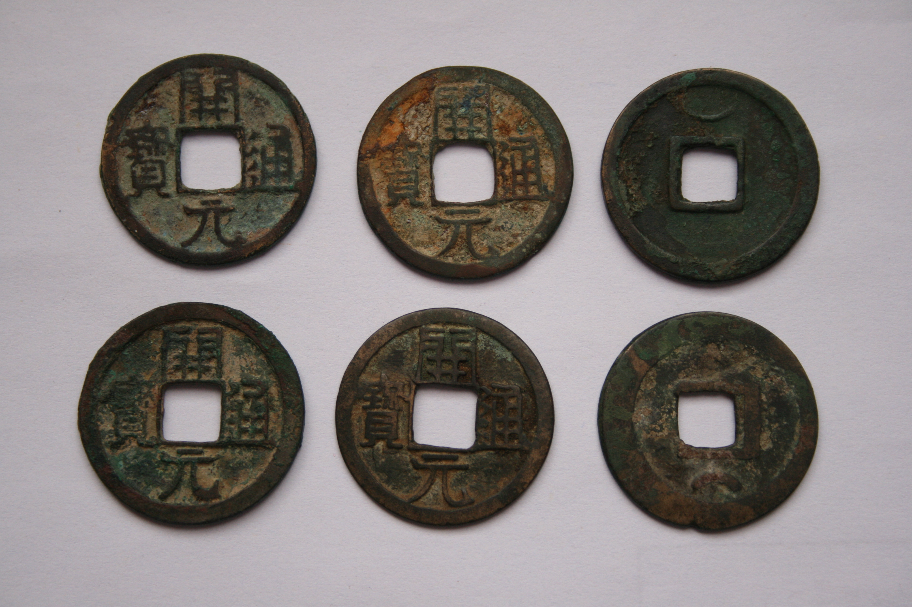
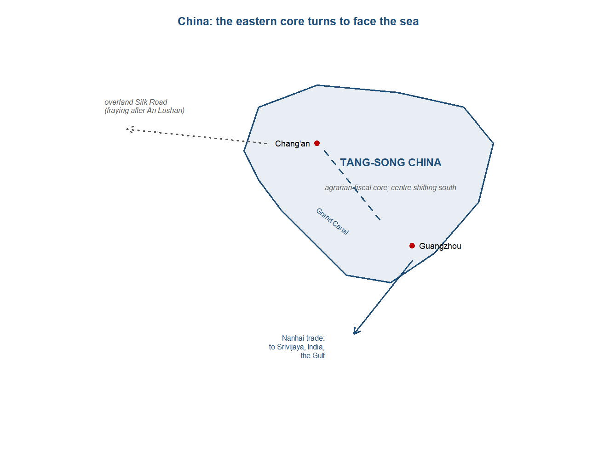
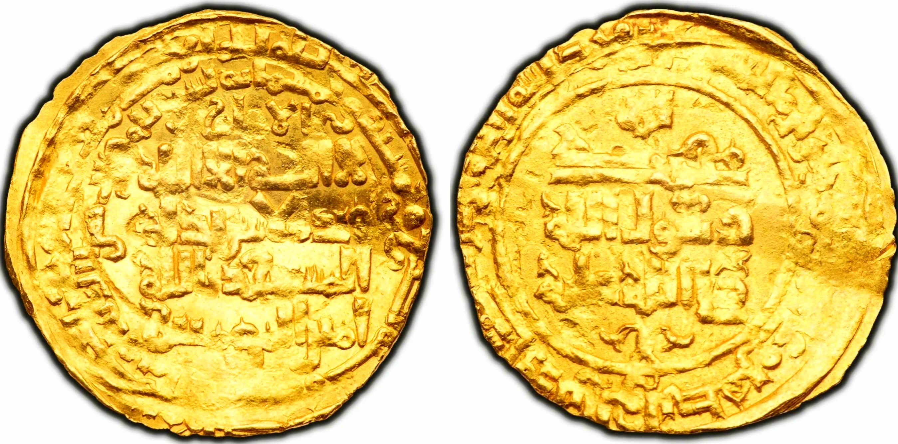
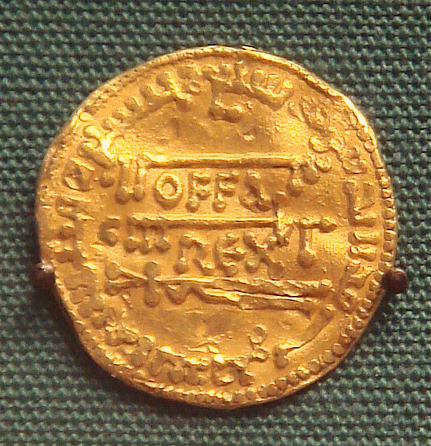
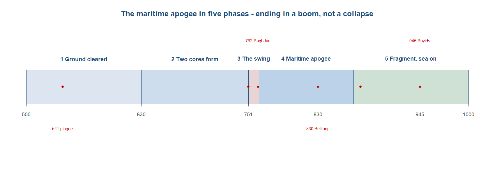

# Maritime apogee: Baghdad and Guangzhou, not Aachen {#sec-ch03}

> *The premodern Indian Ocean at its height — and Europe at its most peripheral.*

> "They journey from West to East, from East to West, partly on land, partly by sea."
> — Ibn Khurradadhbih, on the Radhanite merchants, *The Book of Roads and Kingdoms*, c.850
>
> "It is thus rigorously true to say that, without Mahomet, Charlemagne is inconceivable."
> — Henri Pirenne, *Mohammed and Charlemagne*, 1937

## Follow one thing {.unnumbered}

Start with a coin. Around the year 900 a silver dirham was struck at a Samanid mint in Central Asia — al-Shash, perhaps, near modern Tashkent — to a weight and fineness fixed two centuries earlier by an Umayyad caliph in Damascus. It was money a merchant in Baghdad, Córdoba or Guangzhou would have recognised and trusted. Yet this particular coin did not stay in the lands that used it as everyday cash. It travelled north: up the Volga through the territory of the Khazars and the Rus, paid out for furs and slaves, and ended its working life buried in a hoard on the Baltic island of Gotland, among tens of thousands of its kind, where an archaeologist found it eleven centuries later. Follow that dirham and the whole period comes with it. It shows the two great economies that minted and trusted such silver — the Islamic Middle East and Tang China — with the Indian Ocean as the road between them. It shows the money system, bimetallic and durable, that knit the connected world together. And above all it shows a direction: the silver ran out of the wealthy core toward a poorer northern margin that had only furs and people to sell, the exact mirror of the Roman silver that had drained east into Asia in the last chapter. Where the coin ended up tells us where the centre was not.^[**Sources:** on the dirham flowing north for slaves and furs and the reversal of the Rome$\to$India drain; on the Baltic hoards as a dated flow, Noonan/Kovalev. **Read more:** Frankopan, *The Silk Roads* (2015).]

{#fig-dhow width=92%}

## Where we are on the arc {.unnumbered}

The last chapter left a multipolar relay — Rome, Parthia, Kushan, Han — fraying by about 300 CE under plague, civil war and the fall of the Han. This chapter takes up what replaced it. A new integrating order formed across the centuries after 500, and it had a clearer shape than anything before it: two Asian cores, the Abbasid Middle East and Tang then Song China, with India central to the ocean between them, and Europe on the far western rim. For the first time the question that drives this book — where did the weight of the world economy sit, and was it moving? — has its cleanest pre-modern answer. The signature structural change of the period was a reorientation of the main artery from land to sea, as the maritime Indian Ocean reached its premodern height and overtook the overland Silk Road. The chapter follows the silver to locate the centre, and finds it firmly in Asia and the Islamic world.^[**Sources:** Findlay & O'Rourke, *Power and Plenty* (2007), on the centre of gravity and the land-to-sea reorientation.]

{#fig-cog03 width=76%}

## The stage and the cast

The stage was the Indian Ocean and its monsoon. The same seasonal reversal of winds that had carried Roman ships to India still set the rhythm of the sea, but the network strung along it was now longer and more tightly knit, running unbroken from the Gulf to Guangzhou. Two geographic facts organised the traffic. The first was the cost of carriage: moving goods by sea cost a fraction of moving them overland, so once the caravan routes lost their security the ocean became the cheaper channel for anything heavy. The second was the chokepoint: the eastbound trade had to thread the Straits of Malacca, which gave whoever held them — in this period, Srivijaya — a living from transit alone. Around the ocean sat a cast that had almost wholly changed since the age of Rome and Han. Two new cores had formed at either end of Asia; a fresh northern periphery had appeared to buy the core's silver; and Europe, the wealthy customer of the last chapter's western end, was now a slave-and-raw-materials margin.^[**Sources:** Wickham (Loc 586) on sea carriage roughly twenty times cheaper than land. **Read more:** Pearson, *The Indian Ocean* (2003).]

{#fig-map2cores width=92%}

::: {.callout-tip}
## Dramatis personae
The economic actors of c.500--1000, profiled east to west — the direction the goods were made and the route ran. India, the workshop in the middle of the ocean, appears in every chapter at the fullest depth. The peripheries come last: the northern silver sink that bought the core's coin, Tibet as the overland counterpoint at its height, and Carolingian Europe on the western margin.
:::

::: {.callout-tip collapse="true"}
## China — the eastern core (Tang to early Song)

China was the larger of the two cores by population and output, and the more inward-facing of the two. Where the Abbasid economy ran on long-distance commerce and coined money, the Tang state rested on land, grain and conscript labour. The Sui had reunified the country in 589 and cut the Grand Canal that joined the rice-growing Yangzi south to the political north; the Tang, founded in 618, inherited both. At its eighth-century height the dynasty governed through an equal-field system that granted cultivators a fixed allotment of land in return for the threefold zu-yong-diao levy — grain, cloth and twenty days of labour a year — and through a regimental army of some six hundred headquarters, two-thirds of them packed within about 170 miles of the capital. Chang'an, the eastern terminus of the overland silk roads, may have held more than a million residents inside its walls and was, with Baghdad, one of the two greatest cities on earth.^[**Sources:** von Glahn (Loc 2218, 2227, 2320, 2359, 2599); Lewis (loc 272, 532-533). **Read more:** Lewis, *China's Cosmopolitan Empire* (2009).]

The numbers were the largest in the world. The Sui census of 609 had returned about 46 million people; the Tang apogee under Xuanzong, around the 742 count, reached roughly 50 million, which made China the largest economy on earth. Behind that aggregate a slow geographical shift was under way. The demographic balance that had sat about 60 per cent in the north in 742 tilted to roughly 62 per cent in the south by 980, as the wet-rice frontier of the Yangzi and the far south absorbed migrants and out-produced the old northern heartland. The southern paddy, the canal that carried its surplus north, and the craft towns along the rivers were becoming the centre of gravity of the Chinese economy itself — a movement that would define the centuries to come.^[**Sources:** Hansen (Loc 474); von Glahn (Loc 2248, 2620); Lewis (loc 470). **Read more:** von Glahn, *The Economic History of China* (2016).]

Money in Tang China ran on three things at once. The state minted the kaiyuan tongbao, the round bronze cash introduced in 621 that would set the standard for a thousand years, at perhaps two hundred million coins a year. But bronze was low-value and chronically short, so much of the fiscal economy moved in kind: bolts of silk and measures of grain served as parallel money, and around nine-tenths of state revenue was reckoned and paid in cloth and grain rather than coin. Out of the strain of moving cash across a continental empire came the first credit instruments — the "flying cash" remittance notes by which a merchant could deposit money in one city and draw it in another — the distant beginnings of the paper money that the Song would later make general.^[**Sources:** von Glahn (Loc 2335, 2341, 2350); Lewis (loc 379). **Read more:** von Glahn (2016).]

The base under all of it was agriculture and craft. Tang prosperity rested on irrigated rice and on a string of industries that fed the export trade: the stoneware kilns of Changsha in the middle Yangzi, the celadon of the Yue kilns on the south-east coast, and the silk weave of the north. These were the goods that filled the holds of the dhows, and the kilns at Changsha in particular turned to mass production for an overseas market they would never see.^[**Sources:** von Glahn (Loc 2518); Lewis (loc 114). **Read more:** Lewis (2009).]

Externally, the Tang met the Indian Ocean at Guangzhou. The great southern port held a large quarter of foreign merchants — Arab, Persian and others — living under their own headmen, and through it ran the Nanhai or "Southern Seas" trade that linked China to Srivijaya, India and the Gulf. To manage it the state appointed a maritime trade commissioner, the shibo shi, by 714, who levied a heavy customs charge on incoming cargo and exercised a right of monopoly purchase over the most valuable goods before private sale was allowed. The turn to the sea was sharpened by disaster on land: the An Lushan rebellion of 755 to 763 shattered Tang military and fiscal power, broke the equal-field system, and loosened the dynasty's grip on the overland routes west — pushing the surviving commercial energy of the empire toward its southern coast. The scale of the resulting diaspora can be read, grimly, from its destruction: when the rebel Huang Chao sacked Guangzhou in 878 to 879, the foreign merchant community killed was put by Abu Zayd al-Sirafi at about 120,000 and by al-Masudi at some 200,000 — figures inflated but indicative of how large the resident foreign trading population had grown. The Tang gave way to the Song after 907, and under the Song the maritime economy would intensify into a full commercial surge — the story of the next chapter.^[**Sources:** Sen (1996); Lewis (loc 516); Abu Zayd / al-Masudi via Alpers; von Glahn (Loc 2602, 2632). **Read more:** Sen, "The Administration of Maritime Trade during the Tang and Song Dynasties" (1996).]

{#fig-cointang width=55%}

**Trade profile**

- **Main exports** — ceramics above all (Changsha stoneware, Yue celadon), silk and other fine textiles.
- **Main imports** — aromatics, spices and incense, ivory, rare woods and other tropical produce; bullion and goods from the western ocean.
- **Export markets** — Srivijaya and Southeast Asia, India, and the Gulf ports of the Abbasid world, reached through Guangzhou.
- **Import sources** — the Nanhai trade with Srivijaya, India and the Indian Ocean; the Gulf and the Middle East at the far end of the route.^[**Sources:** von Glahn (Loc 2518); Hansen (Loc 344, 3194); Lewis (loc 516). **Read more:** Hansen, *The Year 1000* (2020).]

{#fig-mapchina width=85%}
:::

::: {.callout-tip collapse="true"}
## India — the workshop between two cores

India in this period was again not one polity but a layered subcontinental economy, and its weight had shifted south and west of the old Gangetic heartland. The end of the Gupta order in the fifth century had thinned the northern trade that Rome once fed, and the occurrence of foreign coin fell with it; what rose in its place was a set of regional powers oriented to the sea. The Chalukyas held the Deccan from Vatapi; the Pallavas commanded the Tamil south and its Coromandel ports; and from the later eighth century the Rashtrakutas of the Deccan became the dominant power, their Balhara king remembered by Arab writers as one of the "Four Great Kings of the World" alongside the Byzantine emperor, the Tang emperor and the Abbasid caliph. At the very tail of the period the Cholas began their rise under Rajaraja from 985 — but their Indian-Ocean empire belongs to the next chapter, not this one.^[**Sources:** Roy (p.38) on the post-Gupta fall in foreign-coin occurrence; Kanisetti (Loc 631, 1716) on the Chalukyas at Vatapi and Pallava power; Kanisetti (Loc 4709, 4811, 5030) on the Rashtrakutas and the "Four Great Kings"; Kanisetti (Loc 5598) on Rajaraja Chola from 985. **Read more:** Kanisetti, *Lords of the Deccan* (2022).]

As everywhere, the base of the economy was farming and the village, but two export industries set India apart, as they had under Rome and would for centuries more: pepper and cotton textiles. The Malabar coast remained the world's principal pepper source — a position it held for roughly fifteen hundred years — and pepper stayed the ocean's signature bulk luxury. The deeper change in this period was in cloth. As the maritime economy thickened, cotton rather than silk became the textile that moved in volume across the Indian Ocean, and the subcontinent was its great workshop; Indian block-printed cottons were reaching as far as Egypt. Production and exchange were organised through merchant guilds, and along the routes sat the same craft-and-temple economy seen elsewhere in South Asia: at Pattadakal in the 730s a single Rashtrakuta-era temple commission was said to have absorbed so many craftsmen that other royal temples stalled for want of hands.^[**Sources:** Eaton (Loc 3659) on Malabar as the world's principal pepper source; Hansen (Loc 3357) on cotton displacing silk as the ocean's textile; Eaton (Loc 2475) on block-printed cottons reaching Egypt; Kanisetti (Loc 2986, 2990, 2994) on the Pattadakal craftsmen. **Read more:** Roy, *India in the World Economy* (2012).]

The southern and western coasts were where the subcontinent met the ocean, and the geography of its ports mapped the trade. Three coastal arms carried it: Gujarat in the north-west, with Broach and the later rise of Gujarati shipping; the Malabar pepper coast facing the Arabian Sea and the Gulf; and the Coromandel coast on the Bay of Bengal, turned toward Sri Lanka, Srivijaya and China. The archaeology shows how cosmopolitan these ports had become. The Rashtrakuta-era harbour of Sanjan, on the western coast, has yielded both West Asian glass and Chinese ceramics from the same layers — a single Indian port catching goods from both ends of the ocean. Indian shipwrights, for their part, built vessels designed around the monsoon, a craft tradition that changed remarkably little between the early historic centuries and the seventeenth.^[**Sources:** Roy (p.32) on the Gujarat, Malabar and Coromandel arms and (p.25) on the three Indian-Ocean trade systems; Kanisetti (Loc 4754, 4876) on Sanjan's West Asian glass and Chinese ceramics; Roy (p.11, p.48) on monsoon-built Indian ships. **Read more:** Kanisetti, *Lords of the Deccan* (2022).]

India's coasts were also where Islam first touched the subcontinent, and they show how money and faith travelled together. Arab traders had reached the western coast before Islam, and by the ninth century the ports held settled, multi-confessional mercantile communities. A famous set of copper plates from Kollam, on the Malabar coast, recorded a trade grant witnessed by signatories writing in Arabic alongside Zoroastrian, Jewish and Christian merchants — a snapshot of the cosmopolitan port society on which the Gulf–China trade rested. Indian states minted their own coin, but the high-value settlement medium of the wider ocean was the Abbasid silver dirham and gold dinar, and Indian ports were embedded in that monetary world rather than standing outside it.^[**Sources:** Mohan (Loc 2394) on Arab traders on the western coast before Islam; on the Kollam copper plates and the Arabic, Zoroastrian, Jewish and Christian witnesses. **Read more:** Roy, *India in the World Economy* (2012).]

Externally, India's role had changed since the age of Rome. It was no longer the wealthy West's chief partner at the end of a relay; it was the indispensable midpoint of a much longer artery, the sea road that now ran direct from the Gulf to China. Ships out of Siraf, Basra and Oman's Sohar sailed for Guangzhou — Basra to Guangzhou in about five months, the longest regular sea route then worked — and that route ran along India's coasts, took on its pepper and cottons, and used its harbours and pilots. The decisive new entrepôt to the east was Srivijaya, which from its base at Palembang held the Straits of Malacca through which the China traffic had to pass; India sat between that chokepoint and the Gulf. India was, in short, the producing and trans-shipping core in the middle of the ocean: not the customer at the end of the line, but the workshop between the two cores.^[**Sources:** on the Siraf/Basra/Sohar–Guangzhou route and Srivijaya from 670; Hansen (Loc 344) on the ~5-month Basra–Guangzhou run. **Read more:** Roy, *India in the World Economy* (2012).]

**Trade profile**

- **Main exports** — pepper and other spices above all; cotton textiles, increasingly the ocean's signature cloth; gems, ivory and other high-value craft goods.
- **Main imports** — Abbasid silver and gold coin; horses from the Gulf and Arabia (a trade that grew over the ninth to twelfth centuries); West Asian glass and Chinese ceramics, recovered together at ports such as Sanjan.
- **Export markets** — the Abbasid Gulf and the Islamic west to one side; Srivijaya, Tang China and Southeast Asia to the other — India supplying both ends of the Gulf$\to$China route.
- **Import sources** — the Persian Gulf and Arabia (bullion, horses, glass); China and Srivijaya (ceramics, eastern goods), reaching India along the same sea road.^[**Sources:** Roy (p.32, p.38) on the export staples and the horse trade; Kanisetti (Loc 4754, 4876) on glass and ceramics at Sanjan; Roy (p.27) on the long-run pattern. **Read more:** Roy, *India in the World Economy* (2012).]

{#fig-mapindia width=85%}
:::

::: {.callout-tip collapse="true"}
## Srivijaya — the keeper of the strait

Srivijaya rose at Palembang, on the Musi river in south-east Sumatra, from around 670, and for the next several centuries lived off a single geographic fact: every ship sailing between the Abbasid west and Tang China had to thread the Straits of Malacca, and Srivijaya sat astride them. It was a thalassocracy rather than a territorial empire — a power built on harbours, river-mouths and the loyalty of coastal chiefs, not on ploughland. Its wealth came from controlling the chokepoint: ships were induced or compelled to call, pay tolls and exchange goods at the entrepôt, where forest products gathered from the Sumatran interior met the manufactures of the two cores. The polity cultivated relations with both ends of the route, sending tribute embassies to the Tang court that secured trading privileges, while drawing on Indian religious and political models — Palembang was a noted centre of Buddhist learning where foreign monks paused on the long passage east.^[**Sources:** on Srivijaya controlling the Straits of Malacca as the great entrepôt. **Read more:** Alpers, *The Indian Ocean in World History* (2014).]

The entrepôt's economics were those of a relay, not a workshop. Srivijaya produced little itself beyond what its forests and seas yielded; its value lay in transit, storage and the redistribution of others' goods. Whether the long Gulf-to-China voyage was sailed direct or broken at intermediate ports such as Palembang and the Indian harbours is a live question — the Belitung wreck of around 830 shows that direct sailing happened, but much trade was still trans-shipped through entrepôts that held a strait or a coast. Either way, Srivijaya was the indispensable hinge in the maritime middle.^[**Sources:** on direct versus segmented Gulf–China trade and direct-versus-trans-shipped sailing. **Read more:** Pearson, *The Indian Ocean* (2003).]

**Trade profile**

- **Main exports** — entrepôt re-exports plus Sumatran forest and sea products (aromatic woods, resins, camphor); above all the service of transit itself, monetised through tolls and harbour dues.
- **Main imports** — Chinese ceramics and silk and Middle-Eastern and Indian manufactures moving through in transit.
- **Export markets** — Tang China (tribute-and-trade embassies) and the Indian Ocean trading world to the west.
- **Import sources** — China to the east; the Abbasid Gulf, India and the Sumatran hinterland feeding the port.^[**Sources:** Alpers, *The Indian Ocean in World History* (2014), on Srivijaya and the entrepôt trade.]
:::

::: {.callout-tip collapse="true"}
## The Abbasid Caliphate — the western core

The first thing to grasp about the Abbasid realm was its sheer extent as a single commercial space. Within a century of Muhammad's death in 632 the Arab conquests had welded the Near East, Egypt, Persia, North Africa and Iberia into one polity, and the Abbasid revolution of 750 inherited it whole. The result was a free-trade zone with no internal frontier from al-Andalus in the west to Sind in the east, governed after the 690s through Arabic as its sole administrative language and, from 762, from a new capital on the Tigris. Goods, coin and merchants moved across it without changing sovereign, customs regime or currency — an integration the fragmented Roman West of the same centuries could not approach.^[**Sources:** Hoyland (Loc 1090, 1447, 3492) on the conquest from Iberia to Sind and Arabic as the official language; on the al-Andalus-to-Sind free-trade zone. **Read more:** Hoyland, *In God's Path* (2015).]

At the centre of it stood Baghdad, founded by the caliph al-Mansur in 762. Its construction was itself an index of Abbasid command over resources: the round city's build was reported to have employed on the order of 100,000 workers and cost some 4.88 million dirhams. Within a few decades it had grown into the largest city on earth, with a population conservatively put at around half a million, though estimates run considerably higher. Baghdad anchored a wider urban order: the great Iranian cities of Nishapur, Rayy and Isfahan each passed 100,000 people in the boom era, and Baghdad itself was reckoned five to ten times the size of the largest of them. This was a thoroughly monetised, consuming society — one in which occupational records show deep specialisation, the textile and fibre trades alone accounting for a fifth to a quarter of the recorded epithets of those who died in the cities of ninth- and tenth-century Iran.^[**Sources:** on the 762 founding, the ~100,000 workers and 4.88m dirhams, and Baghdad at ~half a million (estimates higher); Bulliet (Page 8) on the >100,000 Iranian cities and (Page 45) on Baghdad five to ten times their size; Bulliet (Page 3, 2) on textile trades as 20-24% of occupational epithets. **Read more:** Bulliet, *Cotton, Climate, and Camels in Early Islamic Iran* (2009).]

What knit this consuming economy together was money, and the Abbasid monetary system was the most sophisticated of its age. It rested on a bimetallic coinage fixed by the reform of the Umayyad caliph 'Abd al-Malik between 685 and 705: a gold dinar of about 4.25 grams and a silver dirham of about 2.97 grams, with copper *fals* for small change. The official rate set roughly ten dirhams to the dinar, though in practice the market drifted toward twenty, so that the gold-to-silver ratio the coinage implied was not a single clean figure but a band, somewhere in the region of ten to fourteen to one. The system proved remarkably durable, holding broadly stable for three centuries. Layered above the coin were genuine credit instruments that let value move without bullion travelling: the *sakk* — a written order on a banker, the distant ancestor of the cheque — and the *suftaja*, a bill of exchange already in use by the eighth century, by which a sum paid in one city could be drawn in another.^[**Sources:** on 'Abd al-Malik's reform and the *sakk*/*suftaja*; on the ~10-dirham official rate drifting to ~20 and the implied ~10-14:1 band. **Read more:** Findlay & O'Rourke, *Power and Plenty* (2007).]

Underneath the cities and the coin lay land and tax. The Abbasid fisc drew on a rich agrarian base, above all the irrigated alluvium of southern Iraq: a single revenue record for southern Iraq around 670 showed sixty million dirhams collected, of which fifty-two million — some 87 per cent — went out again on military stipends and rations, a reminder that the fiscal machine existed largely to pay the army that held the zone together. Agriculture in the Iranian heartland was worked through qanats, the underground irrigation channels in use on the plateau since Achaemenid times. Whether the period saw a genuine "Arab agricultural revolution" — Andrew Watson's thesis of diffused crops, irrigation and rising productivity — is contested: sceptics such as Decker and Squatriti hold that many of the crops were already present in Roman and late-antique times and that change was gradual rather than abrupt. What is clearer, from recent work, is that the core ran relatively unrestricted markets in land, labour and capital and a deep urban division of labour, even if the "revolution" framing remains in dispute.^[**Sources:** Hoyland (Loc 2144) on the ~670 southern-Iraq record (60m dirhams collected, 52m on military pay); Bulliet (Page 12, 23) on qanats since Achaemenid times; on the Watson-vs-Decker/Squatriti debate. **Read more:** Watson, *Agricultural Innovation in the Early Islamic World* (1983).]

Externally, the Abbasid core was the central node of Afro-Eurasian exchange, and the sea was its main artery. Its outlets were the Gulf ports — Basra at the head of the Gulf, Siraf on the Persian shore, and Oman's Sohar — from which ships sailed direct to Tang China, the longest regular sea route of the age, Basra to Guangzhou taking about five months. The merchants who worked it were Arab, Persian and, threading the overland and Mediterranean legs, the Jewish Radhanites, whose activity peaked between the 750s and 830s. The clearest measure of the core's reach, though, was the direction its silver ran. The dirham functioned as an international reserve coin, and it drained north: Islamic silver flowed up the Volga route into the Rus and Viking world in exchange for slaves and furs, the mirror image of the Roman silver that had once flowed east into India. The scale was real — dirham hoards in the north rose from under 300 in 800–810 to over 1,750 in 830–840. To the south and west, by contrast, gold flowed in: roughly two-thirds of all the gold entering Europe and Asia before 1492 came from West Africa, pooling in a realm that was, on balance, silver-exporting and gold-importing.^[**Sources:** on Siraf, Basra and Sohar sailing direct to Guangzhou and the hoards rising from <300 to >1,750; Brook (Loc 1969) on the Radhanite peak 750s-830s; Hansen (Loc 2069) on ~two-thirds of pre-1492 gold from West Africa. **Read more:** Frankopan, *The Silk Roads* (2015).]

{#fig-coindinar width=50%}

**Trade profile**

- **Main exports** — silver dirhams above all (functioning as bullion and reserve coin); fine textiles, including cotton; manufactures and craft goods; and, as carrier, a re-export trade in eastern spices and silks.
- **Main imports** — slaves and furs from the north; West African and Mediterranean gold; silk and ceramics from China; pepper, cotton and other goods from India and the Indian Ocean.
- **Export markets** — the Rus, Viking and Khazar north (paid in silver); Tang China and India to the east; al-Andalus and the Mediterranean to the west.
- **Import sources** — the northern periphery (slaves, furs); West Africa and the Mediterranean (gold); China (silk, ceramics) and India (spices, cottons), reached by the Gulf ports.^[**Sources:** on the slaves-and-furs-for-silver pattern and the eastward goods trade; Bulliet (Page 3-5) on the Iranian textile and cotton economy. **Read more:** Hoyland, *In God's Path* (2015).]

{#fig-mapabbasid width=85%}
:::

::: {.callout-tip collapse="true"}
## The northern periphery — the silver sink

North of the steppe lay a new periphery that did something Rome's eastern partners never had: it bought the core's silver with slaves and furs. The Rus and Vikings worked the Volga route down to the Caspian, and the Khazars — a Turkic polity whose ruling elite adopted Judaism in the early ninth century — sat as intermediaries between the forest north and the Islamic south, taking a tithe on goods passing through fortresses such as Sarkel and the capital Atil. Abbasid and later Samanid dirhams flowed north in payment, the dirham becoming an international reserve coin that reached the Baltic. The northern goods running south were furs and slaves; the period's primary source describes marten rather than the squirrel of later popular accounts — Ibn Rusta valued a single marten skin at about two and a half dirhams on the Volga.^[**Sources:** on the Rus/Viking Volga route and slaves and furs; on the Khazar tithe at Sarkel and the conversion to Judaism; on marten and the Ibn Rusta valuation. **Read more:** Brook, *The Jews of Khazaria* (2018).]

The scale of this flow can be read off buried silver, though only as orders of magnitude. The count of dirham hoards rose from under 300 in 800–810 to over 1,750 in 830–840, and on the order of 400,000 Islamic silver coins survive from across the ninth and tenth centuries — figures best treated as Noonan and Kovalev estimates of a dated flow, not fixed totals. The great Spillings hoard on Gotland, the largest Viking-age silver hoard known, makes the trade physical. That cowrie shells from the Indian Ocean and elephant ivory have turned up at Khazar sites shows how far the maritime world's goods reached up the river roads into the silver-buying north.^[**Sources:** on the hoards and ~400,000 coins as a quantifiable proxy; on cowries and ivory at Khazar sites; on labelling the counts as Noonan/Kovalev estimates. **Read more:** Frankopan, *The Silk Roads* (2015).]

**Trade profile**

- **Main exports** — slaves and furs (marten on the Volga), moving south to the Islamic core.
- **Main imports** — Abbasid and Samanid silver dirhams, drawn north in payment; alongside southern luxuries such as Indian Ocean cowries reaching Khazar sites.
- **Export markets** — the Abbasid Caliphate and the Samanid emirate to the south, via the Volga–Caspian route.
- **Import sources** — the Islamic Middle East and Central Asia (the dirham mints), with the Khazars taking a cut as middlemen.^[**Sources:** Brook, *The Jews of Khazaria* (2018), on the Khazar tithe and the cowries and ivory.]
:::

::: {.callout-tip collapse="true"}
## Tibet — the land counterpoint

While the centre of gravity was swinging from land to sea, the Tibetan Empire stood as the great exception — a major land power at the height of its reach. From around 600 to 866 a unified Tibetan state expanded out of the high plateau to contest the Silk Road directly with the Tang, the Arabs and the Turks. It pressed onto Chinese-controlled territory from the 670s, defeated a large Chinese army west of Chang'an in 695, and at moments held the Tarim oases through which the overland routes ran; for a brief stretch in the mid-eighth century it even seized the Tang capital. Tibet was thus the overland channel personified, a state whose wealth and power rested on commanding the mountain corridors and caravan routes rather than the monsoon sea-lanes.^[**Sources:** on the Tibetan Empire c.600-866 contesting the Silk Road; on Tibet encroaching from 670 and defeating a Chinese army in 695. **Read more:** Beckwith, *The Tibetan Empire in Central Asia* (1987).]

Tibet matters here less for the detail of its campaigns than for the channel question it personifies. The decisive moment came not from Tibet itself but from the wider unravelling of the overland order: the Abbasid victory over the Tang at Talas in 751, then the An Lushan rebellion of 755 to 763 that crippled Tang land power and frayed the Sogdian relay. As the steppe routes lost their reliability, both cores turned increasingly to the sea, and the Tibetan Empire's own collapse in 866 removed one of the last great land-powers organised around the overland artery. The land counterpoint had its high-water mark, and then the sea took over.^[**Sources:** on Talas 751 as the high-water of overland contact. **Read more:** Beckwith, *The Tibetan Empire in Central Asia* (1987).]

**Trade profile**

- **Main exports** — control of the overland corridors itself: tribute, plunder and tolls extracted from the caravan routes and oasis towns it commanded.
- **Main imports** — Chinese goods (silk among them) drawn in through tribute, exchange and the spoils of frontier war with the Tang.
- **Export markets** — the overland Silk Road network — Tang China to the east, the Turkic and Central Asian world to the north and west.
- **Import sources** — Tang China and the Tarim-basin oases astride the routes Tibet contested.^[**Sources:** Beckwith, *The Tibetan Empire in Central Asia* (1987), on Tibet on the Chinese frontier.]
:::

::: {.callout-tip collapse="true"}
## Carolingian Europe — the western margin

Western Europe under the Carolingians was the periphery of this world, and its trade profile said so plainly. It exported slaves, furs, amber, swords and timber to the wealthier south and east, and imported silver, silk and spices in return — the goods exchange of a resource-and-slave margin supplying a richer core. In Pirenne's famous reading, the Arab capture of the Mediterranean cut Europe off from the old Roman sea and pushed its centre of gravity north to the Frankish heartland: without Mahomet, Charlemagne is inconceivable. That reading is contested, and the full Pirenne debate is properly an ECU3303 set-piece; here the point is narrower. Whether or not Islam "cut" the sea, the direction of the flows shows Europe working the margin of a wealthy Asian and Islamic core — and McCormick's caveat matters: European commerce revived precisely through this peripheral trade, so peripheral need not mean stagnant.^[**Sources:** on Europe's export and import profile, the Pirenne thesis and the McCormick caveat. **Read more:** McCormick, *Origins of the European Economy* (2001).]

The asymmetry of standing showed in symbols as much as goods. Offa of Mercia struck a gold coin imitating an Abbasid dinar, copying the Arabic inscription so faithfully — and so uncomprehendingly — that the profession of Islamic faith ran upside down beside his own name; the prestige of the dinar was worth borrowing even when its words could not be read. And Harun al-Rashid sent Charlemagne an elephant, a gift from the Abbasid court to a far-western king who could offer nothing of comparable exotic value in return. The traffic of prestige, like the traffic of silver, ran from the core outward to the margin.^[**Sources:** on Offa's gold-dinar imitation, Charlemagne's elephant and the prestige asymmetry; on Offa's coins with imperfect Arabic. **Read more:** Frankopan, *The Silk Roads* (2015).]

{#fig-coinoffa width=50%}

**Trade profile**

- **Main exports** — slaves, furs, amber, swords and timber, sent south and east to the Islamic and Mediterranean world.
- **Main imports** — silver, silk and spices drawn from the wealthier core.
- **Export markets** — the Abbasid world and the Mediterranean, reached overland and through the northern and Italian trade arms.
- **Import sources** — the Islamic Middle East and, by relay, the Indian Ocean (silk and spices) and the dirham-minting south (silver).^[**Sources:** on Europe's export/import profile and the resource-and-slave margin. **Read more:** McCormick, *Origins of the European Economy* (2001).]
:::

::: {.callout-note}
## How we know
The eyes through which this period was seen flipped from Roman to Arab and Persian. The single closest thing to a commercial manual was the *Akhbar al-Sin wa'l-Hind* ("Relation of China and India"), set down around 851 by a merchant who knew the route to Guangzhou at first hand and reported on Tang China, its ports and its customs from the deck of a dhow rather than from a Mediterranean library. Around that text sat three hard proxies, each of a different kind. The first was a shipwreck: the Belitung dhow, lost around 830 off Sumatra with a cargo of tens of thousands of Chinese ceramics, the first physical proof that Gulf-built ships sailed direct to China. The second was the fiscal record of the Chinese state, dense enough to show how the eastern core taxed and registered its traffic, though the corpus thins for the Tang and much of the sharpest quantitative material is Song. The third was the silver itself: Islamic dirhams buried in northern hoards and datable coin by coin, so that the flow north can be read as a dated stream rather than a static stock. Each proxy has a bias, and one bias is structural. The ocean this chapter centres on ran through the humid tropics, where wood, cloth and paper rot, so the sea that carried the integration is precisely the part of the system that left the least behind. We read a maritime world largely from what washed up on its edges.

*Sources: on the Belitung wreck, Flecker (2010); on the dirham hoards as a dated flow, Noonan/Kovalev estimates. Read more: Hourani, Arab Seafaring in the Indian Ocean (rev. 1995).*
:::

## The period on its own terms

The five centuries from 500 to 1000 had a shape, and it is worth setting out in sequence before the analysis takes it apart. The period ran in five phases, and the striking thing about its close is that it ended not in collapse but in a maritime boom. The ground was first cleared by plague and war; two cores then formed at either end of Asia; the overland route reached a last height and then gave way; the maritime economy climbed to its apogee; and finally the cores fragmented as states while the sea trade between them only intensified.

{#fig-timeline03 width=92%}

**Phase 1 — the ground is cleared (c.500–630).** The new order did not rise onto an empty stage so much as onto a thinned-out one. The first shock was biological. From 541 the bubonic plague that bears Justinian's name swept the Mediterranean and the Near East, and it did not pass through once but settled in, recurring for two centuries; at its height in Constantinople contemporaries reckoned something like ten thousand people died in a single day, and across the affected world the population fell by perhaps a fifth to a quarter. The numbers were medieval estimates rather than counted totals, and the upper figures should be read as orders of magnitude, but the direction was not in doubt: the late-antique world lost people on a scale it would not make good for generations, and the western European town reached the nadir of its long contraction in the seventh century.^[**Sources:** Hoyland (Loc 537, 1538); Harper (Loc 1849, 1888). **Read more:** Harper, *The Fate of Rome* (2017).]

The second shock was political, and it fell on the two great powers of the region at once. Rome's eastern heir, Byzantium, and Sasanian Persia had clashed repeatedly across the sixth century, but the wars of 530–32, 540–45 and 572–90 were skirmishing beside what came after. From 602 a coup in Constantinople gave the Persian king Khusrau his pretext, and the war that followed ran the full length of the period from 603 to 628. The Persians took Syria around 610, Palestine in 614, Egypt by 619, and pushed to the walls of Constantinople in 626; Heraclius then counter-attacked into the Persian heartland, and a Byzantine–Turkish force broke the Persian army at Nineveh in 627. By the peace of 628 Heraclius could restore the True Cross to Jerusalem, but the victory was hollow. Both empires had spent a quarter-century of men and treasure to arrive, exhausted, almost exactly where they had begun.^[**Sources:** Hoyland (Loc 40, 43, 46, 55, 238, 906); Brook (Loc 366, 376). **Read more:** Hoyland, *In God's Path* (2015).]

What this combination produced was a region whose old order had been worn through without anything yet rising to replace it. The plague had hollowed out the tax base and the armies; the long war had drained the treasuries and discredited both courts; the steppe to the north was in flux as the Turk confederation that had vanquished the Hephthalites in the 560s split into eastern and western halves by 583. The settled empires that had policed the Near East for centuries were thin on the ground and short of cash precisely as a new force gathered in the Arabian peninsula, where Muhammad founded his polity at Medina in 622. The ground, in short, had been cleared.^[**Sources:** Hoyland (Loc 130, 133, 991, 647); Brook (Loc 346). **Read more:** Hoyland, *In God's Path* (2015).]

**Phase 2 — two cores form (c.630–750).** Out of that cleared ground the first of the two cores rose with a speed that still startles. After Muhammad's death in 632 the Arab armies broke out of the peninsula and, within a single lifetime, overran the exhausted survivors of the old order. The Byzantines lost Syria at the Yarmuk in 636 and surrendered Alexandria in 642, ending nearly a thousand years of Greco-Roman Egypt; the Sasanian state, already spent, was shattered at Qadisiyya, with lower Iraq under Arab control by 638 and its strongholds in Fars falling in the early 650s. The conquerors were remarkably few — perhaps a quarter of a million Arabs settling among some twenty-five to thirty million conquered — yet the conquest carried west across North Africa, crossed into Visigothic Spain in 711, and reached Sind in 712. Within a century a single polity stretched from al-Andalus to the Indus.^[**Sources:** Hoyland (Loc 340, 538, 541, 400, 409, 1407, 1090, 1447). **Read more:** Hoyland, *In God's Path* (2015).]

A conquest, though, is not yet an economy, and what made the Islamic Near East a commercial core was the order built on top of the armies. Two acts mattered most. The first was monetary: 'Abd al-Malik's reform between 685 and 705 fixed a bimetallic coinage that would outlast the dynasty that minted it — a gold dinar of about 4.25 grams and a silver dirham of about 2.97 grams, struck at an official rate near ten dirhams to the dinar that drifted in practice toward twenty, and stable as a standard for more than three centuries. The same caliph made Arabic the sole language of administration in the 690s. The second act was dynastic and came two generations later: in 750 the Abbasid revolution overthrew the Umayyads and moved the centre of gravity east into Iraq, and in 762 the new dynasty founded Baghdad, which would grow within a few decades into the largest city of the connected world. The politics can be compressed; the structure cannot. A fixed coinage and a single administrative language across a free-trade zone of that size were the institutions that made the later maritime boom possible.^[**Sources:** on 'Abd al-Malik's reform; Hoyland (Loc 1219, 3388, 3492); Dalrymple (Loc 4871, 4874) on Baghdad 762. **Read more:** Hoyland, *In God's Path* (2015).]

The eastern core formed on its own timetable and by a different route — reunification rather than conquest. After centuries of division the Sui put China back together in 589, cut the Grand Canal that bound the rice-growing south to the northern capitals, and were succeeded in 618 by the Tang, who carried the empire to its greatest pre-modern extent. Under Taizong's Zhenguan reign from 627 and then Xuanzong from 712 — the dynasty's apogee — the Tang ran a vast agrarian-fiscal machine: an equal-field land system, a refounded regimental army of some six hundred headquarters clustered around Chang'an, and a rapid-relay postal network of nearly thirteen hundred waystations. By 750, then, the two cores stood in place at either end of Asia, each large, each newly consolidated, with the ocean and the overland routes between them.^[**Sources:** Lewis (loc 105, 272, 400, 470, 532). **Read more:** Lewis, *China's Cosmopolitan Empire* (2009).]

**Phase 3 — the overland high-water, then the swing (751–763).** For one moment the two cores touched directly by land, and they touched as enemies. In July 751, on the Talas river in Central Asia, an Abbasid army met a Tang force under Gao Xianzhi and beat it over five days of fighting. The battle is famous for a reason often overstated: among the prisoners taken were said to be craftsmen who knew how to make paper, and the technology is held to have travelled west from Talas into the Islamic world. The spread was real, but the single-battle story is a simplification. Paper-making was already moving along the routes; a paper mill is recorded in Baghdad around 794–795, under Barmakid patronage, decades after the battle, and Samarqand became the early Central-Asian centre. Talas is better read as a marker than a cause — the high-water of overland Tang–Abbasid contact, after which the more consequential change was the cheap writing material that would underpin Abbasid bureaucracy, accounting and a book economy, however it actually arrived.^[**Sources:** Hoyland (Loc 1387); on the Baghdad paper mill c.794-795 (Bloom 2001). **Read more:** Bloom, *Paper Before Print* (2001).]

The swing came not from the west but from a catastrophe inside the eastern core. In 755 An Lushan, a frontier general of non-Chinese origin raised up in the years when the court had handed its military governorships to outsiders, marched on the capital from Hebei; he took Chang'an in 756 after the Tang defeat at the Tong Pass, and the rebellion that bore his name ground on until 763. It did the dynasty damage from which it never fully recovered. The equal-field system and the regimental army that had ordered the early Tang were broken; central control over the western garrisons and the Central Asian routes loosened, and the Tibetan empire, already encroaching since 670, pressed into the gap. The Sogdian merchants who had run the overland silk relay — a Turfan document of around 600 names forty-one of forty-eight traders as Sogdian — saw their network fray as the corridors they worked passed out of imperial hands.^[**Sources:** Lewis (loc 503, 516, 520, 522, 451); on the Sogdian relay. **Read more:** Lewis, *China's Cosmopolitan Empire* (2009).]

The consequence is the hinge of the whole chapter. With the overland relay disrupted at both its political ends, the cheaper channel reasserted itself. Sea carriage in this world ran perhaps twenty times cheaper than land, so once the caravan route lost the security that had justified its tolls, the maritime route from the Gulf to Guangzhou was simply the cost-minimising way to move goods between the two cores. The reorientation was not a sudden decision but a settling of the system onto its lower-cost path, and it proved durable: from the middle of the eighth century onward the Indian Ocean, not the steppe, carried the main artery of Afro-Eurasian exchange.^[**Sources:** Wickham (Loc 586) on sea ~20x cheaper than land, on the land-to-sea reorientation. **Read more:** Wickham, *The Donkey and the Boat* (2023).]

**Phase 4 — the maritime apogee (c.750–870).** With the overland relay fraying after Talas and An Lushan, the sea became the cheaper channel, and the system tipped onto the water. Baghdad, founded in 762, anchored the change as the world's largest city — conservatively perhaps half a million people, though estimates ran higher. From the head of the Gulf, the ports of Siraf and Basra, with Oman's Sohar, now sent ships the whole way to Guangzhou rather than handing cargo down a chain of intermediaries. Basra to Guangzhou took roughly five months under sail, the longest regular sea route the premodern world had yet run, threaded along the monsoon and through the Malacca strait that Srivijaya held. This was the maritime route not merely supplementing the Silk Road but overtaking it.^[**Sources:** on Baghdad and the Gulf ports; Hansen (Loc 344) on the five-month Basra-Guangzhou run. **Read more:** Pearson, *The Indian Ocean* (2003).]

The proof that ships sailed the whole distance came out of the water off Belitung island in Indonesia, from a wreck of about 830. The vessel measured roughly eighteen metres overall — the often-quoted 15.3 metres is the keel — and its build, sewn rather than nailed in the Indian Ocean manner, led the excavator Michael Flecker to the reasoned inference that it was Gulf- or Arab-built. What made it decisive was the cargo: an estimated 60,000 Chinese ceramics recovered of perhaps 70,000 originally loaded, the difference lost to breakage, including around 55,000 mass-produced Changsha bowls. A single Chinese cargo, in a Gulf-built hull, on the direct line between the two cores, was the first physical evidence that China and the Gulf were sailing to each other without transshipment — settling, for this ship at least, an old argument about whether the long-haul trade ran direct or in segmented hops.^[**Sources:** on the ~18m hull, the ~60,000-of-~70,000 count and the ~55,000 Changsha bowls, and Flecker's Gulf-built inference. **Read more:** Krahl et al. (eds.), *Shipwrecked: Tang Treasures and Monsoon Winds* (2010).]

{#fig-belitung width=66%}

The money the trade moved told the same story in metal, and it ran in a direction that inverted the Roman pattern of the previous chapter. Where Rome had bled silver eastward to Asia, the Abbasid core now pumped silver northward. 'Abd al-Malik's reform had fixed a bimetallic coinage trusted far beyond the lands that struck it. Dirhams travelled up the Volga and into the Baltic in exchange for the furs and slaves of the northern forests, and they survive in dated hoards that work as a flow rather than a stock: by Noonan and Kovalev's estimates, fewer than 300 hoards date to 800–810, rising to over 1,750 by 830–840. The cargo profile shifted too. Cotton, not silk, increasingly became the ocean's signature textile, a workaday cloth carried in bulk rather than a luxury thread.^[**Sources:** on 'Abd al-Malik's coinage; labelling the hoard counts as Noonan/Kovalev estimates; Hansen (Loc 3357) on cotton as the ocean's textile. **Read more:** Findlay & O'Rourke, *Power and Plenty* (2007).]

**Phase 5 — fragmentation, but the sea intensifies (c.870–1000).** The final stretch of the period broke the political frame without breaking the economic one. At Guangzhou in 878–879, the rebel Huang Chao sacked the city and turned on its foreign merchant quarter; the Arab writer Abu Zayd al-Sirafi put the dead at around 120,000 and al-Masudi at around 200,000. The figures are inflated, but they are indicative — a city would not be credited with massacres on that scale unless its Arab, Persian and Jewish trading diaspora was large enough to make the numbers imaginable. The terminus of the longest sea route had grown into a foreign-merchant town worth the killing.^[**Sources:** on the 878-879 Huang Chao massacre; on the Abu Zayd ~120,000 and al-Masudi ~200,000 tolls as inflated but indicative. **Read more:** Alpers, *The Indian Ocean in World History* (2014).]

The two cores then came apart along their own seams. In the west, the Abbasid caliphate fragmented: in 945 the Buyids, a dynasty of Daylami soldiers, took Baghdad and reduced the caliph to a figurehead, while in Egypt the Fatimids rose and began to pull the spice route off the Gulf and onto the Red Sea — a reorientation that would mature in the next chapter. In the east, the Tang gave way to a generation of division after 907 before the Song reunified the country from 960. China's own centre of gravity was sliding south as it did so: where the north had held about 60 per cent of the registered population in 742, the south held some 62 per cent by 980, the rice economy of the Yangzi overtaking the millet north.^[**Sources:** Hoyland (Loc 3413) on the Buyid capture of Baghdad in 945; on the Fatimid Gulf-to-Red-Sea shift; von Glahn (Loc 2632) on the Song reunification; Hansen (Loc 474) on the 742$\to$980 population shift. **Read more:** von Glahn, *The Economic History of China* (2016).]

The point worth holding is that none of this was decline. The political map fractured, dynasties fell, capitals changed hands — and the maritime economy intensified rather than contracted. More ships, not fewer, worked the ocean as the period closed; the Fatimid Red Sea and the Song ports were openings, not closures. This was the system's apogee, not its end, and it is why the chapter dates the Abbasid–Tang world's high-water to a moment of political disorder. China stood as the largest economy on earth through it all — by the year 1000 perhaps 60 to 80 million people, a figure that measured aggregate size and not income per head. And as the century turned, the climate began to warm: the Medieval Warm Period opened from around 900–1000, the long spell of milder conditions that would underwrite the boom taken up in the next chapter.^[**Sources:** on the maritime economy intensifying; on China at ~60-80m c.1000; on the Medieval Warm Period. **Read more:** Hansen, *The Year 1000* (2020).]

## Reading the period: the four questions

The narrative of these five centuries can be condensed into answers to the four questions that drive this book, and for the first time they point, with little hedging, in one direction.

The first question was about direction: was the system integrating or disintegrating? As in the last chapter, the honest answer was both, in sequence. Two cores formed and knit themselves to one ocean across the seventh and eighth centuries, then both came under strain at roughly the same time. In the east the An Lushan rebellion broke Tang land power and hollowed the dynasty's order; in the west the Abbasid core fragmented politically across the following two centuries, the Buyids taking Baghdad in 945 and the Fatimids rising in Egypt. The module's recurring lesson held: the routes that carried trade also carried shocks, and a more integrated system was a more exposed one. What separates this period from the last is that the synchronised stress did not end the economy. The cores fragmented as states while the maritime trade between them intensified, so that political disintegration and economic integration ran on at once.^[**Sources:** Lewis (loc 516-522) on An Lushan; Hoyland (Loc 3413) on the Buyids. **Read more:** Wickham, *The Donkey and the Boat* (2023).]

The second question was about channels, and here lay the headline of the whole chapter. Where the last period ran on an overland relay of tolls, this one swung decisively from land to sea. The reorientation can be stated as economics rather than narrative. Sea carriage was, on the order of twenty times cheaper than land in the medieval Mediterranean, with estimates ranging higher, so once the overland Silk Road frayed after Talas and the Sogdian relay decayed, the ocean was simply the cost-minimising channel for anything heavy. Geography did the rest: the monsoon gave the route its rhythm, and a handful of chokepoints concentrated the traffic. The proof that ships now ran the whole way, rather than passing cargo hand to hand through entrepôts, was the Belitung wreck, a Gulf-built dhow that had loaded directly in China. Above it sat Srivijaya, the entrepôt power at Palembang that held the Straits of Malacca, the single strait through which the eastbound trade had to pass. Belitung showed the through-route; Srivijaya showed the gate.^[**Sources:** sea ~20x cheaper than land from Wickham (Loc 586). **Read more:** Pearson, *The Indian Ocean* (2003).]

The third question was about modes: which flow did the integrating? Money was now central in a way it had not been before, and the way to see the system was to follow the silver. The Abbasid state ran a bimetallic order whose coins reached from al-Andalus to the Baltic: a gold *dinar* of about 4.25 grams and a silver *dirham* of about 2.97 grams, with the dirham serving as something close to an international reserve coin. Value could also move without bullion travelling, through credit instruments the period made routine, the *sakk* (a cheque) and the *suftaja* (a bill of exchange). And the direction of the metal was the chapter's decisive new datum: it ran north.^[**Sources:** on the bimetallic coinage and the *sakk*/*suftaja*. **Read more:** Findlay & O'Rourke, *Power and Plenty* (2007).]

::: {.callout-important}
## Follow the money
The dirham was this period's bullion tracer. It ran north out of the Islamic core into the fur-and-slave periphery of the Rus, the Vikings and the Khazars, who had little to sell but pelts, slaves and forest goods and paid for silver with them. That is the mirror image of the last chapter, where Roman metal drained east toward the Asian workshop. The tracer had reversed: the silver no longer flowed toward the centre of gravity but out of it, toward a margin that wanted coin. Read the direction, and the centre announces itself.
:::

{#fig-dirham width=66%}

Why did the metal move at all? Because of one very old price, the ratio of gold to silver, and the deep history of that ratio is worth a pause, because it explains the northward drain. The ratio is among the oldest prices that can be glimpsed, but before coined and purified bullion it was regionally plural, set by the geography of supply rather than by any single market. Gold-rich Egypt valued gold at only about two or three times silver; the silver-rich Near East valued it at perhaps eight to ten times. Coinage and purification then converged the Mediterranean into a band of roughly ten to fourteen to one, broadly stable from classical Athens to Diocletian's edict of 301, though a clean long-run series remains genuinely contested. Islam's monetary achievement was to fuse this plural world. It conquered a gold-using Mediterranean west and a silver-using Persian and Central-Asian east and welded them into a single bimetallic zone, the dinar descended from the Roman *denarius* and the dirham from the Greek *drachma*. 'Abd al-Malik's reform fixed the pair at around ten dirhams to the dinar, drifting in practice toward twenty, which implies a gold-to-silver ratio not as a clean figure but as a band of about ten to fourteen to one. That band then met its neighbours. Gold ran relatively cheaper to the east and silver dearer in the metal-hungry north, so a price gap opened along the edges of the zone, and the dirhams drained north exactly as arbitrage predicts while gold pooled south. The bullion-drain logic of the last chapter, generalised: a price difference between two metal regimes pulled coin across the seam between them.^[**Sources:** on the supply-geography ratios and the Mediterranean convergence, Ross & Bettenay (2023); on 'Abd al-Malik's reform and the implied ~10-14:1 band. **Read more:** Ross & Bettenay (2023).]

{#fig-goldsilver width=85%}

::: {.callout-note}
## Research in focus — Ross & Bettenay (2023): the gold-to-silver ratio as a supply-geography price
- **Aim** — to reconstruct how the relative value of gold and silver behaved across the ancient world, and to show that it began as a price set by where the metals came out of the ground rather than by any integrated market.
- **Question** — what was the gold-to-silver ratio in different regions before and after coinage, and what determined it?
- **Data & method** — compiled relative-value evidence (texts, weighed payments and, later, coin) across the Near East and Mediterranean from roughly 2500 BCE to 400 CE, and compared regional ratios before and after the spread of purified, coined bullion.
- **Findings** — before coinage (about 550 BCE) the ratio was regionally plural and supply-driven: gold-rich Egypt valued gold at only about two to three times silver, while the silver-rich Near East valued it at perhaps eight to ten times. Coinage and purification then converged the Mediterranean toward a band of roughly ten to fourteen to one, with gold relatively cheaper further east — the asymmetry that later pulled Abbasid silver north.
- **Caveats** — a clean, continuous long-run series is genuinely contested; the values are anchor points rather than a time series, and the Abbasid figure (~10–14:1) is implied from the dinar–dirham reform, not a market quote.

*Sources: Ross & Bettenay, "Gold and Silver: Relative Values in the Ancient Past," Cambridge Archaeological Journal 34(3), 2023 [DOI 10.1017/S0959774323000355]; the Abbasid implied ratio from the dinar (~4.25g gold) and dirham (~2.97g silver) at ~10–20 dirhams to the dinar.*
:::

Money was not the only flow that crossed the civilisational zones; knowledge and technology did too, and arguably they were the most distinctively world-economic flows of all, because they lowered the cost of the other three. Paper moved west after the battle of Talas, reaching a mill at Baghdad within decades and on to Syria, Egypt and al-Andalus, though the tidy story that a single battle handed the West paper is a simplification, and the lasting point is the outcome: cheap paper underwrote bureaucracy, accounting and a book economy. The translation movement carried Greek, Persian and Sanskrit learning into Arabic across the eighth to tenth centuries, and it is best taught as a movement rather than as a grand academy, since the *Bayt al-Hikma* was a palace library and translation bureau, not a "House of Wisdom" college. Indian numerals travelled the same way: al-Khwarizmi described them around 825, his name passing through Latin into the word "algorithm." The cargo profile shifted with the knowledge: cotton, not silk, increasingly became the ocean's signature textile.^[**Sources:** on knowledge and technology as a flow; on paper west of Talas, Bloom (2001); on the translation movement and the *Bayt al-Hikma* caveat, Gutas (1998); on al-Khwarizmi and "algorithm", Saidan (1966); on cotton, Hansen (Loc 3357). **Read more:** Bloom, *Paper Before Print* (2001).]

{#fig-chess width=55%}

The fourth question was about Europe, and the answer could be read straight off the flows without recourse to any thesis. Europe exported slaves, furs, amber, swords and timber and imported silver, silk and spices, which is the trade profile of a resource-and-slave margin attached to a wealthy core. The prestige ran the same way: Offa of Mercia struck an imitation gold dinar carrying an Arabic legend he could not read, and Harun al-Rashid sent Charlemagne an elephant. That Europe's centre had shifted north under the Carolingians because Islam closed the Mediterranean is the Pirenne reading, and it carries a caveat worth keeping. McCormick showed European commerce reviving precisely through this peripheral trade, above all the traffic in slaves sold south and east, so that peripheral need not mean stagnant. Europe was on the rim, but the rim was busy.^[**Sources:** on Europe's trade, Offa's dinar and Charlemagne's elephant; on the Pirenne reading and the McCormick caveat. **Read more:** McCormick, *Origins of the European Economy* (2001).]

## The verdict: where was the centre?

This was the strongest pre-modern test of the centre-of-gravity question in the whole book, and it returned the cleanest answer. On every available measure, the centre of gravity sat firmly in Asia and the Islamic world. Where the great cities stood, where the money and the manufactures sat, and which way the bullion and the slaves flowed all pointed the same way, and they pointed away from Europe. After the measure-dependent verdict of the last chapter, this one can be stated with high confidence.^[**Sources:** on this as the high-water mark of pre-modern support for the centre-of-gravity reading. **Read more:** Findlay & O'Rourke, *Power and Plenty* (2007).]

The honest qualification is that the centre was bipolar rather than a single point. There were two cores, the Abbasid Middle East and Tang then Song China, with India central to the ocean between them, and the verdict locates a region rather than a capital. The proxy that carried the weight, in the absence of any GDP figure, was city size. The world's largest cities were Baghdad, Chang'an and Córdoba, each in Asia or the Islamic world, and each dwarfing Aachen, the Carolingian seat that stands in this chapter for the European centre. Baghdad alone reached perhaps half a million people within a few decades of its founding in 762, the largest city on earth, though the figure is a reported estimate and some accounts run higher.^[**Sources:** on the bipolar core and the city-size proxy; on Baghdad's size as a reported estimate, Dalrymple (Loc 4871, 4874). **Read more:** Dalrymple (2024).]

{#fig-citysize width=76%}

The denominator has to be kept honest all the same. Long-distance trade was perhaps one to two per cent of these economies, a thin and lucrative layer spread over agrarian worlds in which the overwhelming majority of people farmed and never touched a trade good. To say the centre of gravity lay in Asia is a statement about the connected economy, not about total output, which was agrarian and poor everywhere. A second caution governs what "largest" can mean. China was the largest economy on earth, with a population of perhaps sixty to eighty million around the year 1000, but that is aggregate size, not income per head. The switch from measuring success by the scale of an economy to measuring it by the income of the people in it lies eight centuries ahead, with the Great Divergence of @sec-ch07. Hold the two apart: weight now, living standards much later.^[**Sources:** the export share of ~1-2% from Wickham (Loc 570), his Mediterranean figure; on China at ~60-80m c.1000. **Read more:** von Glahn, *The Economic History of China* (2016).]

::: {.callout-warning}
## The debate: what triggered the maritime surge?
What set off the maritime boom around 1000? Valerie Hansen dates the decisive swing late, to roughly 960–1000, and argues it needed no new technology at all: the causal chain ran from agricultural surplus to a larger population to more trade, a demographic and agrarian engine rather than an institutional one. Against her stand the "commercial-revolution" accounts, which credit new institutions, better ships or new money for the take-off and place it earlier. The two sides disagree about both the *when* and the *why* of the land-to-sea reorientation, and the evidence does not yet settle it. This book leaves the question genuinely open, as a live quarrel about whether trade booms are pushed by technology and institutions or pulled by the slow accumulation of people and food.
:::

::: {.column-page}
**Data exhibit — the largest cities of the connected world, c.1000.** With no GDP series for any pre-modern economy, the size of cities is the best single proxy for where the weight of the economy sat: cities had to be fed, supplied and governed out of a surrounding surplus, so a very large city is a marker of a very productive region. Around 1000 the largest cities were Baghdad, Chang'an and Córdoba — all in Asia or the Islamic world — against a Carolingian Aachen of a few thousand. The figures are order-of-magnitude estimates drawn from the urban datasets of Bosker, Buringh and van Zanden (2013) and Reba, Reitsma and Seto (2016), and they are taught here as a debate, not a census. *What you could do with this:* take a published urban-population dataset, rank the top twenty cities of the year 1000 by region, and ask how sensitive the "centre in Asia" verdict is to the disputed population of Baghdad — does the conclusion survive halving it?
:::

## Threads forward

The chapter advances the book's running threads and hands three of them on. The centre-of-gravity thread reaches its clearest pre-modern reading here: a bipolar Asian and Islamic core with Europe on the margin, held with high confidence, and it will stay Asian through the next two chapters before the hinge of the Great Divergence. The bullion-as-tracer thread, opened with the Roman drain east, is generalised: the same logic of following the metal now points north, and it will point east again when New World silver floods toward China in @sec-ch05. The channels thread — the alternation of land and sea — has its sharpest single episode here, the post-Talas swing to the ocean, and it will swing back to land for one last overland moment under the Mongols in @sec-ch04 before the sea takes over for good.^[**Sources:** Findlay & O'Rourke, *Power and Plenty* (2007), on the centre-of-gravity and channels threads.]

The hand-off to the next chapter is already visible at the close of this one. Around 1000 the Abbasid core fragmented politically while the Fatimids pulled the spice route onto the Red Sea, and the Tang gave way to a Song dynasty whose commercial energy this chapter has deliberately held back. The next chapter opens on that Song commercial revolution, the Chola and Cairo Geniza worlds of the Indian Ocean, and the system at its fullest pre-European extent — climaxing in the one moment the overland channel surged back, under the Mongols, before the Black Death delivered the era's great disintegration. The Medieval Warm Period that opened as this chapter ended is the climatic tailwind under all of it.^[**Sources:** on the hand-off to the next period. **Read more:** Abu-Lughod, *Before European Hegemony* (1989).]

---

## Classic research: the foundations {.unnumbered}

The debate this chapter stages descends from a handful of seminal works, most of them by historians for whom trade and money were the spine of the story.

- **Pirenne (1937)**, *Mohammed and Charlemagne* — the thesis that Islam's capture of the Mediterranean cut Europe off and shifted its centre north, making "Europe peripheral" a claim to test rather than assume. The reference point for the whole Q4 debate.
- **Hourani (1951; rev. 1995)**, *Arab Seafaring in the Indian Ocean in Ancient and Early Medieval Times* — the classic account of Arab and Persian sailing to Tang China; Belitung later confirmed the direct route Hourani argued for.
- **Lombard (1971; Eng. 1975)**, *The Golden Age of Islam* — the foundational economic history of the Abbasid commercial florescence: money, towns, routes and the dinar as an international currency.
- **Udovitch (1970)**, *Partnership and Profit in Medieval Islam* — the classic study of Islamic commercial and credit institutions (the *qirad*/*mudaraba*); the historian's counterpart to the recent institutional cliometrics.
- **Goitein (1967–93)**, *A Mediterranean Society* (5 vols) — the unmatched documentary reconstruction of medieval Mediterranean and Indian-Ocean trade from the Cairo Geniza; the evidentiary bedrock under the period's merchant world.
- **Watson (1974)**, "The Arab Agricultural Revolution and Its Diffusion, 700–1100," *Journal of Economic History* 34(1) — the diffusion-of-crops thesis that remains the live debate of Abbasid agriculture. [DOI 10.1017/S0022050700079602]
- **McCormick (2001)**, *Origins of the European Economy: Communications and Commerce, AD 300–900* — the great quantitative answer to Pirenne (coin finds, communications, the slave trade): European commerce revived through, not despite, this peripheral trade. [DOI 10.1017/cbo9781107050693]

## At the research frontier: recent cliometric work {.unnumbered}

Where the action is now: a quantitative economic history of this world, built from wages, city sizes, coin finds and trade's long-run institutional traces. The bench is strongest on the Abbasid core; the eastern (Tang) pole still lacks an equivalent wage series, an honest asymmetry.

- **Pamuk & Shatzmiller (2014)**, "Plagues, Wages, and Economic Change in the Islamic Middle East, 700–1500," *Journal of Economic History* 74(1): 196–229 — real-wage and GDP-per-capita estimates for medieval Egypt and Iraq; wages held above subsistence for much of the era, with the plagues as the demographic lever. The headline "how rich, really?" paper. [DOI 10.1017/s0022050714000072]
- **van Bavel, Campopiano & Dijkman (2014)**, "Factor Markets in Early Islamic Iraq, c. 600–1100 AD," *Journal of the Economic and Social History of the Orient* 57(2): 262–289 — relatively unrestricted markets in land, labour and capital and deep urban specialisation; the micro-foundation under "Baghdad, the world's largest city." [DOI 10.1163/15685209-12341349]
- **Bosker, Buringh & van Zanden (2013)**, "From Baghdad to London: Unraveling Urban Development in Europe, the Middle East, and North Africa, 800–1800," *Review of Economics and Statistics* 95(4): 1418–1437 — the city-size dataset behind the centre-of-gravity proxy of this chapter. [DOI 10.1162/rest_a_00284]
- **Jha (2013)**, "Trade, Institutions, and Ethnic Tolerance: Evidence from South Asia," *American Political Science Review* 107(4): 806–832 — medieval Indian-Ocean trading ports, where Muslim shipping and Hindu production were complementary, left a thousand-year institutional imprint; the cleanest "this ocean's trade had long-run economic consequences" paper. [DOI 10.1017/s0003055413000464]
- **Shatzmiller (2022)**, "Structural Change and Economic Development in the Islamic Middle East 700–1500: Population Levels and Property Rights," *Scottish Journal of Political Economy* 69(1): 4–22 — population and property rights behind the early-Islamic standard of living. [DOI 10.1111/sjpe.12277]
- **Rubin (2010)**, "Bills of Exchange, Interest Bans, and Impersonal Exchange in Islam and Christianity," *Explorations in Economic History* 47(2): 213–227 — why a shared instrument stayed personal-network-bound in the Islamic world; ties to the *suftaja* credit story, and the origin of the "long divergence" question paid off in @sec-ch07. [DOI 10.1016/j.eeh.2009.06.003]
- **Ross & Bettenay (2023)**, "Gold and Silver: Relative Values in the Ancient Past," *Cambridge Archaeological Journal* 34(3): 403–420 — the long-run gold-to-silver ratio as a supply-geography price; the grounding for this chapter's deep dive. [DOI 10.1017/S0959774323000355]

::: {.callout-note}
## Keeping this current (verification gate)
Sweep date 2026-06-25; repositories searched: Crossref, RePEc/EconPapers, NBER, CEPR, journal tables of contents. Every entry above was citation-verified (Crossref DOI or publisher record); none is a fabricated or unverified working paper. Where the discipline's action actually sits for this period: on the Abbasid/Middle-Eastern core (wages, factor markets, the long divergence) and on urban and numismatic datasets — with the Tang/Song quantitative economic history thinner in the cliometric literature than its weight in the period warrants. Refresh before publication.
:::

::: {.callout-note}
## Research in focus — Pamuk & Shatzmiller (2014): wages and GDP in the medieval Middle East
- **Aim** — to put numbers on the living standards of the Islamic core, where narrative sources had long claimed prosperity but no series existed.
- **Question** — how did the real wages of unskilled workers, and GDP per head, move in Egypt and Iraq across 700–1500?
- **Data & method** — assembled prices and nominal wages from the documentary and chronicle record, deflated to a consumption basket to get real wages, and built cautious GDP-per-capita estimates anchored on them.
- **Findings** — real wages stood well above bare subsistence for much of the medieval era, pushed up by the two great demographic shocks (the Justinianic Plague and the Black Death) and the slow recovery after them; the early Islamic Middle East was, by this measure, a comparatively high-wage economy.
- **Caveats** — the data are thin and uneven, the consumption basket is a reconstruction, and the series is far firmer for the Middle East than any comparable Tang-China figure, so cross-core comparison stays qualitative.

*Sources: Pamuk & Shatzmiller, "Plagues, Wages, and Economic Change in the Islamic Middle East, 700-1500," Journal of Economic History 74(1), 2014 [DOI 10.1017/s0022050714000072]; see also Shatzmiller (2022) [DOI 10.1111/sjpe.12277].*
:::

::: {.callout-note}
## Research in focus — Jha (2013): the long shadow of Indian-Ocean trade
- **Aim** — to test whether the medieval Indian-Ocean trade left durable economic and social institutions, not just goods in the ground.
- **Question** — why are some South Asian towns far less prone to Hindu–Muslim conflict than otherwise-similar neighbours, centuries later?
- **Data & method** — compared medieval trading ports with comparable non-port towns across South Asia, using the historical geography of natural harbours and the timing of Muslim-dominated overseas shipping as the source of variation.
- **Findings** — medieval ports, where Muslim shipping and Hindu production were complementary and hard to replicate, developed institutions of inter-ethnic exchange that persisted for a thousand years, leaving these towns markedly more tolerant and commercially organised into the modern era.
- **Caveats** — an identification of long-run persistence, not of the medieval trade's contemporaneous scale; the mechanism is institutional memory, which is inferred rather than directly observed in the medieval record.

*Sources: Jha, "Trade, Institutions, and Ethnic Tolerance: Evidence from South Asia," American Political Science Review 107(4), 2013 [DOI 10.1017/s0003055413000464].*
:::

---

### Questions for consideration {.unnumbered}

*Essay / exam style — reward the four-questions toolkit and the live debate, not recall.*

1. *"In the year 1000 the centres of the world economy were Baghdad and Chang'an, not Aachen."* Assess this claim using the evidence on city size, money and the direction of bullion flows.
2. Why did the main artery of Afro-Eurasian exchange reorient from land to sea between c.500 and 1000? How much of the answer is transport cost, and how much is the politics of the overland route?
3. *"Follow the silver."* The Roman drain ran east; the Abbasid drain ran north. Explain both with the same economic logic, and say what the gold-to-silver ratio has to do with it.
4. How far does the Pirenne thesis survive McCormick's evidence? Distinguish "Europe peripheral" from "Europe stagnant," and say which the data support.
5. Hansen dates the maritime surge late and denies it needed new technology. What evidence would let you decide between her demographic account and the "commercial-revolution" alternative?

::: {.callout-tip}
## Cross-cutting questions (collected at the end of the book)
The book closes with a bank of questions spanning several chapters. Those this chapter feeds:
- **Bullion as tracer.** Compare the Roman drain east (@sec-ch02), the Abbasid drain north (this chapter) and the early-modern silver flow east (@sec-ch05): in what sense does "follow the bullion" locate the same kind of centre each time, and where does the analogy break?
- **Quantity vs quality.** Across @sec-ch03, @sec-ch04 and @sec-ch07, when is it legitimate to call a big economy a *rich* one? Build the answer from the aggregate-versus-per-capita distinction this chapter insists on.
:::

### Data exercise {.unnumbered}

```{r}
#| label: ch-03-exercise
#| eval: false
# The largest cities of the connected world, c.1000 (urban-population datasets).
# 1. Load a published urban-population dataset: Bosker, Buringh & van Zanden (2013)
#    or Reba, Reitsma & Seto (2016, FigShare DOI 10.6084/m9.figshare.2059500).
# 2. Rank the top 20 cities of the year 1000 and tag each by region (Islamic world,
#    China, India, Latin Europe, other).
# 3. Plot the regional share of the top-20 urban population — the centre-of-gravity proxy.
# 4. Robustness: halve Baghdad's disputed population and re-rank. Does "centre in Asia"
#    survive? Discuss the deposition/estimation bias before drawing inferences about "weight".
```

### Key data {.unnumbered}

| Figure | Value | Source (to wire to `references.bib`) |
|---|---|---|
| Sea vs land carriage cost | ~20x cheaper (estimates higher) | Wickham, *The Donkey and the Boat* (2023) |
| Long-distance trade, share of output | ~1–2% | Wickham (2023), Mediterranean figure |
| Basra $\to$ Guangzhou, sailing time | ~5 months (longest regular route) | Hansen (2020); *Akhbar al-Sin wa'l-Hind* |
| 'Abd al-Malik dinar / dirham | ~4.25g gold / ~2.97g silver; ~10–20 dirhams/dinar | Findlay & O'Rourke (2007) |
| Implied gold:silver ratio (Abbasid) | band ~10–14:1 | Ross & Bettenay (2023) |
| Dirham hoards, north | <300 (800–810) $\to$ >1,750 (830–840) | Noonan/Kovalev estimates |
| Belitung cargo | ~60,000 recovered of ~70,000; ~55,000 Changsha bowls | Flecker (2010); Krahl et al. (2010) |
| Baghdad population | ~500,000 (reported estimate; higher claimed) | Dalrymple (2024) |
| China population, c.1000 | ~60–80 million (largest economy) | von Glahn (2016) |
| Guangzhou massacre toll, 878–879 | ~120,000 (Abu Zayd) / ~200,000 (al-Masudi); inflated | Alpers (2014) |

*Figures flagged as estimates or disputed (Baghdad's population, the Belitung count, the massacre toll) are presented as debate, not silently resolved. Formal citation keys are added in the bibliography pass.*

### Further reading {.unnumbered}

- **Core:** Findlay & O'Rourke, *Power and Plenty* (2007), ch. 2; Pearson, *The Indian Ocean* (2003), ch. 4; von Glahn, *The Economic History of China* (2016), on the Tang anchor.
- **Supplementary:** Hourani, *Arab Seafaring* (rev. 1995); Hoyland, *In God's Path* (2015); Bulliet, *Cotton, Climate, and Camels in Early Islamic Iran* (2009); Frankopan, *The Silk Roads* (2015); Lewis, *China's Cosmopolitan Empire* (2009); Krahl et al. (eds.), *Shipwrecked* (2010, on Belitung).
- **The debate:** Pirenne (1937) and McCormick (2001) on Europe's peripherality; Hansen, *The Year 1000* (2020), on what triggered the surge; Watson (1974) with Decker (2009) and Squatriti (2014) on the "Arab agricultural revolution"; on the quantitative turn, Pamuk & Shatzmiller (2014), van Bavel, Campopiano & Dijkman (2014), and Jha (2013).
