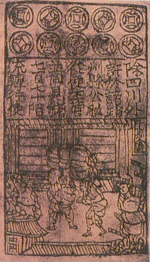
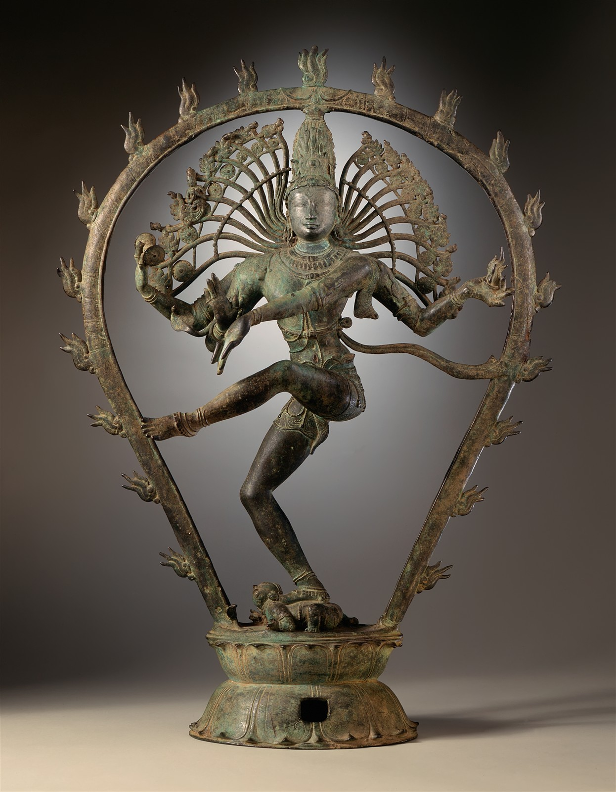
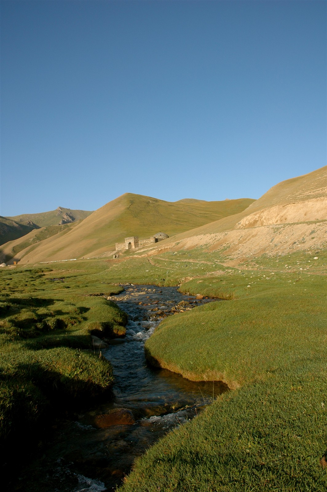

# The high-medieval boom and the Mongol climax {#sec-ch04}

::: {.callout-important appearance="simple"}
**Preliminary draft --- under review.** Published for review; content, figures and citations may still change.
:::

> *The system's fullest premodern extent --- then the great shock.*

> "For one shipload of pepper that goes to Alexandria or elsewhere, destined for Christendom, there come a hundred such, aye and more too, to this haven of Zayton; for it is one of the two greatest havens in the world for commerce."
> — Marco Polo, on Quanzhou, late 13th century

## Follow one thing {.unnumbered}

Follow a sack of pepper. Picked on the Malabar coast of south-west India, where it had grown for fifteen centuries and would grow for centuries more, it could go two ways. West, it crossed the Arabian Sea to Aden, was assessed and trans-shipped up the Red Sea, crossed to the Nile, and reached Alexandria, where Venetian and Genoese galleys paid customs of up to thirty per cent to carry it on to a Christendom that prized it. East, it sailed the Bay of Bengal to the Straits and on to the Chinese port of Quanzhou. Marco Polo, who saw both ends of the trade, left the ratio between them: for every shipload that reached Alexandria for Europe, he reckoned, a hundred reached Quanzhou. The figure is a traveller's flourish, not a customs return, but it points the right way. The pepper trade, like the silk and the porcelain and the cotton, ran overwhelmingly within Asia and to its richest market in China, and Europe was the small, expensive tail of it. This chapter is the one place in the book where that can be said most precisely, because for the first time there are wages and prices and city sizes to count, and they all point east. It is also the chapter where, in the wreckage of the century's great catastrophe, the first faint signal appears that the weight might one day move the other way.^[**Sources:** Eaton (Loc 3659) on Malabar as the world's principal pepper source; on the Alexandria customs and the Quanzhou ratio, Marco Polo via Abu-Lughod (1989). **Read more:** Abu-Lughod, *Before European Hegemony* (1989).]

## Where we are on the arc {.unnumbered}

The last chapter left the Abbasid--Tang world at its maritime apogee, the centre of gravity firmly in Asia and the Islamic world. This chapter takes that system to its fullest pre-modern extent and then watches it suffer the era's greatest shock. Across these four centuries the Afro-Eurasian economy knit itself into what Janet Abu-Lughod called a polycentric world system --- roughly eight overlapping circuits, peaking between about 1250 and 1350, with no single hegemon and, in particular, no European one. Song China ran the most advanced economy on earth; India was the workshop in the middle of the ocean; Egypt and its Karimi merchants formed a major western core; and for a few decades the Mongol peace let the overland Silk Road surge back one last time. Then the Black Death tore through the routes that bound it together. The centre stayed Asian, and this is where we can say so most precisely --- but it is also where the first counter-current appears, in a post-plague wage rise on the far north-western margin that this book will follow all the way to the Great Divergence.^[**Sources:** the centre-of-gravity reading, Abu-Lughod (1989) on the polycentric system; Pamuk (2007) on the post-plague north-western wage rise. **Read more:** Findlay & O'Rourke, *Power and Plenty* (2007).]

{#fig-cog04 width=76%}

## The stage and the cast

The stage was an ocean with four corners and, for a few decades, a land bridge thrown across the top of it. The maritime Indian Ocean had reached its widest pre-modern span, organised around four great nodes: Fatimid and then Mamluk Egypt with its Karimi spice merchants at the western end, the Chola of the Tamil south in the centre, Srivijaya at the Straits of Malacca, and Song China at the east. The Cairo Geniza and the travellers' books of the age --- Marco Polo, Ibn Battuta, the merchant Pegolotti --- light this world more brightly than any before it. Over the top of the ocean, from the early thirteenth century, the Mongol conquests laid a brief overland peace that made the Silk Road safe and taxable, the one moment in the book when the land channel surged back inside a maritime era. And behind both ran two slower forces that would decide the period's end: a climate turning colder from about 1300, and a disease gathering on the steppe that the trade routes themselves would carry to the world.^[**Sources:** Abu-Lughod (1989) on the four-node ocean and the polycentric system; Favereau (2021) on the Mongol overland peace; Campbell (2016) on the climate turn. **Read more:** Abu-Lughod, *Before European Hegemony* (1989).]

{#fig-fournode width=92%}

::: {.callout-tip}
## Dramatis personae
The economic actors of c.1000--1400, profiled east to west. The ocean is at its fullest extent, so these are the corners of a connected system rather than loosely linked cores. **India appears in every chapter at the fullest depth** --- here as the Chola of the Tamil south, workshop and now sea power. The Mongols enter as the overland engine; Europe, still, as the peripheral entrant --- though for the first time one that is learning fast.
:::

::: {.callout-tip collapse="true"}
## Song and Yuan China — the world's leading economy

China entered this period already the largest economy on earth, with perhaps a hundred million people by about 1100 out of a world of some two hundred and fifty million, and the most extensive foreign trade of any state. What set the Song apart from the Tang of the previous chapter, though, was not size but kind. Under the Song the inward-facing dynasty of grain and conscript labour gave way to the world's first urban-commercial revolution, an economy run through markets, coin and paper rather than through the granary and the levy. The demographic centre had completed its long slide to the wet-rice south, where by 1100 roughly two-thirds of the population now lived, and the southern paddy, the canal that carried its surplus and the craft towns strung along the rivers had become the engine of the whole.^[**Sources:** Hansen (Loc 437, 508); von Glahn (Loc 2620, 2650). **Read more:** von Glahn, *The Economic History of China* (2016).]

The metallurgy alone marked the gap with the rest of the world. By the late eleventh century Chinese iron and steel output reached on the order of 125,000 tons a year, more than the whole of Europe combined would produce, smelted in foundry clusters such as the thirty-six works at Liguo that ran perhaps seven thousand tons a year between them. The same surge ran through ceramics, where the kiln town of Jingdezhen worked some three hundred kilns and twenty-four thousand hands; through the improved, faster-ripening Champa rice that lifted southern yields; and through a run of inventions that would travel far beyond China — gunpowder, water-powered machinery, the movable-type print, and the magnetic compass first described by Shen Kuo around 1086. Cities grew to a scale Europe would not match for centuries: Kaifeng in the north, Hangzhou the southern capital running perhaps a million and a half, and the great southern port of Quanzhou around a million by 1080, rising to some one and a quarter million by the 1240s.^[**Sources:** von Glahn (Loc 3148, 3151, 3184); Ball (Loc 4401); Hansen (Loc 3749, 3783). **Read more:** Hansen, *The Year 1000* (2020).]

It was the money economy that ran furthest ahead of the rest of the world. The Song minted bronze cash at a scale without precedent — coin output peaked at roughly six billion coins a year around 1080, and on the order of two hundred and sixty billion across the Northern Song as a whole. So central had coin become to the state that under Wang Anshi's New Policies of 1067 to 1085 it reached up to eighty-one per cent of state income, where a century earlier kind had carried most of the fisc. And out of the strain of moving so much cash came the decisive step: from 1024 the government took over the privately issued jiaozi of Sichuan and ran the world's first paper money, made permanent and silver-backed from about 1170. A third channel bound the commercial core together internally — the Grand Canal, the roughly eighteen-hundred-kilometre artery that carried the rice surplus of the south to the cities and armies of the north, a riverine spine the land-and-sea account of the period easily forgets.^[**Sources:** von Glahn (Loc 3004, 3007, 3088, 2992); Hansen (Loc 3612, 3768); Ball (Loc 3562). **Read more:** von Glahn (2016).]

{#fig-jiaozi width=50%}

All of this poses a question the chapter raises but leaves open. If China around 1100 was the most advanced economy in the world — in iron, in money, in cities, in invention — why did it not go on to an industrial revolution, leaving that breakthrough to a far poorer Europe seven centuries later? Mark Elvin's answer, the "high-level equilibrium trap," held that Chinese agriculture and craft grew so efficient and labour so abundant that the incentive to mechanise fell away; others reject the framing entirely. The debate belongs properly to a later chapter (see @sec-ch07), and is flagged here, not resolved.^[**Sources:** von Glahn (Loc 4528) on the later Jiangnan-versus-England productivity comparison. **Read more:** Elvin, *The Pattern of the Chinese Past* (1973).]

Externally, the Song met the ocean through a string of customs ports — nine of them, against the single licensed port of the Tang — and through them the eastern node of the four-node maritime system reached India, the Gulf and the Middle East. Quanzhou, the Zaiton of Arab and later European traders, became the greatest of these, surpassing Guangzhou around 1200; a maritime trade superintendent was appointed there in 1087, and customs took one to two million strings of cash a year. Then came the conquest. The Mongols took the Jin north in 1234 and seized Hangzhou under Qubilai in 1276, completing the Yuan takeover by 1279, and the commercial machine ran on under new masters — the same ports, the same canal, a unified paper currency from 1260. The fourteenth century broke it. From the 1340s drought, repeated Yellow River floods and the collapse of Yuan finance and order set off a fall of at least fifteen and perhaps a third of the population between 1340 and 1370 — a catastrophe of misgovernment, flood and war rather than the Black-Death-scale pandemic that struck Europe, a point von Glahn presses against easy parallels. In 1368 the Red Turbans and the rising Ming ejected the Yuan from China.^[**Sources:** Findlay & O'Rourke (p.63) on nine customs ports; Hansen (Loc 3636, 3749); von Glahn (Loc 3490, 3283, 3661, 3724); Ball (Loc 3349). **Read more:** von Glahn (2016).]

**Trade profile**

- **Main exports** — ceramics above all (the Jingdezhen and Fujian kilns producing for an overseas market), silk and fine textiles, and bronze cash, which leaked abroad to become de facto currency in Japan and beyond.
- **Main imports** — aromatics, incense and spices (sandalwood, musk, aloeswood, camphor, cloves and frankincense, recorded in Song pharmacy prescriptions), pepper, ivory, rare woods and other tropical produce of the southern ocean.
- **Export markets** — the four-node maritime world reached through Quanzhou and the other customs ports: Srivijaya and Southeast Asia, the Chola south of India, and the Gulf and Middle East; overland, the Pax Mongolica routes west.
- **Import sources** — India and the Indian Ocean, Srivijaya and the Straits, and the Gulf at the far end of the sea road, feeding the southern ports.^[**Sources:** Hansen (Loc 3290, 3730, 3771); von Glahn (Loc 3184); Findlay & O'Rourke (p.63). **Read more:** Hansen, *The Year 1000* (2020).]

{#fig-mapchina04 width=85%}
:::

::: {.callout-tip collapse="true"}
## Srivijaya and the Straits — the fading entrepot

Srivijaya entered this period as the power it had been in the last: a thalassocracy at Palembang on the Musi river, living off the single fact that ships sailing between China and the western ocean had to thread the Straits of Malacca. By the eleventh century that living was no longer secure. In 1025 a fleet of the Chola king Rajendra I crossed the Bay of Bengal and raided the entrepot directly, sacking its ports in a campaign without obvious territorial aim — a strike by one maritime power against the chokepoint that taxed its merchants. Srivijaya survived the raid but never recovered its old command of the strait, and the centuries that followed eroded the basis of its wealth.^[**Sources:** Hansen (Loc 3290, 3310) on China's top trading partners c.1016 including Srivijaya, and the Srivijaya monastery at Nagapattinam; Kanisetti (2022) on Rajendra Chola's 1025 raid. **Read more:** Kanisetti, *Lords of the Deccan* (2022).]

What eroded it was partly success elsewhere. As Chinese shipping grew under the Song and direct sailing became more common, fewer cargoes needed breaking and storing at a single guarded entrepot; the Song listed Srivijaya among its leading trading partners around 1016, but the traffic increasingly found other ports and other routes. New emporia rose along the Straits and the Java Sea, and the redistributive monopoly that had made Palembang rich thinned as the network around it multiplied its nodes. The polity did not vanish — it remained a transit point on a busy sea — but it slid from keeper of the strait to one harbour among several.^[**Sources:** Hansen (Loc 3290) on Srivijaya as a top Song trading partner in 1016; Hansen (Loc 3553) on the compass and direct sailing. **Read more:** Alpers, *The Indian Ocean in World History* (2014).]

**Trade profile**

- **Main exports** — the service of transit above all, monetised through tolls and harbour dues, plus Sumatran forest and sea products (aromatic woods, resins, camphor) re-exported east and west.
- **Main imports** — Chinese ceramics and silk and Indian and Middle-Eastern manufactures moving through in transit.
- **Export markets** — Song China to the east and the Indian-Ocean trading world to the west, increasingly shared with rival ports.
- **Import sources** — China, India and the Sumatran hinterland feeding the entrepot.^[**Sources:** Hansen (Loc 3290) on the China traffic. **Read more:** Alpers, *The Indian Ocean in World History* (2014).]
:::

::: {.callout-tip collapse="true"}
## The Chola and South India — the maritime workshop

South India had risen from the rim of the ocean to one of its commanding nodes. Through the early centuries the Tamil south had been a producer and a way-station; in this period it became a sea power. The turn came under the Cholas of the Kaveri delta, who emerged as the primary Tamil house when Rajaraja I established himself from 985 and pushed out across the peninsula and the sea over the half-century that followed. The Chola state was an agrarian-temple economy at its core: its wealth grew on the irrigated rice of the Kaveri, channelled through a dense fabric of village assemblies and, above all, through the great royal temple. The Brihadishvara temple endowed at Thanjavur in 1003 stood for the whole arrangement — its tower rose 190 feet in fourteen storeys, among the largest free-standing structures then on earth, and its foundation gifts ran to thousands of kilograms of gold and silver and hundreds of gemstones. A temple on that scale was not only a shrine but a landholder, an employer and a bank, recycling agrarian surplus into craft, ritual and credit. The temple boom of the eleventh and twelfth centuries along the east coast amounted, on one reading, to India's third urbanisation after the Indus and the Ganga valleys.^[**Sources:** Kanisetti (Loc 5598) on Rajaraja from 985; Kanisetti (Loc 5675, 5694, 5699, 5681) on the Brihadishvara temple, its 190-foot tower and its gold-and-silver endowment; Kanisetti (Loc 5930) on the east-coast temple boom as a third urbanisation. **Read more:** Kanisetti, *Lords of the Deccan* (2022).]

Beneath the temple lay the two export industries that had marked the Indian coast since the age of Rome and would mark it for centuries more: pepper and cotton. The Malabar coast remained the world's principal pepper source — a position it held for roughly fifteen hundred years — and pepper still moved as the ocean's signature bulk luxury, with China now its largest single consumer; Marco Polo's later report put Hangzhou's pepper consumption above four thousand kilograms a day. Cotton was the deeper story of the period. The subcontinent was the great workshop of cloth, and Indian block-printed cottons were reaching as far as Fatimid Egypt from at least the eleventh century. Production and exchange were organised commercially: in the Deccan and the south, copper and gold coin was minted by private workshops under royal supervision, and credit ran at interest rates of thirty to forty per cent a year — a monetised, lending economy rather than a barter one. A guild inscription from Mysore around 1050 listed the goods that passed through these hands — elephants, horses, sapphires, pearls, rubies, diamonds, cardamom, cloves, sandalwood, camphor and musk — the whole tropical luxury trade in a single document.^[**Sources:** Eaton (Loc 3659, 3664) on Malabar as the world's principal pepper source and China the largest consumer; Eaton (Loc 2475) on block-printed cottons reaching Egypt from the eleventh century; Kanisetti (Loc 6899, 6908) on private minting under royal supervision and 30-40 per cent credit; Hansen (Loc 3357) on the Mysore guild inscription. **Read more:** Roy, *India in the World Economy* (2012).]

The institutions that ran this trade were among the most striking in the medieval ocean: the Tamil merchant guilds. The greatest of them, the Ainurruvar — the Ayyavole or "Five Hundred" — had grown by the eleventh and twelfth centuries into a self-styled corporate body, the "Five Hundred of the Thousand Directions in all the Eighteen Lands," with tens of thousands of members. Alongside it worked the Manigramam. These were not loose associations of individual traders but standing organisations with their own charters, militias and temples, able to negotiate, lend and protect caravans and cargoes across the Bay of Bengal and into Southeast Asia and China. They were the South Indian counterpart to the credit-and-partnership institutions that ran the western ocean, and the clearest sign that the Tamil south exported not only goods but commercial organisation.^[**Sources:** Kanisetti (Loc 5920, 5924) on the Ainurruvar/Ayyavole grown into the "Five Hundred of the Thousand Directions" with tens of thousands of members. **Read more:** Kanisetti, *Lords of the Deccan* (2022).]

{#fig-nataraja width=46%}

Externally, the Chola south was the South Indian corner of a four-node maritime system that by about 1000 linked Fatimid Egypt and the Red Sea, the Cholas at the Palk Strait, Srivijaya at the Straits of Malacca, and Song China — the fullest extent the Indian Ocean economy reached before the modern age. India sat as the indispensable midpoint and workshop of that ocean, supplying the pepper and the cottons that moved in both directions and lending its harbours and pilots to the long sea road. To the west, the Malabar pepper coast fed the Arabian Sea trade up toward Aden, the hinge between the ocean and the Mediterranean, and into the world the Cairo Geniza documents have opened to view — the records of the Jewish "India traders" whose letters track cargoes of pepper, iron and textiles between the Malabar coast and Fatimid Egypt. The horse trade ran the other way along this same western arm: imports were reckoned at roughly a tenth of India's existing stock, their value exceeding what Bengal later exported to all the European companies combined.^[**Sources:** Kanisetti (Loc 5671) on the four-node system of Fatimids, Cholas, Srivijaya and Song by about 1000; Roy (p.38, p.63) on the Persian Gulf-Aden horse trade and its scale. **Read more:** Goitein & Friedman, *India Traders of the Middle Ages* (2008); Margariti, *Aden and the Indian Ocean Trade* (2007).]

To the east, the Cholas did what no earlier Indian power had done: they projected naval force across the Bay of Bengal. Rajaraja's successor Rajendra first marched the army some 1,600 kilometres north to the Ganges around 1022, and then, in 1025, sent a fleet against Srivijaya itself, sacking Kadaram and Kedah and breaking the Straits power's monopoly over the eastern passage. The raid was a commercial act as much as a military one — the fleet returned to the Coromandel coast in 1026 laden with booty, and Chola embassies continued to reach the Song court, the first in 1015 bearing twenty-one thousand ounces of pearls, sixty elephant tusks and sixty catties of frankincense. The deeper trace of this reach lay at the Chinese end of the route: at the great southern port of Quanzhou, Tamil inscriptions and Shaiva temples appeared after 1025, the physical residue of a South Indian mercantile community settled at the far edge of the ocean. China's own customs records named the Chola among its top trading partners. The Tamil south, in short, was at its widest span in this period both a workshop and a sea power — the producing core of the ocean's middle that could now also strike across it.^[**Sources:** Eaton (Loc 713) and Dalrymple (Loc 4402) on Rajendra's c.1022 northern march of ~1,600 km to the Ganges; Kanisetti (Loc 5974, 6090, 6092) on the 1025 raid on Srivijaya, the sack of Kadaram/Kedah and the laden return in 1026; Kanisetti (Loc 5954, 5957) on the 1015 embassy to Song (21,000 oz pearls, 60 tusks, 60 catties frankincense); Kanisetti (Loc 6160) on Tamil inscriptions and Shaiva temples at Quanzhou after 1025; Hansen (Loc 3290) on the Chola among China's top trading partners. **Read more:** Kanisetti, *Lords of the Deccan* (2022).]

**Trade profile**

- **Main exports** — pepper above all (Malabar the world's principal source); cotton textiles, including block-printed cottons reaching Egypt; gems, sandalwood, camphor, ivory and other tropical luxuries.
- **Main imports** — war-horses from the Gulf and Arabia (reckoned at roughly a tenth of the existing stock); gold and silver bullion; Chinese ceramics and silk drawn in along the eastern route.
- **Export markets** — Fatimid Egypt and the Red Sea by way of the Malabar coast and Aden; Srivijaya, Southeast Asia and Song China across the Bay of Bengal, reached through the Coromandel ports and a settled Tamil community as far as Quanzhou.
- **Import sources** — the Persian Gulf and Arabia (horses, bullion, reached via Aden); China and Srivijaya (ceramics, silk, eastern goods) at the far end of the sea road.^[**Sources:** Eaton (Loc 3659, 2475) on pepper and cottons; Hansen (Loc 3357) on the Mysore guild's luxury list; Roy (p.38, p.63) on the horse trade and its scale; Kanisetti (Loc 6160) on the Tamil community at Quanzhou. **Read more:** Roy, *India in the World Economy* (2012).]

{#fig-mapchola04 width=85%}
:::

::: {.callout-tip collapse="true"}
## Fatimid and Mamluk Egypt, and the Karimi — the western hinge

At the western end of the four-node ocean sat Egypt, and after 969 its centre was Cairo, founded by the Fatimids and grown into the largest city in Africa. The geography that mattered was a short overland and riverine link between two seas: spices and other eastern goods came up the Red Sea, crossed to the Nile, and went on to Alexandria and the Mediterranean carriers waiting there. The Fatimid caliphate held this hinge through the eleventh and twelfth centuries; the Mamluk sultans who took power after 1250 held it through the thirteenth and fourteenth, and made the transit trade a pillar of state revenue. Whoever ruled Cairo controlled the cheapest passage between the Indian Ocean and Europe, and taxed it heavily.^[**Sources:** Hansen (Loc 2316, 2340) on Cairo founded 969, the largest African city; Abulafia (loc 4963) on the Fatimid move to Cairo. **Read more:** Goitein & Friedman, *India Traders of the Middle Ages* (2008).]

The pivot of the system was Aden, the Yemeni port at the mouth of the Red Sea where the monsoon ocean met the route to the Mediterranean. Ships from India and the further east discharged at Aden; their cargoes were assessed, taxed and trans-shipped onward toward Egypt; and the port's customs house was the gate through which the spice trade passed. Aden was the place where the two halves of the world's richest trade were joined, and the institutions that governed it — the customs, the brokers, the credit — made it the working hinge of the whole western ocean rather than a mere stopping-point.^[**Sources:** Margariti (2007) on Aden as the pivot between the Indian Ocean and the Mediterranean. **Read more:** Margariti, *Aden and the Indian Ocean Trade* (2007).]

The merchants who worked this trade at its richest were the Karimi, a wealthy network of spice traders, mostly based in Cairo and the Red Sea ports, who dominated the pepper and spice business between India and the Mediterranean under the Ayyubids and Mamluks. They moved goods in bulk, extended credit, and amassed fortunes large enough to lend to sultans. Alongside them, and partly before them, ran the Jewish India-traders whose papers survive by accident in the Cairo Geniza — the discarded documents of a Fustat synagogue, salvaged centuries later — which open a close documentary window on how the medieval ocean actually did business: the partnerships, the consignments, the letters of credit, the family firms reaching from Cairo to Aden to the Malabar coast.^[**Sources:** Goitein on the Cairo Geniza and the Jewish India-traders; Abulafia (loc 4992) on Geniza-era trade. **Read more:** Goitein & Friedman, *India Traders of the Middle Ages* (2008).]

The cost of using this hinge was high, and deliberately so. Alexandria's customs were among the steepest on any route in the system: duties there ran in the order of ten to thirty per cent, far above the three to five per cent levied in the Black Sea, and the trade was lucrative enough that Aragon's fines on its merchants for breaking the embargo on Alexandria could approach half the king's Catalan revenues. The high customs were the price Europe paid to reach the spices, and they were one reason the sea route around Africa, once found, would be worth so much — but that lay in the next chapter.^[**Sources:** Favereau (Loc 3735-3746) on Alexandria duties of 10-30% against Black Sea duties of 3-5%; Abulafia (loc 6381) on Aragonese fines on the Alexandria trade approaching half of Catalan royal revenue. **Read more:** Abulafia, *The Great Sea* (2011).]

**Trade profile**

- **Main exports** — as carrier, the eastern spices and pepper trans-shipped to the Mediterranean above all; Egyptian textiles and other manufactures; the transit service itself, taxed at Alexandria.
- **Main imports** — pepper, spices and fine eastern goods up the Red Sea from India and beyond; Mediterranean silver and European cloth and goods coming the other way.
- **Export markets** — Venice, Genoa and the Mediterranean world drawing spices through Alexandria; the Red Sea and Indian Ocean for Egyptian manufactures.
- **Import sources** — India and the eastern ocean via Aden and the Red Sea; Venice and Genoa bringing silver and European goods to Alexandria.^[**Sources:** Margariti (2007) on Aden; Abulafia (loc 6381) on the Alexandria trade. **Read more:** Margariti, *Aden and the Indian Ocean Trade* (2007).]
:::

::: {.callout-tip collapse="true"}
## The Mongols and the Pax Mongolica — the overland climax

The Mongols were the new power of the age, and the only actor in this chapter whose weight lay on land rather than water. From 1206, when Temujin was proclaimed Chinggis Khan, a single steppe confederation expanded across Eurasia faster than any before it, and within two generations broke into four khanates — the Yuan in China, the Ilkhanate in Iran, the Chaghatai ulus in Central Asia, and the Golden Horde on the western steppe. The conquest was savage: the campaign of Hulegu that took Baghdad in 1258 ended the Abbasid caliphate that had anchored the Islamic world for five centuries, killing the caliph and, by the chroniclers' inflated counts, a great part of the city. But out of the unified empire came something the overland route had lacked for centuries — a single authority able to make the Silk Road safe.^[**Sources:** Favereau (Loc 686) on Chinggis proclaimed 1206; Favereau (Loc 374) on the split into khanates; Favereau (Loc 2550, 2553) and Eaton (Loc 1307) on the 1258 sack of Baghdad ending the Abbasid caliphate. **Read more:** Favereau, *The Horde* (2021).]

For a few decades the road was not only safe but taxable, and the scale of integration was real. The Florentine merchant Pegolotti's commercial handbook of the 1330s and 1340s laid out the route from Tana on the Black Sea to China as a known quantity: a journey of seven to eleven months, with duties along the way amounting to no more than about 1.6 per cent of the value carried. The Mongols ran a relay system, the *yam*, with post-stations and remounts that could carry a message across enormous distances — Volga to Irtysh in some eight weeks. Marco Polo, Ibn Battuta, missionaries and merchants crossed the continent in these decades. Beyond letting goods pass, the Mongols moved them deliberately: as Allsen showed, the khans shifted artisans, textiles, craftsmen and technical knowledge between Iran and China by design, treating skilled people and useful techniques as spoils to be redistributed across the empire.^[**Sources:** Favereau (Loc 3735-3746) on Pegolotti's Tana-China route, 7-11 months at a tax of <=1.6%, and the *yam* relay Volga to Irtysh in ~8 weeks; Allsen (2001) on the deliberate Mongol movement of goods, artisans and knowledge between Iran and China. **Read more:** Allsen, *Culture and Conquest in Mongol Eurasia* (2001).]

{#fig-silkroad width=80%}

Yet even at this climax the land channel did not overtake the sea. The same Pegolotti numbers that made the overland route look cheap sat beside duties at Alexandria of ten to thirty per cent and in the Black Sea of three to five per cent — and the sea, carrying far greater bulk at far lower cost per ton, remained the cheaper artery for almost everything heavy. The Pax Mongolica was a brief surge of the land route inside a durably maritime era, not a reversal of it. And the surge was short. By about 1325 to 1340 the khanates were fragmenting, the *yam* faltering, and the overland trade thinning even before the plague tore through the routes that had carried it. This was the one moment in the chapter when the land channel came back — and it came back briefly, inside a world the sea still governed.^[**Sources:** Favereau (Loc 3735-3746) on Black Sea duties of 3-5% versus 10-30% at Alexandria, the sea cheaper even at the overland climax; on the Pax fraying by c.1325-1340. **Read more:** Abu-Lughod, *Before European Hegemony* (1989).]

**Trade profile**

- **Main exports** — as a taxing and moving power rather than a producer: the transit trade of silk and eastern goods passing west along the road, levied lightly under the Pax; tribute and plunder funnelled inward; and furs (over 500,000 pelts a year off the northern forests of the Horde).
- **Main imports** — the same long-distance luxuries drawn into the khans' courts; artisans, craftsmen and technical knowledge moved deliberately between Iran and China.
- **Export markets** — the Black Sea and Mediterranean termini (Tana, Caffa) where the overland route met the European carriers; the settled economies the khanates taxed.
- **Import sources** — China and Iran at the two ends of the road; the steppe and forest north for furs; the settled cores for the manufactures and people the system redistributed.^[**Sources:** Favereau on the Horde's fur economy (>500,000 pelts/year) and four-zone silver-bar money; Allsen (2001) on the Iran-China movement of artisans and knowledge. **Read more:** Favereau, *The Horde* (2021).]
:::

::: {.callout-tip collapse="true"}
## Europe — the peripheral entrant

Europe entered this chapter much as it had left the last: on the margin of a wealthy Asian and Islamic world, a net importer plugged into networks it had not built. It bought spices, silk and fine eastern goods through Alexandria and the Black Sea, and paid for them largely in silver and rough manufactures. What had changed since the Carolingian margin was not Europe's place in the relay — still subordinate — but its growing skill at the commercial mechanics of plugging in. Its advances in this period were institutional and financial rather than industrial: it learned to organise money and risk better than before, while remaining a customer at the end of other people's trade.^[**Sources:** Abulafia (loc 6381) on the costly Alexandria trade; Abu-Lughod (1989) on Europe as a net importer plugged into pre-existing networks. **Read more:** Abu-Lughod, *Before European Hegemony* (1989).]

Three innovations marked the change. Venice ran a system of public debt, the *prestiti* — forced loans on its citizens that paid interest at about five per cent, issued from 1171 and traded as a market in claims on the state, an early machinery of sovereign finance. The *commenda* partnership let a sedentary investor and a travelling merchant pool capital and share risk on a single voyage, with the active partner typically taking three-quarters of the profit; it spread risk and mobilised idle money for long-distance trade. And in 1205 Leonardo of Pisa, Fibonacci, brought Hindu-Arabic numerals and the commercial arithmetic of the Islamic world into European practice with his *Liber Abaci* — by the fourteenth century up to a thousand youths attended the abacus schools of Florence, learning the calculation a merchant economy ran on. None of this was Europe's invention from nothing; the numerals and much of the credit practice came from the Islamic and Indian worlds it traded with.^[**Sources:** Goetzmann (loc 3825, 3828) on Venetian *prestiti* at 5% from 1171; Goetzmann (loc 4031) on the *commenda* and the three-quarters profit share; Goetzmann (loc 4116) on the ~1,000 youths in Florentine abacus schools; on Fibonacci's 1205 *Liber Abaci*. **Read more:** Goetzmann, *Money Changes Everything* (2016).]

The carriers were Venice and Genoa, whose fleets worked the Mediterranean and pushed beyond it. They reached east to Alexandria for the spices coming up the Red Sea, and north into the Black Sea, where colonies such as Genoese Caffa and the port of Tana tapped the overland route the Mongols had opened. They paid the high Alexandrian customs and the lighter Black Sea duties, carried the goods on to European markets, and grew rich on the carrying trade — but they were carrying a commerce whose sources lay in Asia and whose pivot lay in Egypt. On Abu-Lughod's reading this was the position of the whole continent: rising and learning, genuinely more capable than before, but subordinate within a polycentric system it neither dominated nor organised. Europe rose here as the old cores were battered — Baghdad sacked, the caliphate gone — not by displacing a centre that was still firmly in the east.^[**Sources:** Abulafia (loc 6381) on the Alexandria trade and its fines; Favereau on the Black Sea termini Tana and Caffa; Abu-Lughod (1989) on a subordinate, rising Europe. **Read more:** Abu-Lughod, *Before European Hegemony* (1989).]

**Trade profile**

- **Main exports** — silver and bullion above all; woollen cloth and rough manufactures; timber, metals and slaves moving south and east into the Mediterranean and Black Sea.
- **Main imports** — pepper, spices and fine eastern goods through Alexandria; silk and luxury manufactures; the commercial techniques and numerals absorbed from the Islamic and Indian worlds.
- **Export markets** — Mamluk Egypt through Alexandria; the Black Sea termini of the overland route; the wider Mediterranean.
- **Import sources** — the Indian Ocean by way of Egypt and the Red Sea; the Mongol overland route through Caffa and Tana; the eastern Mediterranean carriers' networks.^[**Sources:** Abulafia (loc 6381) on the Alexandria spice trade; Abu-Lughod (1989) on Venice and Genoa as carriers. **Read more:** Abulafia, *The Great Sea* (2011).]
:::

::: {.callout-note}
## How we know
For the first time the record changed kind: where the earlier chapters had to read direction off hoards and shipwrecks, this period yielded genuine economic series. Reconstructed real wages and grain prices survive for parts of Europe and the Middle East from the late thirteenth century, so a historian could at last watch a wage rise or a price spike rather than infer it from buried metal. Sevket Pamuk's real-wage series and Gregory Clark's English wage-rent ratios are the headline instruments, and they carry a price-convergence kind of evidence the previous chapters lacked. Alongside the series sat documents of extraordinary intimacy: the Cairo Geniza, the discarded paper of a Cairo synagogue, preserved the letters and accounts of the Jewish "India traders" who worked the Aden hinge, opening the ocean's credit world to direct view. And there was an ingenious new proxy. Maristella Borner and Battista Severgnini used the speed at which the Black Death diffused to quantify trade integration itself, finding that ten per cent more distance slowed the spread by about five per cent, and that rivers and oceans carried contagion faster than land. The cautions are real. Whether the plague reached India or China at all is genuinely unresolved, and even its origin and dating are contested. Read the series for what they measure, and remember that the richest of them are European.

*Sources: Pamuk (2007) on the real-wage series; Clark on the English wage-rent ratios; Goitein & Friedman on the Geniza India-traders; Borner & Severgnini (2011) on plague-diffusion speed as a trade-integration gauge. Read more: Abu-Lughod, Before European Hegemony (1989).*
:::

## The period on its own terms

The high-medieval centuries had a clear shape, and it is worth running through it in sequence before the analysis takes it apart. The period climbed in five movements: a Chinese commercial revolution opened it, the maritime Indian Ocean spread to its fullest pre-modern reach, the overland Silk Road surged back one last time under the Mongols, that order then frayed as the climate turned, and the whole system met the era's sharpest shock in the Black Death.

{#fig-timeline04 width=92%}

**Phase 1 — the Song commercial revolution (c.1000–1127).** Northern Song China ran what was, by any measure available, the most advanced economy on earth. Its population reached roughly 100 million around the year 1000, in a world of perhaps 250 million, and it carried on the most extensive foreign trade of any state of the age. The capital at Kaifeng and the later southern seat at Hangzhou each held something close to or above a million people, an urban scale no other society approached. The output figures were of a different order from anything seen before: cast-iron production has been put at about 125,000 tons by 1078, on the standard Hartwell estimate more than all of contemporary Europe combined, feeding tools, weapons and the cooking-pots of a commercialising society. Gunpowder, the magnetic compass, water-powered machinery, movable-type printing and the early-ripening Champa rice that lifted the southern harvests all belonged to the same surge. The single most important question the textbook plants here, and does not answer until a later chapter, is why the most advanced economy of c.1100 did not go on to an industrial revolution.^[**Sources:** Hansen (Loc 437, 508, 518, 3783); on Song iron at 125,000 tons (1078, the Hartwell estimate) and the million-cities. **Read more:** von Glahn, *The Economic History of China* (2016).]

Money was the spine of this economy, and it ran at a scale the rest of the world could not match. Bronze-coin output reached on the order of 6 billion pieces a year around 1080, and perhaps 260 billion over the Northern Song as a whole; under Wang Anshi's New Policies of 1067 to 1085 coin came to make up as much as 81 per cent of state income, a depth of monetisation without precedent. The shortage of bronze for large payments produced the decisive innovation: officials in Sichuan began issuing paper money, the jiaozi, from 1024, and a permanent silver-backed note followed around 1170. Nine customs ports handled the maritime trade where the Tang had run one, and a Superintendent of Maritime Trade was appointed at Quanzhou — the port the Arabs called Zaiton — in 1087; its population has been put at a million in 1080, rising toward 1.25 million by the 1240s. The boom broke politically rather than economically: the Jurchen overran the north and took Kaifeng in 1127, driving the dynasty south, where its commercial economy carried on.^[**Sources:** von Glahn (Loc 3004, 3007, 3088); Hansen (Loc 3612, 3636, 3749, 3768) on the jiaozi from 1024, Quanzhou and the silver-backed note; Findlay & O'Rourke (p.63) on nine Song ports against the Tang's one. **Read more:** von Glahn (2016).]

**Phase 2 — the maritime Indian Ocean at its fullest extent (c.1000–1300).** The ocean that the previous chapter left at its apogee now spread to its widest pre-modern reach, organised around four great nodes. At the western end sat Fatimid and then Mamluk Egypt, the Red Sea its outlet and the Karimi spice merchants its long-distance operators, with Aden the hinge where the Indian Ocean met the Mediterranean. In the centre stood the Chola of the Tamil south, no longer merely the workshop of the last chapter but a naval power: in 1025 Rajendra Chola launched a raid across the Bay of Bengal against Srivijaya, the third node, whose hold on the Straits of Malacca it left weakened. Song China anchored the eastern end through Quanzhou and Guangzhou, and a Chinese list of 1016 already named Arab lands, Srivijaya, Java and the Chola among its leading trading partners.^[**Sources:** Hansen (Loc 3290, 3310) on Chola-Srivijaya and the 1016 trading partners; on the four-node Fatimid/Chola/Srivijaya/Song system and Aden the hinge. **Read more:** Abu-Lughod, *Before European Hegemony* (1989).]

The texture of this commerce survives in unusual detail because one corner of it left its papers behind. The documents of the Cairo Geniza opened a window on the Jewish "India traders" who worked the route between Egypt and the Malabar coast, their partnerships, credit and correspondence recovered from a synagogue store-room; a single crossing from Alexandria could put ten ships of some five hundred passengers each into a Sicilian port, the voyage running anywhere from thirteen to fifty days. The Tamil merchant guilds — the Ayyavole "Five Hundred" and the Manigramam — organised exchange along the Coromandel coast and across the bay. Out of all this Janet Abu-Lughod drew the chapter's organising idea: a genuinely polycentric world system of roughly eight overlapping circuits, peaking between about 1250 and 1350, in which there was no European hegemony and no single dominant core. It is the module's clearest snapshot of a connected world economy before Europe ran it.^[**Sources:** Abulafia (loc 5005, 5035) on the Alexandria-Palermo crossings; on the Cairo Geniza, the Tamil guilds and Abu-Lughod's polycentric ~8-circuit system peaking c.1250-1350. **Read more:** Goitein & Friedman, *India Traders of the Middle Ages* (2008).]

**Phase 3 — the Pax Mongolica and the overland climax (c.1206–1325).** Into this maritime world the land channel surged back, for the only time in the period, on the back of Mongol conquest. Temujin was proclaimed Chinggis Khan in 1206; within a few decades his successors had built the largest contiguous land empire in history, and as it settled into four khanates it imposed a measure of order across the steppe corridors. The overland Silk Road became, for a stretch of decades, safe and taxable. The Florentine merchant Francesco Pegolotti's handbook, compiled in the 1330s and 1340s, set out the route from Tana on the Black Sea through to China as a journey of seven to eleven months on which the cumulative tax burden ran to no more than about 1.6 per cent; the Mongol *yam*, the relay-post system, could carry a courier from the Volga to the Irtysh in around eight weeks. Marco Polo, Ibn Battuta, friars and merchants crossed Eurasia along these roads, and Thomas Allsen has shown that the movement of goods, artisans and knowledge was often deliberate — Mongol courts pulling Iranian and Chinese specialists in textiles, astronomy and medicine across the empire to serve them.^[**Sources:** Favereau (Loc 686, 3735-3746) on Chinggis from 1206, Pegolotti's Tana-China route and the *yam* relay; Allsen (2001) on the deliberate movement of artisans and knowledge. **Read more:** Allsen, *Culture and Conquest in Mongol Eurasia* (2001).]

The conquests also shattered the old order they passed through. In 1258 Hulegu's army sacked Baghdad, killed the last Abbasid caliph along with a reported 200,000 or more of its people, and ended the caliphate that had anchored the Islamic core for five centuries — a reminder that Europe rose as the old centres were battered, not by displacing a still-dominant one. Yet the overland climax should not be overstated. Even at its height the land route was dearer than the sea: on Pegolotti's own figures the duties on the Black Sea ran to perhaps 3 to 5 per cent against 10 to 30 per cent at Alexandria, but the carrying cost of a caravan still sat far above that of a ship, and the bulk of long-distance trade by value moved on water throughout. Silver bars served as a kind of traveller's cheque across the Horde's four coinage zones, knitting the Mongol west into a single monetary space. The Pax was a brief surge of the land channel inside a durably maritime era, and it had already begun to fray by the mid-1320s.^[**Sources:** Eaton (Loc 1307) on the 1258 sack of Baghdad; Favereau (Loc 3052, 3070, 3735-3746) on the silver bars, the four coinage zones and the Black Sea-versus-Alexandria duties. **Read more:** Favereau, *The Horde* (2021).]

**Phase 4 — the fraying (c.1325–1345).** The Mongol order came apart before the plague reached it. The Toluid-Jochid war had split the empire from the 1260s, and through the early fourteenth century the khanates fragmented further: the Ilkhanate dissolved after Abu Sa'id died, probably poisoned, in 1335, and the western steppe descended into the succession struggles that would consume the Golden Horde. The overland route lost its security as the political guarantee behind it weakened, and the merchants who had crossed Eurasia under the Pax found the roads less safe and the protection less reliable. The land surge of the previous decades was, in retrospect, a short-lived thing.^[**Sources:** Favereau (Loc 374, 4380) on the Toluid-Jochid split and the death of Abu Sa'id in 1335; on the Pax fraying c.1325-40. **Read more:** Favereau, *The Horde* (2021).]

The climate turned at the same time, and it turned against everyone. The Medieval Warm Period that had lifted populations since around 1000 gave way to what Bruce Campbell has called the Great Transition — a colder, more volatile regime that marked the onset of the Little Ice Age from about 1300. Its first great blow fell on northern Europe: the rains of 1315 to 1321 brought the Great Famine, which killed perhaps 1.5 million as grain prices ran to six times their normal level. India suffered a severe famine of its own in 1344 and 1345, severe enough that even royalty was said to have gone hungry. A late-medieval bullion famine — a tightening shortage of the silver and gold on which long-distance settlement depended — set in across the same years. The system was visibly weakening, on several fronts at once, before the pestilence arrived.^[**Sources:** Fagan (loc 635, 3259) on the Great Famine of 1315-21 and the Indian famine of 1344-45; Pye (Loc 4768) on the sixfold grain prices; Campbell (2016) on the Great Transition / Little Ice Age onset c.1300. **Read more:** Campbell, *The Great Transition* (2016).]

**Phase 5 — the Black Death and the great disintegration (1346–1400).** The same connectivity that had carried silk now carried plague. The disease moved west along the trade routes and reached the Genoese colony of Caffa in the Crimea, where it broke out among the besieging Horde army in 1346; from the Black Sea ports it travelled on the grain ships, reaching Constantinople and Alexandria in 1347 and the Italian cities soon after. Marie Favereau's phrase captures the mechanism exactly: the fur road became the plague road. Roughly a third of Europe died, on the order of 25 of some 80 million people, with mortality nearer 40 per cent around the Mediterranean; Cairo is reported to have lost about 200,000 of perhaps 500,000 to 600,000. Where the plague began is itself a live question: Favereau traced its deep origins back to between 1196 and 1268, while a 2022 study of ancient DNA placed the source in the Tian Shan near Lake Issyk-Kul in 1338 to 1339, and the two datings have not been reconciled.^[**Sources:** Favereau (Loc 4466, 4478, 4564, 4590) on Caffa 1346, the spread of 1347 and the "fur road became the plague road"; Fagan (loc 828) on ~25 of ~80 million; Harper (Loc 1945, 1999) on the Tian Shan source and the Cairo toll; on Favereau's 1196-1268 origin versus Spyrou et al. (2022). **Read more:** Spyrou et al., *Nature* (2022).]

{#fig-plague width=66%}

How far east the rupture reached is contested, and the textbook teaches it as a debate rather than settling it. China saw no pandemic on the European scale in these years: the 15 to 33 per cent fall in its population between roughly 1340 and 1370 is better explained, on Richard von Glahn's reading, by the collapse of Yuan rule, the catastrophic Yellow River flooding of the 1350s and the wars of the Ming conquest than by any single plague — though an earlier East Asian origin and the ancient-DNA evidence keep the question open. Whether the disease reached India at all is disputed in turn, with a serious revisionist case holding that neither India nor China was clearly infected before 1346. If South Asia largely escaped, the great factor-price reset that reshaped Europe and the Middle East did not reset India's — an asymmetry that may matter later. The Yuan were ejected from China in 1368 and replaced by the Ming; the overland route collapsed with the Mongol order that had sustained it; and as the land channel failed, the maritime Indian Ocean resumed its primacy, setting up the spectacular last pre-European flourish that the next chapter takes up.^[**Sources:** von Glahn (Loc 3724) on no Black-Death-scale pandemic in China and the 15-33 per cent fall of 1340-70; Favereau (Loc 4606, 4614) on the 1350s Yellow River flooding and the Ming capture of 1368; on the contested reach to India (Eaton) and the hand-off to Zheng He. **Read more:** Jedwab, Johnson & Koyama, *Journal of Economic Literature* (2022).]

## Reading the period: the four questions

The narrative of these four centuries can be condensed into answers to the four questions that drive this book, and they point, more sharply than in any chapter before, to a system that reached its fullest extent and then suffered its greatest rupture.

The first question was about direction, and here the period gave the clearest case in the book of integration and disintegration in sequence. The Afro-Eurasian economy knit itself to its fullest pre-modern reach. On Janet Abu-Lughod's reading it formed a polycentric world system of roughly eight overlapping circuits, peaking between about 1250 and 1350, with no single hegemon and, in particular, no European one. Then it broke. The Black Death of 1346 to 1353 killed perhaps a third of Europe, around twenty-five of some eighty million people, and the same connectivity that had carried silk carried the plague. The module's recurring lesson reached its sharpest form: a more integrated system was a more exposed one, and the routes that moved goods moved death. The integration and the disintegration were not separate stories but one, the boom carrying the seeds of its own collapse.^[**Sources:** Abu-Lughod (1989) on the polycentric ~8-circuit system peaking c.1250-1350; Favereau (Loc 4548, 4590) on the plague killing ~a third of Europe and the fur road becoming the plague road. **Read more:** Abu-Lughod, *Before European Hegemony* (1989).]

The second question was about channels, and this was the one period in the whole book when the overland route climbed back. Mongol unification, from Chinggis Khan's proclamation in 1206 through the four khanates, made the Silk Road safe and taxable for a few decades, and goods, artisans and knowledge moved across Eurasia at a scale not seen before or since. Caravans ran from Crimea to China in roughly eight to eleven months, and Francesco Pegolotti's merchant handbook of the 1330s and 1340s reckoned the Tana-to-China journey at a tax of no more than about 1.6 per cent. Yet the decisive point cuts against the headline. Even at the overland climax the sea stayed cheaper: Pegolotti's Black Sea duties of three to five per cent compared with ten to thirty per cent at Alexandria, and the Pax Mongolica was a brief land surge inside a durably maritime era. When the Mongol system fragmented and the plague came, the overland route collapsed and the maritime Indian Ocean resumed its place as the durable artery. There was a third axis too, easily lost in the land-and-sea framing: China's Grand Canal, running some 1,800 kilometres, carried the internal traffic that sustained the Song and Yuan commercial core.^[**Sources:** Favereau (Loc 686) on Chinggis Khan in 1206; Favereau (Loc 3735-3746) on the Pegolotti Tana-China tax <=1.6%, Black Sea 3-5% versus Alexandria 10-30%; von Glahn (Loc 2992) on the Grand Canal. **Read more:** Favereau, *The Horde* (2021).]

The third question was about modes, and money was the spine that ran through the period. Song China was the most monetised economy on earth, its coin output reaching something like six billion coins a year around 1080, perhaps 260 billion across the Northern Song, and under Wang Anshi's New Policies coin came to make up as much as four-fifths of state income. Above the coin ran paper money, issued from 1024 and put on a permanent silver-backed footing by about 1170. The other flows mattered, but they organised themselves around the metal: goods moved, people moved, and knowledge moved, the Song innovations in iron, printing and the compass travelling west under Mongol patronage. The bullion itself told the clearest story.^[**Sources:** von Glahn (Loc 3004, 3007) on Song coin output ~6 billion/year and ~260 billion over the Northern Song; von Glahn (Loc 3088) on coin as up to 81% of state income under Wang Anshi. **Read more:** von Glahn, *The Economic History of China* (2016).]

::: {.callout-important}
## Follow the money
Money was the period's spine. Song China ran on paper notes issued from 1024 and a coin output of perhaps six billion a year around 1080, the most monetised economy on earth, with cash funding the bulk of the state. Across the Mongol west, silver bars worked something like traveller's cheques, passing between the Horde's separate coinage zones as a settled high-value medium. Then, as the boom broke, came the late-medieval bullion famine. Follow the money and the centre is plainly in the east; follow it as it dries up and the disintegration comes into view.
:::

The bullion ran in two registers. In China it was coin and paper; across the Horde it was silver, and the Mongol monetary world was sophisticated in its own way, silver bars circulating like traveller's cheques between four distinct coinage zones so that value could move across the steppe without recoining at every frontier. Then the metal failed. As the fourteenth century turned, a late-medieval bullion famine set in, the monetary contraction that helped end the boom, and the drying-up of the silver was itself a sign of the disintegration to come.^[**Sources:** Favereau (Loc 3052, 3070) on silver bars working "like traveller's cheques" across the Horde's coinage zones; on the late-medieval bullion famine. **Read more:** Favereau, *The Horde* (2021).]

{#fig-tradecost width=72%}

The fourth question was about Europe, and the answer could still be read straight off the flows. Europe was a peripheral entrant, a net importer plugged into networks it had not built, and its distinctive contribution was institutional rather than productive: Venetian public debt, the *prestiti*, paying around five per cent; the *commenda* partnership; and Fibonacci's *Liber Abaci* of 1205 carrying Hindu-Arabic numerals into European commerce. That Europe rose at all owed something to the battering of the old cores, the Mongol sack of Baghdad in 1258 destroying the Abbasid node that had anchored the Islamic core for five centuries. But one new datum mattered for everything that followed. After the Black Death, real wages in north-western Europe rose and, uniquely, held, and that rise was the first faint counter-current to the long Asian dominance, the first hint that the centre might one day move.^[**Sources:** Goetzmann (loc 3825, 4031) on Venetian *prestiti* at ~5%, the *commenda* and Fibonacci's *Liber Abaci* (1205); Eaton (Loc 1307) on the 1258 sack of Baghdad; Pamuk (2007) on the post-plague NW-European wage rise. **Read more:** Pamuk (2007).]

## The verdict: where was the centre?

This period let the centre-of-gravity question be answered with more precision than any other in the book, and the answer was that the weight sat firmly in Asia. Song China was the single most advanced economy in the world: it cast iron on a scale no other society approached, ran paper money and the deepest coin economy on earth, and held cities approaching a million people when the largest in Europe held a fraction of that. Around it sat a polycentric system in which, on Abu-Lughod's reading, Europe was subordinate and rising rather than hegemonic, India was central to the maritime network as workshop and entrepot, and Egypt with its Karimi merchants formed a major core in its own right. The Mongol overland climax re-weighted the land route for a few decades but did not move the centre. After the measure-dependent verdicts of the earlier chapters, this one can be stated with high confidence.^[**Sources:** von Glahn (Loc 3148) on Song iron, paper money and million-cities as the world's most advanced economy; Abu-Lughod (1989) on the polycentric system with Europe subordinate and rising. **Read more:** Abu-Lughod, *Before European Hegemony* (1989).]

Two cautions keep the verdict honest. The first is the old one about quantity and quality. To call China the most advanced or the largest economy is to measure aggregate scale and technological lead, not income per head, which stayed Malthusian everywhere; the switch to measuring success by the living standards of ordinary people lies centuries ahead, with the Great Divergence of @sec-ch07. The second is that the long-distance trade on which the whole centre-of-gravity reading rests was a thin, lucrative layer over agrarian worlds where almost everyone farmed and never touched a trade good. Hold the two apart: weight and technology now, living standards much later.^[**Sources:** von Glahn (Loc 4528) on aggregate scale versus income per head. **Read more:** von Glahn, *The Economic History of China* (2016).]

Then the crucial twist. The first counter-current to the Asian centre appeared in this very period, and it appeared in the wreckage of the plague. Pamuk's post-Black-Death real wages rose across Europe to about 1450 and then fell back everywhere except the Low Countries and England, where they held and pulled away, opening the wage gap that historians call the Little Divergence. That north-western rise was the first faint signal of the westward move that the Great Divergence of @sec-ch07 would test. And if India largely escaped the plague, as a serious revisionist case holds, then the great factor-price reset that scarcity forced on Europe and the Middle East never reset India's, an asymmetry that is part of why divergence later favoured the north-west. So the period did two things at once. It confirmed the Asian centre more clearly than any chapter before it, and it planted the first hint of that centre's eventual erosion: a seed, not yet a shift, and one this book picks up again at the hinge of the Great Divergence.^[**Sources:** Pamuk (2007) on the post-plague wage rise to ~1450 and the NW-European Little Divergence; Eaton on the contested case that the plague largely spared India. **Read more:** Pamuk (2007).]

{#fig-wages width=76%}

::: {.callout-warning}
## The debate: was the Black Death a starting gun for divergence?
Was the plague the trigger of the long European rise, or merely the occasion? Pamuk (2007) showed post-plague real wages rising to about 1450 and then falling everywhere except the Low Countries and England, opening the north-west-versus-rest Little Divergence. Stuart Borsch turned the same shock the other way: it raised English peasant welfare but wrecked Egypt's irrigation-dependent, centralised system, so institutions rather than the shock itself did the causal work. Jedwab, Johnson and Koyama (2022), the up-to-date survey, find the gains often not sustained outside the north-west. And behind all of it sits the prior question, the one this chapter keeps open as a hook: did the Black Death even reach India? If South Asia largely escaped, the factor-price reset that reshaped Europe and the Middle East never touched it. Was the plague a starting gun, or did pre-existing institutions and geography decide the outcome? The book leaves it open.
:::

::: {.column-page}
**Data exhibit — the Little Divergence in real wages.** The Black Death is the best natural experiment in the book: a roughly symmetric demographic shock — labour suddenly scarce, land suddenly abundant — applied across Europe and the Middle East at once, with sharply divergent outcomes. Pamuk's reconstructed real wages of unskilled urban workers rose almost everywhere in the century after 1348, as scarce labour bid up its price. But after about 1450, as populations recovered, wages fell back to subsistence everywhere except the Low Countries and England, where they held and pulled away — the wage gap that defines the "Little Divergence." *What you could do with this:* take Pamuk's or the Allen real-wage series for a set of European and Middle Eastern cities, index them to 1348, and chart the divergence after 1450 — then ask what, other than the shared shock, the Low Countries and England had that Italy, Spain and Egypt did not.
:::

## Threads forward

This chapter both confirms the book's central thread and complicates it. The centre-of-gravity thread reaches its most precisely measurable reading here — the weight firmly Asian, Song China the most advanced economy on earth, in a polycentric system with no European hegemony — and it will stay Asian, on aggregate, through the next two chapters before the hinge of the Great Divergence. But the same chapter plants the counter-current that the rest of the book must reckon with: the post-Black-Death wage rise that held only in north-western Europe, the first faint signal of the westward move, and the possibility that India's escape from the plague spared it the factor-price reset that pushed Europe's wages up. The channels thread has its sharpest single episode here too — the one moment the overland route climaxed under the Mongols, then collapsed, leaving the sea the durable artery for good.^[**Sources:** Pamuk (2007) on the Little Divergence; Abu-Lughod (1989) on the polycentric system. **Read more:** Findlay & O'Rourke, *Power and Plenty* (2007).]

The hand-off to the next chapter is already visible. By about 1400 the boom had broken — plague, the Great Transition climate downturn, the Yuan-to-Ming transition of 1368, the collapse of the overland route, the bullion famine. The maritime Indian Ocean resumed its primacy, and the next chapter opens on its spectacular last pre-European flourish: Ming China's Zheng He voyages, the Indian-Ocean apogee that China then abandoned by choice — the great counterfactual — alongside the European entry of 1498 and the New World and Japanese silver that would finally weld all three oceans into one. The centre is still Asian, but the seeds planted here, the north-western wage divergence and China's coming retreat from the sea, set up the long pivot toward the Great Divergence.^[**Sources:** von Glahn (Loc 3724) on the Yuan-to-Ming transition; on the hand-off to the Zheng He voyages and the European entry. **Read more:** Abu-Lughod, *Before European Hegemony* (1989).]

---

## Classic research: the foundations {.unnumbered}

The chapter's central ideas — a polycentric world before Europe, the Song commercial revolution, the Black Death as a turning point — descend from a bench of historians who put trade and money at the centre.

- **Abu-Lughod (1989)**, *Before European Hegemony: The World System A.D. 1250–1350* — the polycentric, eight-circuit system with no European hegemony; the conceptual spine of this chapter. [DOI 10.1093/oso/9780195067743.001.0001]
- **von Glahn (2016)**, *The Economic History of China* — the standard account of the Song commercial revolution: iron, paper money, the deepest coin economy on earth. [DOI 10.1017/cbo9781139343848]
- **Goitein & Friedman (2008)**, *India Traders of the Middle Ages: Documents from the Cairo Geniza* — the documentary reconstruction of the Jewish India-trade between Egypt and Malabar; the bedrock under the western ocean's credit world.
- **Margariti (2007)**, *Aden and the Indian Ocean Trade* — Aden as the working hinge between the ocean and the Mediterranean.
- **Allsen (2001)**, *Culture and Conquest in Mongol Eurasia* — the deliberate Mongol movement of goods, artisans and knowledge between Iran and China.
- **Elvin (1973)**, *The Pattern of the Chinese Past* — the "high-level equilibrium trap," the classic statement of the "why didn't Song China industrialise?" puzzle (opened here, resolved at @sec-ch07).
- **Borsch (2005)**, *The Black Death in Egypt and England* — the same shock, divergent institutional outcomes; institutions, not the shock, did the causal work.

## At the research frontier: recent cliometric work {.unnumbered}

The Black Death is one of cliometrics' best-studied natural experiments, and the frontier here is unusually deep. Every entry verified.

- **Pamuk (2007)**, "The Black Death and the origins of the 'Great Divergence' across Europe, 1300–1600," *European Review of Economic History* 11(3): 289–317 — post-plague real wages rose to ~1450 then fell everywhere except the Low Countries and England: the "Little Divergence," and this chapter's headline counter-current. [DOI 10.1017/s1361491607002031]
- **Jedwab, Johnson & Koyama (2022)**, "The Economic Impact of the Black Death," *Journal of Economic Literature* 60(1): 132–178 — the up-to-date survey; the gains were often not sustained outside the north-west, and institutions and geography mediated the shock. [DOI 10.1257/jel.20201639]
- **Voigtländer & Voth (2013)**, "The Three Horsemen of Riches: Plague, War, and Urbanization in Early Modern Europe," *Review of Economic Studies* 80(2): 774–811 — how plague, war and cities together raised European wages and urbanisation, the mechanism behind the Little Divergence. [DOI 10.1093/restud/rds034]
- **Pamuk & Shatzmiller (2014)**, "Plagues, Wages, and Economic Change in the Islamic Middle East, 700–1500," *Journal of Economic History* 74(1): 196–229 — the Middle Eastern wage record, including Egypt's divergent post-plague path. [DOI 10.1017/s0022050714000072]
- **Bosker, Buringh & van Zanden (2013)**, "From Baghdad to London," *Review of Economics and Statistics* 95(4): 1418–1437 — the city-size dataset that sets Quanzhou and Hangzhou against the largest European cities. [DOI 10.1162/rest_a_00284]

::: {.callout-note}
## Keeping this current (verification gate)
Sweep date 2026-06-25; repositories searched: Crossref, RePEc/EconPapers, NBER, journal tables of contents. Every entry above was citation-verified (Crossref DOI); none is a fabricated or unverified working paper. Where the action sits for this period: the Black Death as a natural experiment is intensively studied for Europe and the Middle East, far less so for South and East Asia — the "did it reach India/China?" question is unresolved, and the 2022 *Nature* ancient-DNA result (Spyrou et al., placing the source in the Tian Shan, 1338–39) reopened the origin debate. Refresh before publication.
:::

::: {.callout-note}
## Research in focus — Pamuk (2007): the Black Death and the Little Divergence
- **Aim** — to test whether the Black Death set off the long-run divergence of north-western Europe from the rest of the continent and the Middle East.
- **Question** — how did real wages move across Europe and the Mediterranean in the centuries after the plague, and where did the post-plague gains last?
- **Data & method** — assembled and compared reconstructed real-wage series for unskilled urban workers across a set of European and Middle Eastern cities, indexed around the 1348 shock, and tracked their paths to 1600.
- **Findings** — labour scarcity pushed real wages up almost everywhere after 1348; but after about 1450, as populations recovered, wages fell back to subsistence everywhere except the Low Countries and England, where they held and rose — the "Little Divergence." The symmetric shock produced asymmetric outcomes.
- **Caveats** — wage series are urban, unskilled and patchy; they measure one slice of welfare, not GDP; and the result identifies where divergence appeared, not conclusively why — institutions and geography (see Borsch; Jedwab et al.) carry much of the causal weight.

*Sources: Pamuk, "The Black Death and the origins of the 'Great Divergence' across Europe, 1300–1600," European Review of Economic History 11(3), 2007 [DOI 10.1017/s1361491607002031]. The thread is paid off at @sec-ch07.*
:::

::: {.callout-note}
## Research in focus — Jedwab, Johnson & Koyama (2022): the Black Death, surveyed
- **Aim** — to synthesise the now-large quantitative literature on the economic consequences of the Black Death.
- **Question** — what does the accumulated evidence say about how, where, and why the plague reshaped economies?
- **Data & method** — a structured review of the cliometric record (wages, prices, urbanisation, settlement and persecution data) across Europe and the Middle East, weighing the competing mechanisms.
- **Findings** — the shock was real and large, but its long-run effects were highly conditional: post-plague gains were often not sustained outside north-western Europe, and pre-existing institutions, factor endowments and geography shaped whether labour scarcity translated into lasting higher incomes or was eroded as population recovered.
- **Caveats** — a survey inherits the gaps of its sources, which are thin for southern and eastern Asia; the "did it reach India/China?" question remains open and limits any truly global account.

*Sources: Jedwab, Johnson & Koyama, "The Economic Impact of the Black Death," Journal of Economic Literature 60(1), 2022 [DOI 10.1257/jel.20201639].*
:::

---

### Questions for consideration {.unnumbered}

*Essay / exam style — reward the four-questions toolkit and the live debate, not recall.*

1. *"In c.1100 the most advanced economy in the world was Song China."* Set out the evidence — iron, money, cities — and explain why it nonetheless did not lead to an industrial revolution there.
2. Abu-Lughod called the thirteenth-century world "polycentric, with no European hegemony." What does the four-node Indian-Ocean system show, and where (if anywhere) was Europe in it?
3. *"The Pax Mongolica moved the centre of gravity onto land."* Assess, using the evidence that the sea stayed cheaper even at the overland climax.
4. Was the Black Death a "starting gun" for the divergence of north-western Europe, or did pre-existing institutions decide the outcome? Use Pamuk, Borsch, and the survey evidence.
5. How would the later history of divergence look different if South Asia largely escaped the Black Death? Explain the factor-price logic, and say what evidence would settle the question.

::: {.callout-tip}
## Cross-cutting questions (collected at the end of the book)
The book closes with a bank of questions spanning several chapters. Those this chapter feeds:
- **The seed of the shift.** This chapter dates the first north-western counter-current to the Asian centre. Trace it forward to @sec-ch07: was the Little Divergence the start of the Great Divergence, or a separate episode?
- **Quantity vs quality.** Song China was the largest and most advanced economy of its day. Across @sec-ch03, @sec-ch04 and @sec-ch07, when does technological and aggregate lead become *rich*, in the sense of income per head?
:::

### Data exercise {.unnumbered}

```{r}
#| label: ch-04-exercise
#| eval: false
# The Little Divergence in real wages (datasets_by_topic.md, Topic 4).
# 1. Load a published real-wage dataset (Pamuk 2007; Allen's European real wages;
#    the Clark English series). Choose ~6 cities spanning NW Europe, S Europe, the Middle East.
# 2. Index each city's real wage to its 1348 level; plot 1300-1600.
# 3. Identify where wages held above subsistence after ~1450 (the Low Countries, England)
#    vs where they fell back (Italy, Spain, Egypt) - the Little Divergence.
# 4. Discuss: a symmetric demographic shock, asymmetric institutional outcomes. What else
#    distinguishes the cities that pulled away?
```

### Key data {.unnumbered}

| Figure | Value | Source |
|---|---|---|
| Song cast-iron output | ~125,000 tons/year by 1078 (> all Europe) | Hartwell, via von Glahn (2016) |
| Song paper money | from 1024; silver-backed from ~1170 | von Glahn (2016); Hansen (2020) |
| Song coin output | ~6 billion/year c.1080; ~260 billion (N. Song) | von Glahn (2016) |
| Coin as share of state income | up to ~81% (Wang Anshi, 1067–85) | von Glahn (2016) |
| Quanzhou population | ~1m (1080) $\to$ ~1.25m (1240s) | Hansen (2020) |
| Song customs ports | 9 (vs the Tang's 1) | Findlay & O'Rourke (2007) |
| Pax Mongolica route | Tana $\to$ China ~7–11 months, tax ~1.6% | Pegolotti, via Favereau (2021) |
| Customs comparison | Black Sea ~3–5% vs Alexandria ~10–30% | Favereau (2021) |
| Black Death, Europe | ~a third dead (~25 of ~80m); ~40% Mediterranean | Favereau (2021) |
| China population fall, 1340–70 | ~15–33% (Yuan collapse/flood/war, not plague) | von Glahn (2016) |
| Post-plague wages | rise to ~1450, then hold only in NW Europe | Pamuk (2007) |

*The "did the Black Death reach India/China?" question and the plague's origin-dating are presented as live debates, not resolved.*

### Further reading {.unnumbered}

- **Core:** Abu-Lughod, *Before European Hegemony* (1989); von Glahn, *The Economic History of China* (2016); Findlay & O'Rourke, *Power and Plenty* (2007), ch. 2–3.
- **Supplementary:** Favereau, *The Horde* (2021); Goitein & Friedman, *India Traders of the Middle Ages* (2008); Margariti, *Aden and the Indian Ocean Trade* (2007); Allsen, *Culture and Conquest in Mongol Eurasia* (2001); Kanisetti, *Lords of the Deccan* (2022).
- **The debate:** Pamuk (2007), Jedwab, Johnson & Koyama (2022) and Voigtländer & Voth (2013) on the Black Death and the Little Divergence; Borsch (2005) on institutions vs the shock; Campbell, *The Great Transition* (2016) on climate and plague; on the contested reach of the plague to India, Eaton's revisionist note and Spyrou et al., *Nature* (2022) on its Central Asian origin.
