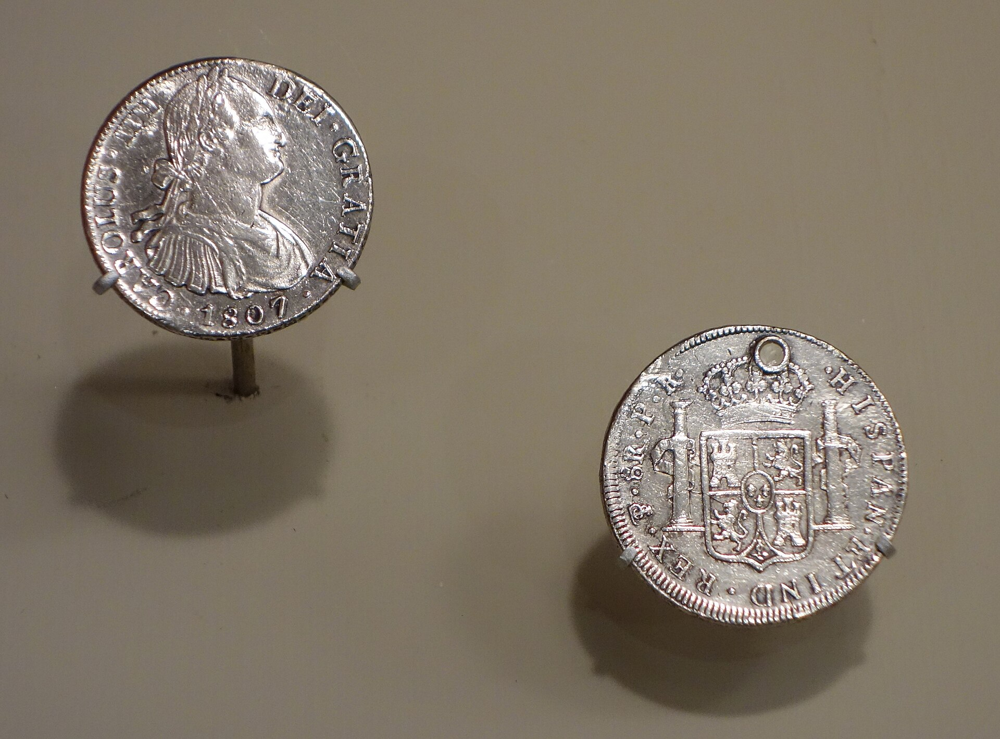
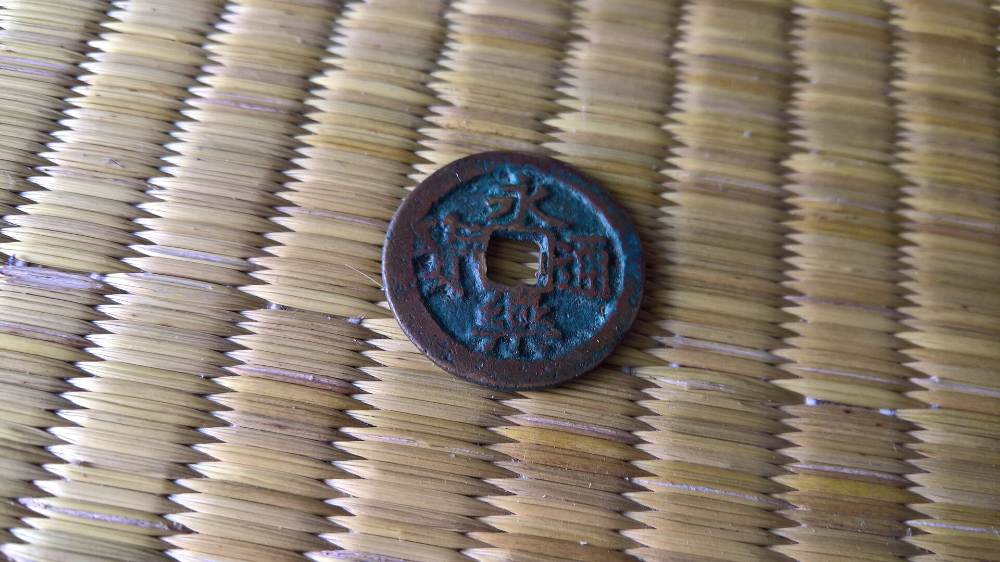
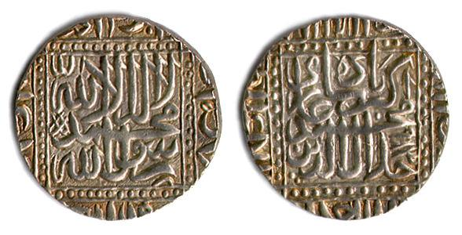
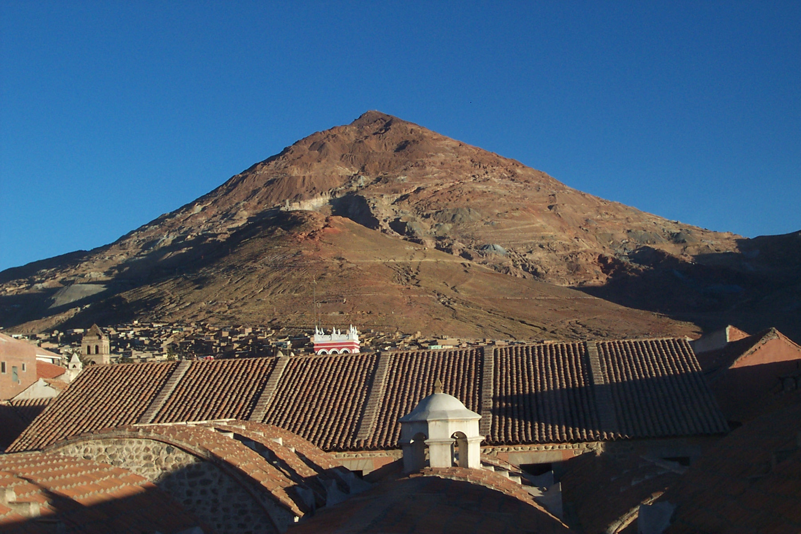
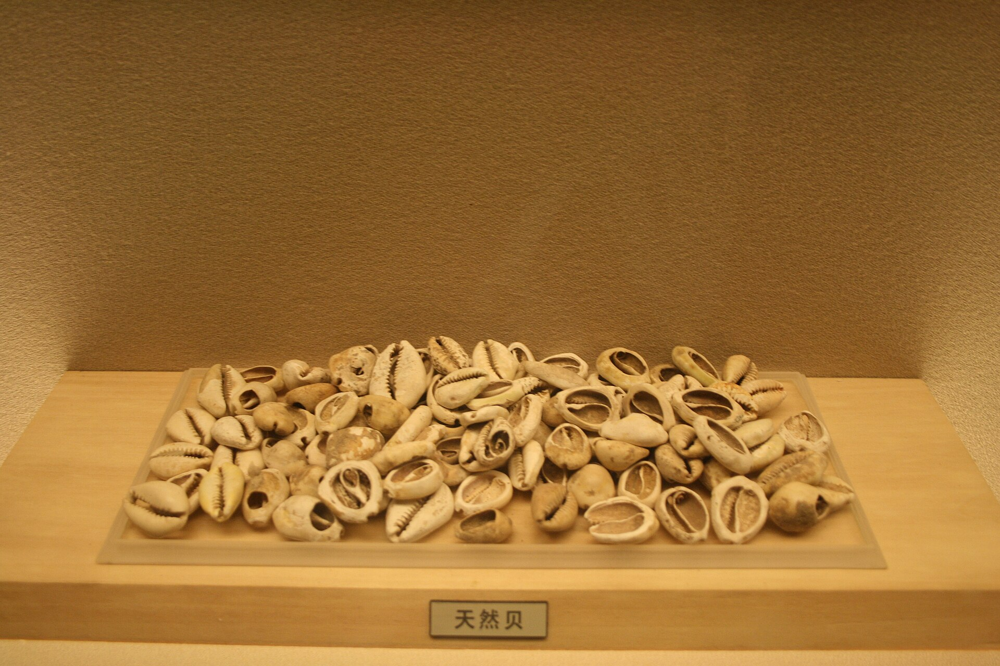

# The world becomes one — and stays Asian {#sec-ch05}

::: {.callout-important appearance="simple"}
**Preliminary draft --- under review.** Published for review; content, figures and citations may still change.
:::

::: {.chapter-subtitle}
Three oceans connect; silver welds the globe; the sink is still in Asia.
:::

> "We came in search of Christians and spices."
> — the reply of one of Vasco da Gama's men at Calicut, 1498

## Follow one thing {.unnumbered}

Follow a coin of eight reales. Struck at Potosi, the silver mountain in the high Andes opened in 1545, from metal dug by labour conscripted from a population that Old World disease had already cut by four-fifths, it was the nearest thing the sixteenth century had to a world money. From Potosi it could go two ways, and both ended in Asia. West, it was carried down to the Pacific coast, loaded at Acapulco onto the annual Manila galleon that first sailed in 1571, and taken across the ocean to Manila, where Chinese merchants exchanged it for silk and porcelain. East, it crossed to Seville in the Atlantic treasure fleets, and from Europe much of it drained on round the Cape or up through the Levant toward India and China. Either way the coin ran east, because silver bought more in Asia than anywhere else on earth, and the greatest buyer of all was Ming China, whose tax system had been rebuilt to swallow the metal whole. This is the chapter in which the three oceans — Indian, Atlantic and Pacific — were joined for the first time into a single circuit. But the circuit was not organised from Europe. It was organised around the place the silver wanted to go, and that place was the demand core in the east. Follow the coin, and it tells you that the world had become one, and that its centre had not moved.^[**Sources:** P&P (p.166) on Spanish-American silver output; von Glahn (Loc 4048) on China the silver sink. **Read more:** Flynn & Giraldez (2002).]

{#fig-piece8 width=52%}

## Where we are on the arc {.unnumbered}

The last chapter ended with the Black Death and the breaking of the medieval boom, and with a first faint counter-current — the post-plague wage rise that held only in north-western Europe. This chapter is where the oceans of the world are finally joined, and where, for the first time, a global price signal can be measured. Yet the verdict it returns is the same as before, only sharper: the centre of gravity was still firmly Asian. China was the great silver sink that organised the first world circuit; India was the workshop the bullion flowed to; and the Europeans who now appear in the Indian Ocean were minor armed newcomers grafting onto a system they could tax but neither make nor run. The chapter's title has to be read carefully. The world became one in the sixteenth century by contact, by money and by biology — three oceans welded by silver, two hemispheres fused by the Columbian Exchange — but not yet by price. A single integrated world market, in which the cost of pepper or cloth converged across continents, was still two centuries off. What unified here was real, and datable, and Asian-centred; it was not yet globalisation in the economic sense.^[**Sources:** von Glahn (Loc 4048) on the silver sink; O'Rourke & Williamson (2002) on commodity price convergence from the 1820s. **Read more:** Findlay & O'Rourke, *Power and Plenty* (2007).]

{#fig-cog05 width=76%}

## The stage and the cast

The stage was, for the first time, the whole globe. The maritime channel that the previous chapters had followed around the Indian Ocean was now spliced to the Atlantic and, from 1571, across the Pacific through Manila, so that a coin or a cargo could in principle circle the earth. Three things did the welding, and a fourth ran underneath. Silver, mined in the emptied Americas and in Japan, flowed toward the Asian demand core and tied the oceans into one circuit of payments. The Columbian Exchange fused the biology of two hemispheres, at a catastrophic human cost. And a new kind of actor appeared on the Indian Ocean — the armed European trader, small in numbers but willing to use naval gunnery at the chokepoints. Beneath all three ran a price: the gold-to-silver ratio, which differed sharply across the world's monetary zones and, as arbitrage moved the metal, began to converge — the first genuinely global price signal this book can read. The cast ran east to west, from the Ming demand core that pulled the silver, through the Indian workshop that absorbed much of the rest, to the Atlantic newcomers who carried it and the African coast where the same metal worked the opposite effect.^[**Sources:** P&P (p.143, 169) on the Manila galleon and the joined circuit; Smith (Loc 3582) on the gold-silver ratios. **Read more:** Flynn & Giraldez (2002).]

{#fig-threeoceans width=92%}

::: {.callout-tip}
## Dramatis personae
The economic actors of c.1400--1600, profiled east to west --- now spanning the whole globe. **India appears in every chapter at the fullest depth** --- here as the cotton workshop and silver-absorber the Europeans entered, not yet a victim. China leads as the silver sink that organised the circuit; the Atlantic newcomers (Portugal, Spanish America) carry the metal; West Africa is the leg where the same silver worked the opposite fate.
:::

::: {.callout-tip collapse="true"}
## Ming China — the silver sink and the ocean abandoned

China under the Ming was the demand core that organised the first global circuit, and it shows the centre of gravity twice over: once as the sea-power that could have ruled the ocean and walked away, and again as the economy whose hunger for silver pulled bullion toward it from three continents. The Ming had been founded in 1368 by Zhu Yuanzhang, the Hongwu emperor, on a deliberately agrarian and inward-facing model. Land tax ran at perhaps five to ten per cent of yields, and the rice paddies of Jiangnan, where yields had roughly doubled since the Southern Song, carried the fisc. The early dynasty distrusted commerce so far as to ban private overseas trade outright in 1374, and its paper currency collapsed so badly — the baochao note was worth only about two per cent of its face value by 1425 — that by the 1430s the state abandoned paper money and even halted the minting of bronze coin. An economy that large could not run on nothing, and into the monetary vacuum flowed silver.^[**Sources:** von Glahn (Loc 3709, 3760, 3745, 3817, 3754, 3790, 4006). **Read more:** von Glahn, *The Economic History of China* (2016).]

{#fig-coinming width=46%}

What turned the Ming into a global suction pump was a fiscal reform. Across the later sixteenth century the single-whip reforms consolidated the empire's scattered labour services and grain levies into payments reckoned in silver, making the metal the sole fiscal medium of the largest economy on earth. A state that taxed in silver created a standing demand for it that no domestic mine could meet, and the overseas-trade ban of 1374 was finally repealed in 1567, with a Portuguese base at Macau from 1557 and a Spanish one at Manila from 1571 giving the inflow its doors. Silver poured in: imports reached at least 115 tons a year, roughly half of it from Japan and the rest from Peru and Mexico. The pull was an arbitrage as much as a policy. Silver bought far more in China than in Europe, so it paid to ship it east, and China imported around three times as much pepper as Europe did in the sixteenth century — a reminder that the great consuming market lay in Asia, not the West.^[**Sources:** von Glahn (Loc 4012, 3856, 4036, 4030, 4048); Krondl (Loc 2472). **Read more:** von Glahn (2016).]

A caveat keeps the causation straight. The silver lubricated an expansion that was already under way; it did not create it. Internal Chinese money demand — a monetising economy that had outgrown its broken paper-and-bronze currency — was the precondition for the foreign inflow, not its product. China absorbed roughly half of all the New World's silver between 1550 and 1645, a figure now treated with some caution given how contested the import estimates are, but the order of magnitude holds: the world's silver ran to China because China's economy could absorb it, not because silver made China grow.^[**Sources:** von Glahn (Loc 4048); the contested-estimates caveat noted by Irigoin and others. **Read more:** von Glahn (2016).]

The sharper point, though, is what China did not do. A century before da Gama, the Ming had projected naval power across the whole Indian Ocean. Between 1405 and 1433 the admiral Zheng He led seven treasure-fleet voyages that reached India, Arabia and the east coast of Africa, the fifth touching Mogadishu and Brava. The fleets were of a scale Europe could not approach: at their peak around 3,800 vessels and some 27,000 men, with treasure ships of perhaps 1,500 tons — about five times the burden of da Gama's flagship. The cost matched the scale. Each expedition ran to something like six million taels, on the order of a third of annual Ming revenue, for little tangible return.^[**Sources:** Ball (Loc 2400, 2403, 2418, 2387, 2397). **Read more:** Dreyer, *Zheng He* (2007).]

Then China left. After the Yongle emperor died in 1424, the court's anti-maritime party gained the upper hand; fiscal strain, Confucian-eunuch rivalry and an agrarian-stability ideology all told against the voyages, and a final expedition under the Xuande emperor closed the programme by 1433. The withdrawal was not a drift but a decision, and it hardened over the century that followed. The voyage records were condemned and burned by Confucian officials around 1477, and by 1500 building a sea junk with more than two masts had become a criminal offence. China vacated the ocean it had been able to command — the module's great counterfactual, and a vacuum the small armed fleets of Portugal would later sail into rather than a contest China lost.^[**Sources:** Ball (Loc 2556, 2561, 2563, 2589, 2585). **Read more:** Dreyer, *Zheng He* (2007).]

How to read those voyages is itself contested. Dreyer's account, drawn closely from the Chinese record, presents them broadly as state-sponsored exploration and tribute diplomacy. Wade reads them harder, as a phase of coercive maritime-commercial expansion — a "pax Ming" imposed by force rather than a benign opening of the seas. The reading one takes shapes the counterfactual: a China that stayed might have been a trading hegemon, or a tributary overlord, but in either case the sixteenth-century ocean would not have been left so open to European arms.^[**Sources:** the Dreyer-Wade debate on the character of the voyages. **Read more:** Wade, "The Zheng He Voyages: A Reassessment" (2005).]

**Trade profile**

- **Main exports** — silk, porcelain and other manufactures, drawn out by foreign silver; the empire ran a structural surplus that the world settled in bullion.
- **Main imports** — silver above all (at least 115 tons a year, about half of it Japanese), plus pepper and other tropical goods, the Ming consuming roughly three times Europe's pepper.
- **Export markets** — Manila and the Pacific leg to Spanish America, Macau and the Portuguese carrying trade, and the older networks of Southeast Asia and the Indian Ocean.
- **Import sources** — Japan (Iwami silver) and Spanish America (Potosi silver via Manila and Acapulco) for bullion; Southeast Asia and India for spices.^[**Sources:** von Glahn (Loc 4048, 4030); Krondl (Loc 2472). **Read more:** von Glahn (2016).]

{#fig-mapchina05 width=85%}
:::

::: {.callout-tip collapse="true"}
## Japan — the eastern silver source

If Spanish America was the silver source to China's east across the Pacific, Japan was the source on its doorstep. The decisive event was the Iwami silver strike of the 1530s, which turned the archipelago into one of the world's great bullion producers at exactly the moment the Ming fisc was learning to swallow silver whole. Japanese silver, not just American, fed the China sink: of the at least 115 tons a year reaching China by the early seventeenth century, roughly half came from Japan and the rest from Peru and Mexico.^[**Sources:** von Glahn (Loc 4021, 4048). **Read more:** von Glahn, *The Economic History of China* (2016).]

What made the metal flow west was a price gap. The ratio at which gold exchanged for silver differed sharply across the world's monetary zones: gold stood at roughly fourteen to fifteen times silver in Europe, around ten to twelve to one in India, but only about one to eight in Japan, where silver was comparatively cheap. A merchant who carried Japanese silver to China, where silver bought most, and brought gold or goods back made money on the spread alone. The arbitrage was the engine, and it pulled Japanese silver toward the Ming as surely as it pulled the silver of Potosi.^[**Sources:** Smith (Loc 3582, 3661). **Read more:** von Glahn (2016).]

Much of that silver moved in European bottoms. The Ming had suspended direct dealings with Japan in 1523, and the Portuguese, established at Macau from 1557, stepped into the gap as middlemen, carrying Japanese silver to Chinese markets and Chinese silk back to Japan on a circuit that earned them a handsome margin without their producing anything. Japan thus entered the world economy in this period less as a trader in its own right than as a bullion source whose output, channelled through Macau, helped weld the Pacific and Indian Ocean circuits onto the Chinese core.^[**Sources:** von Glahn (Loc 4024, 4030). **Read more:** von Glahn (2016).]

**Trade profile**

- **Main exports** — silver above all, from Iwami and the other mines; the metal that, with American silver, fed the Ming sink.
- **Main imports** — Chinese silk and manufactures, carried in largely through the Portuguese at Macau.
- **Export markets** — China above all, reached directly and through the Macau carrying trade.
- **Import sources** — China, via the Portuguese intermediaries who worked the Macau-Nagasaki silk-for-silver run.^[**Sources:** von Glahn (Loc 4021, 4024, 4030). **Read more:** von Glahn (2016).]
:::

::: {.callout-tip collapse="true"}
## India — the workshop the silver flowed to

India in this period was again not one polity but a layered subcontinental economy, and it was being remade at its centre by a new dynasty. From Babur's victory over the Lodi sultan at Panipat in 1526, and then under his grandson Akbar, the Mughal empire consolidated the great land-and-textile power of the age — abolishing the pilgrimage tax in 1563 and the jizya the following year, and registering an agrarian order in the survey work that produced the *Ain-i-Akbari* in 1595. Beneath the empire the older productive base ran on undisturbed: the village and its fields, the weaving towns, and a string of merchant communities along two coasts. The subcontinent had for almost two thousand years sold the same things to the ocean and bought back the same things in return: ships brought gold and horses in, and took textiles and spices out. None of the European arrivals of the sixteenth century changed that pattern; they entered it.^[**Sources:** Eaton (Loc 3836, 4509) on Babur at Panipat 1526 and Akbar's abolition of the pilgrimage tax (1563) and jizya (1564); Roy (p.27) on the long-run gold-and-horses-in, textiles-and-spices-out pattern. **Read more:** Eaton, *India in the Persianate Age* (2019).]

Two industries gave India its weight in the ocean, as they had for centuries. The first was pepper. The Malabar coast remained the world's principal pepper source — a position held for roughly fifteen hundred years — and the spice was still the bulk luxury the whole sea trade turned on. The second, and the larger, was cotton cloth. India was the great cloth workshop of the connected world, weaving the textiles that moved in volume across the Indian Ocean and as far west as Egypt, where block-printed Gujarati cottons had been arriving since at least the eleventh century. The cloth trade was already large before the European companies tried to corner it: when the Portuguese reached Malabar they bought only about a tenth of the coast's roughly ten thousand tonnes of pepper a year, and the weavers of Coromandel and Gujarat were selling cloth eastward to Southeast Asia long before any northern buyer mattered — Pulicat alone was shipping textiles worth some 175,000 cruzados a year to Malacca in the early 1500s.^[**Sources:** Eaton (Loc 3659) on Malabar as the world's principal pepper source; Eaton (Loc 2475) on block-printed cottons reaching Egypt; Eaton (Loc 3751) on the Portuguese buying only ~10% of Malabar's ~10,000 t/year pepper; Eaton (Loc 3225, 3231) on Pulicat's cloth exports to Malacca. **Read more:** Roy, *India in the World Economy* (2012).]

What made India remarkable in this particular period, though, was money. The subcontinent was not only the ocean's workshop but one of its great silver sinks, second only to China. New World silver, mined at Potosi and carried round the world, reached the Mughal heartland at something like 185 tonnes a year between 1586 and 1605, and across the two centuries from 1600 India absorbed perhaps a fifth of all the precious metal the world produced. The metal stayed because it paid to bring it: the gold-to-silver ratio ran at roughly ten or twelve to one in India against fourteen or fifteen to one in Europe, so silver bought more in India than at home and arbitrage pulled it east. The Mughal fisc ran on the silver rupee that Sher Shah Sur had standardised before the dynasty's return, a coin of about 178 grains struck in a trimetallic system with gold and copper; the empire's recorded revenue demand climbed from about 90.7 million rupees in 1580 toward 222.3 million by the 1640s. This was a deeply monetised, commercialised core that drank the world's silver and minted it into its own coin.^[**Sources:** Eaton (Loc 7051, 7057) on New World silver into the Mughal heartland at ~185 t/year (1586–1605) and India absorbing ~20% of the world's precious metals 1600–1800; Smith (Loc 3582) on the ~10–12:1 India versus ~14–15:1 Europe gold:silver ratio; Eaton (Loc 4076, 5416) on Sher Shah's silver rupiya and the rise in Mughal revenue demand. **Read more:** Eaton, *India in the Persianate Age* (2019).]

{#fig-rupee width=46%}

This was the world the Portuguese entered in 1498, and the manner of their arrival made the point that they were grafting onto a working system rather than discovering an empty one. When Vasco da Gama crossed from East Africa to Calicut in May 1498, he did not find his own way; he was steered across by a pilot picked up at Malindi, by most accounts a Gujarati, who knew the monsoon crossing that Indian and Arab navigators had worked for generations. Calicut itself was a crowded port, not a frontier outpost: something like 1,500 "Moorish" vessels — Arab and Indian Muslim ships — called there during da Gama's three-month stay. The newcomer was the small party, arriving among an established and far larger Asian trade. The Estado da India that followed seized chokepoints and sold protection through its *cartaz* pass system, but it never controlled the volume of the trade, and the old Mediterranean–Red Sea channel revived around it rather than dying: Lisbon's share of Malabar's pepper fell from roughly thirty per cent in 1515 to three or four per cent by 1600, while Venice recovered much of what it had lost.^[**Sources:** Roy (p.82) on da Gama steered to Calicut by a Gujarati pilot; Krondl (Loc 2468) on the ~1,500 "Moorish" vessels calling during da Gama's three-month stay; Krondl (Loc 2491, 2802) on Lisbon's Malabar pepper share falling from ~30% (1515) to 3–4% (1600). **Read more:** Roy, *India in the World Economy* (2012).]

India was, then, the indispensable midpoint of the ocean — and the place to read it was the pepper price itself, because the price showed where India sat and where the money was actually made. A kilogram of pepper that left the Malabar grower for one or two grams of silver fetched ten to fourteen grams at Alexandria, fourteen to eighteen on the Venetian Rialto, and twenty to thirty in London. India produced the spice and took the smallest cut; the great markups were added downstream, in the entrepots and capitals of the buyers, far from the coast that grew it. The same asymmetry framed the silver story: India was a producing core that the world's bullion flowed toward, not a market that European traders had captured. It supplied the ocean's cloth and its pepper, absorbed the silver that paid for them, and minted that silver into the coin of a consolidating empire. The shift from this — from indispensable supplier toward dependency — belongs to the next chapter, not this one.^[**Sources:** Krondl (Loc 266) on the pepper price chain from grower (~1–2 g silver/kg) to Alexandria (10–14), Venice (14–18) and London (20–30); Eaton (Loc 7051, 7057) on India as a silver sink. **Read more:** Krondl, *The Taste of Conquest* (2007).]

**Trade profile**

- **Main exports** — cotton textiles above all, the connected world's signature cloth, from the weaving towns of Gujarat and Coromandel; Malabar pepper, the ocean's bulk luxury for some fifteen hundred years; indigo, saltpetre and other high-value craft and agrarian goods.
- **Main imports** — silver above all, drawn in by arbitrage and absorbed into the Mughal coinage (~185 tonnes a year into the heartland, 1586–1605); gold; and war-horses from the Gulf and Arabia, the long-standing northern import.
- **Export markets** — Southeast Asia and the eastern ocean (Malacca, the spice islands) for Coromandel and Gujarati cloth; the Red Sea, the Gulf and the Mediterranean for pepper, with Venice reviving by 1600; the Portuguese Cape route taking only a minor share.
- **Import sources** — the New World by way of Europe and, across the Pacific, Manila (silver); the Gulf and Arabia (horses, bullion); the wider Indian Ocean for the goods that crossed at its ports.^[**Sources:** Eaton (Loc 3225, 3659, 7051) on cloth, pepper and silver; Smith (Loc 3582) on the silver-to-India arbitrage; Krondl (Loc 2491, 2802) on Venice's revival. **Read more:** Roy, *India in the World Economy* (2012).]

{#fig-mapindia05 width=85%}
:::

::: {.callout-tip collapse="true"}
## Portugal and the Estado da India — the armed graft

The first thing to fix about Portugal in the East was its size. This was a kingdom of perhaps 1.25 million people that never put more than about 10,000 men into the whole of monsoon Asia, and it reached the pepper coast not as the master of a new system but as a small, violent newcomer grafting itself onto a thriving one. Vasco da Gama rounded the Cape and reached Calicut in 1498 — steered the last leg by a Gujarati pilot, and arriving at a port where some 1,500 "Moorish" ships called during his three-month stay. The ocean he entered was already full. Subrahmanyam's deflation of the old "Vasco da Gama epoch" narrative rested on exactly this asymmetry: the Portuguese were minor armed entrants, not the makers of the trade they joined.^[**Sources:** Krondl (Loc 2468); P&P (p.151). **Read more:** Subrahmanyam, *The Career and Legend of Vasco da Gama* (1997).]

What Portugal lacked in scale it made up in violence applied at the right points. The Estado da India did not try to occupy Asia; it seized chokepoints — Goa in 1510, Malacca in 1511, Hormuz in 1515 — and from them ran a protection racket on the sea itself. The instrument was the cartaz, a pass that Asian ships had to buy and carry on pain of seizure, a way of taxing a trade the Portuguese could never have produced or even carried in bulk. The armadas that worked the route were tiny against the cargoes they chased: almost all of Europe's pepper came home in a yearly armada of around six Portuguese ships. The model was armed trade — a navy with a customs house attached — bolted onto an Asian commercial world that went on operating around it.^[**Sources:** Krondl (Loc 64). **Read more:** Subrahmanyam (1997).]

The profits explain the gamble. Net returns on pepper ran above 150 per cent in the sixteenth century, and a cargo of Moluccan fine spice — cloves, nutmeg, mace — could be expected to return on the order of 1,000 per cent. Against odds and mortality like that, sending six ships round Africa made sense. But the headline that mattered most for this chapter was what happened to the share, not the margin. Lisbon's grip on Malabar pepper peaked early and then slid: from roughly 30 per cent of the coast's pepper in 1515 to a mere 3 to 4 per cent by 1600. The Cape route never killed the old channel.^[**Sources:** Krondl (Loc 275, 3168, 2491, 2802). **Read more:** Subrahmanyam (1997).]

That last point is the one to hold onto. As Lisbon's share collapsed, Venice and the Red Sea-Mediterranean route revived; by the late sixteenth century nearly as much pepper passed through Venice as through Lisbon. The overland-and-Levant channel that the Portuguese were supposed to have cut off was instead running again at something close to full volume. This is the continuity case made concrete: 1498 reorganised a corner of the trade and added a violent new toll-keeper, but it did not rupture the Asian system or redirect its centre. Portugal was a graft on the tree, not the tree.^[**Sources:** Krondl (Loc 2491, 2802). **Read more:** Subrahmanyam (1997).]

**Trade profile**

- **Main exports** — pepper above all, carried home in the annual Carreira da India armada; Moluccan fine spices where the Estado could reach them; and, as a service rather than a good, the sale of protection through the cartaz pass.
- **Main imports** — silver and bullion to pay for Asian goods, since Portugal made little that Asian markets wanted; provisions and naval stores for the chokepoint forts.
- **Export markets** — Lisbon and, through it, the European pepper market — a market that by 1600 it supplied only at the margin as Venice revived.
- **Import sources** — the Malabar pepper coast, Hormuz, Malacca and the Spice Islands, reached and held by the seizure of the ocean's narrow points.^[**Sources:** Krondl (Loc 64, 2491); P&P (p.151). **Read more:** Subrahmanyam (1997).]
:::

::: {.callout-tip collapse="true"}
## Spanish America and the silver — the new node

The new actor in this chapter was a place, not a state: the silver mountain at Potosi, worked from 1545, and the Andean and Mexican mines around it. Their output transformed the volume of money moving through the world. Spanish-American silver production rose from roughly 45 tonnes a year early in the sixteenth century to about 290 tonnes a year by its end — a sixfold increase in the bullion the planet's most monetised economies could draw on. This was the supply side of the story the chapter follows. It mattered less for what Spain did with the metal than for where the metal went, and the answer was not, in the main, Europe.^[**Sources:** P&P (p.166). **Read more:** Flynn & Giraldez, "Cycles of Silver" (2002).]

{#fig-potosi width=72%}

The reason silver flowed east was a price gap that had stood for centuries. Gold bought far more silver in Asia than in Europe — the ratio ran around 10 to 12 to 1 in India against 14 to 15 to 1 in Europe — so silver's purchasing power was highest where it was scarcest relative to gold, and it paid to ship it there. China, silverising its tax system and pulling the world's bullion toward itself, was the great sink; India absorbed a large share too. American silver was, in effect, the one commodity Europe could sell into Asia at a profit, and it did so on a scale that reorganised the world's payments.^[**Sources:** Smith (Loc 3582). **Read more:** Flynn & Giraldez (2002).]

The last weld came across the Pacific. From 1571 the Manila galleon linked Potosi to Acapulco to Manila to Canton, running American silver straight across the ocean to Chinese buyers and bringing silk and porcelain back. With that line the three oceans — Indian, Atlantic, Pacific — were joined into one circuit for the first time. Flynn and Giraldez made 1571 the date "world trade" was born, and the claim is contested but useful: it marks the moment the loop closed and the globe could be sailed as one connected market, even if a price-integrated one was still centuries off.^[**Sources:** P&P (p.143, 169). **Read more:** Flynn & Giraldez, "Born with a Silver Spoon" (1995).]

None of this would have been possible without a catastrophe. The land that produced the silver had first to be emptied of the people who lived on it. The Columbian Exchange carried Old World pathogens into a population with no immunity, and the die-off was on a scale with nothing else in the record: something like 80 to 95 per cent of Native Americans died within a century of contact, in wave after wave of virgin-soil epidemics. Mexico's population fell from around 8 to 10 million to 2 to 3 million; the pandemic of 1545 to 1548 alone killed 60 to 90 per cent of those it reached. The same exchange reshaped Old World diets in the other direction, sending maize and the potato east to feed populations that would later swell on them.^[**Sources:** Harper (Loc 2320, 2344, 2362). **Read more:** Crosby, *The Columbian Exchange* (2003).]

**Trade profile**

- **Main exports** — silver, overwhelmingly: minted at Potosi as the piece of eight, shipped east through Seville to Europe and west across the Pacific through the Manila galleon to China; plus cochineal and other New World dyes and goods.
- **Main imports** — Asian silk and porcelain returning on the galleon; European manufactures and provisions through the Atlantic fleets; and, grimly, enslaved African labour to replace the population the epidemics had destroyed.
- **Export markets** — China and India above all, where the silver's purchasing power was highest; and Europe.
- **Import sources** — China and the wider Indian Ocean (via Manila); Spain and Europe (via the Atlantic convoys); West Africa (captive labour).^[**Sources:** P&P (p.166, 143); Harper (Loc 2320). **Read more:** Flynn & Giraldez (2002).]
:::

::: {.callout-tip collapse="true"}
## West Africa — the same silver, the opposite fate

West Africa was the leg of the one circuit that is easiest to leave out and most revealing to put back in. The same Potosi silver that fed the China sink also financed the purchase of African captives, and following it into the Atlantic-African trade shows the world's new money system doing the opposite of what it did in Asia. Green's reconstruction made this the third strand of the period: not a sideshow to the silver story but its inversion, an Atlantic-African counterpart to the Asian absorption running on the very same metal.^[**Sources:** Green (App. B). **Read more:** Green, *A Fistful of Shells* (2019).]

The mechanism was monetary. West African economies ran on commodity currencies — cowrie shells, the nzimbu shells of Kongo, the macuta unit of Angola — and as European traders poured these in to buy gold, goods and people, the currencies inflated against bullion-backed European purchasing power. Something on the order of 30 billion cowries went to the Bight of Benin between 1500 and 1875, roughly 44 per cent of West Africa's total cowrie inflow. The result was a steady debasement: Kongo's nzimbu cofo lost two-thirds of its value by 1619, and the Angolan macuta fell from 500 to 40 reais. African currencies were being driven down at the same time and by the same trade that was deepening monetisation in China.^[**Sources:** Green (App. A, App. B). **Read more:** Green, *A Fistful of Shells* (2019).]

That is the inversion stated plainly. In China the silver inflow met a rising demand for money and was absorbed, lubricating commerce and deepening the fiscal system. In West Africa the same flow met commodity currencies that simply inflated, while the region exported not manufactures but people — around 12,000 captives a year leaving Ndongo by 1576. Green called this an early "deindustrialisation by monetary divergence": the same silver, welding the same circuit, that enriched one end and hollowed out the other. One world, one money, and two opposite fates.^[**Sources:** Green (App. B). **Read more:** Green, *A Fistful of Shells* (2019).]

{#fig-cowries width=52%}

**Trade profile**

- **Main exports** — captives above all, shipped into the Atlantic system (around 12,000 a year from Ndongo by 1576); gold; and goods such as melegueta pepper and ivory.
- **Main imports** — cowrie and other shell currencies poured in by European traders; textiles and cloth; and bullion-backed European manufactures bought with the same metal that fed the China sink.
- **Export markets** — the Atlantic plantation complex of the Americas (captives) and the European traders working the coast (gold, goods).
- **Import sources** — Europe and its trading networks, carrying cowries drawn from the Indian Ocean, cloth, and goods priced in the new American silver.^[**Sources:** Green (App. A, App. B). **Read more:** Green, *A Fistful of Shells* (2019).]
:::

::: {.callout-note}
## How we know
For the first time the past left behind a genuinely global price signal. As silver arbitrage moved the metal from where it was cheap to where it bought most, the gold-to-silver ratio began to converge across the four poles of the trade. Silver was dear in Asia and cheap in Europe: the ratio ran at roughly ten to twelve to one in India and around one to five-and-a-half to seven at Canton, against about fourteen to fifteen to one in Europe, with Japan cheaper still at something like one to eight. Where the ratios stood apart, it paid to ship silver east; as the metal flowed, the gap narrowed. That convergence is the first cross-continental price series this book can read, and it is a real measurement of integration: four widely separated markets responding to one another through the price of money. But it was a monetary signal, not a commodity one, and the distinction carried the whole dating debate. A converging gold-silver ratio told us bullion moved freely; it did not tell us that the price of pepper or cloth or grain converged across continents. O'Rourke and Williamson insisted that real globalisation meant sustained commodity price convergence, and that it did not appear before the 1820s. So this period can be measured as a monetary and biological unification, and dated firmly to the sixteenth century. It must not be read as an integrated world market. The metal moved; the goods markets had not yet joined.

*Sources: Smith (Loc 3582, 3661) on the gold-silver ratios and the incentive to ship silver east; O'Rourke & Williamson (2002) on commodity price convergence from the 1820s. Read more: Flynn & Giraldez (2002).*
:::

## The period on its own terms

The world becomes one twice over in this century: China shows the capacity to rule the ocean and then walks away from it, and a flood of silver pulled by Chinese demand welds three oceans into a single circuit on terms set in the east.

{#fig-timeline05 width=92%}

**Phase 1 — the apogee China abandoned (1405–1433).** The period opened with the most powerful demonstration of oceanic capacity the premodern world had ever staged, and it came from China. Between 1405 and 1433 the Yongle emperor sent seven treasure-fleet expeditions out under the eunuch admiral Zheng He, and their scale dwarfed anything Europe would put to sea for another century. The fleets ran to sixty and more ships carrying on the order of twenty-seven thousand men, with the largest treasure ships displacing perhaps fifteen hundred tonnes — about five times the size of the vessels Vasco da Gama would take to India ninety years later. They reached Calicut on the first voyage, and by the fifth, in 1417 to 1419, they were calling at Mogadishu and Brava on the East African coast and carrying a giraffe back to the Ming court. Here was a state that could project naval and commercial power across the whole western Indian Ocean at will, and it did so a lifetime before the first Portuguese carrack rounded the Cape.^[**Sources:** Ball (Loc 2387, 2400, 2403, 2418); von Glahn (Loc 3775). **Read more:** Dreyer, *Zheng He* (2007).]

Then China stopped, and the stopping was deliberate. The voyages were ruinously expensive against any return they brought home — treasure-ship construction alone consumed resources reckoned against an annual grain tax that was itself most of the state's revenue, and the cargoes of giraffes and tribute did not pay for the fleets. When Yongle died in 1424 the politics turned at once: his successor Hongxi sided with the anti-maritime party that same year, and although a final voyage sailed under Xuande in 1430 to 1433, the great expeditions then ceased for good. The reasons stacked up in one direction. Fiscal strain from Mongol campaigning and the rebuilding of the Great Wall, a Confucian bureaucracy hostile to the eunuch-run enterprise, and an agrarian ideology that prized stability over commerce all pulled the same way. The dismantling was made permanent and then punitive: Confucian officials condemned and burned Zheng He's voyage records around 1477, and by 1500 building a sea-going junk with more than two masts had become a capital offence. China did not lose the ocean to a rival; it vacated the ocean by choice. That decision is the great counterfactual of the period — the world's most capable maritime power withdrawing exactly as the Atlantic was about to open, leaving a vacuum that smaller and poorer newcomers would fill.^[**Sources:** Ball (Loc 2556, 2561, 2563, 2585, 2589, 2590); von Glahn (Loc 3790). **Read more:** Wade, "The Zheng He Voyages: A Reassessment" (2005).]

**Phase 2 — the European entry, a minor armed graft (1498–1515).** The newcomer arrived from the Atlantic margin. Vasco da Gama sailed from Lisbon in 1497 with a crew of about a hundred and seventy, rounded the Cape, and reached Calicut on the Malabar coast in 1498, by which point sickness had cut his crew to roughly fifty-five. The detail that punctures the heroic version is who got him there: across the Arabian Sea from Malindi he was steered to Calicut by a local pilot, and during his three-month stay something like fifteen hundred "Moorish" vessels called at the port. He had not discovered a sea route so much as bought passage onto a working one. The system he entered was vast, old and Asian-run, and Portugal was a kingdom of perhaps a million and a quarter people that would never keep more than ten thousand men in the East.^[**Sources:** Krondl (Loc 1961, 1979, 1983, 2468); P&P (p.151). **Read more:** Subrahmanyam, *The Career and Legend of Vasco da Gama* (1997).]

What Portugal did possess was naval gunnery and a willingness to use it. Over the next two decades the Estado da India seized a handful of chokepoints — Goa in 1510, Malacca in 1511, Hormuz in 1515 — and imposed the cartaz, a pass that Asian shippers had to buy to trade unmolested. This was armed graft rather than conquest of the system: a protection racket levied at the margins of a commerce the Portuguese could tax but neither replace nor control. Sanjay Subrahmanyam's deflation of the "1498 rupture" holds firmly here. The clearest proof that the old channel survived is what happened to pepper. The Portuguese share of Malabar's pepper, around thirty per cent in 1515, collapsed to three or four per cent by 1600 as the Mediterranean–Red Sea route revived, until late-sixteenth-century Venice was handling nearly as much pepper as Lisbon. The Cape route grafted onto the Asian networks; it did not sever them.^[**Sources:** Krondl (Loc 2491, 2802, 2090, 2094); von Glahn (Loc 4027). **Read more:** Subrahmanyam, *The Career and Legend of Vasco da Gama* (1997).]

**Phase 3 — the Columbian Exchange and the emptying of the Americas (1492–1600).** While the Portuguese probed the eastern ocean, the Atlantic opened the other half of the new world system, and its first effect was biological rather than commercial. Columbus crossed in 1492; the Treaty of Tordesillas split the unclaimed globe between Castile and Portugal in 1494. What followed was the reunification of two biological worlds sundered since the last ice age — Alfred Crosby's Columbian Exchange of crops, animals and, above all, pathogens moving both ways across the ocean. The maize and the potato that crossed eastward would in time reshape Old World diets and underwrite later population growth; the cattle, horses and sugar cane that crossed west would remake American landscapes. But the exchange that mattered first ran the other way, as a catastrophe.^[**Sources:** Krondl (Loc 2300); Fagan (Loc 1807). **Read more:** Crosby, *The Columbian Exchange* (2003).]

The peoples of the Americas met Old World diseases — smallpox, measles, influenza — to which they had no inherited resistance, and they died in numbers that have no parallel in recorded history. The collapse ran to something on the order of eighty to ninety-five per cent of the pre-contact population within a century, though the figures are reconstructed estimates rather than counts and the upper end is debated. In central Mexico the population fell from perhaps eight to ten million to two or three million; a single pandemic in 1545 to 1548 is reckoned to have killed sixty to ninety per cent of those it reached. The demographic meaning of the silver age rested on this emptying. Depopulated land was what cleared the way for the silver-mining districts and, later, the plantation complex, and the labour shortage the dying created was one driver of the Atlantic slave trade that would carry captives west. The world was being unified, but the first thing that unification did was kill.^[**Sources:** Harper (Loc 2320, 2362). **Read more:** Crosby, *The Columbian Exchange* (2003).]

**Phase 4 — silver welds the oceans, and flows to China (1545–1600).** The metal that joined the three oceans came out of the emptied Americas. The silver mountain at Potosi was opened in 1545, and Spanish-American output climbed across the century from around forty-five to roughly two hundred and ninety tonnes a year, with Japanese silver from the Iwami strike of the 1530s pouring out alongside it. The decisive fact, though, was not supply but where the metal went, and why. China pulled it. The Ming had been monetising for over a century, and the single-whip tax reforms of the later sixteenth century consolidated state levies into payments reckoned in silver, turning the whole fiscal economy into a standing demand for the metal. Where a saturated European economy met the new bullion with inflation — the Price Revolution — a monetising Chinese one absorbed it. The pull showed up as a price: silver bought far more in Asia than in Europe, the gold-to-silver ratio running near ten to twelve to one in India and lower still at Canton against fourteen or fifteen to one in Europe, so it paid to ship silver east.^[**Sources:** P&P (p.166); von Glahn (Loc 4012, 4021); Smith (Loc 3582). **Read more:** von Glahn, *Fountain of Fortune* (1996).]

The Ming opened the door to receive it. The overseas-trade ban of 1374 was repealed in 1567, and with Macau established in 1557 and Spanish Manila founded in 1571, silver flowed in at upward of a hundred and fifteen tonnes a year. Manila was the last weld. From 1571 the annual galleon ran silver from Potosi through Acapulco across the Pacific to Manila, where Chinese merchants exchanged it for silk and porcelain — closing a circuit that for the first time joined the Pacific to the Atlantic and the Indian Ocean. Dennis Flynn and Arturo Giraldez date the birth of world trade to that year and read its causation as demand-side and Asian in origin: the rest of the world arranged itself around Chinese money demand. China became the great silver sink, absorbing a very large share of all New World silver between 1550 and 1645 — perhaps half, on a figure that is itself debated and rests on contested import estimates. The circuit existed because Chinese demand reached out and pulled the silver through it.^[**Sources:** von Glahn (Loc 3856, 4036, 4030, 4048); P&P (p.143, 169). **Read more:** Flynn & Giraldez, "Born with a Silver Spoon" (1995).]

**Phase 5 — one world by silver and biology — but not yet one market (c.1600).** By 1600 the three oceans were joined into a single circuit, and the joining was real. Silver linked Potosi to Manila to Canton and round the Cape to Lisbon and Antwerp; the Columbian Exchange had fused the biota of two hemispheres; and the same Potosi metal that China absorbed also financed the Atlantic slave trade and drove West African commodity currencies into debasement, the dark inversion of the Asian silver pull. The piece of eight minted at Potosi circulated from Seville to Canton as something close to the first world money. On every leg, the terms were set by Asian, above all Chinese, demand — the whole apparatus existed to feed a sink in the east, with Europeans working as armed intermediaries rather than masters.^[**Sources:** P&P (p.166); Green (App. A, App. B); von Glahn (Loc 4048). **Read more:** Frank, *ReOrient* (1998).]

Yet "the world becomes one" has to be stated with care, because what had been unified was contact, biology and money, not prices. Silver arbitrage did converge one cross-continental price, the gold-to-silver ratio across Europe, India, China and Japan — the first genuinely global price signal. But Kevin O'Rourke and Jeffrey Williamson insisted that this was not yet globalisation in the economic sense: no sustained convergence of commodity prices across the oceans appears in the record before the 1820s, and without it 1571 marks a connected world rather than an integrated market. The distinction is the heart of the dating debate, Flynn and Giraldez against O'Rourke and Williamson, and it is best taught as a live argument rather than settled. The tail of the period bent colder. The deepening Little Ice Age — the greatest recorded Alpine glacier advance fell in 1599 to 1600 — ran on into the seventeenth-century General Crisis that would shake the whole connected world and, by way of an interruption in the silver flow, help bring down the Ming in 1644. That collapse belongs to the next chapter, where Europeans move from armed traders to chartered companies that internalise protection, and the long pivot of the divergence begins.^[**Sources:** Fagan (Loc 1518, 1973); Smith (Loc 3582). **Read more:** O'Rourke & Williamson (2002).]

## Reading the period: the four questions

The four questions that organise this book press hardest, in this period, on the single fact that the three oceans had become one circuit. Begin with direction. For the first time the Indian, Atlantic and Pacific oceans were joined into a single system, with the Manila galleon closing the Pacific leg from 1571. That was integration, and it deepened over the century. But it integrated on terms set from the east. The new circuit did not radiate out of Europe; it was organised around Asian, and above all Chinese, demand, which pulled the world's silver toward itself and set the price at which the metal moved. The direction that mattered was not the spread of European ships but the flow of bullion, and that ran east. Integration here meant contact, money and biology drawn into one system on an Asian axis, not yet a single price-integrated market.^[**Sources:** von Glahn (Loc 4036, 4048) on the silver inflow following the lifting of the trade ban; Findlay & O'Rourke (2007) on the centre of gravity. **Read more:** Flynn & Giraldez (2002).]

The channels question turns on which arteries carried the traffic, and the headline change was that the maritime channel went global. The Indian Ocean sea road, already dominant by the close of the last chapter, was now spliced to the Atlantic and, through Manila, to the Pacific: three oceans, one circuit. The overland route, the old Silk Road spine, was now decisively secondary. But the Cape route that Vasco da Gama opened in 1498 did not replace the old channels so much as graft a new one onto them. The clearest evidence is pepper. Lisbon shipped perhaps thirty per cent of Malabar's pepper in 1515, but only three to four per cent by 1600, while the Mediterranean-Red Sea route revived and Venice recovered until, late in the century, nearly as much pepper passed through Venice as through Lisbon. The Portuguese had added a sea lane, not strangled the old one, and that survival of the Levant channel is the hard evidence behind Subrahmanyam's case that 1498 was no rupture.^[**Sources:** Krondl (Loc 2491, 2802, 2090, 2094) on Lisbon's collapsing pepper share and the Venice revival. **Read more:** Subrahmanyam (1997).]

The modes question — how value moved, in what form, under whose compulsion — is where this period announces its character, and the answer is silver. New World silver from Potosi, mined from 1545, and Japanese silver from Iwami flowed not to Europe but through it to Asia, and above all to China.^[**Sources:** P&P (p.166) on Spanish-American silver output; von Glahn (Loc 4036) on the inflow to China. **Read more:** von Glahn (1996).]

::: {.callout-important}
## Follow the money
The silver of this period is the clearest "follow the money" signal in the book. New World and Japanese silver did not pool in Europe; it flowed through Europe to Asia, because gold-silver arbitrage made silver buy the most in China and India. The Manila galleon, sailing from 1571, closed the Pacific leg, so that Potosi silver could reach Canton across the ocean as well as round the Cape. China, the great silver sink, absorbed roughly half of all New World silver between 1550 and 1645. Follow the silver and it ran east, to the demand core that organised the whole circuit. The centre announced itself in the direction the metal flowed.
:::

{#fig-arbitrage width=72%}

Why did the metal run east? Because of an old price gap. Gold was dear and silver cheap in Europe, while in Asia the reverse held, so silver's purchasing power was highest exactly where the demand for it was deepest. China's single-whip tax reform had made silver the sole fiscal medium, turning a monetising economy into a standing demand for the metal; Spanish-American output climbed from about forty-five to roughly two hundred and ninety tonnes a year across the sixteenth century, and a large share of it drained toward the Ming. Flynn and Giraldez read this as demand-side causation of Asian origin: the rest of the world reacted to Asian, above all Chinese, money demand, rather than Europe pushing its silver outward. The same metal, though, drove the opposite fate elsewhere. In West Africa the silver that financed the purchase of captives sat alongside commodity currencies — cowries, the nzimbu, the macuta — that inflated against bullion-backed European purchasing power; the nzimbu lost two-thirds of its value by 1619, an early deindustrialisation by monetary divergence. One silver circuit, several fates: absorbed and deepening commercialisation in China, debasement and depletion on the Atlantic-African leg.^[**Sources:** Smith (Loc 3582) on the gold-silver ratios; P&P (p.166) on Spanish-American silver output; von Glahn (Loc 4036) on the silver inflow; Green (App. A, App. B) on the nzimbu and the African commodity currencies. **Read more:** Green (2019).]

One caution belongs with the silver before the last question. The metal accommodated an expansion that was already under way; it did not cause it. Von Glahn's point was that internal Chinese money demand came first and was the precondition for the foreign inflow: a monetising economy absorbed silver and deepened, where a saturated one would simply have inflated. Silver lubricated an endogenous Chinese commercial expansion. It was not the engine of growth, and reading it as such inverts the causation.^[**Sources:** von Glahn (Loc 3760, 4036) on internal money demand as the precondition for the inflow. **Read more:** von Glahn (1996).]

That leaves Europe's role, and the period's evidence cuts the European entry down to size. The Portuguese arrived as a small, violent newcomer grafting onto a thriving Asian system, not as its master. Da Gama was steered to Calicut by a Gujarati pilot, and some fifteen hundred "Moorish" vessels called at the port during his three-month stay; Portugal held perhaps ten thousand men in the whole of the East and sent its pepper home in an annual armada of about six ships. The Estado da India seized chokepoints — Goa in 1510, Malacca in 1511, Hormuz in 1515 — and imposed the cartaz pass, but armed extortion at the margins was not command of the trade. Europe consumed only a quarter to a third of Asia's pepper around 1600, while China imported roughly three times as much pepper as Europe did. The deflation of 1498 is Subrahmanyam's; the strong version is Frank's, in *ReOrient*: Europe bought a ticket on the Asian economy with American silver, paying its way into a system it could neither make nor run.^[**Sources:** Krondl (Loc 2468, 2472) on the Gujarati pilot, the Calicut shipping and the pepper shares; P&P (p.151) on Portugal's ten thousand men and the six-ship armada. **Read more:** Frank, *ReOrient* (1998).]

## The verdict: where was the centre?

The centre of gravity was still firmly Asian, and the silver made the verdict vivid. The entire global circuit existed because Chinese demand pulled the metal toward itself: China was the great silver sink, absorbing something like half of all New World silver between 1550 and 1645, and the new lanes — Potosi to Manila to Canton across the Pacific, Potosi round the Cape to the Indian Ocean — were strung together to feed that demand. A world economy organised around where the money wanted to go was organised around China. The Europeans who sailed it were minor armed intermediaries, grafting onto a system they did not centre. This is Subrahmanyam's reading of the European entry and, in its strong form, Frank's: Europe bought its place with American bullion rather than productive superiority. The confidence here is high.^[**Sources:** von Glahn (Loc 4048) on China the silver sink; Frank, *ReOrient* (1998), on Europe buying a ticket with American silver. **Read more:** Frank, *ReOrient* (1998).]

Zheng He sharpens the point past argument. China's treasure fleets of 1405 to 1433 — sixty-ship armadas of some twenty-seven thousand men, treasure ships several times the size of da Gama's, reaching Arabia and East Africa — showed a capacity for oceanic projection far beyond anything Europe could mount. Then China withdrew. Each expedition had cost around six million taels, roughly a third of annual Ming revenue, for little return; after the Yongle emperor's death in 1424, fiscal strain, court politics and an agrarian-stability ideology won out, the fleet was dismantled and the charts burned, and by 1500 a two-masted junk was a capital offence. China vacated the ocean by choice. European maritime expansion therefore filled a vacuum China had chosen to leave, not a contest China had lost — the great counterfactual of the period.^[**Sources:** Ball (Loc 2387, 2397, 2585, 2589) on the fleet's scale, the ~6-million-tael cost and the burning of the records. **Read more:** Dreyer, *Zheng He* (2007).]

But the counter-current grew, and it is the seed carried from the last chapter. The European entry, taken together with the Atlantic system of American silver and the plantation complex that the demographic catastrophe of the Columbian Exchange had cleared the ground for, was the thin end of a wedge. It plants further seeds the later divergence would need, even while the centre stayed Asian. Hence "the world becomes one" has to be said carefully. What unified in the sixteenth century was contact, money and biology: the oceans joined, the silver welded them, and crops, animals and pathogens crossed both ways, killing perhaps eighty to ninety-five per cent of the Americas' population within a century. A single price-integrated market did not yet exist; on O'Rourke and Williamson's measure that waited until the 1820s. And the Asian florescence the silver lubricated was extensive — more output, more people, more fiscal and commercial scale — not per capita. The switch from counting quantity to measuring quality only bites later, when the per-capita divergence opens at @sec-ch07.^[**Sources:** Harper (Loc 2320, 2362) on the American demographic collapse; O'Rourke & Williamson (2002) on commodity price convergence from the 1820s. **Read more:** Crosby, *The Columbian Exchange* (2003).]

::: {.callout-warning}
## The debate: when did globalisation begin?
Flynn and Giraldez dated the birth of world trade to 1571, the year the Manila galleon welded the last ocean into one silver circuit. O'Rourke and Williamson rejected the claim: real globalisation meant sustained commodity price convergence, and that did not appear until the 1820s, so 1571 marked contact, not integration. De Vries split the difference, distinguishing "soft" globalisation — new connections and trade in high-value goods — from "hard" globalisation, the price-integrated mass markets that came much later. The disagreement is partly about definition. Monetary and biological unification were real and datable to the sixteenth century; a single integrated world market was not. Name the three positions, and leave the dating genuinely open.
:::

::: {.column-page}
**Data exhibit — the gold-to-silver ratio, the first global price.** With no commodity-price series spanning the oceans, the one cross-continental price the sixteenth century yields is monetary: the rate at which gold exchanged for silver, which stood far apart across the world's zones and then converged as arbitrage moved the metal. Around 1600 the ratio ran near 14–15:1 in Europe, 10–12:1 in India, lower still at Canton, and as low as ~1:8 in Japan, where silver was cheapest. Silver flowed toward where it bought most — Asia — and as it flowed the gaps narrowed. *What you could do with this:* collect the gold:silver ratios for Europe, India, China and Japan across the sixteenth and seventeenth centuries, plot their convergence, and then ask the O'Rourke–Williamson question — does a converging *monetary* ratio prove an integrated market, when *commodity* prices (pepper, cloth, grain) had not yet converged at all?
:::

## Threads forward

This chapter confirms the book's central thread at its most vivid and complicates it at its most consequential. The centre-of-gravity thread holds: the weight stayed firmly Asian, with China the silver sink that organised the first global circuit and India the workshop the bullion flowed to, and Zheng He's withdrawal proving that European expansion filled a vacuum China vacated rather than a contest China lost. The follow-the-silver thread, opened here, runs straight on into the next two chapters — the same metal that fed the China sink also financed the Atlantic slave economy, and the question of who absorbed silver and who was depleted by it will shape the divergence to come. And the counter-current thread, the seed first seen in the post-plague north-west, grows: the European entry plus the Atlantic American-silver-and-plantation system is the apparatus the later divergence will be built from.^[**Sources:** von Glahn (Loc 4048) on the silver sink; Green (App. B) on the Atlantic-African leg. **Read more:** Findlay & O'Rourke, *Power and Plenty* (2007).]

The hand-off to the next chapter is organisational. By 1600 the three oceans were joined by silver and biology, but on terms set by Asian demand, and the Europeans in the ocean were still armed traders, not its masters. The next chapter opens as that changes in kind: Europeans move from minor armed entrants to organised chartered companies — the English East India Company of 1600, the Dutch VOC of 1602 — that internalise protection and contest the oceans systematically, while Mughal India, the world's great cotton workshop, begins its slow shift from beneficiary toward dependency that will culminate at Plassey in 1757. The seventeenth-century silver-interruption crisis and the fall of the Ming in 1644 bridge into it. The centre is still Asian — but the European challenge now organises and intensifies.^[**Sources:** von Glahn (Loc 4048) on the silver-interruption crisis and the Ming; Frank, *ReOrient* (1998), on the Asian centre. **Read more:** Findlay & O'Rourke, *Power and Plenty* (2007).]

---

## Classic research: the foundations {.unnumbered}

The chapter's organising ideas — silver welding the oceans, China the sink, Europe a minor entrant — descend from a bench of global and economic historians.

- **Flynn & Giráldez (1995)**, "Born with a 'Silver Spoon': The Origin of World Trade in 1571," *Journal of World History* 6(2): 201–221 — the silver circuit and the "world trade born in 1571" thesis; the foundation of the dating debate. See also their "Cycles of Silver" (2002).
- **Frank (1998)**, *ReOrient: Global Economy in the Asian Age* — the strong centre-of-gravity reading: Europe "bought a ticket" on the Asian economy with American silver. Contested, but the sharpest statement of the Asia-centred view.
- **Subrahmanyam (1997)**, *The Career and Legend of Vasco da Gama* — the continuity case: 1498 was no rupture, and the Europeans were minor armed entrants grafting onto a working Asian system.
- **Crosby (1972; 2003)**, *The Columbian Exchange* — the biological unification of two hemispheres, and the ~90% Native American depopulation that emptied the Americas for silver and plantations.
- **von Glahn (1996)**, *Fountain of Fortune: Money and Monetary Policy in China, 1000–1700* — Ming silverization and the precondition caveat: internal money demand came first.
- **Atwell (1982)**, "International Bullion Flows and the Chinese Economy circa 1530–1650," *Past & Present* 95: 68–90 — the silver-flow interruption transmitted to the Ming crisis. [DOI 10.1093/past/95.1.68]

## At the research frontier: recent cliometric work {.unnumbered}

The action here is the measurement of integration: did "the world becomes one" mean a single market, or only contact? Every entry verified.

- **O'Rourke & Williamson (2002)**, "When did globalisation begin?" *European Review of Economic History* 6(1): 23–50 — no sustained commodity price convergence before the 1820s, so 1571 marks contact, not an integrated market. The chapter's headline measurement paper. [DOI 10.1017/s1361491602000023]
- **de Vries (2010)**, "The limits of globalization in the early modern world," *Economic History Review* 63(3): 710–733 — "soft" globalisation (new connections, high-value goods) versus "hard" (price-integrated mass markets); a partial adjudication of the dating debate with new Euro-Asian trade-volume estimates. [DOI 10.1111/j.1468-0289.2009.00497.x]
- **Bosker, Buringh & van Zanden (2013)**, "From Baghdad to London," *Review of Economics and Statistics* 95(4): 1418–1437 — the comparative city-size record that sets the great Asian and Middle Eastern cities against Europe's. [DOI 10.1162/rest_a_00284]
- **Pamuk & Shatzmiller (2014)**, "Plagues, Wages, and Economic Change in the Islamic Middle East, 700–1500," *Journal of Economic History* 74(1): 196–229 — the long-run Middle Eastern wage record behind the comparative standard-of-living question. [DOI 10.1017/s0022050714000072]


::: {.callout-note}
## Research in focus — O'Rourke & Williamson (2002): when did globalisation begin?
- **Aim** — to date the start of *economic* globalisation rigorously, rather than by the date of first contact.
- **Question** — when do prices of the same commodity begin to converge across continents, the signature of an integrated world market?
- **Data & method** — assembled long-run commodity price series across Europe and Asia and tested for sustained cross-continental convergence, distinguishing it from mere trade growth or monetary linkage.
- **Findings** — no sustained commodity price convergence appears before the early nineteenth century; the great convergence dates to the 1820s, when falling transport costs first integrated mass markets. The sixteenth-century welding of the oceans by silver was real, but it was contact and monetary linkage, not a single market.
- **Caveats** — price series are patchy and weighted to a few traded goods; the result defines globalisation narrowly (price convergence), which others (de Vries) argue is too strict for a useful concept.

*Sources: O'Rourke & Williamson, "When did globalisation begin?" European Review of Economic History 6(1), 2002 [DOI 10.1017/s1361491602000023]. The hard-globalisation threshold is reached only at @sec-ch08.*
:::

::: {.callout-note}
## Research in focus — de Vries (2010): the limits of globalization
- **Aim** — to find a middle ground in the dating debate between the "1571" and "1820s" positions.
- **Question** — is there a single threshold for "globalisation," or are there distinct kinds with distinct dates?
- **Data & method** — reviewed the evidence on early-modern Euro-Asian trade volumes and composition, and proposed a distinction between "soft" and "hard" globalisation.
- **Findings** — "soft" globalisation — durable new connections and a growing trade in high-value goods — was real from the sixteenth century, but "hard" globalisation — price-integrated mass markets in everyday goods — came only much later. Both camps are partly right because they are measuring different things.
- **Caveats** — the soft/hard line is a useful frame more than a sharp test; early-modern trade-volume estimates carry wide error bands.

*Sources: de Vries, "The limits of globalization in the early modern world," Economic History Review 63(3), 2010 [DOI 10.1111/j.1468-0289.2009.00497.x].*
:::

---

### Questions for consideration {.unnumbered}

*Essay / exam style — reward the four-questions toolkit and the live debate, not recall.*

1. *"The first global trade circuit existed because Chinese demand pulled the silver."* Explain the arbitrage and the single-whip reform, and assess what they show about where the centre of gravity sat.
2. Zheng He's fleets dwarfed anything in Europe, yet China withdrew from the ocean. Why — and what would the sixteenth century have looked like if it had not?
3. *"1498 changed everything."* Assess, using the scale of the Portuguese presence, the cartaz, and the revival of Venice and the Red Sea route.
4. When did globalisation begin? Set out the Flynn–Giráldez, O'Rourke–Williamson and de Vries positions, and say which "globalisation" each is dating.
5. *"The same silver, several fates."* Compare what the silver inflow did in China and in West Africa, and explain the monetary logic behind the difference.

::: {.callout-tip}
## Cross-cutting questions (collected at the end of the book)
The book closes with a bank of questions spanning several chapters. Those this chapter feeds:
- **Follow the silver.** This chapter opens the silver thread that runs through @sec-ch06 and @sec-ch07. Trace it: who absorbed the world's silver, who was depleted by it, and how does that map onto the later divergence?
- **Contact vs integration.** Compare the sixteenth-century unification (this chapter) with the price-integrated world market of @sec-ch08: what exactly was "one" in 1600, and what was not?
:::

### Data exercise {.unnumbered}

```{r}
#| label: ch-05-exercise
#| eval: false
# The gold:silver ratio as the first global price (datasets_by_topic.md, Topic 5).
# 1. Compile gold:silver ratios for Europe, India, China (Canton) and Japan, 1500-1650
#    (period sources; secondary compilations in Flynn & Giraldez and von Glahn).
# 2. Plot the four series; mark 1571 (Manila galleon) and the convergence over time.
# 3. Overlay a commodity-price series (e.g. pepper) for two continents; does IT converge?
# 4. Discuss the O'Rourke-Williamson point: a converging MONETARY ratio is not the same as
#    an integrated commodity market. When does "the world becomes one" become globalisation?
```

### Key data {.unnumbered}

| Figure | Value | Source |
|---|---|---|
| Zheng He fleets | 7 voyages 1405–33; ~27,000 men; treasure ships ~1,500 t (5x da Gama) | Ball (Loc 2387) |
| Cost per expedition | ~6 million taels (~a third of Ming revenue) | Ball (Loc 2397) |
| China abandons the sea | records burned ~1477; >2-masted junk a capital offence by 1500 | Ball (Loc 2585) |
| Spanish-American silver output | ~45 $\to$ ~290 tons/year across the 16th c. | Findlay & O'Rourke (2007) |
| Manila galleon | from 1571 (Potosi $\to$ Acapulco $\to$ Manila $\to$ Canton) | Flynn & Giráldez (1995) |
| China's silver imports | >=115 tons/year (~half Japanese); ~half of New World silver, 1550–1645 (debated) | von Glahn (2016) |
| Silver into Mughal India | ~185 tons/year (1586–1605); ~20% of world precious metals 1600–1800 | Eaton (2019) |
| Gold:silver ratio | ~14–15:1 Europe; ~10–12:1 India; ~1:8 Japan | Smith / von Glahn |
| Lisbon's Malabar pepper share | ~30% (1515) $\to$ 3–4% (1600); Venice revives | Krondl (2007) |
| Native American depopulation | ~80–95% within a century; Mexico ~8–10m $\to$ 2–3m | Crosby; Harper (2017) |

*The "~half of New World silver to China" figure and the date globalisation "began" are presented as live debates, not resolved.*

### Further reading {.unnumbered}

- **Core:** Findlay & O'Rourke, *Power and Plenty* (2007), ch. 4; von Glahn, *The Economic History of China* (2016); Frank, *ReOrient* (1998).
- **Supplementary:** Subrahmanyam, *The Career and Legend of Vasco da Gama* (1997); Crosby, *The Columbian Exchange* (2003); Green, *A Fistful of Shells* (2019); Dreyer, *Zheng He* (2007); Eaton, *India in the Persianate Age* (2019).
- **The debate:** Flynn & Giráldez (1995) vs O'Rourke & Williamson (2002) vs de Vries (2010) on when globalisation began; Dreyer (2007) vs Wade (2005) on the character of the Zheng He voyages; Atwell (1982) on whether American silver caused the Ming crisis.
