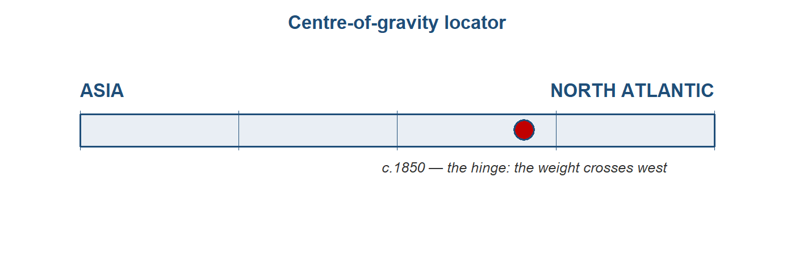

# The Great Divergence: the centre moves west {#sec-ch07}

::: {.callout-important appearance="simple"}
**Preliminary draft --- under review.** Published for review; content, figures and citations may still change.
:::

> *The hinge of the whole story — and its most open question. That the centre moved is not in
> doubt; when it moved, and why, is the book's central debate.*

<!-- BUILD NOTE: Q4 "why Britain" draws on the author's own (non-Kindle) Allen (2009) and
     Pomeranz (2000) reading notes — slot personal notes into the marked paragraphs. The
     web-grounded summaries below stand as a complete first draft until then. -->

## Follow one thing: a bolt of cotton cloth {.unnumbered}

Follow a single bolt of cotton. In 1700 the finest cloth in the world was Indian — calico and
chintz woven on hand looms in Bengal and on the Coromandel coast, so coveted in Europe that
Britain and France **banned** it to protect their own weavers. A century and a half later the
flow had reversed: cheap machine-spun cloth poured *out* of Lancashire and flooded the world,
including India, whose hand-loom weavers it undercut in their own bazaars. The same product —
cotton cloth — that had once measured Asian supremacy now measured its eclipse. This chapter is
the story of that reversal, because the cloth carries the whole argument: the moment the centre
of gravity of the world economy moved from Asia to the North Atlantic.^[**Sources:** Findlay & O'Rourke, *Power and Plenty* (2007), ch. 5; Parthasarathi, *Why Europe Grew Rich and Asia Did Not* (2011), on the calico bans. **Read more:** Riello, *Cotton: The Fabric that Made the Modern World* (2013); Beckert, *Empire of Cotton* (2014).]

## Where we are on the arc {.unnumbered}

Through @sec-ch06, the centre of gravity still sat in Asia: India made perhaps a quarter of the
world's manufactures as late as 1750, and Europe was the armed, silver-bearing contestant, not
yet the workshop. This chapter is **the hinge**. By 1850 the centre has moved to the North
Atlantic — that much is uncontested. What is genuinely open, and what this chapter stages rather
than settles, is *when* the move began and *why* — and whether Europe was ever structurally
ahead before it happened. This is the topic on which the book's whole "bounded anomaly" verdict
turns, so we return to weigh it in the @sec-conclusion.^[**Sources:** the centre-of-gravity ledger, `module_design/centre_of_gravity_ledger.md`, Topic 7 (the pivotal entry); the module synthesis, `module_design/11_synthesis.md`, Q4. **Read more:** Pomeranz, *The Great Divergence* (2000), the book that named the debate.]

{#fig-cog07}

## The stage and the cast

The cast carries over from @sec-ch06, but the roles reverse. **Britain** turns from a calico
*importer* and armed contestant into the mechanised workshop of the world. **India** turns from
the world's cotton workshop into a deindustrialising periphery — its share of world
manufacturing collapsing from roughly a quarter in 1750 to under 3% by 1880, the single headline
reversal of the whole book. **Qing China** is the great parity comparator: the lower Yangzi delta
tracked Europe's leading regions until about 1700 before falling behind. Two newer western actors
join: the **United States South**, whose enslaved-labour cotton plantations became the raw-fibre
engine of Lancashire; and **West Africa**, whose story is the monetary mirror-image — a
deindustrialisation worked through *money* rather than machines. And, as the foil that keeps the
question honest, **continental Europe**: if it was simply "Europe," why Britain and not France?^[**Sources:** Bairoch (1982) and Findlay & O'Rourke (2007), ch. 5, on the manufacturing-share reversal; Broadberry, Guan & Li (2018) on the Yangzi parity; Beckert (2014) on the US South; Green, *A Fistful of Shells* (2019), on West Africa. **Read more:** Parthasarathi (2011) on the India case.]

::: {.callout-tip}
## Dramatis personae
- **Britain** *(since @sec-ch06: transformed)* — from armed contestant and calico importer to the
  mechanised "workshop of the world."
- **India** *(present every chapter; since @sec-ch06: reversed)* — from the world's cotton
  workshop to a deindustrialising periphery; the chapter's central case.
- **Qing China** *(since @sec-ch05: changed)* — the parity comparator that shadowed Europe's
  leaders to ~1700, then diverged.
- **The US South / the Atlantic slave-cotton complex** *(new)* — the enslaved-labour raw-fibre
  engine; the New World "ghost acres" feeding mills the land of Britain could not.
- **West Africa** *(new role)* — deindustrialisation by monetary divergence (the parallel case).
- **Continental Europe (France)** — the foil for "why Britain, specifically?"
:::

::: {.callout-note}
## How we know — here the data *is* the debate
In every other chapter the evidence is sparse and we squeeze what we can from it. Here the
problem inverts: there is a *lot* of evidence, and the disagreement is about **which numbers to
trust**. The divergence is fought with rival reconstructions — Bairoch's manufacturing shares,
Broadberry's historical national accounts, Allen's real wages — and we have far richer series for
Britain and Europe than for Asia. So "when did the divergence begin?" is partly an artefact of
*where we have data*: the book's running **data-bias** warning bites hardest precisely here, on
the chapter that decides the whole argument. Two honesty checks set the tone. First, the
Industrial Revolution itself was *slower* than legend — the Crafts–Harley reconstruction cut the
headline growth rates sharply. Second, even the best Asian series get revised: the leading
estimate of historical Chinese GDP was publicly challenged and restated. Treat every number in
this chapter as a contested estimate, not a fact.

*Sources: Crafts & Harley, "Output growth and the British Industrial Revolution: a restatement," Economic History Review 45 (1992); Broadberry, Guan & Li (2018) and the subsequent "Further Concerns"/"Restatement" exchange in the Journal of Economic History. Read more: the data-survival-and-bias note, `module_design/datasets_by_topic.md`.*
:::

### Inside the economies: three engines, and Britain's is the new kind

Before the narrative, look inside — because the divergence is, at bottom, a story about three
different economic engines. **Britain** was, on the standard account, a high-wage, cheap-coal
economy: expensive labour and cheap energy made it profitable to *adopt* and to *invent*
labour-saving, coal-burning machines. The **lower Yangzi** was the opposite — an "involutionary"
economy of extraordinary labour intensity, absorbing ever more work-hours per acre for
diminishing returns (by one comparison, labour intensity some eight times England's, for output
only nine times higher). **India** was a low-wage handloom proto-industry: genuinely competitive
in world markets, but competitive *on the basis of cheap labour*, not mechanisation. The
factor-price contrast is the cleanest single mechanism to teach — and, as we will see, the most
contested.^[**Sources:** Allen, *The British Industrial Revolution in Global Perspective* (2009), on factor prices; on Yangzi involution, the discussion in von Glahn (2016) and Pomeranz (2000); on Indian proto-industry, Parthasarathi (2011). **Read more:** the contest over Allen's mechanism — Kelly, Mokyr & Ó Gráda (2023), in the research-frontier section below.]

## The period on its own terms: how cotton turned around, 1750–1850

The reversal runs in five phases, from Indian primacy to a North-Atlantic workshop.^[**Source:** the five-phase framing follows the Topic 7 story spine, `module_design/topic_07_story_spine_2026-06-19.md`, built from Findlay & O'Rourke (2007), ch. 5, and Riello (2013).]

**Phase 1 (c.1700–1750) — The eve: India the workshop, parity at the top.** Indian calicoes
flood European markets; Britain legislates against them (1700, 1721) to shelter home weavers. The
Yangzi delta still tracks Europe's leading economies. No one is yet pulling away.^[**Sources:** Parthasarathi (2011) on the calico acts; Broadberry, Guan & Li (2018) on Yangzi parity. **Read more:** Riello (2013), part II.]

**Phase 2 (1750s–1780s) — Britain mechanises cotton.** A cascade of textile inventions — Kay's
flying shuttle (1733), Hargreaves's jenny, Arkwright's water frame (1769), Crompton's mule
(1779) — meets Newcomen's and then Watt's steam engine, and coal turns the wheels. The effect on
productivity is staggering: the operative-hours needed to process 100 lb of cotton fall from
upwards of 50,000 by hand to around 2,000 on the early mule.^[**Sources:** Findlay & O'Rourke (2007), ch. 5, for the operative-hours series; standard accounts of the textile inventions. **Read more:** Allen (2009), chs 6–8, on why these inventions paid in Britain specifically.]

**Phase 3 (1780s–1815) — The reversal gathers; the Atlantic engine fires.** Raw cotton pours
from the US South after Whitney's gin (1793), grown by enslaved labour on New-World land that
functioned as "ghost acres" Britain did not have at home. British raw-cotton imports leap from
roughly 3,600 tonnes (1775) toward 27,000 tonnes (1800); cotton output triples. Britain flips
from calico importer to the world's dominant cloth exporter.^[**Sources:** Beckert (2014) on the slave-cotton complex; Pomeranz (2000) on "ghost acres"; Findlay & O'Rourke (2007) for the import figures. **Read more:** Beckert (2014), chs 3–5.]

**Phase 4 (1815–1840s) — India deindustrialises; Lancashire floods the world.** Productivity
keeps climbing — operative-hours per 100 lb reach about 135 by 1825 — and by 1815 some 60% of
British cotton textiles are exported. This is a productivity-driven terms-of-trade shock:
Lancashire cloth undercuts Indian weavers *in India*. And coercion has teeth — the Permanent
Settlement (1793), Company exports financed from Bengal's land revenue, the end of the East India
Company's trade monopoly (India 1813, China 1833) — "free trade," on British terms.^[**Sources:** Findlay & O'Rourke (2007), ch. 5; Parthasarathi (2011) and Beckert (2014) on coercion; on the deindustrialisation-as-terms-of-trade-shock mechanism, Clingingsmith & Williamson. **Read more:** the deindustrialisation debate in the *Debate* box below.]

**Phase 5 (1840s–1850s) — The centre has moved; China is cracked open.** British raw-cotton
imports run from ~220,000 tonnes (1840) to ~680,000 tonnes (c.1860); India's share of world
manufacturing falls below a tenth. China's parity ends in the Daoguang Depression, with net
silver flowing *out* from the late 1820s; the Opium War (1839–42) and the Treaty of Nanjing
force it open. By 1850 the centre sits in the North Atlantic.^[**Sources:** Findlay & O'Rourke (2007), ch. 5, for the cotton-import series; von Glahn (2016) on the Daoguang Depression and silver outflow. **Read more:** on the China shock, @sec-ch08 (the first global economy on colonial terms).]

## Reading the period: the four questions

**Direction** (Q1) is the subtle one. The divergence is *not* a break in integration — the world
keeps integrating across these decades — but a **reversal of relative position within an
integrating system**. That carries the chapter's distinctive fragility lesson: integration can
*hollow out* a core, not only lift it. India was not cut off from the world economy; it was
remade by it, on disadvantageous terms.^[**Sources:** O'Rourke & Williamson on integration-with-divergence; the module synthesis, `module_design/11_synthesis.md`, Q1. **Read more:** Williamson, *Trade and Poverty: When the Third World Fell Behind* (2011).]

**Channels** (Q2): the integrating circuit is now the cotton circuit — raw fibre *in*,
manufactured cloth *out*, on terms Britain sets. Its raw-material leg is the Atlantic
slave-sugar-cotton complex; the old overland channel is now marginal. The geography of the world
economy has been re-plumbed around an Atlantic-and-Indian-Ocean manufacturing core.^[**Source:** Beckert (2014) on the Atlantic raw-material leg. **Read more:** Findlay & O'Rourke (2007), ch. 5.]

::: {.callout-important}
## Follow the money — the silver thread pays off
**Modes** (Q3): goods lead now — the cotton reversal is the headline flow — and bullion is a
*good* on its way to becoming money (the role-change completes in @sec-ch08). But here the
book's **"follow the silver"** thread, running since @sec-ch05, finally pays off. Europe's
centuries as the monetary loser — shipping silver east to buy Asian goods it could not match —
turn out to have been the making of it: Europe **converted its monetary "loss" into armed trade,
finance and navies.** Up to 90% of British state revenue went on war; the European edge was
fiscal-military power and organised violence as much as cheaper manufactures. West Africa is the
parallel run in reverse: deindustrialisation by *monetary* divergence — the macuta sliding from
500 to 40 reais, some 30 billion cowries absorbed — money, not machines, doing the hollowing-out.

*Sources: the silver thread note, `module_design/silver_monetization_thread_2026-06-16.md`; Green, A Fistful of Shells (2019), on West Africa; on the fiscal-military state, O'Brien and Findlay & O'Rourke (2007). Read more: the Introduction's "bullion tracer, and why it flips".*
:::

**Europe** (Q4) is the question this chapter exists to test — and the one period where the answer
is genuinely "yes, Europe pulls ahead." *Why Britain?* There is no settled answer, and the
honest move is to teach the disagreement. One quartet of accounts explains the *adoption* of the
new technology: **Allen** (factor prices — high wages plus cheap coal made machines pay);
**Pomeranz** (resources — coal near at hand, plus New-World ghost acres); **Mokyr** (useful
knowledge — an Industrial Enlightenment); **Beckert** (war capitalism — empire and slavery). A
second quartet locates a *deeper* European peculiarity well before 1750: **Mokyr** (a culture of
growth), **Scheidel** (the productive consequences of political fragmentation), **Acemoglu &
Robinson** (inclusive institutions), **Rubin** (religion and the relation of rulers to clerics).
The Parthasarathi twist keeps the spine honest: the divergence emerged *from* India's cotton
dominance — British mechanisation was in part a response to Indian competition — not in spite of
it.^[**Sources:** Allen (2009); Pomeranz (2000); Mokyr, *A Culture of Growth* (2016); Beckert (2014); Scheidel, *Escape from Rome* (2019); Acemoglu & Robinson, *Why Nations Fail* (2012); Parthasarathi (2011). **Read more:** all are reviewed in the research-frontier section below; the author's own Allen/Pomeranz notes slot in here.]

**Forces.** Technology leads — mechanisation, steam, coal — and the debate is really about what
made invention *and adoption* happen *here*. Energy is the tell: English daily energy use rose
from roughly 33,000 to 99,000 kcal per head, a jump sustained only by coal. Climate enters too,
as a supply shock in parts of the Indian story.^[**Sources:** Scheidel and Wrigley on the coal-energy transition; Findlay & O'Rourke (2007), ch. 5. **Read more:** Wrigley, *Energy and the English Industrial Revolution* (2010).]

## The verdict: where was the centre?

That the centre of gravity moves west by 1850 is **uncontested**. *When* and *why* it moved is
**genuinely open** — and on the answer hangs the strength of this book's spine. If the divergence
was **late and contingent** (Pomeranz, Allen — parity until ~1750, then a coal-and-colonies
accident), the "European dominance as anomaly" framing is *stronger*. If it was **early and
structural** (Broadberry — India behind Britain by the 17th century, China diverging from ~1700),
the framing is *weaker*. The reconciliation worth teaching is **"late in outcome, earlier in
roots"**: the aggregate per-head gap opens late, but specific seeds — institutional, fiscal,
demographic — run earlier. *(Confidence: high on the move; the* why *is the debate — the ledger's
pivotal, deliberately-unresolved line, adjudicated at the* @sec-conclusion*.)*^[**Sources:** centre-of-gravity ledger, `module_design/centre_of_gravity_ledger.md`, Topic 7; Broadberry, Custodis & Gupta (2015) and Broadberry, Guan & Li (2018) for the early-divergence case; Pomeranz (2000) and Allen (2009) for the late case. **Read more:** the *Debate* box below.]

Then **size it honestly**. The Industrial Revolution was gradual: the Crafts–Harley
reconstruction puts British growth at roughly 0.33% a year, with output expanding about 6.5-fold
between 1700 and 1860. Cotton was the lead sector, not the whole economy; the dramatic headline
hides a slow aggregate transformation. And note *what kind* of change this was. The per-capita
divergence opens around 1700 — *during* the Asian empires' aggregate apogee — which is why this
is the chapter where the book's **quantity to quality** thread finally resolves: **the Great
Divergence *is* the switch.** "Success" stops meaning aggregate scale and starts meaning sustained
income per head. By 1700 China sat at perhaps 55% of the European leader; India fell from over 60%
of Britain's GDP per head in 1600 to under 15% by 1871; a day's wage around 1700 bought roughly
four subsistence baskets in London but only one in Beijing, Canton or Edo.^[**Sources:** Crafts & Harley (1992) for the growth reconstruction; Broadberry, Guan & Li (2018) and Broadberry, Custodis & Gupta (2015) for the GDP ratios; Allen and Findlay & O'Rourke (2007) for the real-wage baskets. **Read more:** the quantity-vs-quality thread is set up in @sec-ch01 and closed in @sec-ch10.]

::: {.callout-warning}
## The debate: late and contingent, or early and structural?
This is *the* debate of the module. The **California school** (Pomeranz, Allen) argues for
surprising **parity** between the most advanced regions of Europe and Asia as late as ~1750,
with the divergence then opening fast on coal and colonies — late, contingent, and so a *stronger*
case for European dominance as an anomaly. The **historical-national-accounts** camp (Broadberry
and colleagues) reconstructs GDP series showing the gap opening **earlier and more structurally**
— India behind Britain by the seventeenth century, China sliding from ~1700 — a *weaker* anomaly
reading. Bound up with it are two further quarrels: **why Britain** (Allen's factor-prices vs
Mokyr's knowledge vs Pomeranz's resources vs Beckert's empire — and the newer claim of Kelly,
Mokyr & Ó Gráda that it was *low* wages plus mechanical skill, not high wages, that drove
adoption); and **deindustrialisation** — was India's handloom sector *destroyed* (Williamson,
Beckert) or *reorganised and partly resilient* (Roy, Harnetty)? The book does not resolve any of
these. It insists only that **measurement is the debate**: which series you trust decides which
story you tell.

*Sources: Pomeranz, The Great Divergence (2000); Allen (2009); Broadberry, Custodis & Gupta (2015); Broadberry, Guan & Li (2018); Kelly, Mokyr & Ó Gráda (2023); on deindustrialisation, Roy and Harnetty vs Williamson/Beckert. All cited in full below.*
:::

::: {.column-page}
**Data exhibit — follow the cloth: India's deindustrialisation in numbers.** Lay three series
side by side, 1600–1880: India's **share of world manufacturing** (~24.5% in 1750 to under 3% by
1880, Bairoch); India's **GDP per head relative to Britain** (>60% in 1600 to <15% by 1871,
Broadberry–Custodis–Gupta); and British **cotton-cloth exports** (surging from ~1815). Read
together they turn "India was deindustrialised" from a slogan into a measured reversal — and show
*when* each curve turns, which is the empirical heart of the timing debate. *Caveats:* the
manufacturing-share and GDP series are **reconstructed estimates** with wide error bands, far
better-grounded for Britain than for India; the manufacturing-share denominator (world output) is
itself estimated. *What you could do with this:* plot the three series, mark the inflection years,
and test how the "when did it begin?" answer moves as you swap Bairoch's shares for Broadberry's
GDP — i.e. show that measurement *is* the debate.

*Sources: Bairoch, "International Industrialization Levels from 1750 to 1980," Journal of European Economic History 11 (1982); Broadberry, Custodis & Gupta (2015); Findlay & O'Rourke (2007), ch. 5. See the per-topic dataset entry in `module_design/datasets_by_topic.md`, Topic 7.*
:::

## Threads forward

This is the chapter where the book's threads converge. The **centre-of-gravity** spine reaches
its hinge (the move west by 1850 — high confidence; the *why* left open for the
@sec-conclusion). The **quantity to quality** thread resolves: the divergence *is* the switch from
aggregate scale to income per head. And the **"follow the silver"** thread pays off — Europe's
monetary "loss" converted into power.^[**Source:** the threads are tracked in `module_design/11_synthesis.md`. **Read more:** the Introduction sets out all six.]

Hand-off to @sec-ch08: by 1850 the centre has moved, and in the next chapter this newly
Euro-centred order *globalises* — the first price-integrated world economy, built on steam, the
Suez Canal and indentured labour, and resting on the very Indian-Ocean periphery it now governs.
The divergence made the dominance; the next chapter shows what the dominance was *for*.^[**Source:** the arc, `module_design/module_outline_2026-06-16.md`, §6. **Read more:** @sec-ch08.]

---

## Classic research: the foundations {.unnumbered}

Long before "the Great Divergence" was named, economic historians argued about *why Europe* and
*why the Industrial Revolution* — and the chapter's modern debate descends directly from them.

- **Weber (1905)**, *The Protestant Ethic and the Spirit of Capitalism* — the original
  culture-and-institutions account of European economic dynamism; the ancestor of Mokyr's and
  Rubin's arguments.
- **Gerschenkron (1962)**, *Economic Backwardness in Historical Perspective* — relative
  backwardness and the varieties of industrialisation; reframed "catching up" as a process.
- **Landes (1969)**, *The Unbound Prometheus*, and **Landes (1998)**, *The Wealth and Poverty of
  Nations* — the influential (Eurocentric) technological-superiority account the California school
  was written against.
- **E. L. Jones (1981)**, *The European Miracle* — the environment-and-politics case for Europe's
  distinctiveness; the foil for Pomeranz.
- **Bairoch (1982)**, "International Industrialization Levels from 1750 to 1980," *Journal of
  European Economic History* 11: 269–333 — the manufacturing-share series (the ~24.5% to 3% India
  figures) that still anchors the descriptive picture.
- **Crafts & Harley (1992)**, "Output growth and the British Industrial Revolution: a restatement,"
  *Economic History Review* 45(4): 703–730 — the reconstruction that showed the IR was *slower*
  than legend; the basis for this chapter's "size it honestly."

## At the research frontier: recent cliometric work {.unnumbered}

The Great Divergence is one of the most active quantitative fields in economic history, and —
unlike the ancient chapters — it is **NBER/CEPR-central**. A sweep of NBER, CEPR and RePEc, with
the defining books, recent first:

- **Kelly, Mokyr & Ó Gráda (2023)**, "The Mechanics of the Industrial Revolution," *Journal of
  Political Economy* 131(1): 59–94 (CEPR DP 14884) — using county-level English data, argues
  industrialisation went with *low* wages and *high mechanical skills*, not Allen's high wages,
  and that coal proximity and literacy don't predict it. A direct, current challenge to the
  factor-price thesis. [DOI](https://doi.org/10.1086/720890) · [CEPR](https://cepr.org/publications/dp14884)
- **Broadberry, Guan & Li (2018)**, "China, Europe, and the Great Divergence: A Study in
  Historical National Accounting, 980–1850," *Journal of Economic History* 78(4): 955–1000 — the
  GDP reconstruction placing the China–Europe divergence *earlier* than the California school
  allows; see also the subsequent "Further Concerns"/"Restatement" exchange (the field correcting
  itself in public). [RePEc](https://ideas.repec.org/p/oxf/esohwp/_155.html)
- **Allen (2015)**, "The high wage economy and the industrial revolution: a restatement,"
  *Economic History Review* 68(1): 1–22 — Allen defending the factor-price account against its
  critics; read alongside Kelly–Mokyr–Ó Gráda as the live exchange. [Wiley](https://onlinelibrary.wiley.com/doi/abs/10.1111/ehr.12079)
- **Broadberry, Custodis & Gupta (2015)**, "India and the great divergence: An Anglo-Indian
  comparison of GDP per capita, 1600–1871," *Explorations in Economic History* 55: 58–75 — the
  India series behind this chapter's headline ratios. [RePEc](https://ideas.repec.org/a/eee/exehis/v55y2015icp58-75.html)
- **Mokyr (2016)**, *A Culture of Growth* (Princeton) — the Industrial-Enlightenment / culture
  account, now the leading "deep roots" alternative to factor-price stories.
- **Allen (2009)**, *The British Industrial Revolution in Global Perspective* (CUP) — the
  high-wage/cheap-coal thesis in full; the most-cited single mechanism.
- **Parthasarathi (2011)**, *Why Europe Grew Rich and Asia Did Not* (CUP) — the India-centred
  account: mechanisation as a *response* to Indian competition.
- **Pomeranz (2000)**, *The Great Divergence* (Princeton) — the book that defined the debate
  (parity to ~1800; coal + New-World ghost acres).

::: {.callout-note}
## Keeping this current (verification gate)
Sweep run 2026-06-25 across NBER, CEPR, RePEc/IDEAS and Crossref; every entry above was
citation-verified (DOI/RePEc/publisher URL). This is a fast-moving field — refresh before
publication and **never list an unverified working paper**. *Standing build note:* integrate the
author's own (non-Kindle) Allen and Pomeranz reading notes into the Q4 "why Britain" paragraphs.
:::

---

### Questions for consideration {.unnumbered}

*Essay / exam style — each rewards the four-questions toolkit and the live debate, not recall.*

1. Was the Great Divergence **late and contingent** or **early and structural**? Set out what
   evidence would decide it, and how far the available series actually let you.
2. *"India was deindustrialised, not outcompeted."* Discuss, distinguishing market forces from
   coercion, and the "destroyed" from the "reorganised" readings.
3. Why **Britain**, and not France, China or India? Assess at least two of the four "why-the-West"
   accounts (Allen, Pomeranz, Mokyr, Beckert) against the evidence.
4. *"The Great Divergence is the moment 'success' changed meaning."* Explain, using the
   quantity-versus-quality distinction and the per-capita series.
5. *"Here the data is the debate."* Using the rival GDP and real-wage reconstructions, show how
   the answer to "when did the divergence begin?" depends on which series you trust — and on where
   we have data at all.

::: {.callout-tip}
## Cross-cutting questions (collected at the end of the book)
Those this chapter feeds:
- **Quantity vs quality.** Across @sec-ch02, @sec-ch06 and @sec-ch07, when is a "thriving" empire
  *rich* and when only *big*? Build the answer from aggregate-vs-per-capita evidence.
- **How bounded is the anomaly?** Holding @sec-ch07's timing debate against @sec-ch10's partial
  return, how strong a version of "European dominance as anomaly" can the evidence support?
:::

### Data exercise {.unnumbered}

```{r}
#| label: ch-07-exercise
#| eval: false
# The Great Divergence: when did it begin? (datasets_by_topic.md, Topic 7)
# 1. Load Broadberry et al. GDP-per-capita series (Britain, India, China, ~1600–1870).
# 2. Load Bairoch manufacturing-share series and Allen real-wage (welfare-ratio) series.
# 3. Plot each; mark the inflection year implied by each measure.
# 4. Show how the "start date" of the divergence shifts with the measure chosen — i.e. that
#    measurement IS the debate. Note the wider error bands on the Asian series.
```

### Key data {.unnumbered}

| Figure | Value | Source (to wire to `references.bib`) |
|---|---|---|
| India share of world manufacturing | ~24.5% (1750) to <3% (1880) | Bairoch 1982 / Findlay–O'Rourke 2007 |
| India GDP/cap vs Britain | >60% (1600) to <15% (1871) | Broadberry, Custodis & Gupta 2015 |
| China GDP/cap vs European leader | ~55% by 1700 | Broadberry, Guan & Li 2018 |
| Cotton operative-hours per 100 lb | >50,000 (hand) to ~2,000 (mule 1779) to 135 (1825) | Findlay–O'Rourke 2007 |
| British raw-cotton imports | 3,600 t (1775) to 27,000 t (1800) to ~680,000 t (c.1860) | Findlay–O'Rourke 2007 |
| English energy use per head/day | 33,000 to 99,000 kcal | Scheidel; Wrigley |
| IR aggregate growth | ~0.33%/yr; output ~6.5× (1700–1860) | Crafts–Harley 1992 |
| Real wage c.1700 (baskets/day) | ~4 London vs ~1 Beijing/Canton/Edo | Allen; Findlay–O'Rourke 2007 |
| West Africa monetary divergence | macuta 500 to 40 reais; ~30bn cowries | Green 2019 |

*GDP and manufacturing-share figures are reconstructed estimates with wide error bands (better for
Britain than for Asia) — presented as the substance of the debate, not as settled facts.*

### Further reading {.unnumbered}

- **Core:** Findlay & O'Rourke, *Power and Plenty* (2007), ch. 5; Pomeranz, *The Great Divergence*
  (2000); Allen, *The British Industrial Revolution in Global Perspective* (2009).
- **Supplementary:** Parthasarathi, *Why Europe Grew Rich and Asia Did Not* (2011); Riello,
  *Cotton* (2013); Beckert, *Empire of Cotton* (2014); Broadberry, Custodis & Gupta (2015).
- **The debate:** Kelly, Mokyr & Ó Gráda (2023) vs Allen (2015) on the high-wage thesis;
  Broadberry et al. (2018) vs the California school on timing; Roy/Harnetty vs Williamson/Beckert
  on deindustrialisation.
