# The first global economy: integration on colonial terms {#sec-ch08}

::: {.callout-important appearance="simple"}
**Preliminary draft --- under review.** Published for review; content, figures and citations may still change.
:::

> *"The inhabitant of London could order by telephone, sipping his morning tea in bed, the various products of the whole earth ... and reasonably expect their early delivery upon his doorstep."* --- John Maynard Keynes, *The Economic Consequences of the Peace*, 1919, on the world before 1914.
>
> *"It is the knife of sugar. That is to say there is no oppression, it is all smooth and sweet, but it is the knife, notwithstanding."* --- Dadabhai Naoroji, on British rule and the drain of wealth from India.

## Follow one thing {.unnumbered}

Follow the price gap. In 1873 raw cotton cost about 57 per cent more in Liverpool than in Bombay; by 1913 the gap had fallen to roughly 20 per cent. The same closing happened on route after route --- London-Calcutta jute from about 35 per cent to 4, London-Rangoon rice from 93 per cent to 26 --- and it is the single best measure of what this chapter is about. For the first time in the history this book has traced, the integration of the world economy was visible not just in flows of goods but in prices converging across oceans: a genuinely global market, where the cost of a thing in Bombay and the cost of the same thing in Liverpool were chained together by steam, the telegraph and the gold standard. This was the first true globalisation. But a converging price gap raises its own question, and it is this chapter's question: the gap closed --- but on whose terms? The convergence that lifted wages in Australia and Ireland reached Bombay, Calcutta and Rangoon as well, and it reached them as the prices of a colonial periphery, integrated downward into a system run from London. The price gap is the thread; whose terms it closed on is the argument.^[**Sources:** O'Rourke & Williamson (Loc 610) on the Liverpool-Bombay cotton gap (57 per cent to 20), London-Calcutta jute (35 to 4) and London-Rangoon rice (93 to 26), 1873-1913. **Read more:** O'Rourke & Williamson (1999), *Globalization and History*.]

## Where we are on the arc {.unnumbered}

The last chapter was the turning point: between about 1760 and 1850 the centre of gravity finally moved west, mechanised cotton reversed the textile trade, and India deindustrialised from the workshop of the world into an importer of British cloth. This chapter is the apogee of the order that reversal created. The Euro-centred economy now globalised, knitting the continents into the first price-integrated world market through steam, the Suez Canal, the submarine telegraph and the classical gold standard. On every aggregate measure the weight sat unambiguously in the North Atlantic --- by 1913 Europe and its offshoots produced nearly 90 per cent of the world's manufactures. But the Indian-Ocean vantage adds the chapter's sharpest twist. This peak of Western dominance rested on the periphery it governed: the Indian Ocean had become, in the phrase of the age, a "British lake," and India's export surplus financed an estimated more than 40 per cent of Britain's balance-of-payments deficits between 1870 and 1915, holding the whole multilateral settlement system together. The centre was Western; but it was built on, not independent of, the ocean this book has followed.^[**Sources:** Findlay & O'Rourke (2007) on world manufacturing shares in 1913 (Europe and offshoots ~90 per cent) and the multilateral settlement system; the brief's account of India financing over 40 per cent of Britain's payments deficits, 1870-1915. **Read more:** Findlay & O'Rourke (2007), *Power and Plenty*, ch. 7.]

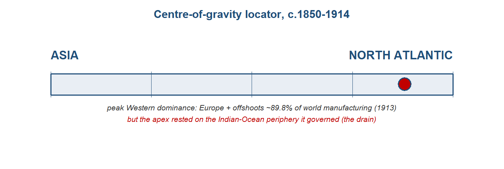{#fig-cog08 width=85%}

## The stage and the cast

There were now three ways to be integrated into the world economy, and the difference between them is the engine of this chapter. The core --- Britain and north-west Europe --- set the terms, exported capital and manufactures, and imported cheap food and raw materials. The settler periphery --- the United States, Argentina, Australia, Canada --- was land-abundant and drew in European migrants and European capital, and it converged upward toward core living standards. The colonial periphery --- India, Ceylon, Malaya, Egypt --- exported commodities and labour and imported manufactures, and it integrated downward, its fortunes locked in beneath the system rather than rising with it. Same world economy, three fates. The territorial frame made the asymmetry concrete: Europe controlled about 67 per cent of the Earth's land surface in 1878, and around 84 per cent by 1914. The cast below runs east to west, from the colonial periphery that this book has followed, through the one Asian economy that escaped its fate, to the core that governed the whole.^[**Sources:** the brief's "three ways to be integrated" framework (core, settler periphery, colonial periphery); Findlay & O'Rourke (2007) on European territorial control rising from ~67 per cent of the Earth's surface (1878) to ~84 per cent (1914). **Read more:** Williamson (2011), *Trade and Poverty*.]

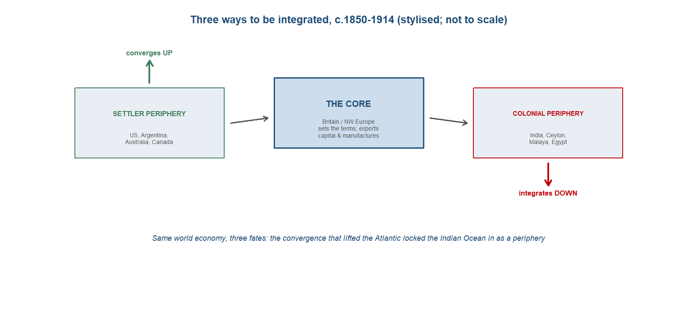{#fig-peripheries08 width=92%}

::: {.callout-tip}
## Dramatis personae
The economic actors of c.1850--1914, east to west, and what changed since the last chapter. **India appears in every chapter, profiled most fully.**

- **India** --- since the last chapter: not just deindustrialised but the linchpin of the imperial economy, the periphery whose surplus held the core's payments system together.
- **China** --- forced open: the Treaty of Nanking fixed tariffs at 5 per cent (1842); a treaty-port semi-periphery integrated on imposed terms.
- **Japan** --- the Asian exception: opened by force in 1858, it used the shock to industrialise rather than deindustrialise.
- **The indentured-labour diasporas** --- the Indian Ocean's distinctive labour story: ~1.5-2 million Indians shipped overseas under indenture, 1834-1920.
- **Britain** --- since the last chapter: the workshop of the world is now the hub of a global, imperial economy, and its banker.
- **The settler New World** --- the other periphery: integrated, migrant-fed, and converging upward.
:::

::: {.callout-tip collapse="true"}
## India --- the deindustrialised periphery that propped up the core

India entered this chapter as the loser of the last one. The deindustrialisation that Topic 7 traced --- the collapse of the great cotton workshop under the combined weight of British machine competition, free-trade tariffs and colonial policy --- had run most of its course, and what remained was an economy integrated into the world on wholly new terms. India was now a commodity-exporting colonial periphery: it shipped out raw cotton, jute, wheat and tea, and it took in British manufactures, above all the machine-made cloth that had once been its own great export. The aggregate that measured the reversal was stark. India's share of world manufacturing output, which had stood near a quarter around 1750, fell toward roughly 1.4 per cent by 1913 --- the workshop of the connected world reduced, in a century and a half, to a supplier of fibre and food.^[**Sources:** Findlay & O'Rourke (2007) on India's world-manufacturing share at about 1.4 per cent by 1913 (Bairoch-type series, *Power and Plenty* p.324). **Read more:** Roy (2012), *India in the World Economy*.]

The new role was not pure absence of industry. Where colonial demand and British capital aligned, modern factory enclaves grew, and the clearest case was jute. Bengal's jute mills rose from five in 1869 to sixty-four by 1913, building a near-monopoly on the world's supply of the sacking and bagging that the whole grain-and-commodity trade was carried in. This was real industrialisation, but of a particular kind: an export-processing enclave serving the world market rather than a broad domestic manufacturing base, sitting alongside an artisan sector that the machine age had hollowed out. The factory grew at the edges while the loom shrank at the centre.^[**Sources:** Roy (p.191) on Bengal jute mills rising from five to sixty-four (1869--1913) and the resulting near world monopoly. **Read more:** Roy (2012), *India in the World Economy*.]

Integration also reached inside the subcontinent. The railways that the colonial state built for strategic and commercial reasons cut India's internal transport costs by something like 80 per cent, and the effect on prices was measurable: the dispersion of grain prices across districts, which had run at over 40 per cent, fell sharply as cheap rail freight knitted local markets into one. The same price-convergence apparatus that the chapter uses to measure globalisation across oceans worked within India too --- Bombay, Calcutta and Rangoon were drawn into the world's price system, and India's own districts were drawn into each other's. Convergence was genuine. The question the chapter presses is on whose terms it arrived.^[**Sources:** O'Rourke & Williamson (Loc 566) on Indian internal transport costs falling about 80 per cent and cross-district grain-price dispersion falling from over 40 per cent; O'Rourke & Williamson (Loc 610) on the Liverpool--Bombay cotton spread narrowing from 57 to 20 per cent and London--Calcutta jute from 35 to 4 per cent (1873--1913). **Read more:** O'Rourke & Williamson (1999), *Globalization and History*.]

Here the chapter's central claim turns. India was subordinate, but it was also the linchpin of the whole imperial settlement system, and the mechanism was its balance of payments. India ran a large surplus on its commodity trade with the rest of the world while running a deficit with Britain; that surplus, earned in other countries' currencies, was the instrument through which Britain settled its own deficits with the rest of the world. On the standard reconstruction India's export surplus financed an estimated more than 40 per cent of Britain's balance-of-payments deficits between 1870 and 1915, recycled through the Council Bill system by which the colonial administration moved funds between London and Calcutta. India, the subordinate periphery, was the keystone that held the multilateral settlement of payments --- and with it the classical gold standard --- together.^[**Sources:** Findlay & O'Rourke (2007) on India's export surplus financing more than 40 per cent of Britain's balance-of-payments deficits, 1870--1915, recycled through the Council Bill system and holding the multilateral settlement system together. **Read more:** Findlay & O'Rourke (2007), *Power and Plenty*, ch. 7.]

Layered on top of the trade surplus were the Home Charges: the costs of Indian administration, debt service and pensions, running at roughly £35 million a year, all charged to Indian revenue and remitted to Britain. This is the heart of an old and unresolved argument. The nationalist tradition, from Dadabhai Naoroji onward, read these transfers as a drain --- a systematic extraction that impoverished India to enrich the metropole. The revisionist reply, made most carefully by Tirthankar Roy, is that the surplus and the charges largely paid for real services --- railways, irrigation, courts, defence --- and that the colonial state was a small share of national income, so the net extraction was far smaller than the nationalist accounting implied. The two readings are not reconciled here, and the magnitude remains contested. What is widely accepted, and separable from the extraction debate, is the balance-of-payments mechanism itself: whatever its welfare cost, India's surplus structurally underwrote Britain's global position.^[**Sources:** the Home Charges (about £35 million a year --- administration, debt service, pensions) charged to Indian revenue, taught as contested: Naoroji's drain thesis versus the revisionist qualification of Roy (2012) that the surplus largely paid for real services and that the colonial state was a small share of national income. **Read more:** Roy (2012), *India in the World Economy*.]

The periphery exported people as well as goods. The same integration that moved Indian fibre to the world moved Indian labour to its plantations, and India became the source of the great indentured diaspora of the age --- carried to Mauritius, Natal, Trinidad, British Guiana, Malaya and Fiji to work the sugar and rubber estates that the colonial division of labour required. By 1920 there were more than a million persons of Indian origin living abroad, a population that in some destinations formed the majority. Whether this was a new system of slavery or a constrained but real labour market is itself a live debate; either way, the labour reservoir of the imperial economy was Indian.^[**Sources:** Roy (p.178) on more than a million persons of Indian origin abroad by 1920, India as the source of the indentured diaspora across the plantation colonies. **Read more:** Roy (2012), *India in the World Economy*.]

The sharpest cost of all came in the famines. Between 1876 and 1902, three catastrophic subsistence crises --- in 1876--78, 1896--97 and 1899--1902 --- struck a countryside newly exposed to integrated grain markets and governed by a state committed to free-market orthodoxy in relief. Mike Davis read these as the lethal intersection of El Nino drought, global market integration and colonial non-intervention, and estimated the combined mortality in the tens of millions, with figures ranging from around 12 to 29 million dead across the episodes. The mortality range is contested, and revisionists put the numbers and the causal weight of policy lower. The teaching point does not depend on the exact figure: in the colonial periphery, the same integration that the core experienced as cheap food and converging prices could arrive as famine.^[**Sources:** Davis (2001) on the Late Victorian famines of 1876--78, 1896--97 and 1899--1902, with combined mortality estimated in the range of roughly 12 to 29 million, taught as contested (Davis versus revisionists), and on the link between global market integration, colonial relief policy and El Nino drought. **Read more:** Davis (2001), *Late Victorian Holocausts*.]

**Trade profile**

- **Main exports** --- primary commodities for the world market: raw cotton, jute (and jute manufactures from the Bengal mills), wheat and tea, the food and fibre of a colonial periphery; and, through the surplus they earned, the foreign exchange that settled Britain's accounts.
- **Main imports** --- British manufactures above all, the machine-made cotton cloth that had displaced India's own weaving, together with the metals and capital goods of the railway age.
- **Export markets** --- Britain and the wider world economy, with the export surplus earned outside Britain recycled to London through the Council Bill system; the plantation colonies that drew Indian indentured labour.
- **Import sources** --- Britain, the workshop and the metropole, the dominant source of the manufactures India now bought rather than made.^[**Sources:** Findlay & O'Rourke (2007) on the commodity-export role, the surplus and the Council Bill mechanism; Roy (p.191, p.178) on jute and the labour diaspora. **Read more:** Roy (2012), *India in the World Economy*.]
:::

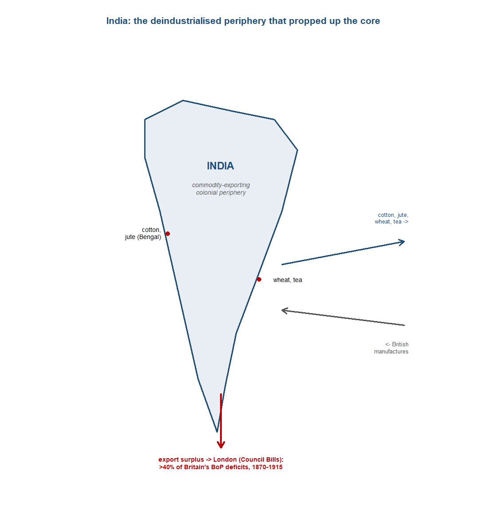{#fig-india08 width=80%}

::: {.callout-tip collapse="true"}
## China --- the treaty-port semi-periphery

China was integrated into the first global economy by force, not by choice. The First Opium War ended in the Treaty of Nanking in 1842, and the settlement fixed Chinese import tariffs at 5 per cent --- a rate China could not afterwards raise without foreign consent. A low tariff held in place by treaty meant that China surrendered the principal instrument by which a sovereign state could shelter its own producers or shape its own trade. Integration came on terms imposed from outside, and the treaty ports that followed --- the foreign-administered enclaves along the coast and the great rivers --- became the points at which an empire was opened on conditions it had not set.^[**Sources:** Findlay & O'Rourke (2007) on the Treaty of Nanking fixing Chinese tariffs at 5 per cent (1842) and the treaty-port settlement (*Power and Plenty* p.388). **Read more:** Findlay & O'Rourke (2007), *Power and Plenty*, ch. 7.]

The depth of that subordination is visible in who collected China's own revenue. The Imperial Maritime Customs, the service that levied the empire's trade duties, was run by foreigners, and by 1894 over 80 per cent of China's customs revenue was paid by British firms. A core function of the fiscal state --- taxing its own foreign trade --- was administered by, and largely fell to, the very powers that had forced the country open. China was not colonised outright as India was; it kept its dynasty and its territory. But it was integrated as a semi-periphery, on imposed terms, with key levers of its commercial sovereignty in foreign hands.^[**Sources:** Findlay & O'Rourke (2007) on over 80 per cent of China's customs revenue being paid by British firms by 1894, through the foreign-run Imperial Maritime Customs (*Power and Plenty* p.388). **Read more:** Findlay & O'Rourke (2007), *Power and Plenty*, ch. 7.]

China nonetheless guards against a crude reading of integration as a story of unequal prices alone. Between 1870 and 1913 China's terms of trade moved roughly 25 per cent in its favour: the prices of what it sold rose relative to the prices of what it bought, exactly the improvement that a simple account of exploitation would deny. And yet China still fell behind. Its exports rose around fivefold across this period, but its share of world exports stayed near 2 per cent, and on the comparative living-standards record it diverged downward against Europe and Japan. The lesson is the chapter's central caution made concrete: integration on better price terms was not the same as a convergence of fortunes. A periphery could face improving relative prices and still lose ground in the world economy, because the gains from trade and the trajectory of development are different things.^[**Sources:** von Glahn (Loc 4882) on China's terms of trade improving about 25 per cent in its favour, 1870--1913; von Glahn (Loc 4891) on exports rising roughly fivefold while China's share of world exports stayed near 2 per cent. **Read more:** von Glahn (2016), *The Economic History of China*.]

China was also a source of diaspora labour, on a scale comparable to India's. The Qing had lifted its restrictions on emigration in the eighteenth century, and the integrated economy of the nineteenth drew Chinese migrants outward in large numbers, chiefly across Asia --- to Southeast Asia, the Straits and the wider Pacific rim. By 1922 some 8.2 million Chinese were living abroad, mostly within Asia, a movement that ran alongside the Indian indenture system as the eastern counterpart to Europe's transatlantic migration. The late-Qing context framed all of this: a dynasty weakened by mid-century rebellion and foreign war, accumulating foreign debt and ceding commercial control, integrated into the world economy precisely as its own capacity to govern that integration was failing.^[**Sources:** Findlay & O'Rourke (2007) on 8.2 million Chinese living abroad by 1922, mostly in Asia (*Power and Plenty* p.408). **Read more:** von Glahn (2016), *The Economic History of China*.]

**Trade profile**

- **Main exports** --- tea above all, the great staple of the China trade, with silk and other primary goods; the empire's exports rose severalfold yet remained a small share of world trade.
- **Main imports** --- foreign manufactures admitted under the treaty-fixed 5 per cent tariff, the terms of entry set by the opening settlement rather than by China.
- **Export markets** --- Britain and the wider world economy, reached through the foreign-run treaty ports and the Imperial Maritime Customs; the intra-Asian trade that carried much of China's commerce.
- **Import sources** --- Britain and the industrial economies whose firms dominated the treaty-port trade and the customs revenue it generated.^[**Sources:** Findlay & O'Rourke (2007) on the 5 per cent tariff and the customs service (*Power and Plenty* p.388); von Glahn (Loc 4882, 4891) on the terms-of-trade gain and the export trajectory. **Read more:** von Glahn (2016), *The Economic History of China*.]
:::

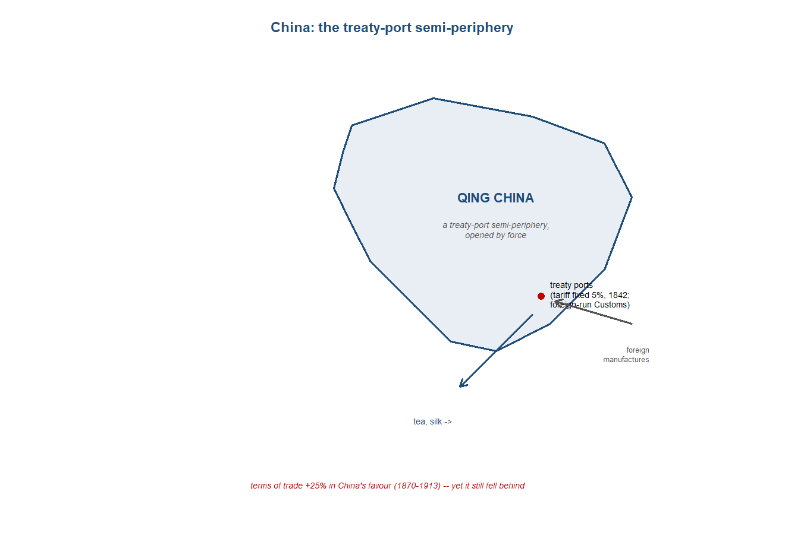{#fig-china08 width=74%}

::: {.callout-tip collapse="true"}
## Japan --- the Asian exception

Japan entered this period the way China had entered the last one: forced open by foreign guns. The treaties that followed Commodore Perry's arrival ended more than two centuries of near-autarky, and from 1858 the country switched almost overnight from a closed economy to free trade. The shock was the same one the chapter measures everywhere else --- integration on terms set from outside --- and Japan's exposure to it was as sharp as any in Asia. What makes Japan worth a profile is not that it received the shock but what it did with it. Among the major Asian economies it was the single exception to the rule the rest of this chapter teaches, and the exception is more instructive than any of the confirming cases.^[**Sources:** O'Rourke & Williamson (Loc 620) on Japan's 1858 switch from virtual autarky to free trade. **Read more:** Huber (1971), "Effect on Prices of Japan's Entry into World Commerce after 1858."]

The price evidence is the clean part of the story, and it is a near-perfect natural experiment. Because Japan moved from autarky to open trade in a single step, the change in its prices measured the gains from integration with unusual clarity, undiluted by the gradual liberalisations that muddied the European cases. The result was large: Japan's terms of trade rose by a factor of about three-and-a-half between 1858 and the early 1870s, as goods the world wanted commanded far more abroad than they had at home and imported manufactures grew cheaper. Hugh Huber's canonical estimate of that gain became the textbook illustration of what opening to trade does to a closed economy's prices, and it sits at the centre of the module's convergence apparatus precisely because the experiment was so clean.^[**Sources:** O'Rourke & Williamson (Loc 622) on Japan's terms of trade rising by a factor of 3.5, 1858 to the early 1870s, after Huber (1971). **Read more:** Huber (1971), "Effect on Prices of Japan's Entry into World Commerce after 1858."]

Here the exception opens. Everywhere else in Asia the same shock --- forced opening, integration into a European-run system --- pushed the economy toward deindustrialisation and a commodity-exporting periphery. India lost its weaving; China became a treaty-port supplier of primary goods. Japan, alone among the major Asian economies, used the opening to industrialise instead. The Meiji Restoration of 1868 put a modernising state at the centre of the response, and that state led the industrial drive directly: building railways and shipyards, founding model factories, importing foreign engineers and machinery, and underwriting an industrial base that grew out of the very exposure to world markets that hollowed out its neighbours. By 1914 Japan was the one economy of the periphery that had converged upward and forced its way into the core's club, an industrial and naval power rather than a reservoir of raw materials and labour.^[**Sources:** the chapter's account of Japan as the lone Asian economy that industrialised on opening, set against the Indian and Chinese deindustrialisation of Topics 7--8. **Read more:** Williamson (2011), *Trade and Poverty: When the Third World Fell Behind*.]

Reading the case this way disciplines the chapter's central claim. The temptation is to treat integration itself as the cause of the periphery's fate --- to say that being drawn into the European-centred order was what condemned India and China to divergence. Japan refutes the simple version. Same shock, opposite outcome: the forced opening that deindustrialised the rest of Asia became, in Japan, the spur to industrialisation. Integration alone, then, did not determine whether an economy rose or fell. Something else --- the kind of state that met the shock, the institutions it could mobilise, the policy room it kept --- decided which way the economy turned. Japan does not weaken the case that integration drove divergence; it sharpens the question of why, posed against the one Asian economy that took the same medicine and grew strong on it, India and China did not.^[**Sources:** the chapter's "integration drove divergence" frame (after Pascali), tested against the Japanese exception. **Read more:** Pascali (2017), "The Wind of Change: Maritime Technology, Trade, and Economic Development."]

**Trade profile**

- **Main exports** --- in the opening decades, the goods a newly-trading economy could sell into a hungry world market: raw silk and tea above all, the primary articles whose prices the opening lifted; later, increasingly, the manufactures of a state-led industrial base.
- **Main imports** --- manufactured goods that grew cheaper on opening, and, decisively, the capital goods of industrialisation: foreign machinery, railway and shipyard equipment, and the engineering skill bought in to run them.
- **Export markets** --- the integrated world economy Japan joined after 1858, and increasingly, by 1914, the Asian markets a rising industrial power supplied in its own right.
- **Import sources** --- the industrial core, Britain above all, for the machinery, technology and expertise on which the Meiji industrial drive was built.^[**Sources:** O'Rourke & Williamson (Loc 620, 622) on the 1858 opening and the terms-of-trade gain; the chapter's account of Meiji state-led industrialisation. **Read more:** Williamson (2011), *Trade and Poverty: When the Third World Fell Behind*.]
:::

::: {.callout-tip collapse="true"}
## The indentured-labour diasporas --- the Indian Ocean's plantation periphery

The first global economy moved people as well as goods, and the Indian Ocean's labour story was distinct from the Atlantic's. Across the nineteenth century the New World drew some sixty million free European migrants, who crossed in search of higher wages and land and converged upward with the economies they joined. The Indian Ocean's version of mass migration ran on a different legal footing. After the abolition of slavery in the British Empire in 1833 the plantation colonies still needed coerced or semi-coerced labour, and the system that replaced the enslaved was indenture: contracts of several years, recruited in India and shipped overseas to work the estates, the "coolie" labour that became the region's signature human flow. The same global integration produced two radically different labour regimes --- free in the Atlantic, indentured across the Indian Ocean --- and the contrast is the point.^[**Sources:** Findlay & O'Rourke (2007) and Hatton & Williamson (1998) on the ~60 million free European migrants to the New World; the chapter's account of indenture replacing slavery after the 1833 abolition. **Read more:** Northrup (1995), *Indentured Labor in the Age of Imperialism*.]

The scale was large and the spread wide. Somewhere between one-and-a-half and two million Indians went overseas under indenture between 1834 and 1920, to around nineteen colonies scattered across the tropical empire. The distribution mapped the plantation economy the labour built. More than four hundred thousand each went to Mauritius and to Malaya; about two hundred and forty thousand to British Guiana; roughly one hundred and fifty thousand to Natal; some one hundred and forty-five thousand to Trinidad; and over sixty thousand to Fiji. The flow remade the societies it reached: by 1870 Indians were about sixty per cent of Mauritius's population, and by 1920 over a million persons of Indian origin were living abroad. This was demographic transformation on a scale that made the indentured diaspora a permanent feature of the Indian Ocean world rather than a passing labour supply.^[**Sources:** the brief on ~1.5--2 million Indians under indenture, 1834--1920, to ~19 colonies, with the regional distribution (>400,000 each to Mauritius and Malaya, ~240,000 British Guiana, ~150,000 Natal, ~145,000 Trinidad, 60,000+ Fiji); Roy (p.177) on Indians at ~60 per cent of Mauritius by 1870 and over one million persons of Indian origin abroad by 1920. **Read more:** Tinker (1974), *A New System of Slavery*.]

The Indian flow was not the only one. A parallel Chinese migration, recruited and shipped largely through Singapore, carried labourers across Southeast Asia and beyond on a comparable footing, and its cumulative scale was larger still: by 1922 some eight-and-a-quarter million Chinese were living abroad, most of them elsewhere in Asia. Together the two diasporas supplied the muscle of the region's plantation-and-commodity economy. The estates they worked grew the commodities that the colonial division of labour assigned to the Indian Ocean periphery --- sugar in Mauritius, Natal and the Caribbean; rubber and tin in Malaya; tea in Ceylon and Assam --- the primary goods whose prices the convergence of this period reached, and whose collapse in the 1930s the next chapter records.^[**Sources:** Findlay & O'Rourke (2007, p.408) on 8.2 million Chinese living abroad by 1922, recruited largely via Singapore; the brief on the plantation commodities (sugar, rubber, tea) the labour built. **Read more:** Northrup (1995), *Indentured Labor in the Age of Imperialism*.]

How to read this labour regime is one of the chapter's live debates, and it turns on a single question: how far was indenture a continuation of slavery, and how far a labour market. Hugh Tinker gave the system its enduring name, "a new system of slavery," and read it as such: recruited under deception, bound by penal contract, carried in high-mortality passages and worked under coercion that the abolition of formal slavery had renamed rather than removed. The continuity with the plantation order that preceded it is, on this reading, the essential fact. David Northrup offered a more agency-attentive account: indenture was a constrained but genuine labour market, in which workers --- imperfectly informed and unequally placed, but choosing --- responded to the large factor-price gaps between a labour-abundant India and labour-scarce plantation colonies. The wage differentials were real, some migrants re-indentured or stayed on, and the flow tracked economic opportunity as a pure system of coercion would not.^[**Sources:** Tinker (1974) on indenture as "a new system of slavery" --- coercion, mortality, continuity with slavery; Northrup (1995) on indenture as a constrained but real labour market responding to factor-price gaps. **Read more:** Tinker (1974), *A New System of Slavery*; Northrup (1995), *Indentured Labor in the Age of Imperialism*.]

The disagreement is not resolved here, and it should not be. Both readings capture something the other misses: the coercion, deception and mortality Tinker documented were real, and so were the wage gaps and the element of choice that Northrup recovered. What the debate fixes is the place of indenture in the chapter's larger argument. The same global integration that sent sixty million Europeans freely to the New World sent one-and-a-half to two million Indians under bond to the plantation tropics, and the difference between the two flows was not the integration but the terms. Free migration helped converge the Atlantic economy upward; indentured migration built and staffed a commodity-exporting periphery that integrated downward. The first global economy moved labour on a single world market and on two utterly different legal regimes, and the gap between them is the Indian Ocean's particular contribution to the chapter's verdict.^[**Sources:** the chapter's free-versus-coerced migration contrast (~60 million free Europeans against ~1.5--2 million indentured Indians), read through the Tinker--Northrup debate. **Read more:** Northrup (1995), *Indentured Labor in the Age of Imperialism*.]

**Trade profile**

- **Main exports** --- in effect, labour itself: the indentured workers shipped out of India, and the Chinese labourers moved through Singapore, who became the workforce of the Indian Ocean's plantation economy.
- **Plantation commodities produced** --- sugar (Mauritius, Natal, the Caribbean), rubber and tin (Malaya), tea (Ceylon, Assam): the primary goods the colonial division of labour assigned to the periphery the labour built.
- **Destinations** --- some nineteen colonies across the tropical empire, with Mauritius and Malaya the largest (over 400,000 each), then British Guiana, Natal, Trinidad and Fiji; the Chinese flow ran chiefly to Southeast Asia.
- **Source regions** --- labour-abundant India above all, drawn out by the factor-price gap with the labour-scarce plantation colonies; southern China, recruited largely through Singapore.^[**Sources:** the brief on the indenture distribution and the plantation commodities; Roy (p.177) on the Indian-origin population abroad; Findlay & O'Rourke (2007, p.408) on the Chinese diaspora. **Read more:** Northrup (1995), *Indentured Labor in the Age of Imperialism*.]
:::

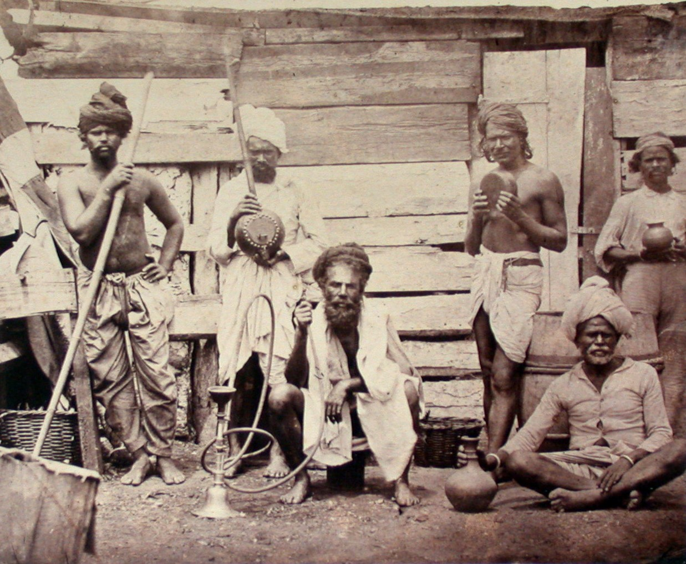{#fig-indenture08 width=70%}

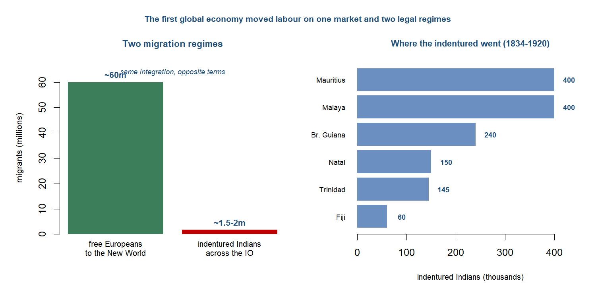{#fig-migrations08 width=80%}

::: {.callout-tip collapse="true"}
## Britain --- the workshop become hub and banker

Britain entered this chapter as the workshop of the world; it left as something more powerful and more dependent --- the hub and the banker of a global imperial economy. The productive lead that the last chapter opened did not disappear, but it ceased to be the source of Britain's pre-eminence. By 1913 newer industrial powers were catching and passing Britain in steel, chemicals and machine-building, and the centre of British advantage shifted from the factory to the counting-house and the quayside. What Britain still ran, better than anyone, was the world's shipping, its payments and its capital. The economy that had made the most goods now moved the most goods and settled the most accounts, and that was a different kind of power --- one that rested less on what Britain produced than on the traffic and the credit it intermediated for everyone else.^[**Sources:** Findlay & O'Rourke (p.324) on world manufacturing shares by 1913. **Read more:** Findlay & O'Rourke (2007), *Power and Plenty*, ch. 7.]

The commercial dominance was most visible at sea. The world merchant fleet grew from roughly nine million tons in 1850 to about 34.5 million by 1910, and Britain carried the largest share of it by far: on the standard reckoning some 63 per cent of world shipping tonnage moved under the British flag by 1890. The opening of the Suez Canal in 1869 reorganised the geography around that fleet. It cut the sea route from Britain to Bombay from about 10,667 to 6,224 miles, roughly two-fifths shorter, and it favoured the steamship over sail, since steamers could work the windless canal and the Red Sea that sailing ships could not. The effect was to make the Indian Ocean, in the standard phrase, a British lake --- a highway whose principal traffic, freight and coaling stations were British, and along which the falling ocean-freight index (down on the order of 70 per cent between 1840 and 1910 on Harley's series) carried Asian commodities west and British capital and manufactures east.^[**Sources:** Findlay & O'Rourke (p.380) on the Suez distance saving and the British lake; Findlay & O'Rourke (p.381) on the ocean-freight index; Pearson (2003) on 63 per cent of world tonnage by 1890 and the fleet's growth to ~34.5m tons. **Read more:** Pearson (2003), *The Indian Ocean*.]

The deeper power was financial. By 1913 British overseas investment had reached something like £3.8 billion, a stock of foreign claims no other economy approached, and the City of London sat at the centre of the world's payments. Sterling did the work that gold could not do alone: it made up roughly 40 per cent of the world's exchange reserves on the eve of war, and London's bill market and the classical gold standard together ran the settlement system through which the trading world cleared its accounts. This was the move from industrial to financial pre-eminence in its sharpest form. The country that had once led on the value of what it made now led on the value of what it held and what it cleared --- the workshop had become the banker, and the income that flowed from foreign investment, shipping and financial services increasingly covered what Britain could no longer earn by exporting goods.^[**Sources:** Eichengreen (Loc 184) on sterling at ~40 per cent of world exchange reserves before 1914; the brief on British overseas investment of ~£3.8bn by 1913. **Read more:** Eichengreen (2008), *Globalizing Capital*.]

That banker's position carried a dependence that the chapter insists on, because it is the twist the Indian-Ocean vantage reveals. Britain ran persistent balance-of-payments deficits with the industrialising economies of continental Europe and North America --- it bought more from them than it sold to them as they caught up in manufactures. What allowed the system to clear was the colonial periphery, and India above all. India ran a large export surplus with the rest of the world, in raw cotton, jute, wheat, tea and indigo, while running a deficit with Britain for manufactures and for the invisible charges of empire. That Indian surplus was recycled to London through the Council Bill system, and on the standard estimate it settled over 40 per cent of Britain's balance-of-payments deficits between 1870 and 1915. The keystone of the multilateral settlement that held the gold standard together was the surplus of a subject economy. Britain set the terms of the world economy from the core, but the core's solvency rested on the periphery it governed.^[**Sources:** the brief on India's export surplus financing over 40 per cent of Britain's balance-of-payments deficits, 1870--1915, recycled through the Council Bill system, and the Home Charges of ~£35m a year. **Read more:** Findlay & O'Rourke (2007), *Power and Plenty*, ch. 7.]

The asymmetry ran through trade policy as well. At home Britain practised free trade, and after the Cobden--Chevalier treaty of 1860 it led a wave of most-favoured-nation commercial treaties that opened a liberal interlude across western Europe. Abroad, in Asia, integration was less freely chosen than imposed. China's tariffs had been fixed at five per cent by the Treaty of Nanking in 1842 and its customs service was foreign-run --- by 1894 British firms paid more than 80 per cent of the customs revenue --- while the wider frame was territorial conquest, with European powers controlling about 67 per cent of the Earth's land surface in 1878 and some 84 per cent by 1914. Free trade for Britain and the white settler economies, enforced trade for the colonial periphery: the same liberal order wore two faces, and which one a region saw depended on whether it set the terms or had them set.^[**Sources:** the brief on the Cobden--Chevalier treaty of 1860 and the liberal interlude; Findlay & O'Rourke (p.388) on the Nanking five-per-cent tariff, British firms paying over 80 per cent of China's customs by 1894, and European territorial control rising from ~67 per cent (1878) to ~84 per cent (1914). **Read more:** Findlay & O'Rourke (2007), *Power and Plenty*, ch. 7.]

**Trade profile**

- **Main exports** --- manufactures, increasingly the older staples (cottons, woollens, iron and coal) as newer rivals overtook Britain in steel and chemicals; and, above all, services and capital --- shipping, insurance, banking and the flow of foreign investment that became the leading earner.
- **Main imports** --- food and raw materials drawn cheap from the integrating world: New World and Russian wheat, meat, raw cotton, Indian jute and tea, the cheap food and fibre that free trade let in.
- **Export markets** --- the empire and the wider world: India above all as a captive market for manufactures, the settler economies, and continental Europe under the post-1860 treaty network.
- **Import sources** --- the settler New World (grain, meat, wool), the colonial Indian Ocean (raw cotton, jute, tea), and industrialising Europe and America, with which Britain ran the deficits the Indian surplus settled.^[**Sources:** the brief on the colonial division of labour, the Indian surplus and the Council Bill settlement; Eichengreen (Loc 184) on sterling's reserve role. **Read more:** Findlay & O'Rourke (2007), *Power and Plenty*, ch. 7.]
:::

::: {.callout-tip collapse="true"}
## The settler New World --- the periphery that converged upward

The Indian Ocean was not the only periphery of the first global economy. A second one lay in the temperate New World --- the United States, Argentina, Australia and Canada --- and it was integrated into the same Britain-centred system by the same forces of steam, capital and migration. Yet its fate ran the opposite way. These were land-abundant, labour-scarce economies, and what they drew from Europe were precisely the factors they lacked. Some sixty million Europeans crossed to the New World across the long nineteenth century, the free mass migration that Hatton and Williamson measured, and European capital followed them in volume. With land cheap and labour and capital arriving, the settler economies specialised in what their endowment favoured: they became the granaries and the pastures of the Atlantic world, exporting food and fibre back to the industrial core that fed and clothed its cities on their produce.^[**Sources:** the brief (after Hatton & Williamson) on ~60 million Europeans crossing to the New World. **Read more:** Hatton & Williamson (1998), *The Age of Mass Migration*.]

The commodity that defined the relationship was cheap New World wheat. As Atlantic transport costs fell --- by about 45 points between 1870 and 1913, a larger fall than the manufactures tariff cuts of the mid-twentieth century --- American and later Argentine and Australian grain poured into Europe in what contemporaries called the grain invasion. Refrigerated shipping, arriving in the 1880s, added meat to the flood. The effect on prices was exactly what integration predicted: the Liverpool--Chicago wheat gap, over 57 per cent in 1870, had narrowed sharply by the 1890s, as the law of one price reached across the ocean. For the settler exporters this was the making of prosperity. For European landowners it was the beginning of a long agricultural depression, and the source of the protectionist backlash that closed the liberal interlude from the late 1870s.^[**Sources:** O'Rourke & Williamson (Loc 479) on Atlantic transport costs falling ~45 points, 1870--1913; O'Rourke & Williamson (Loc 578) on the Liverpool--Chicago wheat gap narrowing from 57 per cent in 1870. **Read more:** O'Rourke & Williamson (1999), *Globalization and History*.]

The deepest evidence that this periphery converged upward lies in factor prices, and it is where the chapter's measurement apparatus pays off. Integration moved not only goods but the relative rewards of land and labour, and the wage--rental ratio --- the price of labour against the price of land --- tracks it precisely. In the land-abundant New World, where labour was scarce, mass immigration and the opening of new land drove that ratio down: in Australia it stood by 1910 at about a quarter of its 1870 level, as wages fell relative to soaring land values. In land-scarce, labour-abundant Europe the ratio moved the other way: in Ireland, drained by emigration, it rose roughly five and a half times; in Britain about two and seven-tenths times; while in Spain, more insulated from the flows, it stayed roughly unchanged. The same global integration produced converging factor prices across the Atlantic economy and, with them, a convergence of living standards --- the poorer European economies that sent migrants closing on the richer ones, the settler economies pulling up toward core incomes.^[**Sources:** O'Rourke & Williamson (Loc 688) on wage--rental ratios by 1910 --- Australia about a quarter of 1870, Ireland up roughly five and a half times, Britain up about two and seven-tenths times, Spain unchanged. **Read more:** O'Rourke & Williamson (1999), *Globalization and History*.]

This is why the settler New World belongs in the chapter as a deliberate contrast to the colonial Indian Ocean, and not merely as another exporting region. Both were peripheries of the same world economy, integrated by the same ships, capital markets and price signals. But the settler periphery received Europe's surplus people and surplus capital, specialised on its own account, and converged upward toward core living standards; the colonial periphery, deindustrialised and governed, supplied commodities and indentured labour on terms it did not set, and integrated downward. Same world economy, opposite fate. That divergence between two peripheries --- one lifted by integration, one held down by it --- is the engine of the chapter's central verdict: that the first global economy drove divergence, not a convergence of fortunes.^[**Sources:** the two-peripheries framing and integration driving divergence (after Pascali); O'Rourke & Williamson (Loc 688) on the factor-price convergence within the Atlantic economy. **Read more:** O'Rourke & Williamson (1999), *Globalization and History*; Williamson (2011), *Trade and Poverty*.]

**Trade profile**

- **Main exports** --- food and fibre from land-abundant economies: wheat and meat (United States, Argentina, Canada), wool and wheat (Australia), the cheap grain of the grain invasion and, after the 1880s, refrigerated meat.
- **Main imports** --- manufactures from the industrial core, above all British, together with the European capital that built the railways, ports and elevators the export economy ran on.
- **Export markets** --- Britain and industrialising Europe, the food-and-fibre-importing core that the settler periphery fed and clothed.
- **Import sources** --- Britain and western Europe for manufactures and capital; and the same Europe for the roughly sixty million migrants whose arrival drove the factor-price convergence.^[**Sources:** the brief on the colonial division of labour and the ~60 million European migrants; O'Rourke & Williamson (Loc 479, 578) on transport costs and the wheat-price gap. **Read more:** Hatton & Williamson (1998), *The Age of Mass Migration*.]
:::

{#fig-wagerental08 width=70%}

::: {.callout-note}
## Research in focus --- O'Rourke & Williamson (1999): Globalization and History
*Aim.* To establish what would count as evidence that a true world economy had formed in the nineteenth century, and to test for it. *Question.* Was the late-nineteenth-century expansion of trade and migration a genuine integration of markets, and what did it do to wages, land rents and the politics of openness? *Data and method.* Reconstruction of commodity-price gaps across the Atlantic and of factor prices, with the convergence of wage-rental ratios across countries read as the signature of integration, set against migration and capital flows. *Findings.* Falling transport costs drove commodity prices together and, through factor-price convergence, moved wage-rental ratios in opposite directions in labour-scarce and labour-abundant economies (Australia falling to a quarter of its 1870 ratio, Ireland rising 5.6-fold, Britain 2.7-fold, Spain flat); the resulting distributional pressure on landed interests, not a free-floating ideology, lay behind the late-century tariff backlash. *Caveats.* The apparatus was built on and works best for the Atlantic economy; it travels imperfectly to the colonial periphery, where integration arrived on imperial terms and the factor-price logic is harder to read.
:::

::: {.callout-note}
## How we know
This is the chapter where the sources turn abundant --- and where the reason they are abundant becomes the lesson. For the first time in this book, rich quantitative series on Asia and Africa appear in quantity: the Imperial Maritime Customs returns that recorded China's foreign trade, India's balance-of-payments and trade statistics, the registers of indentured emigration, the famine commissions. The numbers in this chapter --- price gaps to the percentage point, tonnages through Suez, the balance of payments --- are an order of magnitude better than anything available for the periods before.

But the bias thread this book has followed does not vanish at its richest point; it turns. These series exist largely because of empire: the records were produced because colonial and semi-colonial administrations counted, taxed and shipped the things they recorded. The Imperial Maritime Customs was foreign-run; the Indian trade statistics served an imperial fisc; the indenture registers tracked a coerced labour system; the famine reports were written by the administration whose policies were among the causes. The data improved precisely as the apparatus of domination thickened, and that is the lesson rather than a footnote to it. Read the welcome abundance of numbers, then, knowing whose administration produced them and to what end.

*Sources: Pearson (2003) and Alpers (2014) on the Imperial Maritime Customs, Indian trade and balance-of-payments statistics, and the indenture and famine registers as colonial records; the brief's account of the data-bias "flip." Read more: Pearson (2003), *The Indian Ocean*; Davis (2001), *Late Victorian Holocausts*.*
:::

## The period on its own terms

The years from 1850 to 1914 ran as a single arc of compression: the oceans narrowed, the price gaps closed, and the continents were knitted into one market --- until, at the very peak, the system stood integrated and European-centred on the eve of the war that would tear it apart. Five phases carry the story from the steamship and the liberal interlude, through Suez and the price-convergence "big bang," to the capital exports, the drain and the famines of the apogee.

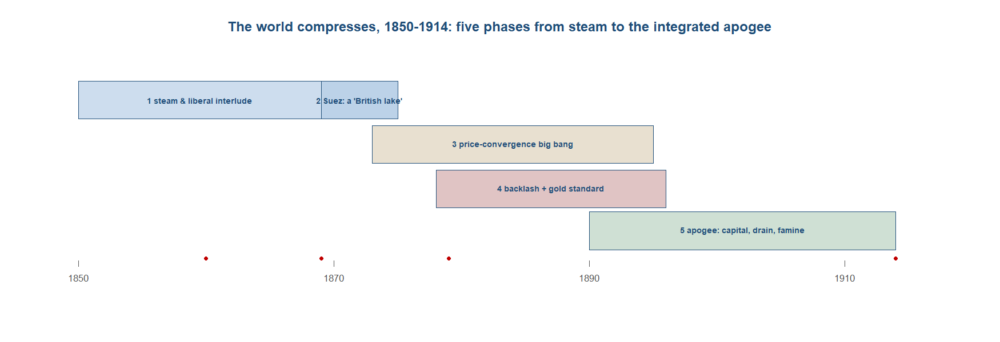{#fig-timeline08 width=92%}

**Phase 1 --- steam and the liberal interlude (1850s--1860s).** The first global economy did not announce itself. It began with cheaper passages and lower freights, as iron hulls and screw propellers began to compress the oceans that the previous chapter had merely connected. The headline measure of the change was the merchant fleet itself: the world's stock of shipping grew from roughly nine million tons around 1850 to about thirty-four and a half million by 1910, a near-quadrupling of the carrying capacity that bound distant markets together. Steam did not displace sail at a stroke --- on the long oceanic hauls sail held its own for decades --- but on the routes where coaling stations could be strung together, the steamer began to set the pace, and the cost of moving a ton of grain or cotton or rice across water started its long descent. This was the physical groundwork on which everything else in the chapter rested: before prices could converge, the sea had to be made cheap to cross.^[**Sources:** Findlay & O'Rourke (p.380) on the world merchant fleet growing from about nine million to about thirty-four and a half million tons, 1850--1910. **Read more:** Findlay & O'Rourke (2007), *Power and Plenty*, ch. 7.]

The policy weather turned liberal at the same moment. In 1860 Britain and France signed the Cobden--Chevalier treaty, and its most consequential clause was not any particular tariff cut but the most-favoured-nation principle it carried: a concession granted to one signatory extended automatically to others, so that a single bilateral bargain pulled a wave of commercial treaties across western Europe behind it. For roughly two decades the Continent moved toward open trade, in what later historians would call a liberal interlude --- a window, not a settled order, since the protectionist reversal of the late 1870s would close it again. But while it lasted, the institutional and the technological pushed the same way: falling freights made distant goods cheaper to carry, and falling tariffs made them cheaper to admit, and the combination began to knit the western economies into something that behaved like a single market.^[**Sources:** O'Rourke & Williamson (Loc 1054) on the Cobden--Chevalier treaty of 1860 initiating a wave of most-favoured-nation commercial treaties (the liberal interlude). **Read more:** O'Rourke & Williamson (1999), *Globalization and History*.]

The most dramatic single case of opening lay outside Europe altogether. Japan had held itself in near-total commercial isolation for more than two centuries; in 1858, under foreign pressure, it switched abruptly from that autarky to free trade. The effect on its prices was violent and measurable. Japanese goods that had been cut off from world markets now met world prices, and the country's terms of trade --- the ratio of what its exports fetched to what its imports cost --- rose by a factor of about three and a half between 1858 and the early 1870s, on Huber's estimate. Silk and tea commanded far more abroad than they had at home, while imported manufactures arrived far cheaper than domestic substitutes. Japan was, in effect, a natural experiment in what integration did to a previously closed economy: the price of isolation, suddenly revealed, was large. The opening of Japan and the opening of the European tariff schedules belonged to the same liberal, steam-compressed moment, and that moment set the stage for the choke point that would reorganise the whole eastern ocean.^[**Sources:** O'Rourke & Williamson (Loc 620, 622) on Japan switching from virtual autarky to free trade in 1858 and its terms of trade rising by a factor of about three and a half, 1858--early 1870s (after Huber 1971). **Read more:** Huber (1971), "Effect on Prices of Japan's Entry into World Commerce after 1858," *Journal of Political Economy*.]

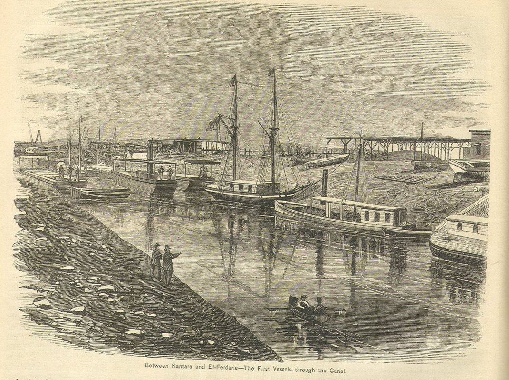{#fig-steam08 width=70%}

**Phase 2 --- Suez: the Indian Ocean becomes a 'British lake' (1869).** If steam and free trade opened the period, a single piece of engineering reorganised its geography. The Suez Canal opened in 1869, and at a stroke it cut the sea route from Britain to Bombay from roughly ten thousand six hundred and sixty-seven miles round the Cape of Good Hope to about six thousand two hundred and twenty-four through the Mediterranean and the Red Sea --- a saving of some forty per cent. The Indian Ocean, which the chapter has treated throughout as the connective tissue of the Asian economy, now became the principal highway between the imperial core and its largest possession. Distance, the oldest tax on long-distance trade, had been slashed not by a gradual improvement but by the cutting of a ditch through a hundred miles of desert, and the whole map of the eastern trade was redrawn around it.^[**Sources:** Findlay & O'Rourke (p.380) on the Suez Canal of 1869 cutting the Britain--Bombay route from about 10,667 to about 6,224 miles (roughly forty per cent) and halving the Europe--China sailing time. **Read more:** Findlay & O'Rourke (2007), *Power and Plenty*, ch. 7.]

The canal did more than shorten the route; it changed which kind of ship could use it. Sailing vessels could not easily work the windless, current-bound passage of the canal and the Red Sea, where a steamer under power could push straight through, so Suez tilted the competitive balance decisively toward steam on exactly the routes that mattered most for the Asian trade. The effect on traffic was rapid. The canal carried something over four hundred thousand tons in 1870, its first full year; by 1889 the United Kingdom alone accounted for more than five million of the roughly six and four-fifths million tons passing through. Suez was a British-run choke point in fact if not always in name, and the traffic statistics make the point with brutal clarity: the new highway of the eastern ocean ran overwhelmingly under one flag.^[**Sources:** Findlay & O'Rourke (p.380) on Suez favouring steam over sail on the canal and Red Sea; the brief (Great Sea) on Suez traffic above 400,000 tons in 1870 rising to the United Kingdom taking more than five million of about 6.8 million tons by 1889. **Read more:** Pearson (2003), *The Indian Ocean*.]

The concentration of canal traffic was a particular instance of a general dominance. By 1890 Britain carried something on the order of sixty-three per cent of the world's shipping tonnage --- not a majority share of one trade or one route, but of the planet's seaborne carrying capacity as a whole. The phrase that historians have used for the result, the Indian Ocean as a "British lake," captures the asymmetry the vantage of this book has stressed throughout: the ocean that for two thousand years had been an Asian-run relay of cottons, spices and silver was now organised around the shipping, the coaling stations and the canal dues of a single European power. Integration was real, and it was accelerating; but it ran along sea-lanes that Britain had cut, owned and worked, and that fact --- the terms on which the ocean was integrated --- is the thread the rest of the chapter follows.^[**Sources:** Findlay & O'Rourke (p.380--381) on Britain carrying about sixty-three per cent of world shipping tonnage by 1890 and the Indian Ocean as a British-dominated highway. **Read more:** Pearson (2003), *The Indian Ocean*.]

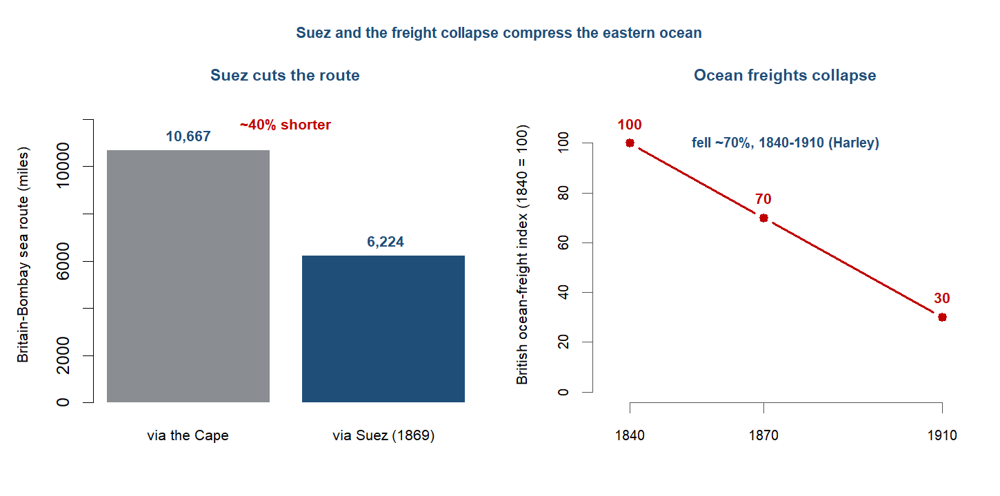{#fig-suez08 width=76%}

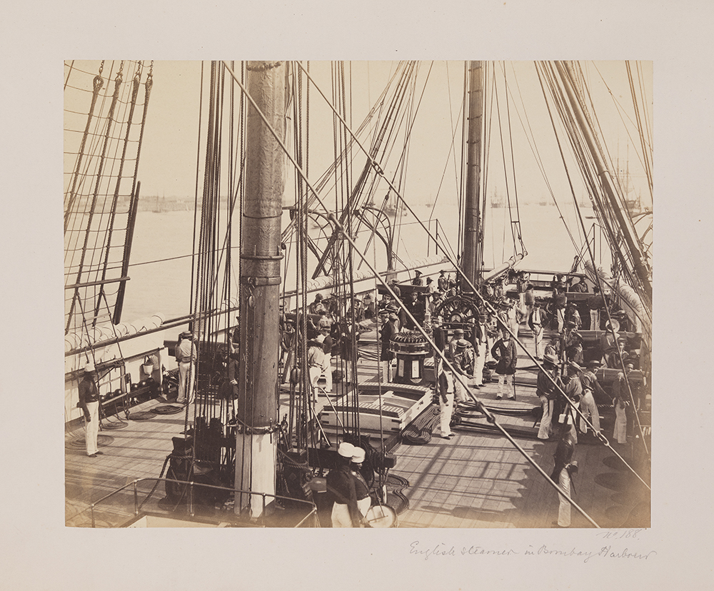{#fig-bombay08 width=70%}

**Phase 3 --- the price-convergence big bang, and the telegraph (1870s).** The cheaper, shorter, steam-worked ocean of the 1860s produced, in the 1870s, the signature of true globalisation --- not merely more trade, but the closing of the gaps between prices in distant markets. The numbers are the heart of the matter. Between 1873 and 1913 the spread between Liverpool and Bombay cotton fell from about fifty-seven per cent to roughly twenty; the gap between London and Calcutta jute narrowed from around thirty-five per cent to about four; and the spread between London and Rangoon rice collapsed from some ninety-three per cent to about twenty-six. These were not flows but differentials, and their narrowing is what distinguished this period from the trade described in earlier chapters. The connected commerce of Topic 6 had moved goods across oceans for centuries without ever forcing the price of cotton in Lancashire and the price of cotton in Bombay toward each other; now, for the first time, integration could be read off the price series themselves. Globalisation had become measurable in prices, not just in cargoes.^[**Sources:** O'Rourke & Williamson (Loc 610) on the Liverpool--Bombay cotton spread falling from 57 to 20 per cent, London--Calcutta jute from 35 to 4 per cent, and London--Rangoon rice from 93 to 26 per cent, 1873--1913. **Read more:** O'Rourke & Williamson (1999), *Globalization and History*.]

Information costs collapsed alongside transport costs. The submarine telegraph, threaded along the same imperial routes as the steamers, linked Britain to India within a single day by the 1870s --- a message that had once travelled at the speed of a ship now travelled at the speed of electricity. The effect on markets was direct: a Liverpool merchant and a Bombay broker could now know the same price on the same day, so arbitrage that had once depended on weeks-old news could act on current information, and the price gaps closed faster than freight savings alone would explain. The same decade saw American wheat pour into Europe in the volumes that contemporaries called the grain invasion, as the railroads and steamers delivered prairie grain to European ports cheaply enough to undercut Continental farmers on their own ground. The scale of the underlying cost fall was extraordinary: Atlantic transport costs dropped by about forty-five points between 1870 and 1913, a larger reduction than the celebrated manufactures-tariff cuts of the mid-twentieth century.^[**Sources:** O'Rourke & Williamson (Loc 479) on Atlantic transport costs falling about forty-five points, 1870--1913, exceeding the developed-country manufactures-tariff cuts of the late 1940s to late 1970s; and on the American grain invasion of Europe. **Read more:** Findlay & O'Rourke (2007), *Power and Plenty*, ch. 7.]

A caution belongs against the temptation to credit steam and Suez with the whole story. Chilosi and Federico have shown that for Asia much of the Europe--Asia price convergence pre-dated 1870, driven less by the steamship than by the earlier abolition of the European trading monopolies that had held prices apart --- the development this book traced in Topic 6. On their reading the post-1870 burst of steam, Suez and telegraph continued a convergence already well advanced rather than initiating it. The "big bang" of the 1870s is therefore part of the story of Asian integration, not the whole of it: the transport revolution sharpened and extended a price convergence whose roots ran back to the dismantling of company monopoly. The qualification matters because it disciplines the chapter's central claim --- integration was real and measurable, but its timing and its causes were neither simple nor uniform across the connected world.^[**Sources:** Chilosi & Federico (2015) on most Europe--Asia price convergence pre-dating 1870 (monopoly abolition), with freights and the telegraph continuing it thereafter. **Read more:** Chilosi & Federico (2015), "Early globalizations: The integration of Asia in the world economy, 1800--1938," *Explorations in Economic History*.]

::: {.callout-note}
## Research in focus --- Chilosi & Federico (2015): early globalizations
*Aim.* To date and measure the integration of Asia into the world economy, rather than assume it followed the post-1870 Atlantic timetable. *Question.* When did Europe-Asia markets actually converge, and what closed the price gaps? *Data and method.* Assembly of long-run commodity-price series between European and Asian markets, 1800-1938, and estimation of when and how fast the gaps narrowed, attributing movement to monopoly abolition, freight costs and the telegraph. *Findings.* Most of the Europe-Asia convergence pre-dated 1870 and was driven by the abolition of European trading monopolies, with falling freights and the telegraph continuing rather than initiating it; the "post-1870 steam-and-Suez big bang" overstates the role of the later transport revolution for the Asian trades. *Caveats.* The Asian price series are sparse and uneven in coverage, so the precise dating carries wide error bands; the finding complicates, without overturning, the chapter's account of a post-1870 acceleration.
:::

**Phase 4 --- the backlash, and the gold standard spreads (late 1870s--1890s).** The liberal interlude did not last. The wave of most-favoured-nation treaties that the 1860 Cobden--Chevalier agreement had opened ran into a flood of cheap New World grain, and from the late 1870s Continental Europe turned back toward agricultural protection. American wheat poured across the Atlantic on the falling freights of the previous phase --- the grain invasion --- and the price gaps that had marked integration now worked against Europe's landowners: as imported grain undercut domestic harvests, land rents fell and the wage--rental ratio swung against the men who owned the soil. Germany supplied the emblem. In 1879 Bismarck broke with free trade and raised tariffs on both grain and manufactures in the alliance contemporaries called the "marriage of iron and rye," yoking Prussian landowners to Ruhr industrialists behind a common protective wall; France followed, lifting its wheat duty through the 1880s and again in 1894. The liberal opening had reversed within two decades.^[**Sources:** O'Rourke & Williamson (Loc 1054) on the 1860 Cobden--Chevalier treaty and the late-1870s turning point; O'Rourke & Williamson (Loc 1059, 1193) on Bismarck's 1879 "marriage of iron and rye" and the French wheat duty. **Read more:** O'Rourke & Williamson (1999), *Globalization and History*.]

Why the reversal came is one of the period's live debates, and the same facts carry two opposed mechanisms. Karl Polanyi read the backlash as endogenous: a self-regulating market, left to run, dislocated the societies it integrated, and those societies moved to protect themselves --- a "double movement" in which the spread of the market called forth its own counter-spread of protection, tariffs and social legislation, almost as a reflex. Kevin O'Rourke and Jeffrey Williamson read it instead as distributional politics. Falling wage--rental ratios mobilised the losers from grain convergence --- the landed interest whose rents the invasion was eroding --- and where those losers had the political weight to capture trade policy, protection followed; where they did not, as in free-trade Britain, it did not. Same reversal, opposite engine: society defending itself against the market, or an interest group defending its rents through the market's politics. The chapter teaches the tension rather than resolving it.^[**Sources:** the brief and the story spine on the Polanyi versus O'Rourke--Williamson framing of the backlash; O'Rourke & Williamson (Loc 688) on the falling wage--rental ratios behind the distributional account. **Read more:** Polanyi (1944), *The Great Transformation*; O'Rourke & Williamson (1999), *Globalization and History*.]

The paradox of the phase was that trade turned protectionist exactly as money and capital integrated more deeply. While tariff walls rose, the classical gold standard spread across the core. Germany adopted gold in 1871, funded in part by the Franco-Prussian War indemnity, and one country after another followed it off silver and onto the single metal, until on the eve of the war only a handful --- England, Germany, France and the United States --- ran pure gold standards, with much of the rest of the world tied to the system at one remove. This was the point at which the long silver thread of the earlier chapters paid off into a financial architecture: bullion that had once moved east as a commodity to settle trade now became money and capital, the common standard on which a single international payments system rested. The world that raised barriers against each other's grain was, at the same moment, knitting itself into one monetary order.^[**Sources:** Eichengreen (Loc 146, 499) on Germany adopting gold in 1871; Eichengreen (Loc 184, 168) on only a handful of pure gold-standard countries before 1914. **Read more:** Eichengreen (2008), *Globalizing Capital*.]

**Phase 5 --- apogee: capital, the drain, and famine (1890s--1914).** By the turn of the century the integration of capital markets had gone further than that of goods. British overseas investment reached roughly £3.8 billion by 1913, a stock of foreign lending without precedent, and London sat at the centre of a settlement system in which sterling made up about 40 per cent of the world's exchange reserves, with French francs and German marks accounting for much of the rest. The classical gold standard was at full operation: fixed parities, convertibility, and capital that could move across borders with a freedom the twentieth century would not see again until late in its course. On every measure of finance the weight of the first global economy sat in the North Atlantic, and above all in the City of London.^[**Sources:** the brief on British overseas investment of about £3.8 billion by 1913; Eichengreen (Loc 184, 190) on sterling at roughly 40 per cent of exchange reserves and francs and marks accounting for much of the remainder. **Read more:** Eichengreen (2008), *Globalizing Capital*.]

That settlement system did not balance on the core alone. India, governed and indebted, ran a large export surplus, and the surplus was the keystone of Britain's multilateral accounts. The Home Charges --- the administration, debt service and pensions charged to Indian revenue, running at something like £35 million a year --- were one channel; the larger one was the export surplus itself, recycled through the Council Bill mechanism by which the India Office in London sold drafts on the Indian treasury to merchants financing trade with Asia. By this route India's surplus is estimated to have financed more than 40 per cent of Britain's balance-of-payments deficits between 1870 and 1915. The periphery, in other words, held the multilateral system together: the colony that the order subordinated was the one that kept the order solvent, subordinate and structurally central at once.^[**Sources:** the brief on the Home Charges of about £35 million a year, the Council Bill system, and India financing over 40 per cent of Britain's balance-of-payments deficits, 1870--1915. **Read more:** Findlay & O'Rourke (2007), *Power and Plenty*, ch. 7.]

The sharpest cost of that integration was paid in lives. Three times in this generation a failure of the monsoon, driven by the El Nino oscillation, met a colonial administration committed to free-market relief and a peasantry now exposed to distant grain markets, and the result was catastrophic famine: in 1876--78, again in 1896--97, and again in 1899--1902. Mike Davis estimated the combined mortality of these Late Victorian famines at somewhere between 12 and 29 million dead in India --- a range that is itself contested, with revisionists disputing both the totals and the weight Davis placed on policy against drought. What is not in dispute is the conjunction the famines expose: a commodity-exporting periphery, an ideology of non-interference in markets, and a climatic shock fell together on the people least able to bear them. This was integration's lethal edge, the underside of the price convergence the period otherwise celebrated.^[**Sources:** the story spine and prep note on the 1876--78, 1896--97 and 1899--1902 El Nino famines and the contested 12--29 million mortality range (Davis versus revisionists). **Read more:** Davis (2001), *Late Victorian Holocausts*.]

By 1914 the first global economy stood at its peak. It was genuinely integrated --- in goods, in people, in money and in capital --- and it was unmistakably European-centred, with the weight of finance and manufacturing sitting in the North Atlantic. But its apex rested on a colonial base: on the export surpluses of a subordinated India, on the coerced and indentured labour of the Indian Ocean, and on a periphery that integrated downward even as the Atlantic economy converged upward. It was, on every aggregate measure, the high-water mark of the western-centred order --- and it was about to shatter. The world war, the collapse of the gold standard and the deglobalisation of the interwar decades, which the next chapter takes up, would unwind the price convergence of this period into commodity-market disintegration, and transmit the shock most brutally to the colonial periphery on which the whole edifice had rested.^[**Sources:** the brief and the story spine on the 1914 apogee, the European-centred order resting on a colonial base, and the hand-off to the disintegration of 1914--45. **Read more:** Findlay & O'Rourke (2007), *Power and Plenty*, ch. 7.]

## Reading the period: the four questions

The four questions this book carries can each be put to the period, and this is the one chapter where the first of them is answered not by inference but by measurement. On direction, the world economy was heading toward a single integrated market, and for the first time that integration was visible in prices rather than only in flows. Earlier chapters could trace silver moving east or cloth moving west; this one can show the price of a thing in Bombay and the price of the same thing in Liverpool chained together and converging. That is why the period is the one where the module teaches the Heckscher-Ohlin logic and its corollary, factor-price convergence, as the very definition of this globalisation: when goods markets join up, the prices of the factors that make those goods --- wages and land rents --- are pulled together too. The convergence was real and it was uneven, and the cleanest way to see it is in the wage-rental ratio. By 1910, against an 1870 base, the ratio in land-abundant Australia had fallen to about a quarter of its earlier level as cheap labour and dear land moved toward the world average; in land-scarce Ireland it had risen roughly five and a half times, and in Britain about two and seven-tenths times, as cheap food and emigration raised the return to labour against land; in Spain, largely outside the integrating economy, it scarcely moved at all. Convergence was not a single experience but a set of contrasting national fates, and it reached inside the colonial periphery as well as across the Atlantic: in India internal transport costs fell by something like 80 per cent, and the dispersion of grain prices across districts, once over 40 per cent, collapsed as railways tied the interior to the ports.^[**Sources:** O'Rourke & Williamson (Loc 688) on wage-rental ratios by 1910 (Australia about a quarter of 1870, Ireland up about 5.6 times, Britain about 2.7, Spain unchanged); O'Rourke & Williamson (Loc 566) on Indian internal transport costs falling about 80 per cent and cross-district price dispersion from over 40 per cent. **Read more:** O'Rourke & Williamson (1999), *Globalization and History*.]

On channels, the answer was maritime as it had always been, but maritime now industrialised and imperial. Steam replaced sail, the Suez Canal of 1869 cut the Britain-Bombay sea route by roughly four-tenths and turned the Indian Ocean into a British highway, and the submarine telegraph carried prices and orders between London and India within a day. The cost of moving goods across the ocean fell with a speed nothing in the earlier record matched: Harley's index of British ocean freights fell by about 70 per cent between 1840 and 1910. The overland channel, which had carried so much of the trade of earlier chapters, was now marginal --- a Trans-Siberian afterthought against the great steam-and-Suez artery that ran east through the ocean this book follows.^[**Sources:** Findlay & O'Rourke (p.381) on Harley's British ocean-freight index falling about 70 per cent, 1840-1910; Findlay & O'Rourke (p.380) on Suez cutting the Britain-Bombay route by about four-tenths. **Read more:** Findlay & O'Rourke (2007), *Power and Plenty*, ch. 7.]

On modes --- how exchange was settled --- the distinctive feature of the period was that goods, people and capital integrated at once. Goods integrated through the price convergence already described. People integrated through migration on a scale never seen before, and here the two peripheries part company most sharply. Roughly 60 million Europeans crossed freely to the New World, choosing their destinations and bargaining their wages; against that, something like 1.5 to 2 million Indians moved across the Indian Ocean under indenture between 1834 and 1920 --- bound by contract to plantations in Mauritius, Malaya, Natal, Fiji and the Caribbean, their passage and their labour arranged by the system rather than by themselves. The same world economy moved one stream of people as free migrants converging upward and another as indentured labour distributed to the colonial frontier. And capital integrated as the silver thread of every earlier chapter finally crossed a boundary. The bullion that had flowed east for two thousand years gave way to money and capital proper: the classical gold standard and a deeply integrated financial market that moved investment across the world with extraordinary freedom.^[**Sources:** Hatton & Williamson (1998) on roughly 60 million Europeans migrating to the New World; Tinker (1974) and the brief on about 1.5 to 2 million Indians under indenture, 1834-1920, and the regional distribution. **Read more:** Hatton & Williamson (1998), *The Age of Mass Migration*; Tinker (1974), *A New System of Slavery*.]

On Europe, the answer was that the continent stood at its apex --- and the Indian-Ocean vantage shows what that apex rested on. European centrality was not independent of the periphery; it was built on it. "Free trade," the supposed principle of the age, was for much of Asia enforced trade: the Treaty of Nanking fixed China's tariff at 5 per cent in 1842, and by 1894 more than 80 per cent of China's customs revenue was collected by British firms, integration imposed by gunboat rather than agreed by treaty between equals. The territorial frame made the asymmetry plain --- Europe controlled about 67 per cent of the Earth's land surface in 1878 and around 84 per cent by 1914. But the sharpest point is financial, and it leads directly into the settlement system: at the heart of this integrated world stood a flow of capital from the periphery that held the whole structure together, and it is to that flow --- the gold standard and the drain --- that the chapter turns next.^[**Sources:** Findlay & O'Rourke (p.388) on the Treaty of Nanking fixing China's tariff at 5 per cent (1842), more than 80 per cent of China's customs paid by British firms by 1894, and European control of the Earth's surface rising from about 67 per cent (1878) to 84 per cent (1914). **Read more:** Findlay & O'Rourke (2007), *Power and Plenty*, ch. 7.]

::: {.callout-important}
## Follow the money
The thread this book has followed from the silver mines now crosses a boundary: bullion became money and capital. The metal that flowed east for two thousand years gave way to a financial system --- the classical gold standard and a deeply integrated capital market. British overseas investment reached about £3.8 billion by 1913, and sterling made up roughly 40 per cent of the world's exchange reserves; under the gold standard a handful of pure gold-standard countries anchored a system of fixed exchange rates that moved capital across the world with extraordinary freedom. And this is where the Indian-Ocean vantage delivers its hardest point. The periphery did not merely sit inside this financial system; it held it together. India's export surplus, recycled through the Council Bill mechanism, financed an estimated more than 40 per cent of Britain's balance-of-payments deficits between 1870 and 1915, while the Home Charges --- administration, debt service and pensions, around £35 million a year, all charged to Indian revenue --- ran the other way. The drain was not a side effect of the gold standard; it was one of the struts that kept the multilateral settlement system standing.

*Sources: Eichengreen (2008) on the classical gold standard, British overseas investment (~£3.8bn by 1913) and sterling as ~40 per cent of world reserves; the brief on the Council Bill mechanism, the Home Charges (~£35m/yr) and India financing over 40 per cent of Britain's payments deficits (1870-1915). Read more: Eichengreen (2008), *Globalizing Capital*; Findlay & O'Rourke (2007), *Power and Plenty*.*
:::

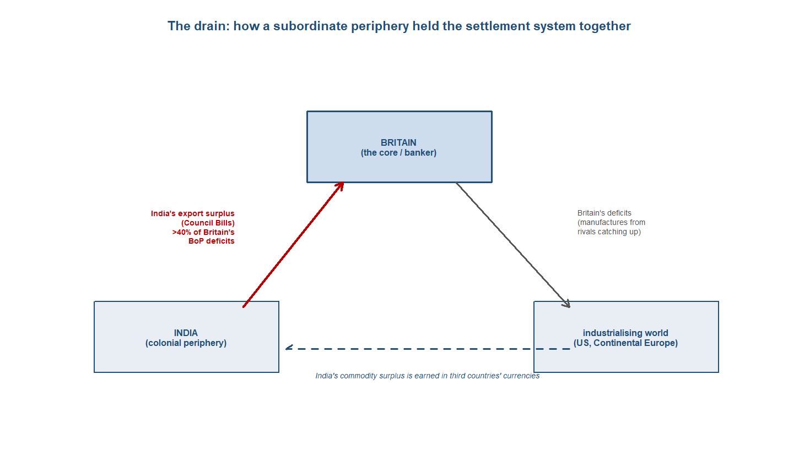{#fig-drain08 width=78%}

## The verdict: where was the centre?

The verdict for this period can be stated with high confidence: the centre of gravity was firmly Western, and 1850 to 1914 marks the peak of the European-dominant era this book has been tracing. On every aggregate measure the weight sat unambiguously in the North Atlantic. By 1913 Europe and its offshoots produced about 89.8 per cent of the world's manufactures, against 1.4 per cent for India and 3.6 per cent for China --- a near-total reversal of the position two centuries earlier, when India and China together had made more than half the world's manufactured goods. Western Europe alone supplied some 60.1 per cent of world exports in 1913. The reversal that the previous chapter dated had now run to completion, and the workshop of the world sat in Lancashire and the Ruhr, not in Bengal or the Yangzi delta.^[**Sources:** Findlay & O'Rourke (p.324) on world manufacturing shares in 1913 (Europe and offshoots about 89.8 per cent; India 1.4; China 3.6); Temin & Toniolo (Loc 304) on Western Europe at about 60.1 per cent of world exports in 1913. **Read more:** Findlay & O'Rourke (2007), *Power and Plenty*, ch. 7.]

But the Indian-Ocean vantage adds the twist on which this chapter turns, and it is a twist about structure, not about the headline. That Western dominance was built on the periphery rather than independent of it. India was subordinate on every measure of autonomy and yet structurally central to the system that governed it: its export surplus, recycled through the Council Bill mechanism, financed an estimated more than 40 per cent of Britain's balance-of-payments deficits between 1870 and 1915, and so propped up the multilateral settlement system and the gold standard at the heart of the integrated economy. Remove the drain and the settlement system at the centre of the Western order loses one of its struts. The periphery this book follows was not merely dominated by the Western centre; it was holding part of that centre up.^[**Sources:** the brief and Findlay & O'Rourke (2007) on India's export surplus, recycled through the Council Bill system, financing over 40 per cent of Britain's balance-of-payments deficits, 1870-1915, and propping up the multilateral settlement system. **Read more:** Findlay & O'Rourke (2007), *Power and Plenty*, ch. 7.]

A caution belongs against any reading of this integration as success. The first global economy was also the first great core-periphery divergence of fortunes. Luigi Pascali's finding is that integration drove divergence, not convergence: the new connectivity lifted countries that already held inclusive institutions and locked the rest into supplying cheap commodities and labour. The wage-rental convergence that raised living standards across the Atlantic economy had no counterpart in the colonial periphery, which integrated downward --- its prices chained to a world market, its fortunes subordinated to a system run from London. Integration was real and measurable; it was not shared. The centre converged internally even as the gap between core and periphery opened into a structure.^[**Sources:** Pascali (2017) on integration driving divergence rather than convergence, with gains concentrated in countries holding inclusive institutions; O'Rourke & Williamson (1999) on internal convergence within the Atlantic economy. **Read more:** Pascali (2017), "The Wind of Change."]

That leaves the chapter at the peak of an order about to break. By 1914 the first global economy stood integrated, European-centred and resting on its colonial base --- and the next chapter is its mirror image, as world war, the collapse of the gold standard and the Great Depression shatter the integrated order and unwind the price convergence traced here. Whether the Western dominance at its apex in 1914 was, in the long run, the anomaly this book's framing suspects is the question the disintegration of the next chapter opens and the final chapter resolves: whether the twentieth century restored the Western centre or began the long Asian return.^[**Sources:** the hand-off to the disintegration of 1914-45 and the book's framing of the European-dominant era as provisionally anomalous, resolved in the closing chapter. **Read more:** Findlay & O'Rourke (2007), *Power and Plenty*, ch. 8; Pomeranz (2000), *The Great Divergence*.]

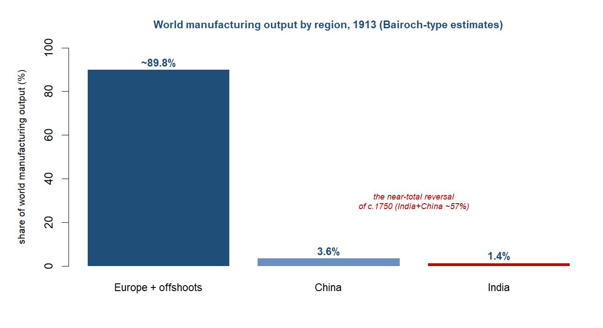{#fig-mfg08 width=68%}

::: {.callout-note}
## Research in focus --- Pascali (2017): the wind of change
*Aim.* To identify the causal effect of the nineteenth-century shipping revolution on trade and on long-run development. *Question.* Did the shift from sail to steam raise trade everywhere, and did the countries it connected all gain alike? *Data and method.* Pascali exploited the fact that steamships, unlike sailing ships, did not depend on wind patterns, using historical wind data to construct an instrument for the change in bilateral sailing times that steam delivered, and traced its effect on trade and on income across countries. *Findings.* Steam sharply raised trade, but its developmental effect was deeply uneven: trade integration boosted growth only where inclusive institutions were already in place, and elsewhere it was associated with divergence rather than catch-up, so the same technology that bound the world together pulled its fortunes apart. *Caveats.* The wind-based instrument and the identification have been debated, and Jacks and Pendakur's separate finding that income growth, not transport, drove the trade boom is the standing counterclaim; the institutional channel is inferred rather than directly observed.
:::

::: {.callout-warning}
## The debate: three live controversies
This period carries three controversies the chapter teaches as genuinely open.

First, what drove the integration. Luigi Pascali argues that the steamship reshaped world trade and, crucially, drove divergence --- only countries with pre-existing inclusive institutions gained from the new connectivity. David Jacks and Krishna Pendakur counter that the maritime transport revolution was not the primary driver at all: income growth and convergence were. Cristiano Chilosi and Giovanni Federico add an Asian wrinkle --- most Europe-Asia price convergence came before 1870, with the abolition of the old European trading monopolies, so the post-1870 steam-and-Suez "big bang" is only part of the story.

Second, what indenture was. Hugh Tinker called the Indian indenture system "a new system of slavery" --- coercion, high mortality, a continuity with the slavery it replaced. David Northrup reads it as a constrained but real labour market, in which migrants exercised agency and responded to factor-price gaps. Same system, two readings of how unfree it was.

Third, why the first globalisation provoked a backlash. From the late 1870s the liberal free-trade interlude reversed into Continental agricultural protection. Karl Polanyi saw this as an endogenous "double movement" --- society protecting itself against the dislocations of a self-regulating market. Kevin O'Rourke and Jeffrey Williamson see distributional politics --- the cheap New World grain of the "grain invasion" drove down land rents and mobilised landed losers, who captured tariff policy. Same reversal, opposite mechanism.

*Sources: Pascali (2017), Jacks & Pendakur (2010) and Chilosi & Federico (2015) on what drove integration; Tinker (1974) and Northrup (1995) on indenture; Polanyi (1944) and O'Rourke & Williamson (1999) on the backlash. Read more: Pascali (2017); O'Rourke & Williamson (1999), *Globalization and History*.*
:::

::: {.column-page}
**Data exhibit --- the price gaps close, 1873--1913.** The chapter's empirical centrepiece is the convergence of commodity prices across the oceans, the physical signature of the first true globalisation. The gap between Liverpool and Bombay raw cotton fell from about 57 per cent to 20; London-Calcutta jute from 35 to 4; London-Rangoon rice from 93 to 26. These are not flows but prices, and their convergence is what distinguishes this period's integration from the trade of every earlier chapter, where prices in Europe and Asia moved independently. *What you could do with this:* set the closing Anglo-Asian price gaps beside the wage-rental ratios of the same decades (Australia a quarter of its 1870 level, Ireland up five-and-a-half times, Britain up nearly threefold, Spain flat) and ask whether commodity-price convergence translated into convergence of living standards --- or, as the periphery's experience suggests, did not.

:::

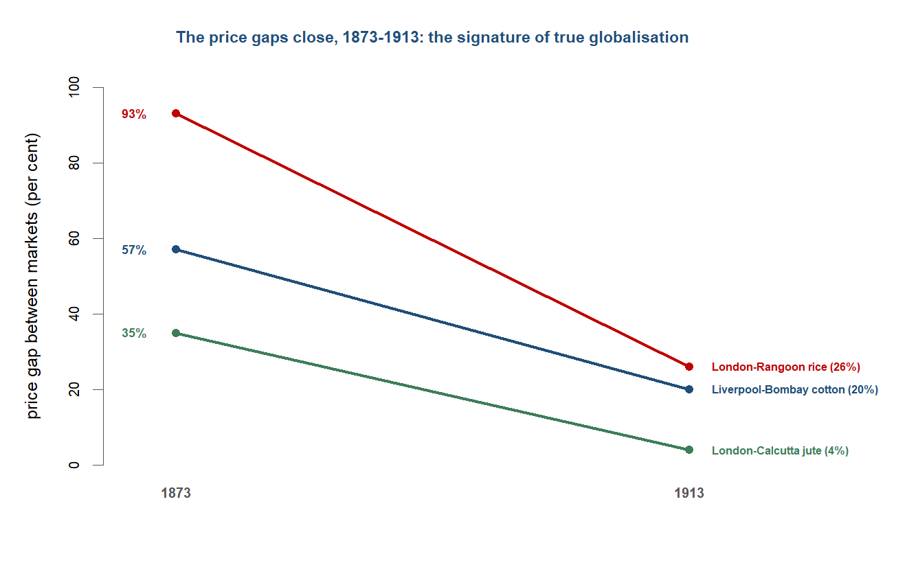{#fig-converge08 width=72%}

## Threads forward

The chapter closes on a system at its peak and about to break. By 1914 the first global economy was integrated, European-centred, capital-rich and resting on its colonial base --- and within a generation all of that would be undone. The next chapter is this one's mirror image: the world war, the collapse of the gold standard, the Great Depression and the deglobalisation of the 1930s shatter the integrated order, and the price convergence this chapter has traced unwinds into outright commodity-market disintegration. The shock would fall hardest where this chapter's logic predicts --- on the primary-commodity periphery, the Ceylon tea and Malayan rubber and Indian wheat whose prices had been chained to a world market that was about to seize up.^[**Sources:** the hand-off to the disintegration of 1914-45; the gold standard's rigidity and the periphery's primary-commodity vulnerability as the channels of transmission. **Read more:** Eichengreen (2008), *Globalizing Capital*; Findlay & O'Rourke (2007), *Power and Plenty*, ch. 8.]

The deeper thread the chapter leaves open is the one the whole book turns on. This was the peak of Western dominance, and the Indian-Ocean vantage has shown that the peak rested on the periphery rather than floating free of it --- that European centrality was built on the drain, the cheap commodities and the coerced labour of the ocean this book follows. Whether that dominance was, in the long run, the anomaly the book's framing suspects depends on what came next: whether the twentieth century restored the Western centre or, after the disintegration of the next chapter, began the long Asian return that the final chapters take up.^[**Sources:** the centre-of-gravity verdict (peak Western dominance resting on the Indian-Ocean periphery) and the book's framing of the European-dominant era as provisionally anomalous. **Read more:** Findlay & O'Rourke (2007), *Power and Plenty*; Pomeranz (2000), *The Great Divergence*.]

---

## Classic research: the foundations {.unnumbered}

The reading list for this period is anchored by a handful of works that defined what "the first globalisation" meant and how to argue about it. The following established the paradigm, mapped its labour and monetary architecture, and named the backlash it provoked.

- **O'Rourke & Williamson (1999)**, *Globalization and History: The Evolution of a Nineteenth-Century Atlantic Economy* --- the paradigm text: it redefined the first globalisation as commodity-price and factor-price convergence (narrowing price gaps; wage-rental ratios moving Australia to a quarter of their 1870 level, Ireland up 5.6-fold, Britain up 2.7-fold, Spain flat), measurable rather than merely asserted.
- **Hatton & Williamson (1998)**, *The Age of Mass Migration: Causes and Economic Impact* --- the model of the roughly 60 million free Europeans who crossed to the New World, and the wage-convergence their movement drove; the free-migration benchmark against which the Indian Ocean's coerced labour reads as the exception.
- **Tinker (1974)**, *A New System of Slavery: The Export of Indian Labour Overseas, 1830--1920* --- the indictment of indenture as a successor to slavery in all but name, foregrounding recruitment fraud, coercion and plantation mortality.
- **Northrup (1995)**, *Indentured Labor in the Age of Imperialism, 1834--1922* --- the constrained-labour-market counter to Tinker, reading indenture as a real if bounded response to factor-price gaps in which migrants exercised some agency; teach the two as the live debate, not a resolved one.
- **Eichengreen (2008)**, *Globalizing Capital: A History of the International Monetary System* --- the classical gold standard explained as a system that transmitted shocks and removed monetary autonomy (sterling about 40 per cent of world reserves), the rigidity that would shatter in the next chapter.
- **Davis (2001)**, *Late Victorian Holocausts: El Nino Famines and the Making of the Third World* --- the argument that the famines of 1876--78, 1896--97 and 1899--1902 fused global market integration, colonial policy and climate; teach the mortality range (roughly 12--29 million) as contested, not settled.
- **Polanyi (1944)**, *The Great Transformation* --- the backlash read as an endogenous "double movement" in which society protects itself against a self-regulating market; the alternative mechanism to O'Rourke and Williamson's interest-group account of the same tariff reversal.

## At the research frontier: recent cliometric work {.unnumbered}

For this period the discipline's action sits in measurement: reconstructing trade costs, freight rates and price gaps to date and quantify integration, and then in linking that integration to the divergence of fortunes between core and periphery. The recent work below, newest first, maps onto the chapter's running debates over what drove integration and whom it served.

- **Jacks & Novy (2018)**, "Market Potential and Global Growth over the Long Twentieth Century," *Journal of International Economics* --- reconstructs bilateral trade costs and "market potential" from the 1880s on, quantifying how access to integrated markets shaped growth; a gravity/trade-cost lens on the same integration the chapter measures through price gaps. [DOI 10.1016/j.jinteco.2018.07.003](https://doi.org/10.1016/j.jinteco.2018.07.003)
- **Bonfatti & O'Rourke (2017)**, "Growth, Import Dependence, and War," *The Economic Journal* --- models how rising import dependence (the mirror image of the grain invasion) feeds geopolitical conflict; the recent link from first-globalisation interdependence to the 1914 rupture, setting up the next chapter. [DOI 10.1111/ecoj.12511](https://doi.org/10.1111/ecoj.12511)
- **Pascali (2017)**, "The Wind of Change: Maritime Technology, Trade, and Economic Development," *American Economic Review* --- the steamship reshaped world trade and drove divergence rather than convergence of fortunes, with only countries holding pre-existing inclusive institutions gaining; the chapter's "integration is not convergence" anchor. [DOI 10.1257/aer.20140832](https://doi.org/10.1257/aer.20140832)
- **Chilosi & Federico (2015)**, "Early globalizations: The integration of Asia in the world economy, 1800--1938," *Explorations in Economic History* --- for Asia, most Europe-Asia price convergence pre-dated 1870 and the abolition of European trading monopolies, with freights and the telegraph continuing it; complicates the post-1870 "steam-and-Suez big bang" frame. [DOI 10.1016/j.eeh.2015.04.001](https://doi.org/10.1016/j.eeh.2015.04.001)
- **Federico & Tena-Junguito (2019)**, "World Trade, 1800--1938: A New Synthesis," *Revista de Historia Economica / Journal of Iberian and Latin American Economic History* --- the current best reconstruction of long-run world-trade volumes and values; the denominator for the scale of the trade expansion and the pre-1914 peak in openness. [DOI 10.1017/s0212610918000216](https://doi.org/10.1017/s0212610918000216)
- **Allen, Bassino, Ma, Moll-Murata & van Zanden (2011)**, "Wages, prices, and living standards in China, 1738--1925," *The Economic History Review* --- the comparative real-wage series underpinning the claim that the periphery integrated downward (China and India against Europe and Japan); the living-standards denominator for the divergence of fortunes. [DOI 10.1111/j.1468-0289.2010.00515.x](https://doi.org/10.1111/j.1468-0289.2010.00515.x)
- **Jacks & Pendakur (2010)**, "Global Trade and the Maritime Transport Revolution," *Review of Economics and Statistics* --- finds the maritime transport revolution was not the primary driver of the trade boom; income growth and convergence were. The demand-side counterweight to a freight-cost-only story, and the direct foil to Pascali. [DOI 10.1162/rest_a_00026](https://doi.org/10.1162/rest_a_00026)
- **Huber (1971)**, "Effect on Prices of Japan's Entry into World Commerce after 1858," *Journal of Political Economy* --- older but still the canonical estimate of Japan's terms-of-trade gain (roughly 3.5-fold) on opening; the clean autarky-to-free-trade natural experiment for the convergence apparatus. [DOI 10.1086/259771](https://doi.org/10.1086/259771)


---

### Questions for consideration {.unnumbered}

*Essay / exam style --- reward the four-questions toolkit and the live debate, not recall.*

1. "The first globalisation was real, measurable, and unequal." Evaluate, using the evidence on commodity-price and factor-price convergence.
2. On whose terms was the Indian Ocean integrated between 1850 and 1914? Answer with reference to steam, Suez, the gold standard and the "drain."
3. "Integration drove divergence, not convergence of fortunes." Assess this verdict (Pascali) against the experience of the settler periphery and the colonial periphery.
4. Was the Indian indenture system "a new system of slavery" (Tinker) or a constrained labour market (Northrup)? What turns on the answer?
5. Why did the first globalisation provoke a protectionist backlash from the late 1870s? Compare Polanyi's "double movement" with the distributional-politics account.
6. In what sense was India "subordinate yet structurally central" to the late-Victorian world economy?

::: {.callout-tip}
## Cross-cutting questions (collected at the end of the book)
The book closes with a bank of questions spanning several chapters. Those this chapter feeds:

- Did integration into the world economy raise or lower the periphery's fortunes? (Chapters 6, 8, 10.)
- When does the "centre of gravity" rest on the periphery rather than float free of it? (Chapters 8, 10.)
- Free trade or enforced trade: how much of nineteenth-century "liberalism" was imposed? (Chapters 7, 8.)
:::

### Data exercise {.unnumbered}

```{r}
#| label: ch-08-exercise
#| eval: false
# Commodity-price convergence and factor prices, 1870-1913 (datasets_by_topic.md, Topic 8).
# 1. Compile Anglo-Asian commodity-price gaps (Liverpool-Bombay cotton, London-Calcutta
#    jute, London-Rangoon rice) for benchmark years 1873, 1890, 1913.
# 2. Plot the three gaps over time; mark Suez (1869) and the spread of the telegraph (1870s).
# 3. Set the closing price gaps beside wage-rental ratios for Australia, Ireland, Britain
#    and Spain (index 1870 = 100).
# 4. Discuss: did commodity-price convergence translate into convergence of living standards?
#    Where did it, and where did integration instead lock in divergence?
```

### Key data {.unnumbered}

| Figure | Value | Source |
|---|---|---|
| Liverpool-Bombay cotton price gap, 1873 -> 1913 | ~57% -> ~20% | O'Rourke & Williamson |
| London-Rangoon rice price gap, 1873 -> 1913 | ~93% -> ~26% | O'Rourke & Williamson |
| Wage-rental ratio by 1910 (1870 = 1) | Australia ~1/4; Ireland ~5.6x; Britain ~2.7x; Spain flat | O'Rourke & Williamson |
| Suez: Britain-Bombay distance | ~10,667 -> ~6,224 miles | Findlay & O'Rourke |
| British ocean-freight index, 1840-1910 | fell ~70% | Findlay & O'Rourke |
| British share of world shipping tonnage, 1890 | ~63% | Pearson (2003) |
| European migration to the New World | ~60 million | Hatton & Williamson |
| Indian indentured emigration, 1834-1920 | ~1.5-2 million | brief / Tinker (1974) |
| India financing Britain's BoP deficits, 1870-1915 | >40% | Findlay & O'Rourke |
| World manufacturing shares, 1913 | Europe+offshoots ~89.8%; China 3.6%; India 1.4% | Findlay & O'Rourke |
| British overseas investment, 1913 | ~£3.8 billion | Eichengreen (2008) |

### Further reading {.unnumbered}

- **Core:** O'Rourke & Williamson (1999), *Globalization and History*; Findlay & O'Rourke (2007), *Power and Plenty*, ch. 7; Williamson (2011), *Trade and Poverty*.
- **Supplementary:** Hatton & Williamson (1998), *The Age of Mass Migration*; Eichengreen (2008), *Globalizing Capital*; Roy (2012), *India in the World Economy*; Pearson (2003), *The Indian Ocean*.
- **The debate:** Pascali (2017) vs Jacks & Pendakur (2010) vs Chilosi & Federico (2015) on what drove integration; Tinker (1974) vs Northrup (1995) on indenture; Polanyi (1944) vs O'Rourke & Williamson (1999) on the backlash; Davis (2001), *Late Victorian Holocausts*, on the famines.
