# Disintegration: war, depression, and the colonial world {#sec-ch09}

::: {.callout-important appearance="simple"}
**Preliminary draft --- under review.** Published for review; content, figures and citations may still change.
:::

> *"Nineteenth-century civilization has collapsed."* --- Karl Polanyi, *The Great Transformation*, 1944.
>
> *"Swadeshi is that spirit in us which restricts us to the use and service of our immediate surroundings to the exclusion of the more remote."* --- Mahatma Gandhi, on self-reliance, 1916.

## Follow one thing {.unnumbered}

Follow the price gap again --- but watch it blow back open. The last chapter made the closing of the gap between Liverpool and Bombay, London and Rangoon, the signature of the first true globalisation: the cost of a thing in Asia and the cost of the same thing in Europe, chained together by steam, the telegraph and the gold standard. This chapter watches the chain break. The Great War alone drove the London-Rangoon rice gap from about 27 per cent back out toward 400 per cent, as ocean freight rates tripled and the integrated market of 1913 came apart; the slump of the 1930s reopened the gaps a second time, toward levels not seen since the 1870s. The same yardstick that measured integration now measures disintegration, run in reverse. That reversal is the chapter's first lesson and its hardest: the integration of the first global economy was not a ratchet. It could run backwards, and between 1914 and 1945 it did --- through two wars, a botched monetary restoration and the deepest depression of the industrial age. But the chapter has a second thing to follow, harder to see in the price series, and it is the Indian-Ocean vantage's particular contribution: the same disintegration that wrecked the colonial periphery also began, quietly, to loosen the ties that had subordinated it.^[**Sources:** Findlay & O'Rourke (p.434) on the London-Rangoon rice gap reopening (from about 27 per cent toward 400 per cent) with tripled wartime ocean-freight rates; Hynes, Jacks & O'Rourke (2012) on interwar commodity-market disintegration (the gaps reverting toward pre-1870 levels). **Read more:** Findlay & O'Rourke (2007), *Power and Plenty*, ch. 8.]

## Where we are on the arc {.unnumbered}

The last chapter was the apogee: the first global economy at its integrated, European-centred peak in 1914, resting on a colonial periphery. This chapter is its mirror image. Between 1914 and 1945 that integrated order was violently unwound --- by the Great War, by the failed attempt to rebuild the gold standard, by the Great Depression, and by the retreat into autarky and imperial blocs that followed. The decisive question is where the centre went, and the answer is the chapter's central claim: the European-dominant order cracked, but the centre did not move to Asia. The decisive shift was within the West, as financial leadership passed from London to New York and the United States became the ascendant core. Western Europe's share of world exports fell from about 60 per cent in 1913 to about 41 per cent by 1950. Asia, in aggregate, stayed a subordinate periphery, hammered by the commodity collapse and by the influenza pandemic of 1918 that killed more people in India than anywhere on earth. And yet --- this is the twist the vantage reveals --- the very disintegration that battered the periphery also began to free it: behind the broken trade ties, India industrialised, Japan's mills displaced Lancashire across Asia, and the seed of the post-1945 rebalancing was sown.^[**Sources:** Feinstein, Temin & Toniolo (Loc 304) on Western Europe's share of world exports falling from 60.1 per cent (1913) to 41.1 per cent (1950); the brief's account of financial leadership passing London $\to$ New York and the periphery's "quiet turn." **Read more:** Tooze (2014), *The Deluge*; Findlay & O'Rourke (2007), *Power and Plenty*, ch. 8.]

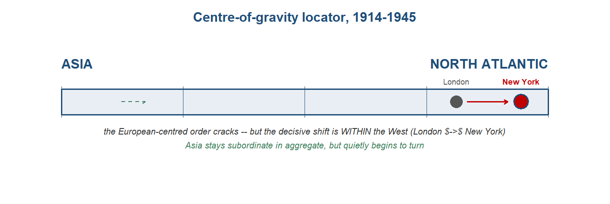{#fig-cog09 width=85%}

## The stage and the cast

There were four ways to meet the slump, and which one an economy followed decided its fate more than the depth of its initial fall. The gold-standard core --- Britain until 1931, the gold-bloc economies of continental Europe, the United States until 1933 --- defended their fixed parities and so imported deflation, squeezing prices and demand to hold the peg. The early-devaluers --- Japan, and the sterling area after 1931 --- left gold, let their currencies fall, reflated, and recovered first. The colonial commodity periphery --- Burma, Malaya, Ceylon, Java, India --- were price-takers in primary goods, and took the terms-of-trade collapse straight on, adapting unevenly. And China, alone on silver rather than gold, had a different Depression again. The cast below runs east to west, from the periphery this book follows, through the rising Asian exception, to the Western core whose fracture is the period's decisive event.^[**Sources:** the brief's "four ways to meet a slump" framework (gold-defenders, early-devaluers, commodity periphery, China-on-silver); Eichengreen & Sachs (1985) on recovery following the order of departure from gold. **Read more:** Eichengreen (1992), *Golden Fetters*.]

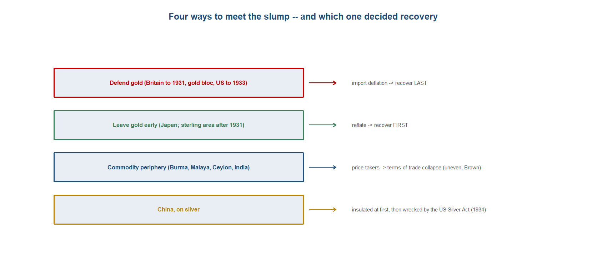{#fig-slumps09 width=92%}

::: {.callout-tip}
## Dramatis personae
The economic actors of 1914--1945, east to west, and what changed since the last chapter. **India appears in every chapter, profiled most fully.**

- **India** --- worst-hit by the 1918 influenza, and a price-taker in the commodity collapse; but the quiet turn begins (import-substituting industrialisation from the 1920s).
- **Japan** --- the early-off-gold recovery: industrial output doubles 1932--39; its textiles displace Lancashire across Asia.
- **China** --- the silver-standard exception: a different Depression, on a different monetary regime.
- **The colonial commodity periphery** --- Burma, Malaya, Ceylon, Java: price-takers, hit hardest by the 1929--31 collapse.
- **Britain** --- the creditor core of the last chapter, now caught in "golden fetters": back to gold in 1925, forced off in 1931.
- **The United States** --- the ascendant core: financial leadership passes from London to New York.
:::

::: {.callout-tip collapse="true"}
## India --- the worst-hit, and the quiet turn

India entered this chapter as the commodity-exporting colonial periphery that the last one had made of it, and the first global economy's collapse reached it as a price-taker's catastrophe. The economy shipped jute, raw cotton, tea and wheat into a world market over whose prices it had no say, and when that market broke in 1929--31 the terms of trade swung violently against it. The commodity-price collapse that flattened the colonial periphery --- rubber down some 84 per cent, tea down 62 per cent, coffee down 53 per cent across 1929--31 --- ran straight through India's export staples, and the slump arrived as a deflation imported from outside. Tirthankar Roy's reading of the Indian Depression caught the political residue of that helplessness: by 1929 London was coming to be seen, from India, as irrelevant to India's recovery --- a periphery learning that the imperial centre had no answer to a crisis the centre had transmitted.^[**Sources:** Findlay & O'Rourke (p.449) on the 1929--31 commodity-price collapse (rubber minus 84 per cent, tea minus 62 per cent, coffee minus 53 per cent); Roy (p.213, p.214) on the onset of the Depression in India and London seen as irrelevant. **Read more:** Roy (2012), *India in the World Economy*.]

The decade had opened with a demographic wound deeper than any in the trade statistics. The influenza pandemic of 1918--19 struck India harder than anywhere else on earth, and on the standard demographic reconstruction it killed somewhere in the order of twelve to eighteen million people --- an estimate, and a wide one, but on any figure the worst national toll of the global pandemic. Ian Mills's study of the Indian experience set the catastrophe against a colonial administration that mounted little relief and registered little urgency, and the contrast between the scale of the dying and the thinness of the official response fed directly into the gathering anti-colonial movement. Disease, which this book has tracked as a force of the Indian Ocean since cholera, returned in 1918 as both a demographic shock and a political one: the pandemic that killed the most Indians also helped persuade Indians that the state which governed them would not protect them.^[**Sources:** Mills (1986) on the 1918--19 influenza pandemic in India, with an estimated mortality on the order of twelve to eighteen million and the inadequacy of British relief feeding the anti-colonial movement. **Read more:** Mills (1986), "The 1918--1919 Influenza Pandemic: The Indian Experience," *Indian Economic and Social History Review*.]

Here the chapter's paradox turns. Behind the collapsing trade and the rising tariff walls, India had quietly begun to industrialise. The disruption of the war years had cut the colonial economy off from its accustomed flow of British manufactures, and that very severing had created room for Indian producers to supply a home market the metropole could no longer reach. Factory employment, which had stood near a hundred thousand around 1860, climbed toward two million by 1940, most of the growth concentrated in the decades the integrated order was breaking. The import-substituting industrialisation that gathered pace from the 1920s was not a colonial gift but a by-product of disintegration: the breaking of the trade ties that had subordinated India loosened them. Behind tariff protection and behind the collapse of imports, an Indian manufacturing base grew on terms the colonial division of labour had been designed to prevent.^[**Sources:** Roy (p.189) on factory employment rising from about 100,000 in 1860 to roughly two million by 1940, most of the growth after 1870; Tomlinson (1993) on the interwar import-substituting industrialisation. **Read more:** Tomlinson (1993), *The Economy of Modern India, 1860--1970*.]

The mechanism behind that turn has since been identified rather than merely asserted. Roberto Bonfatti and Bjorn Brey showed that the trade disruption of the war and interwar years measurably raised Indian industrialisation: where the withdrawal of foreign competition was sharpest, Indian manufacturing grew most, and the industrial gains in turn fed the anti-colonial nationalism that drove decolonisation. This is the chapter's central claim made concrete --- that disintegration loosened subordination --- and it gives the periphery a part as an agent rather than only a victim. The one hard interior number marks the substitution at work. As Europe withdrew from Asian markets, other Asian producers moved into the gap, and India's own import bill records it: Japan's share of India's cotton-yarn imports rose from about 2 per cent to 46 per cent between 1913 and 1923. The fibre that Lancashire had once supplied was now coming from Osaka --- Asia supplying Asia as the European centre pulled back.^[**Sources:** Bonfatti & Brey (2023) on trade disruption raising Indian industrialisation and feeding anti-colonial nationalism; Roy (p.211) on Japan's share of India's cotton-yarn imports rising from 2 to 46 per cent, 1913--1923. **Read more:** Bonfatti & Brey (2023), "Trade Disruption, Industrialisation, and the Setting Sun of British Colonial Rule in India," *Journal of the European Economic Association*.]

The political face of the turn was the swadeshi movement. Self-reliance --- the boycott of Lancashire cloth, the spinning of homespun khadi, the campaign to clothe India in its own production --- gave the economic substitution a mass nationalist form, and under Gandhi the spinning wheel became the emblem of an independence built on economic self-sufficiency. The boycott of imported British cloth was at once a political weapon and an industrial policy by other means, pressing exactly where the colonial economy was most exposed: the machine-made cotton that had displaced India's weavers a century earlier. The market substitution and the political mobilisation reinforced each other, the one giving the other an economic base, the other giving the first a banner.^[**Sources:** Roy (p.213) on the interwar Indian political economy; the swadeshi boycott of Lancashire cloth and the khadi self-reliance campaign under Gandhi. **Read more:** Tomlinson (1993), *The Economy of Modern India, 1860--1970*.]

The turn should not be overstated, and the honest reading keeps it partial. India remained, in aggregate, a subordinate economy: a battered commodity periphery whose recovery from the slump was slow, whose foreign-investment dependence persisted, and whose industrialisation, real as it was, started from a low base and reached only parts of the subcontinent. The caution against reading the nationalist period as a clean march to empowerment applies here --- the gains were uneven across regions and actors, and the colonial state did not surrender its hold. What changed was the direction of travel. India in 1945 was still subordinate when measured against the imperial core, but it was no longer being deindustrialised; the trade ties that had locked it beneath the system were loosening, and an industrial base and a nationalist movement were in place that the post-1945 rebalancing would build on. The worst-hit economy of the disintegration was also, quietly, beginning to turn.^[**Sources:** Roy (p.210, p.212) on accelerating population growth in the 1920s and the foreign-investment share of national income; the chapter's honest qualification of the empowerment thesis (after Brown 2005) as real but partial and uneven. **Read more:** Roy (2012), *India in the World Economy*; Brown (2005), *A Colonial Economy in Crisis*.]

**Trade profile**

- **Main exports** --- primary commodities into a collapsing world market: jute and jute manufactures, raw cotton, tea and wheat, the food and fibre of a price-taking periphery whose terms of trade the 1929--31 collapse turned sharply against it; and, increasingly behind the tariff wall, the output of a growing domestic manufacturing base.
- **Main imports** --- machine-made manufactures, above all cotton goods, increasingly substituted by home production and by intra-Asian supply: Japanese cotton yarn displaced British, rising from about 2 to 46 per cent of India's yarn imports between 1913 and 1923.
- **Export markets** --- Britain and the wider world economy, fragmenting through the 1930s into the sterling area and the imperial-preference bloc after the 1932 Ottawa conference.
- **Import sources** --- Britain, the declining metropolitan supplier, displaced at the margin by Japan in textiles and by India's own factories as import substitution advanced.^[**Sources:** Roy (p.211) on the Japanese displacement of British yarn; Findlay & O'Rourke (p.449) on the periphery price collapse; the 1932 Ottawa conference and imperial preference. **Read more:** Roy (2012), *India in the World Economy*.]
:::

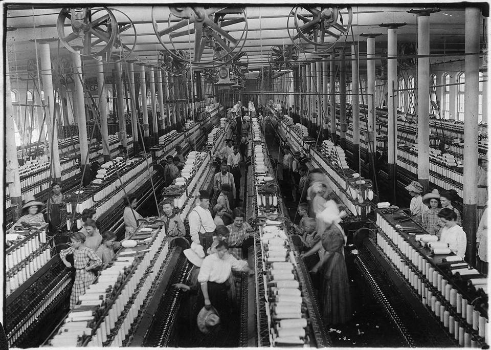{#fig-mill09 width=70%}

::: {.callout-note}
## Research in focus --- Bonfatti & Brey (2023): trade disruption and the setting sun of colonial rule
*Aim.* To identify whether the trade disruption of the war and interwar years causally raised industrialisation in colonial India, and whether that industrialisation in turn weakened colonial rule. *Question.* Did the protection-by-disruption of access to British manufactures spur Indian industry, and did the resulting growth feed anti-colonial nationalism? *Data and method.* Exploitation of variation in exposure to trade disruption across Indian districts, linking the disruption to local industrialisation and then to measures of nationalist and anti-colonial activity. *Findings.* Trade disruption raised Indian industrialisation, and the districts that industrialised more saw stronger anti-colonial nationalism --- a mechanism through which disintegration loosened the periphery's subordination and hastened decolonisation. *Caveats.* The evidence is India-specific and may not generalise to other colonies, and the gains were partial and uneven, consistent with Brown's insistence that the periphery's experience of the slump varied by region and actor.
:::

::: {.callout-tip collapse="true"}
## Japan --- off gold early, and rising

Japan was the period's clearest case of recovery by exit from gold, and it recovered because it left early. Having returned to the gold standard only in December 1930, at the worst possible moment, Japan abandoned it within the year as the Minseito government fell and Korekiyo Takahashi took the finance ministry. What followed was the textbook demonstration of the rule the chapter teaches --- that countries recovered in the order they left gold. Takahashi reflated: the yen was allowed to fall, the central bank financed government spending, and the economy turned almost at once. Real GDP rose about 7 per cent in 1932, wholesale prices rose about 7 per cent as deflation reversed, and short-term money rates were driven down from roughly 15 per cent to 1 per cent. Where the gold-standard core was still importing deflation, Japan had already chosen reflation, and the contrast is the sharpest evidence in the chapter that the slump was a monetary regime as much as a real shock.^[**Sources:** Eichengreen (Page 256) on Japan's December 1930 return to gold, the fall of the Minseito government and Takahashi's appointment; Eichengreen (Page 258) on 1932 real GDP about +7 per cent, wholesale prices about +7 per cent, and short rates falling from about 15 per cent to 1 per cent. **Read more:** Eichengreen (1992), *Golden Fetters*.]

The reflation became a sustained industrial boom. Through the rest of the 1930s Japanese industrial output roughly doubled between 1932 and 1939, and the economy grew at something on the order of 5 per cent a year while much of the world stagnated. The recovery was led by the goods Japan could sell into the Depression's wreckage at prices a devalued yen made unbeatable, and its textiles were the spearhead. Japanese cotton manufactures swept across the Asian markets that Lancashire had long supplied, and the displacement is captured in the one hard interior number of the intra-Asian turn: Japan's share of India's cotton-yarn imports rose from about 2 per cent to 46 per cent between 1913 and 1923. As the European centre withdrew from Asia, Japan moved into the space it left, and by the late 1930s it was the industrial success of the period and the leading edge of the Asian turn that this chapter traces.^[**Sources:** Eichengreen (Page 258) on the post-1932 reflation and recovery; Roy (p.211) on Japan's share of India's cotton-yarn imports rising from 2 to 46 per cent, 1913--1923, as Japanese textiles displaced Lancashire across Asian markets. **Read more:** Eichengreen (1992), *Golden Fetters*.]

The dark side of the recovery was inseparable from it. The reflation that pulled Japan out of the slump fed a state that turned increasingly militarised and autarkic, and the export success hardened into the pursuit of a closed imperial sphere. Through the 1930s Japan built a yen bloc --- a currency-and-trade zone organised around the home islands, Korea, Taiwan and conquered Manchuria --- and bloc-isation reorganised its trade by political design: Japan's exports to Korea and China rose from about a third to roughly two-thirds of the total, and by 1942 trade between the world's great blocs had fallen close to zero. The industrial leader of the Asian turn was also the architect of an autarkic empire, and the recovery that began as a monetary success ended in the slide to war. Japan's interwar record is thus the chapter's paradox in its starkest form: the first concrete evidence of Asia rising, and a warning of what that rise could be turned into.^[**Sources:** Findlay & O'Rourke (p.460, p.473) on the Japanese yen bloc, exports to Korea and China rising from about a third to two-thirds, and near-zero trade between the blocs by 1942. **Read more:** Findlay & O'Rourke (2007), *Power and Plenty*, ch. 8.]

**Trade profile**

- **Main exports** --- manufactures, above all cotton textiles, sold across Asia at prices a devalued yen made unbeatable, displacing Lancashire across the markets of the colonial periphery; increasingly, the output of a militarising industrial base.
- **Main imports** --- the raw materials and capital goods of an industrialising war economy, drawn increasingly from within the yen bloc as autarky tightened: cotton, metals, oil and machinery.
- **Export markets** --- the Asian markets vacated by a withdrawing Europe, and, by political design, the captive markets of the yen sphere --- Korea, Taiwan and occupied Manchuria and China.
- **Import sources** --- the wider world for raw materials early on, then increasingly the colonies and conquests of the bloc, as inter-bloc trade collapsed toward zero by 1942.^[**Sources:** Roy (p.211) on the textile displacement; Findlay & O'Rourke (p.460, p.473) on the yen bloc and bloc-isation. **Read more:** Findlay & O'Rourke (2007), *Power and Plenty*, ch. 8.]
:::

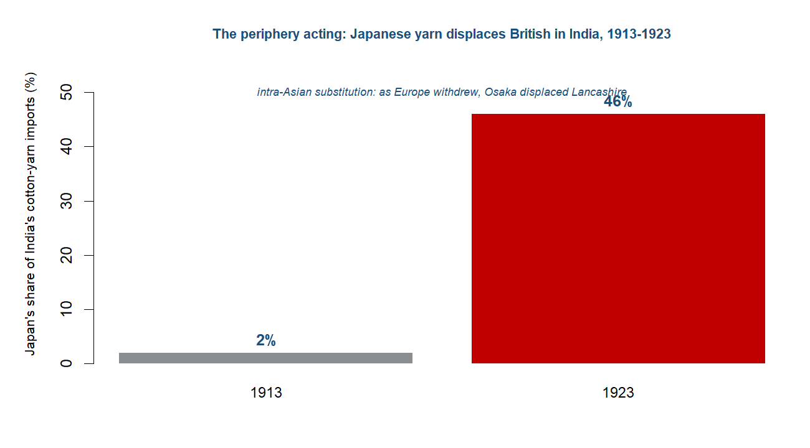{#fig-japanindia09 width=70%}

::: {.callout-tip collapse="true"}
## China --- a different Depression, on silver

China met the Great Depression on a different monetary regime from almost everyone else, and the difference shaped its whole experience of the slump. While the industrial core and the gold-bloc economies of Europe were tied to gold, China was on silver, and silver was a floating commodity against the gold currencies rather than a fixed anchor to them. When the gold-standard world began importing deflation through the reconstructed standard --- the "golden fetters" that transmitted falling prices from one gold currency to the next --- China was insulated from it. A country off gold did not have to defend a fixed parity by squeezing its own prices and demand, and in the first years after 1929, as the gold-standard economies contracted hard, China's silver-based monetary system shielded it from the worst of the early deflation. The instructive point is the counterfactual: a different monetary regime meant a different Depression, and China's early insulation is the clearest single demonstration that the gold standard was the transmission belt of the slump, because the one large economy outside it experienced a different slump.^[**Sources:** the chapter's gold-standard-as-transmission frame (Eichengreen; Eichengreen & Sachs, "no country recovered while still on gold"); the silver-standard exception in the Topic 9 brief and story spine. **Read more:** Eichengreen (1992), *Golden Fetters*.]

That insulation did not last, and what ended it came from the United States. China's protection had rested on silver being cheap relative to gold; when that relation was forced into reverse, the shelter became a trap. In 1934 the US Congress passed the Silver Purchase Act, under which the Treasury bought silver in large quantities to drive up its price --- a measure pressed by domestic silver interests rather than aimed at China, but one that fell on China hardest of all. As the world silver price climbed, silver became worth more abroad than as money at home, and it drained out of China to be sold into the rising market. The country's monetary metal was being pulled out from under its currency, and the contraction that the gold-standard world had imposed on itself from 1929 now arrived in China at second hand, through a metal it could no longer keep.^[**Sources:** Steil, *The Battle of Bretton Woods* (Page 47, 49) on the 1934 US Silver Purchase Act, which "wreaked havoc on the Chinese currency," and the Treasury's commitment to buy further large tranches of silver. **Read more:** Eichengreen (2008), *Globalizing Capital*.]

The outflow forced a deflationary monetary contraction on China at the worst possible moment, and the policy response was to abandon the metal that had become a liability. As silver left the country the domestic money supply shrank and prices fell, reproducing on Chinese ground the very deflation that being on silver had spared it three years earlier. In October 1935 China abandoned the silver standard, replacing full-bodied silver currency with a managed paper currency --- the fabi --- and entering a stabilisation arrangement with the United States, whose silver purchases had helped wreck the old system and whose dollars now helped underpin the new one. The move off silver completed the lesson the panel teaches: the regime that had first sheltered China from the global slump, then transmitted a slump of its own, could only be escaped by leaving it --- the same recovery-by-exit that the gold-standard economies were discovering on their own metal.^[**Sources:** Steil, *The Battle of Bretton Woods* (Page 48) on China abandoning the silver standard in October 1935 and entering a US--Chinese stabilisation arrangement; the recovery-by-exit reading from Eichengreen & Sachs. **Read more:** Eichengreen (2008), *Globalizing Capital*.]

All of this unfolded against a domestic order already under severe strain. The late Qing had fallen in 1911, and the Republic that followed was fractured rather than consolidated: warlord rule had carved up authority across the provinces, the Nationalist government's writ was partial, and the monetary system China carried into the Depression was itself a patchwork that left the country exposed when the silver price turned. Above it all loomed the deepening conflict with Japan, whose pressure on China mounted through the 1930s toward the open war that broke out in 1937. The monetary counterfactual that makes China so instructive for the world economy sat inside a state contending with division at home and invasion from abroad --- so the silver story is best read as one strand, the clearest monetary one, in a wider crisis of the Chinese state.^[**Sources:** the late-Qing-to-Republican, warlord and Sino-Japanese context in the Topic 9 brief and story spine; von Glahn on the late-Qing collapse and the weak Republican fiscal state. **Read more:** von Glahn (2016), *The Economic History of China*.]

**Trade profile**

- **Main exports** --- primary goods and silk into a world market whose prices were collapsing through the early 1930s; China's export values fell sharply in the commodity slump.
- **Monetary regime** --- the silver standard that set China apart: insulating at first against gold-standard deflation, then the channel through which the US Silver Purchase Act drained the country's monetary metal and forced contraction.
- **Key external shock** --- the 1934 US Silver Purchase Act, which raised the world silver price, pulled silver out of China, and pushed it off silver into the managed fabi currency (1935).
- **Stabilisation partner** --- the United States, whose silver buying helped break the old regime and whose dollars helped anchor the new managed currency under the 1935 arrangement.^[**Sources:** Steil, *The Battle of Bretton Woods* (Page 47--49) on the Silver Purchase Act, the silver drain and the 1935 move to a managed currency under a US stabilisation arrangement. **Read more:** Eichengreen (1992), *Golden Fetters*; von Glahn (2016), *The Economic History of China*.]
:::

::: {.callout-tip collapse="true"}
## The colonial commodity periphery --- price-takers in the great collapse

The colonial economies of the Indian Ocean and Southeast Asia entered the Depression as primary-commodity producers selling into world markets they did not control, and that position decided their fate in the slump. Each was built around one or a few export staples: Burma, Siam and French Indochina exported rice; Malaya and Sumatra produced rubber; Ceylon grew tea; Java made sugar; India shipped jute and cotton. The whole region was a set of price-takers, its incomes tied to commodity prices set in London, New York and Amsterdam rather than at home. When those prices held up, the arrangement looked like the benign integration of the previous chapter; when they collapsed, the periphery had no shelter, because the one thing a price-taker cannot do is hold its price. The structure that had drawn these economies into the world market on a single commodity each was exactly what exposed them when the market turned.^[**Sources:** Findlay & O'Rourke (2007) on the colonial commodity periphery and its single-staple export structure (Burma/Siam/Indochina rice, Malayan and Sumatran rubber, Ceylon tea, Java sugar, Indian jute and cotton); the Topic 9 brief's periphery roster. **Read more:** Findlay & O'Rourke (2007), *Power and Plenty*, ch. 8.]

The collapse, when it came, was severe and concentrated in the years 1929 to 1931. Commodity prices fell across the board and fell furthest for exactly the goods this periphery sold. Coffee dropped 53 per cent and rubber 84 per cent; tea fell 62 per cent in Ceylon; and China's export values, caught in the same downdraught, fell by something like 75 to 80 per cent. These were not abstract index movements but the prices on which whole colonial economies turned, and a fall of this depth meant a collapse of export earnings across the region in the space of two years. Because each economy was so narrowly specialised, there was little to cushion the blow internally: the rubber estate, the tea garden and the rice delta all earned in the same falling world market at the same time.^[**Sources:** Findlay & O'Rourke (p.449) on the 1929--31 commodity-price collapse --- coffee minus 53 per cent (Brazil), rubber minus 84 per cent (Malaya), tea minus 62 per cent (Ceylon), and Chinese export values down roughly 75 to 80 per cent. **Read more:** Findlay & O'Rourke (2007), *Power and Plenty*, ch. 8.]

What the price figures register as a terms-of-trade shock arrived in the countryside as debt and dispossession. Smallholders and tenant cultivators across the region had borrowed against expected harvests and prices, and when the late-1930 rice-price crash and the wider collapse cut their incomes, the debts did not fall with them. Mass loan defaults followed, and behind the defaults came foreclosure: land pledged as security passed out of cultivators' hands to the moneylenders and creditors who held the paper. The deepest social cost of the slump in the colonial periphery was this transfer of land --- the rice deltas and smallholdings of Burma, Indochina and beyond changing hands under the weight of indebtedness, so that the price collapse in distant exchanges registered locally as foreclosure and the loss of the land itself.^[**Sources:** the brief and story spine on the late-1930 rice-price crash, mass loan defaults, foreclosure and land passing to moneylenders across the colonial periphery. **Read more:** Brown (2005), *A Colonial Economy in Crisis*.]

Against this orthodox picture of uniform ruin sits a revision that the chapter takes seriously. The standard account makes the single-commodity colonial producer the passive victim of forces set in the metropole, devastated wholesale by the price collapse. J. C. Brown's study of Burma's rice delta, the very heartland of the indebtedness-and-foreclosure story, complicated that picture. Brown showed that the effects of the Depression varied --- by region, by actor and over time --- and that the people caught in it were not passive recipients of disaster but adapted to it, unevenly and with mixed success. Some lost their land; others restructured, switched, held on or recovered as conditions shifted. The lesson is to resist the orthodoxy of uniform single-commodity-producer ruin: the colonial periphery was the price-taking underside of the disintegration, but its people had agency, and the outcomes were patchier than a single regional aggregate suggests.^[**Sources:** Brown (2005), *A Colonial Economy in Crisis: Burma's Rice Delta and the World Depression of the 1930s*, on effects varying by region, actor and over time, and the periphery's "victims" adapting rather than passively suffering. **Read more:** Brown (2005), *A Colonial Economy in Crisis*.]

There was a further turn, and it points forward. The same collapse that wrecked the colonial export economies also began to loosen the trade ties that had bound them into a subordinate role. As the prices and the volumes of colonial trade fell, and as the imperial blocs walled the world economy into separate currency-and-tariff zones, the dense commercial integration that had made these economies appendages of the metropole started to fray. That loosening was uneven and far from a liberation in the 1930s, but it was real, and it connects to the larger movement the chapter traces: in India in particular the disruption of colonial trade was accompanied by import-substituting industrialisation, the periphery beginning, behind the broken trade ties, to make for itself some of what it had imported. The commodity collapse was a catastrophe for the price-taking periphery; it was also, read across the longer run, part of how that periphery's subordination began to slacken.^[**Sources:** the Topic 9 brief and story spine on the collapse of colonial trade ties loosening the periphery's subordination, with the link to India's import-substituting industrialisation from the 1920s. **Read more:** Findlay & O'Rourke (2007), *Power and Plenty*, ch. 8.]

**Trade profile**

- **Main exports** --- single-staple primary commodities: rice (Burma, Siam, Indochina), rubber (Malaya, Sumatra), tea (Ceylon), sugar (Java), and jute and cotton (India) --- the goods whose prices the 1929--31 collapse hit hardest.
- **Price exposure** --- price-takers in markets set in London, New York and Amsterdam; the 1929--31 falls ran to rubber minus 84 per cent, tea minus 62 per cent, coffee minus 53 per cent, and Chinese export values down 75 to 80 per cent.
- **Internal consequence** --- mass loan defaults and foreclosure after the late-1930 rice-price crash, with cultivated land passing to moneylenders --- though the effects varied by region and actor, and the producers adapted (Brown).
- **Forward link** --- the collapse of colonial trade ties began to loosen the periphery's subordination, connecting to India's import-substituting industrialisation and the rebalancing taken up in the next chapter.^[**Sources:** Findlay & O'Rourke (p.449) on the price collapse; the brief on the rice-price crash, foreclosure and the loosening of colonial trade ties; Brown (2005) on uneven effects and adaptation. **Read more:** Brown (2005), *A Colonial Economy in Crisis*; Findlay & O'Rourke (2007), *Power and Plenty*, ch. 8.]
:::

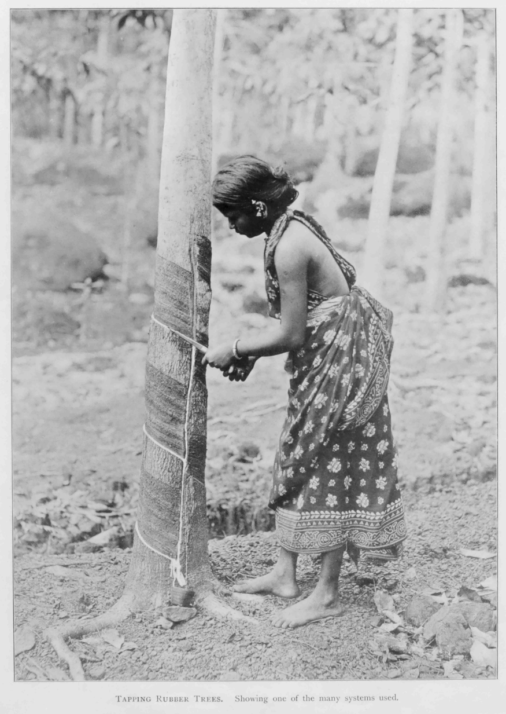{#fig-rubber09 width=60%}

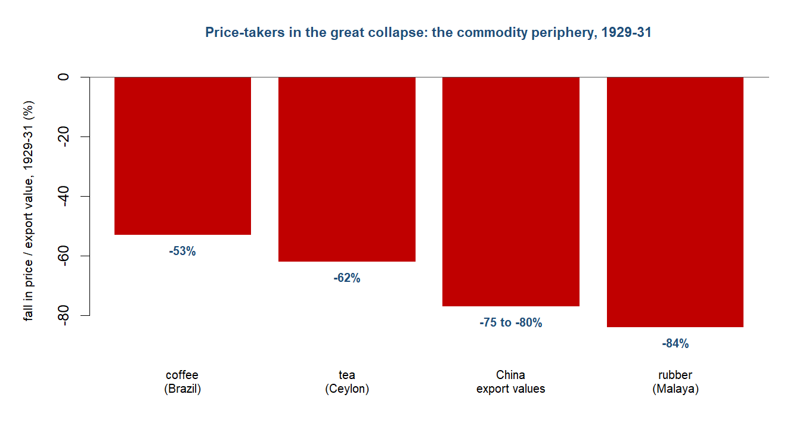{#fig-commodity09 width=68%}

::: {.callout-tip collapse="true"}
## Britain --- the creditor core caught in golden fetters

Britain entered this chapter as the workshop become hub and banker --- the economy that ran the world's shipping, settled its payments and held its capital. It left as the declining core. The classical gold standard that had made the City the centre of world settlement was an early casualty of the war, swept aside by export bans, fiat money and floating exchange rates as the belligerents printed and borrowed to fight. The deeper shift was financial. Britain had spent heavily in the United States to fight the war, financing the purchases by running down its gold reserves and selling off the American securities its citizens had accumulated, and the creditor of 1914 emerged from the war a debtor to New York. The leadership of the international system was passing from London to New York, and it would not come back.^[**Sources:** Steil, *The Battle of Bretton Woods* (Page 66) on Britain spending heavily in the US, financed by selling gold and securities; Eichengreen (Loc 386) on the war ending the classical gold standard through export bans, fiat money and floating rates; Tooze (2014) on financial leadership passing London $\to$ New York. **Read more:** Tooze (2014), *The Deluge*.]

The instinct of the 1920s was restoration, and Britain led it. In April 1925 the Chancellor, Winston Churchill, returned the pound to gold at its prewar parity of $4.86 --- the rate that had defined sterling before the war and that the City regarded as a point of national honour. The trouble was that prices and costs had not returned with it. At $4.86 the pound was overvalued, which meant that British exports were priced out of world markets and the only way back to competitiveness ran through deflation: wage cuts, dear money and unemployment imposed to force domestic prices down to the parity the exchange rate assumed. John Maynard Keynes named the folly at once, in a pamphlet whose title --- "The Economic Consequences of Mr Churchill" --- left no doubt where he laid the blame. The restored standard, Barry Eichengreen would later argue, had become a set of golden fetters: a monetary cage that bound its members to defend parity by deflating, whatever the cost in output and jobs.^[**Sources:** Eichengreen (Page 22) on Britain's return to gold in April 1925 at the prewar $4.86 parity; the chapter's account of the overvaluation forcing deflation, Keynes's "The Economic Consequences of Mr Churchill" and Eichengreen's "golden fetters." **Read more:** Eichengreen (1992), *Golden Fetters*.]

The reconstructed standard was also weaker than the one it replaced. The prewar gold standard had run on a credibility that markets rarely tested and on a habit of central-bank cooperation --- the discreet support operations by which the Bank of England, the Bank of France and the Reichsbank had propped each other up in a crisis. The interwar version had neither. Reconstructed piecemeal between 1925 and 1928, stripped of the automatic confidence that parities would hold and of the cooperative reflexes that had once defended them, it transmitted deflation outward rather than absorbing shocks. When American lending to Europe dried up and the slump arrived, the system had no reserve of trust to draw on, and the deflation it carried fell hardest on the countries least able to leave.^[**Sources:** the chapter's account of the reconstructed gold standard lacking prewar credibility and central-bank cooperation, after Eichengreen; Eichengreen (Loc 399) on the piecemeal restoration of parities, 1925--28. **Read more:** Eichengreen (1992), *Golden Fetters*.]

Then came the break, and Britain led that too. Through the summer of 1931 the crisis that began with the failure of Austria's Creditanstalt rolled west into a run on sterling, and in the weeks before it gave way Britain lost roughly a quarter of its reserves defending the parity it could no longer hold. On 19--20 September 1931 it suspended gold convertibility. Sterling fell about 20 per cent against the dollar, and some twenty countries --- the trading partners and dominions whose reserves and trade were tied to London --- followed Britain off gold, forming the bloc that became the sterling area. The country that had restored the gold standard in 1925 had abandoned it in 1931, and the act that looked like defeat turned out to be release: freed from the fetters, Britain could reflate, and recovery began.^[**Sources:** Eichengreen (Page 150) on Britain losing about a quarter of its reserves before going off gold; Eichengreen (Loc 418) on the suspension of 19--20 September 1931, sterling falling about 20 per cent and roughly twenty countries following Britain off gold. **Read more:** Eichengreen (2008), *Globalizing Capital*.]

What followed was a retreat into empire. Britain led the turn from the open multilateral order it had once championed into imperial preference and currency blocs --- a discriminatory system of tariffs and managed exchange rates organised around the sterling area, in which the empire traded with itself behind walls raised against everyone else. The shift measured the larger change in Britain's place in the world. It remained imperially central: the sterling area still cleared through London, and the old colonial drain had an afterlife in the bloc economy of the 1930s. But it was no longer the world's banker. Financial leadership had passed to New York, and the within-West relegation showed in the aggregates: western Europe's share of world exports, with Britain its largest component, fell from 60.1 per cent in 1913 to 41.1 per cent by 1950. War, overvaluation and the slump had broken a nineteenth-century pre-eminence that had once seemed permanent.^[**Sources:** the chapter's account of Britain leading the retreat into imperial preference and currency blocs (the sterling area, the drain's afterlife); Feinstein, Temin & Toniolo (Loc 304) on western Europe's share of world exports falling from 60.1 per cent (1913) to 41.1 per cent (1950); Tooze (2014) on financial leadership passing to New York. **Read more:** James (2002), *The End of Globalization*.]

**Trade profile**

- **Main exports** --- the older industrial staples (cottons, woollens, coal, iron) now priced out of world markets by the $4.86 overvaluation, alongside the financial and shipping services and capital exports on which the City's pre-eminence had rested; increasingly sold within the imperial bloc.
- **Main imports** --- food and raw materials from the empire and the wider world, drawn in after 1932 on the discriminatory terms of imperial preference rather than the free trade Britain had practised for nearly a century.
- **Export markets** --- the sterling area and the empire above all after 1931--32, the bloc that traded through London and behind a common preferential wall; the open world market that Britain had once led now fragmented.
- **Import sources** --- the dominions and colonies favoured by imperial preference, with India and the primary-producing periphery still feeding the metropole and clearing through sterling.^[**Sources:** Eichengreen (Page 22) on the $4.86 parity; the chapter's account of imperial preference and the sterling area; Feinstein, Temin & Toniolo (Loc 304) on the falling export share. **Read more:** Eichengreen (1992), *Golden Fetters*.]
:::

::: {.callout-note}
## Research in focus --- Eichengreen & Sachs (1985): exchange rates and recovery in the 1930s
*Aim.* To establish how the timing of recovery from the Depression related to a country's exchange-rate regime, and so to test the gold standard as the mechanism that transmitted the slump. *Question.* Why did some countries recover from the early 1930s while others stagnated, and did leaving gold mark the turning point? *Data and method.* Comparison of output, prices, exchange rates and the date of departure from gold across a sample of European economies, reading the order and timing of devaluation against the timing of recovery. *Findings.* No country recovered while still on gold, and recovery came broadly in the order in which countries left it; devaluation, by relaxing the monetary constraint, was the route out of depression rather than a beggar-thy-neighbour aberration. *Caveats.* The sample is a small set of mostly European economies, and the result is contested by the Friedman--Schwartz reading, which locates the failure in domestic monetary policy rather than in the gold standard itself.
:::

::: {.callout-tip collapse="true"}
## The United States --- the ascendant core

The United States was the rising core of this chapter, the economy to which the leadership of the international system passed as Britain's slipped. The war made the transfer. America financed the Allied war effort and emerged the world's largest creditor, and the centre of financial gravity moved from London to New York --- the decisive institutional shift of the period, and one that ran wholly within the West. By the 1920s New York was the source of the world's capital, the market other countries borrowed in, and the dollar the currency that increasingly underpinned the reconstructed gold standard. The hub of the system had moved across the Atlantic; what had not moved with it was any settled willingness to act as a hub.^[**Sources:** Tooze (2014) on financial leadership passing from London to New York and the US emerging as the world's largest creditor; the chapter's account of the within-West shift as the decisive change of the period. **Read more:** Tooze (2014), *The Deluge*.]

In the 1920s the United States was the world's swing creditor, and the reconstructed order ran on its lending. American investors funded roughly 80 per cent of the money borrowed by German public credit institutions between 1925 and 1928 --- the recycling that let Germany pay reparations, the Allies repay America, and the whole brittle settlement of debts and parities hold together on a flow of New York capital. The dependence was the system's hidden fragility, because the flow could stop. In the second half of 1928 it did. As the Federal Reserve tightened to cool a booming Wall Street and the stock market drew funds that had been going abroad, American foreign lending fell to zero, and the prop was pulled from under the international economy. Olivier Accominotti and Barry Eichengreen called the reversal the mother of all sudden stops: a classic boom-and-stop in capital flows that transmitted the gathering crisis to a Europe that had come to depend on it.^[**Sources:** Eichengreen (Page 56) on American investors providing about 80 per cent of German public borrowing, 1925--28; Eichengreen (Page 60) on US foreign lending falling to zero in the second half of 1928 as the Fed tightened and Wall Street boomed; Accominotti & Eichengreen (2016) on "the mother of all sudden stops." **Read more:** Accominotti & Eichengreen (2016), "The mother of all sudden stops."]

Then the centre itself broke. The Wall Street crash of October 1929 turned the sudden stop into a slump, and the slump in the United States was the deepest in the industrial world. American industrial production fell about 48 per cent between 1929 and 1932 --- nearly halved --- as banks failed in waves, prices collapsed and unemployment climbed toward a quarter of the workforce. The largest economy on earth, and the new centre of its financial system, was also the epicentre of the contraction it transmitted. Whether the catastrophe was the gold standard's doing or the Federal Reserve's --- the regime view of Eichengreen and Temin against the domestic-policy failure that Friedman and Schwartz laid at the Fed's door --- is the period's headline macro debate, and the American slump sits at the centre of it.^[**Sources:** Eichengreen (Loc 573) on US industrial production falling about 48 per cent, 1929--32; the chapter's framing of the Eichengreen--Temin versus Friedman--Schwartz debate. **Read more:** Friedman & Schwartz (1963), *A Monetary History of the United States*.]

The United States did more than transmit the slump; it deepened the disintegration through policy. In 1930 the Smoot--Hawley tariff raised the average duty on dutiable imports from about 38 to 45 per cent, the protectionist gesture of a country turning inward at the worst possible moment. The older view held that the direct trade effect was small and the retaliation it provoked a matter of folklore. Newer evidence has revived the charge: Kris Mitchener, Kevin O'Rourke and Eike Wandschneider have shown that Smoot--Hawley did spark measurable foreign retaliation, concentrated among democracies and trading partners, feeding the tariff spiral that helped drive world trade down by roughly two-thirds. Then, having tightened trade, America loosened money in a way that exported deflation onward: the dollar devaluation of 1933--34 raised the gold price from $20.67 to $35 an ounce, pushing the dollar down some 40 per cent and forcing the adjustment onto the countries still clinging to gold.^[**Sources:** Eichengreen (Page 121) on Smoot--Hawley raising the tariff on dutiable imports from 38 to 45 per cent (1930); Mitchener, O'Rourke & Wandschneider (2022) on Smoot--Hawley sparking measurable retaliation; Feinstein, Temin & Toniolo (Loc 153) on the 1933--34 devaluation raising gold from $20.67 to $35 an ounce. **Read more:** Mitchener, O'Rourke & Wandschneider (2022), "The Smoot-Hawley Trade War."]

The figure that emerges is a new hegemon that would not yet behave like one --- powerful enough to make the system run and to break it, but unwilling to manage it. America held the capital the world depended on, then withdrew it; led the trading order, then walled itself off; sat at the centre of the monetary system, then devalued through it. The lesson the chapter draws is about where the weight of the world economy moved, and where it did not. The decisive interwar shift in the centre of gravity was within the West, from London to New York --- not, despite the battering the Depression gave the colonial periphery, toward Asia. The European-centred order of the previous chapter fractured, but into a Western successor, with the United States the reluctant and destabilising core of whatever would come next.^[**Sources:** the chapter's framing of the US as a reluctant, destabilising hegemon and of the decisive interwar shift in the centre of gravity as within the West (London $\to$ New York), not toward Asia; Feinstein, Temin & Toniolo (Loc 304) on western Europe's relative decline. **Read more:** Tooze (2014), *The Deluge*.]

**Trade profile**

- **Main exports** --- manufactures and capital: industrial goods from the world's largest economy, and, decisively in the 1920s, the New York lending that financed German reparations and European reconstruction until it stopped in 1928.
- **Main imports** --- raw materials and foodstuffs, much of it dutiable and so caught by the Smoot--Hawley wall of 1930 that raised the average duty on dutiable goods from 38 to 45 per cent.
- **Export markets** --- Europe above all in the 1920s, as borrower and customer; the wider world economy whose access narrowed as the tariff spiral and bloc-isation advanced through the 1930s.
- **Import sources** --- the primary-producing periphery and industrial Europe, the trade increasingly throttled by US protection and the retaliation it drew.^[**Sources:** Eichengreen (Page 56, 121) on US lending to Germany and the Smoot--Hawley tariff; Tooze (2014) on the US creditor position. **Read more:** Accominotti & Eichengreen (2016), "The mother of all sudden stops."]
:::

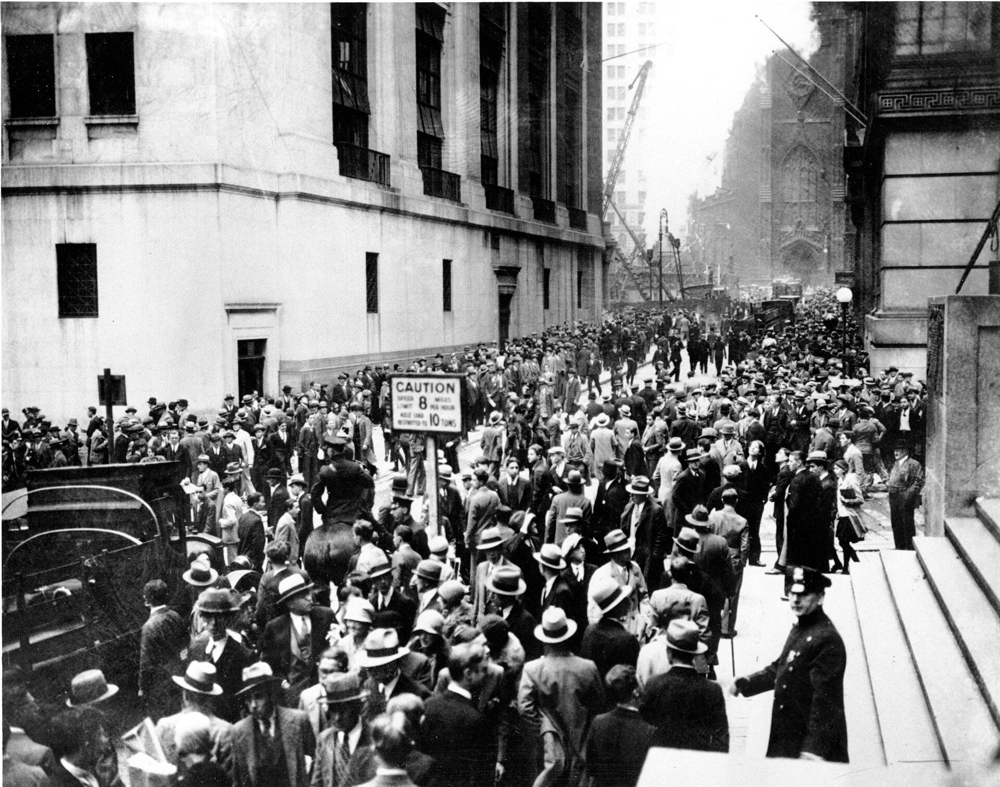{#fig-crash09 width=70%}

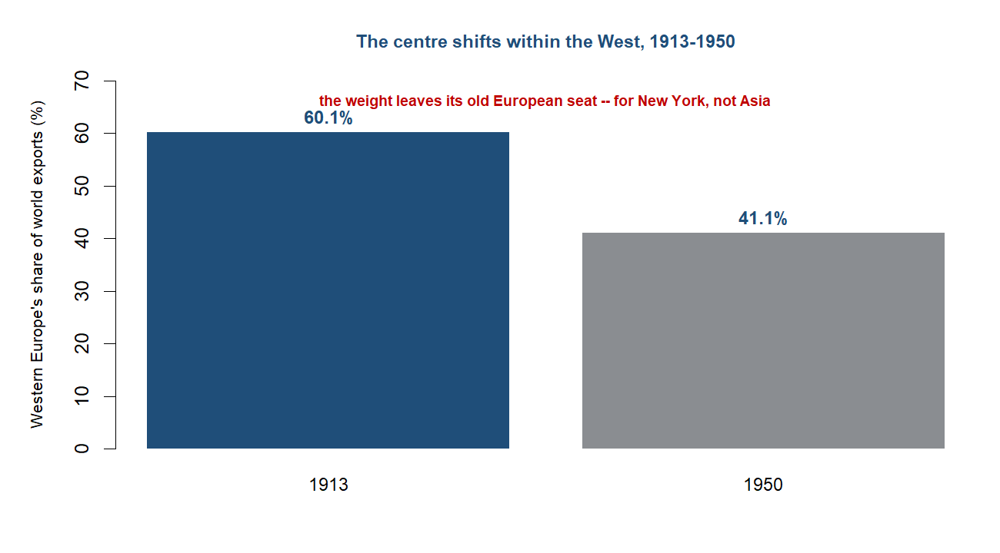{#fig-withinwest09 width=68%}

::: {.callout-note}
## How we know
There is an irony at the centre of this chapter's evidence: the great disintegration is the best-measured episode the book has yet reached. The interwar decades built the first machinery of international economic statistics --- above all the League of Nations, whose statistical service compiled and published comparable trade, production and price data across countries on a scale no earlier age could match. For the first time the historian can set economies side by side and watch them diverge in the same units: gold-standard Europe against silver China, the early-devaluing Japan against the gold bloc, the industrial core against the commodity colonies. The collapse of the world economy was documented as it happened, in tables built to a common standard.

But the bias this book has tracked does not disappear at its best-measured moment; it persists in a new form. The colonial periphery still enters the record largely as colonial aggregates --- trade and production totals compiled by imperial administrations for imperial purposes, seen through the ledger of the governing power rather than the governed economy. We can measure the commodity-price collapse that hit Burma or Ceylon with precision, because the export statistics were kept; we see far less of how the cultivators who grew the rice and the tea experienced it, except where a historian like Brown has gone behind the aggregate. Read the interwar's excellent numbers, then, knowing that their excellence is itself partly a product of the administrative machinery of empire.

*Sources: the brief and story spine on the interwar machinery of international statistics (the League of Nations) and the persistence of the colonial-aggregate bias; Brown (2005) on going behind the regional aggregate. Read more: Brown (2005), *A Colonial Economy in Crisis*; James (2002), *The End of Globalization*.*
:::

## The period on its own terms

The years from 1914 to 1945 ran as a single long unwinding, in six phases: the rupture of the Great War, the botched restoration of the gold standard, the brittle boom on American credit, the slump transmitted through gold to the world, the recovery that came in the order countries left gold, and the retreat into blocs and war that completed the destruction --- and, behind the walls, planted the seed of the rebalancing to come.

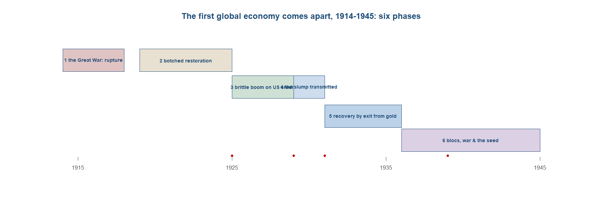{#fig-timeline09 width=92%}

**Phase 1 --- the Great War as rupture (1914--18).** The first global economy did not decay; it broke. In August 1914 the long era of progressive integration of the world economy came to an end, and the date is exact because the rupture was an event rather than a drift. The classical gold standard, which the previous chapter had shown anchoring a single international payments system, was among the first casualties of the conflict. War finance killed it directly: the belligerents imposed gold export bans, suspended convertibility, printed fiat money to pay for armies, and let their currencies float against one another for the first time in a generation. The fixed parities that had chained the price of a thing in Bombay to the price of the same thing in Liverpool were cut, and the monetary architecture on which the integration of the last chapter had rested ceased, almost overnight, to function. What had taken half a century to build was suspended in a matter of weeks.^[**Sources:** Feinstein, Temin & Toniolo (Loc 285) on August 1914 ending the long era of progressive integration; Eichengreen (Loc 386) on wartime gold export bans, fiat money and floating rates. **Read more:** Feinstein, Temin & Toniolo (2008), *The World Economy between the World Wars*.]

The scale of the destruction is hard to register from inside the period, so the cleanest measure is financial. The direct cost of the war, reckoned in constant prewar prices, came to about five times the entire worldwide national debt of 1914 --- not five times one country's borrowing, but five times the accumulated public debt of the whole trading world as it had stood on the eve of the conflict. A generation of saving and lending was consumed in four years of shellfire. The states that fought it could not pay as they went; they borrowed on a scale that dwarfed the prewar fiscal world, ran down their reserves, sold off the foreign assets their citizens had accumulated across the long peace, and printed the rest. The war did not merely interrupt the first globalisation; it burned through the financial surplus that had underwritten it, and left every major combatant poorer, more indebted, and structurally changed by how the bill had been met.^[**Sources:** Feinstein, Temin & Toniolo (Loc 569) on the direct cost of the war in constant prewar prices equalling about five times the worldwide national debt of 1914. **Read more:** Feinstein, Temin & Toniolo (2008), *The World Economy between the World Wars*.]

The deepest change the war worked was a transfer of financial leadership from London to New York, and it is the structural fact the rest of this chapter turns on. Britain had entered the war as the banker of the world economy, the hub through which the trading world cleared its accounts and the largest creditor on earth. It fought the war partly on American supplies, and to pay for them it spent heavily in the United States, financing the purchases by running down its gold reserves and selling the American securities its investors had held. By the time the United States entered the war in 1917, the relationship had reversed: the country that had been the world's creditor was now a debtor to New York, and the centre of international finance had begun the move across the Atlantic that the Depression would complete. The first global economy had cracked, and it had cracked from the centre, not the edge --- the European core fracturing within the West before the periphery felt the full weight of what was coming.^[**Sources:** Steil, *The Battle of Bretton Woods* (Page 66) on Britain spending heavily in the United States, financed by running down gold reserves and selling securities; Tooze (2014) on financial leadership passing London $\to$ New York. **Read more:** Tooze (2014), *The Deluge*.]

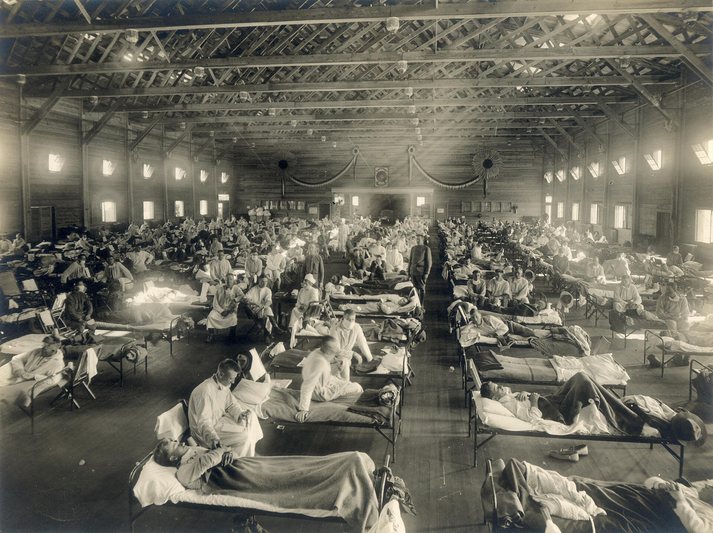{#fig-flu09 width=72%}

**Phase 2 --- the botched restoration (1919--25).** With the guns silent, the victorious powers tried to put the prewar world back together, and the attempt failed in instructive ways. The first obstacle was reparations. The bill presented to Germany was set in 1921 at 132 billion gold marks, a sum on the order of twice German national income, and the handling of the reparations problem added enormous uncertainty to the whole postwar economy. A defeated economy was asked to transfer abroad a multiple of its annual output, and the politics of extraction --- the French occupation of the Ruhr in January 1923, the cycle of default and coercion --- poisoned the cooperation on which any reconstructed international order would depend. Reparations were not a side issue; they were the rock on which the restoration's good faith broke.^[**Sources:** Eichengreen on the reparations settlement (about twice German national income) and the French entry into the Ruhr in January 1923; Feinstein, Temin & Toniolo (Loc 789) on the reparations problem adding enormous uncertainty to the postwar economy. **Read more:** Eichengreen (2008), *Globalizing Capital*.]

The currencies told the same story of a prewar order that could not simply be restored. By 1920 the pound had fallen about a quarter from its prewar parity, the French franc stood at a fraction of its 1914 value, and the German mark was sliding toward the hyperinflation of 1923 that wiped out German bank capital before it was halted that November. Austria, Hungary and Poland passed through their own currency collapses and restored convertibility only after the destruction was complete. The monetary disorder was not a temporary aftershock; it was evidence that the war had changed the underlying values any restored system of fixed parities would have to honour, and that pretending otherwise would force a reckoning.^[**Sources:** Feinstein, Temin & Toniolo (Loc 744) on the pound, franc and mark falling far below prewar parity by 1920; Eichengreen on the German hyperinflation of 1923 and the hyperinflation countries restoring convertibility. **Read more:** Feinstein, Temin & Toniolo (2008), *The World Economy between the World Wars*.]

Britain made the reckoning worse by ignoring it. In April 1925 it returned to gold at the prewar parity of $4.86 to the pound, the rate at which sterling had stood before the war, as though the intervening decade of inflation had not happened. At that parity the pound was overvalued, and an overvalued currency under a fixed-rate standard could be defended only by forcing domestic prices down to match --- deflation, unemployment, and pressure on wages and exports, all to hold a number chosen for its symbolism. This was the trap Keynes named the golden fetters: a reconstructed gold standard that bound its members to defend parities the war had made unrealistic, at the cost of their own economies. The restoration recreated the form of the prewar order without its substance. The new standard was stripped of the credibility and the central-bank cooperation that had let the old one work, and it would transmit deflation outward rather than stability.^[**Sources:** Eichengreen (Page 22) on Britain returning to gold in April 1925 at the prewar parity of $4.86 and the overvaluation it implied; the brief on the reconstructed standard stripped of prewar credibility and cooperation. **Read more:** Eichengreen (1992), *Golden Fetters*.]

**Phase 3 --- the brittle boom on American credit (1925--29).** The late-1920s recovery was real but rented. Behind the apparent return to prosperity stood a single engine: New York lending. The clearest measure is German borrowing. Between 1925 and 1928, American investors provided about 80 per cent of the money borrowed by German public credit institutions --- four-fifths of a defeated economy's public credit raised not at home but on the New York market, drawn by foreign bonds that returned two or three times what United States Treasury bonds paid. That lending was the lubricant of the whole interwar settlement, because it powered a circuit the system could not run without. The United States lent to Germany; Germany used the proceeds to pay reparations to the Allies; the Allies used the receipts to repay their war debts to the United States. Money flowed in a loop, and as long as the loop turned, reparations were paid, debts were serviced, and the brittle postwar arrangement held together.^[**Sources:** Eichengreen (Page 56) on American investors providing about 80 per cent of the money borrowed by German public credit institutions, 1925--28; Eichengreen (Page 50, 59) on foreign-government bonds returning two or three times what United States Treasury bonds paid. **Read more:** Eichengreen (2015), *Hall of Mirrors*.]

The circuit depended on the lending continuing, and it did not. From early 1928 the Federal Reserve began raising its discount rate to cool the speculation building on Wall Street, and the rising returns at home pulled American capital back out of foreign bonds and into domestic stocks. The effect on the loop was abrupt: American foreign lending fell to zero in the second half of 1928. The lubricant simply stopped. A settlement that had been kept standing by a continuous flow of New York credit lost that flow in the space of a few months, not because anything in Europe had failed but because money found a better return on Wall Street. This was, in the phrase Accominotti and Eichengreen later gave it, the mother of all sudden stops --- a textbook reversal of capital flows that left the borrowers exposed. Within a year the Wall Street crash would announce the slump, and the brittle settlement of the 1920s, already drained of the American credit that had been its lifeblood, would begin to come apart in earnest.^[**Sources:** Eichengreen (Page 60) on American foreign lending falling to zero in the second half of 1928 as the Fed tightened and Wall Street boomed; Accominotti & Eichengreen (2016) on "the mother of all sudden stops." **Read more:** Accominotti & Eichengreen (2016), "The mother of all sudden stops: capital flows and reversals in Europe, 1919--32."]

**Phase 4 --- the slump transmitted (1929--31).** The crash came first, on Wall Street, in the last week of October 1929, a series of single-day collapses that wiped out the speculative boom of the previous five years. But the crash was the trigger, not the depression itself, and what turned a financial panic in New York into a contraction across the world was the machinery that bound the world's economies together --- the reconstructed gold standard. With currencies fixed to gold and to one another, a country that lost reserves had to deflate to keep its parity, and deflation in one place pulled prices and demand down everywhere the metal circulated. The gold standard was the transmission belt: it carried the American slump outward and forced the deflation onto trading partners who had done nothing to cause it. By the trough the aggregate damage was enormous. Global output fell by something like 15 per cent between 1929 and 1932, and in the worst-hit industrial economies the fall was far steeper: United States industrial production dropped about 48 per cent and German about 39 per cent across those three years.^[**Sources:** Eichengreen (Page 281) on global GDP falling roughly 15 per cent, 1929--32, and on United States industrial production falling about 48 per cent and German about 39 per cent. **Read more:** Eichengreen (2015), *Hall of Mirrors*.]

The periphery took the blow through prices, and it took it harder than the core. The colonial economies of the Indian Ocean and beyond were price-takers in a handful of primary commodities, and when world demand collapsed the commodity markets collapsed with it, far more violently than the markets for manufactures. The numbers measured the asymmetry. Between 1929 and 1931 the price of coffee fell about 53 per cent, of tea about 62 per cent, and of rubber some 84 per cent, while the value of China's exports fell by perhaps 75 to 80 per cent. A periphery whose entire purchasing power rested on what it could sell --- Burmese and Indochinese rice, Malayan and Sumatran rubber, Ceylon tea, Brazilian coffee --- found that purchasing power cut by half, two-thirds, or more in the space of two years. Behind those aggregates lay mass defaults on rural debt and the loss of land to moneylenders, as cultivators who had borrowed against commodity incomes could no longer service the debt when the income vanished. The slump reached the colonial periphery not as falling factory output but as a terms-of-trade catastrophe that stripped the price-taker of its means.^[**Sources:** Findlay & O'Rourke (p.449) on the 1929--31 commodity-price collapse --- coffee about 53 per cent, tea about 62 per cent, rubber about 84 per cent, and Chinese export values about 75 to 80 per cent. **Read more:** Findlay & O'Rourke (2007), *Power and Plenty*, ch. 8.]

In Europe the transmission ran through the banks and then through gold. In May 1931 the Creditanstalt, Austria's largest bank, was revealed to be insolvent, and its failure set off a chain reaction through central Europe, where foreign short-term money fled the banks of one country after another. The crisis travelled along the gold-standard rails toward Britain. London lost reserves through the late summer, and on 19--20 September 1931 Britain suspended gold convertibility --- the act that, more than any other, marked the end of the reconstructed standard as a system. Sterling fell about 20 per cent against the dollar, and roughly twenty countries, most of them tied to Britain by trade and finance, followed it off gold within months. The break began to separate the world into those who had left the metal and those who clung to it, and that division turned out to predict almost everything about who recovered and who did not. The lesson the next phase would teach was already implicit in the wreckage: no country recovered while it stayed on gold.^[**Sources:** Eichengreen on the Creditanstalt failure of May 1931; Eichengreen (Loc 418) on Britain suspending gold convertibility on 19--20 September 1931, sterling falling about 20 per cent, and roughly twenty countries following; the Eichengreen--Sachs finding that no country recovered while still on gold. **Read more:** Eichengreen (2008), *Globalizing Capital*.]

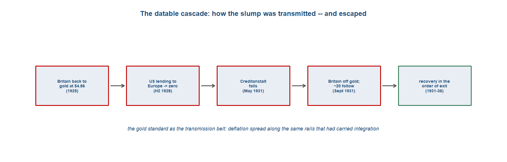{#fig-cascade09 width=88%}

**Phase 5 --- recovery in the order they left gold (1931--36).** The sharpest single finding of the interwar macro literature is also the simplest to state. Barry Eichengreen and Jeffrey Sachs, comparing the recovery paths of the 1930s, found that no country began to recover while it remained on gold, and that countries recovered in the order in which they left it. The mechanism was the same transmission belt run in reverse: a country that abandoned its gold parity could let its currency fall, stop importing deflation, ease money and reflate, while a country that defended its parity was locked into continued deflation to hold the peg. Leaving gold was not a confession of failure but the precondition of recovery, and the timing of departure --- not the depth of the initial slump, not the soundness of the banks --- was what sorted the recoveries. Of the two dozen countries off gold by 1931, only Sweden later suffered a banking crisis; exit, far from courting instability, bought it.^[**Sources:** the Eichengreen--Sachs finding that no country recovered while still on gold and that recovery followed the order of departure; Eichengreen (Page 154) on only Sweden, of the two dozen countries off gold by 1931, later having a banking crisis. **Read more:** Eichengreen (1992), *Golden Fetters*.]

Japan was the clearest demonstration. It had returned to gold only at the end of 1930 and abandoned the parity again within the year, among the earliest of the major economies to go, and the reflation that followed --- a depreciating yen, cheap money, and deficit finance under the finance minister Takahashi --- produced a swift turnaround. By 1932 Japanese real output was rising about 7 per cent, wholesale prices were up by a similar margin, and short-term interest rates had fallen from 15 per cent toward 1 per cent. At the other end stood the gold bloc, the cluster of countries --- France, the Netherlands, Switzerland, Belgium, Italy, Poland --- that defended their parities into the mid-1930s and went on deflating long after the early-leavers had turned the corner. One by one they cracked, until by 1936 the only country still on gold at its unchanged parity was Albania. The United States had occupied a middle path, suspending gold in 1933 and devaluing the dollar from $20.67 to $35 an ounce across 1933--34, a deliberate reflation that pushed the dollar down by something like 40 per cent.^[**Sources:** Eichengreen (Page 258) on Japan, off gold from late 1930, posting 1932 real GDP growth of about 7 per cent with short rates falling from 15 per cent toward 1 per cent; Eichengreen (Page 279) on Albania as the only country still on gold at unchanged parity by 1936; the dollar's devaluation from $20.67 to $35 an ounce, 1933--34. **Read more:** Eichengreen (2015), *Hall of Mirrors*.]

While currencies left gold, trade was strangled behind tariff walls. The United States raised the Smoot-Hawley tariff in 1930, lifting the duty on dutiable imports from about 38 to 45 per cent, and protection spread across the trading world: interwar foodstuff tariffs ran above 80 per cent in Germany and above 100 per cent in Bulgaria, Finland and Poland. World trade fell by something on the order of 65 per cent between 1929 and 1933, the inward spiral that Charles Kindleberger drew as a shrinking coil. How to read the tariffs is a live debate. Eichengreen and Douglas Irwin argued that 1930s protection was largely a constrained-macro response to the gold standard: countries that could not devalue, because they stayed on gold, reached for trade barriers instead as the only available defence of output and the balance of payments, so the tariffs were a symptom of the monetary trap rather than an autonomous folly. A more recent reassessment by Mitchener, O'Rourke and Wandschneider qualified that: their disaggregated evidence showed that Smoot-Hawley did provoke measurable foreign retaliation, concentrated among democracies and trading partners, reviving the tariff-spiral channel that the constrained-macro reading had downplayed.^[**Sources:** Eichengreen (Page 121) on Smoot-Hawley raising the United States dutiable tariff from 38 to 45 per cent (1930); Findlay & O'Rourke (p.448) on interwar foodstuff tariffs above 80 per cent in Germany and above 100 per cent in Bulgaria, Finland and Poland, and world trade falling roughly 65 per cent, 1929--33; the Eichengreen--Irwin "constrained response" reading against Mitchener, O'Rourke and Wandschneider on retaliation. **Read more:** Eichengreen & Irwin (2010), "The Slide to Protectionism in the Great Depression."]

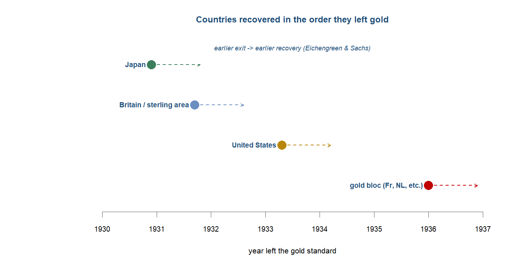{#fig-recovery09 width=80%}

**Phase 6 --- blocs, war, and the seed of rebalancing (1936--45).** What the gold standard had transmitted as deflation, policy now hardened into walls. The world trade that survived the tariff spiral fragmented, by deliberate political design, into imperial currency-and-tariff blocs. Britain's departure from gold in 1931 had created the sterling area, the bloc of countries that pegged to sterling and held their reserves in London; the Ottawa agreements of 1932 built a system of imperial preference that gave Commonwealth producers privileged access to the British market behind a common tariff; and Japan assembled a yen sphere across its expanding sphere of influence in East Asia. Trade did not merely shrink, it re-routed inward, each bloc trading with itself and shutting out the others. By 1942 trade between the three great blocs had fallen to something close to zero. The integrated single market of the first global economy, where a good's price in Bombay and Liverpool had been chained together, had been carved into mutually exclusive trading empires.^[**Sources:** Findlay & O'Rourke (p.460, p.473) on the fragmentation of trade into the sterling area, imperial preference (Ottawa, 1932) and Japan's yen sphere, with near-zero trade between the three blocs by 1942. **Read more:** Findlay & O'Rourke (2007), *Power and Plenty*, ch. 8.]

Behind the walls the periphery began to turn, and this is the paradox the Indian-Ocean vantage brings into focus. The same disintegration that wrecked the commodity exporters also loosened the colonial trade ties that had subordinated Asia in the first place. When European manufactures grew dear or scarce behind the blocs, the markets they had dominated were opened to others, and India's import-substituting industrialisation --- already nudged upward by the trade disruption of the Great War --- accelerated. The cleanest single number comes from the cotton trade. Japan's share of India's cotton-yarn imports rose from about 2 per cent in 1913 to roughly 46 per cent by 1923, as Japanese mills displaced Lancashire in a market Britain had treated as captive. This was intra-Asian substitution: as Europe withdrew or priced itself out, Asian producers filled the gap, and the periphery acted rather than merely absorbing the slump. The thesis should not be overstated --- the gains were real but partial and uneven, and the colonial economies remained subordinate in aggregate --- but the direction of travel had reversed.^[**Sources:** Roy (p.211) on Japan's share of India's cotton-yarn imports rising from about 2 per cent (1913) to roughly 46 per cent (1923), as intra-Asian substitution replaced European supply; the periphery-empowerment thesis taught as real but partial. **Read more:** Roy (2012), *India in the World Economy*.]

Then came the second war, and it completed what the first had begun. The conflict of 1939--45 destroyed what remained of the European-centred order: the productive heart of Europe was wrecked, its empires were drained and discredited by defeat and occupation, and the financial leadership that had passed from London to New York in the first war now settled unambiguously on the United States. By 1945 the European order lay in ruins, the United States stood as the ascendant core of whatever would replace it, and the colonial empires were crumbling --- the seed of the post-1945 rebalancing that the next chapter takes up. This is also where the chapter's open question of periodisation bites hardest. If the disintegration of 1914--45 not only hammered Asia but began to loosen its subordination --- India's industrialisation, Japan's displacement of Lancashire, the first intra-Asian substitution --- then the Asian re-rise arguably began here, in the interwar wreckage, and ran continuously to the East Asian miracles, China after 1978 and India after 1991. On that reading 1945 may be an arbitrary break-line, and the real arc of the rebalancing runs from 1914 to the 1970s and 1990s. The question is left open, to be settled when the module returns to it.^[**Sources:** Findlay & O'Rourke on the second war completing the destruction of the European-centred order and the United States as ascendant core by 1945; the brief's open periodisation question of whether 1945 is the right break-line or the arc runs 1914 to the 1970s--90s. **Read more:** Findlay & O'Rourke (2007), *Power and Plenty*, ch. 8.]

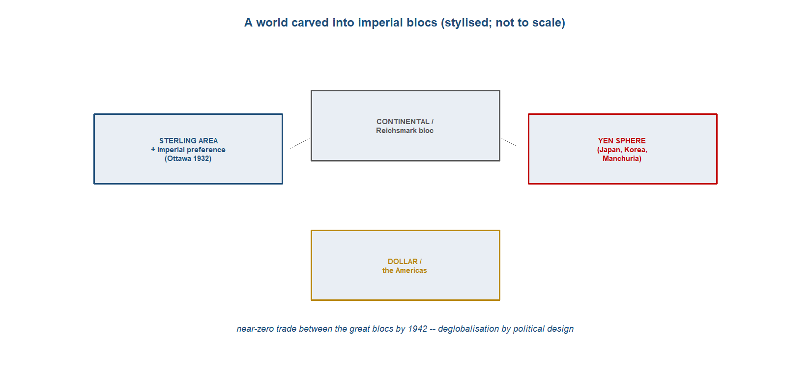{#fig-blocs09 width=90%}

## Reading the period: the four questions

The same four questions that organised the last chapter organise this one, but the toolkit now runs in reverse, because the integration it measures had gone into reverse. Where the last chapter asked how a Euro-centred order globalised the world, this one asks how that order came apart between 1914 and 1945 --- and the answers, taken in turn, are the mirror image of the first global economy's.

On direction, the period broke the pattern of the whole book. For the first time in the arc this study has traced, the world economy decisively disintegrated. The yardstick is the one the last chapter relied on --- the gap between the price of a commodity in two distant markets --- and now it widens instead of closing. The Great War alone blew the gaps back open on a scale that erased decades of convergence: the spread between London and Rangoon rice ran from about 27 per cent before the war toward roughly 400 per cent during it, as real ocean freight rates tripled and the integrated market of 1913 fragmented. The precise figures are fragile and should be read for their order of magnitude rather than to the decimal point, but the qualitative point is not in doubt: a half-century of patient integration was undone, and the London-Rangoon rice gap reverted toward levels not seen since the 1870s. The Depression then drove the second collapse. World manufactured trade fell about 42 per cent between 1929 and 1932, and across the interwar decades trade grew only about 0.7 to 1 per cent a year, against 3.8 per cent between 1855 and 1913. The lesson the direction teaches is fragility: integration was never a ratchet. It could run backwards, and it did.^[**Sources:** Findlay & O'Rourke (p.434) on the wartime rice gap and tripled freight rates; Findlay & O'Rourke (p.458) on manufactured trade falling about 42 per cent (1929--32) and interwar trade growth of 0.7--1 per cent a year against 3.8 per cent (1855--1913); Hynes, Jacks & O'Rourke (2012) on the rice gap reverting toward pre-1870 levels, taught as a qualitative result given fragile point estimates. **Read more:** Hynes, Jacks & O'Rourke (2012), "Commodity Market Disintegration in the Interwar Period."]

On channels, the disintegration was not a failure of the ships but a decision about where they were allowed to sail. The sea lanes that the steamship and Suez had opened did not close; the freighters still ran. What changed was that maritime trade fragmented by political design into imperial currency-and-tariff blocs --- the sterling area and imperial preference, the continental autarky of the Reich, and Japan's yen sphere --- each turning its trade inward behind preference and exchange control. Japan's exports to Korea and China rose from about a third of its total to roughly two-thirds, and by 1942 there was near-zero trade between the great blocs. The overland channel stayed marginal, as it had throughout the maritime age. The decisive point is that deglobalisation here was a policy outcome and not a technological one: the cost of crossing an ocean had never been lower, and the world chose to trade less anyway.^[**Sources:** Findlay & O'Rourke (p.460, p.473) on Japan's exports to Korea and China rising from about a third to two-thirds of the total and near-zero inter-bloc trade by 1942; the brief on the sterling area, imperial preference and the yen sphere as deglobalisation by political design. **Read more:** Findlay & O'Rourke (2007), *Power and Plenty*.]

The question of where the centre lay is the one with the sharpest answer, and it belongs before the modes, because the modes lead into the mechanism that carried the whole collapse. The European-centred order of the last chapter cracked --- but the centre did not move to Asia. The decisive shift was within the West, as financial leadership passed from London to New York and the United States emerged as the ascendant core, the swing creditor on whose lending the interwar system had come to depend. The aggregate confirms it: Western Europe's share of world exports fell from 60.1 per cent in 1913 to 41.1 per cent in 1950, the clearest single sign that the weight of the world economy was leaving its old European seat. It left, though, for a Western successor and not an Asian one. Asia in aggregate remained a subordinate periphery, hammered by the commodity collapse and the 1918 influenza, even as --- the chapter's quiet turn --- the cracking of the colonial trade ties began to loosen its subordination.^[**Sources:** Feinstein, Temin & Toniolo (Loc 304) on Western Europe's share of world exports falling from 60.1 per cent (1913) to 41.1 per cent (1950); the brief and Tooze (2014) on financial leadership passing from London to New York. **Read more:** Tooze (2014), *The Deluge*.]

On modes --- how exchange was settled --- all three flows of globalisation unwound together, and following them leads to the machine that drove the deflation. Goods went first and most visibly, in the trade collapse. Capital went with them, as the classical gold standard broke and lending dried up --- the interwar trough of what was, across the whole century, a U-shaped pattern of capital mobility: high before 1914, suppressed between the wars in a sudden stop, and high again only after the 1970s. People followed: from August 1914 migration turned from an economic flow into a political one, governed thereafter by passports, restriction and quotas rather than by wage gaps. And to see how a slump in one country became a slump in all of them, follow the money. The reconstructed gold standard was the transmission belt that carried deflation around the world.^[**Sources:** Eichengreen on the U-shaped century of capital mobility (high pre-1914, suppressed interwar, high again since the 1970s); the brief on migration turning political from 1914 and the gold standard as the transmission mechanism of interwar deflation. **Read more:** Eichengreen (2008), *Globalizing Capital*.]

::: {.callout-important}
## Follow the money
This is the chapter where "follow the money" means follow the gold standard, because the reconstructed standard was the transmission belt that carried the Depression around the world. Under fixed parities, a country that lost gold had to deflate to defend its peg, and deflation in one place pulled prices and demand down everywhere the metal circulated --- so a slump that began on Wall Street in 1929 became, through the mechanics of gold, a slump in Berlin, London and Rangoon. The datable cascade ran from Britain's overvalued return to gold at $4.86 in 1925, through the collapse of American lending to zero in the second half of 1928, to the Creditanstalt failure of May 1931 and Britain's exit from gold that September. And the escape ran the same belt in reverse: the sharpest single finding of the interwar literature is that no country recovered while it stayed on gold, and that countries recovered in the order they left it. Japan, off gold by the end of 1930, was posting real growth of about 7 per cent by 1932 while the gold bloc was still deflating. The metal that had anchored the first global economy's integration became the chain along which its disintegration spread.

*Sources: Eichengreen & Sachs (1985) on recovery following the order of departure from gold ("no country recovered while still on gold"); Eichengreen (1992) on the gold standard as the transmission mechanism, the 1925 return at $4.86, and Japan's 1932 recovery. Read more: Eichengreen (1992), *Golden Fetters*; Eichengreen (2008), *Globalizing Capital*.*
:::

## The verdict: where was the centre?

The verdict of this chapter is that the European-dominant order cracked, but the centre did not move to Asia --- not yet. The decisive shift was within the West: financial leadership passed from London to New York, and the United States rose as the ascendant core of a successor order that was still, unmistakably, a Western one. On this much the confidence is high. The aggregate evidence --- Western Europe's collapsing export share, the gold-bloc's dependence on American lending, the swing of creditor power across the Atlantic --- points one way, and Asia in aggregate stayed subordinate throughout, battered by the commodity collapse and, in the worst single blow, by the 1918--19 influenza that killed somewhere between twelve and eighteen million people in India, the worst-hit region on earth.^[**Sources:** Feinstein, Temin & Toniolo (Loc 304) on the fall in Western Europe's export share; Mills (1986) and the brief on the 1918 influenza killing about twelve to eighteen million in India; Tooze (2014) on the London-to-New-York shift. **Read more:** Tooze (2014), *The Deluge*.]

The Indian-Ocean vantage adds the twist the aggregates hide. The same disintegration that hammered the colonial periphery also began to loosen the very trade ties that had subordinated it. Behind the tariff walls and the broken markets, India's import-substituting industrialisation took root from the 1920s, and Japan's industrial output roughly doubled between 1932 and 1939. The one hard interior number captures the mechanism: Japan's share of India's cotton-yarn imports rose from about 2 per cent to 46 per cent between 1913 and 1923, as intra-Asian suppliers stepped into the space a withdrawing Europe had vacated. This was the periphery acting, not merely absorbing the slump --- and it was the seed of the rebalancing that the next chapter records.^[**Sources:** Roy (p.211) on Japan's share of India's cotton-yarn imports rising from 2 per cent to 46 per cent (1913--23); the brief on India's ISI from the 1920s and Japan's output doubling 1932--39. **Read more:** Roy (2012), *India in the World Economy*.]

The empowerment thesis is real, but it should be held within bounds. It was partial and uneven, and it was not a wholesale Asian industrial take-off. J. C. Brown's study of Burma's rice delta is the standing caution: the effects of the disintegration varied by region, by actor and over time, so that the periphery's "victims" were neither uniformly ruined nor uniformly empowered. To read the interwar as Asia's industrial breakthrough would overstate a turn that was, in this period, still only a beginning.^[**Sources:** the brief on the empowerment thesis as real but partial and uneven; Brown (2005) on the periphery's experience of the slump varying by region, actor and over time. **Read more:** Brown (2005), *A Colonial Economy in Crisis*.]

That beginning raises the question the book parks for its close. If the Asian re-rise starts here, in the interwar disruption, then 1945 may be the wrong place to draw the line. The real arc could run continuously from the rupture of 1914 to the East Asian miracles, China after 1978 and India after 1991 --- a single long swing rather than two periods divided at the war's end. The next chapter takes up the resolution: the US-led Bretton Woods order rebuilt globalisation, decolonisation ran its course, and the centre of gravity at last began its return to Asia.^[**Sources:** the brief and story spine on the parked periodisation question (1945 versus a 1914-to-1970s/90s arc) and the hand-off to the US-led Bretton Woods rebuild. **Read more:** Tooze (2014), *The Deluge*; Findlay & O'Rourke (2007), *Power and Plenty*.]

::: {.callout-warning}
## The debate: gold standard, or the Fed? And was the periphery's ruin uniform?
Two controversies sit at the heart of this period. The first is the cause of the Depression. The regime view, associated with Barry Eichengreen and Peter Temin, holds that the reconstructed gold standard transmitted deflation worldwide and that leaving it was the route to recovery --- the system was the culprit. Against this, Milton Friedman and Anna Schwartz located the disaster in domestic policy: a passive Federal Reserve that let the American money supply collapse through the banking panics, a failure of monetary management rather than of the international regime. Bordo, Choudhri and Schwartz later tested whether the Fed could have reflated within the gold standard's constraints, staging the dispute on the gold standard's own terms. A more world-economy-productive framing sets Karl Polanyi against Eichengreen: was the collapse an endogenous "double movement," the self-regulating market failing of its own logic and provoking society's protective counter-movement, or an avoidable policy error that better institutions could have escaped? Same evidence, opposite lesson --- the system on trial, or the policymakers.

The second controversy is about the periphery. The orthodox account makes the single-commodity colonial producer the passive victim of the price collapse, devastated wholesale. J. C. Brown's study of Burma's rice delta complicated that: the effects of the slump varied by region, by actor and over time, and the "victims" adapted --- restructured, switched, held on or lost their land --- rather than suffering uniformly. The caution matters for the chapter's own empowerment thesis too: the periphery's interwar turn was real, but partial and uneven, and not to be read as a wholesale Asian take-off.

*Sources: Eichengreen (1992) and Friedman & Schwartz (1963) on the gold-standard-versus-Fed debate; Bordo, Choudhri & Schwartz (2002) on the feasibility test; Polanyi (1944) on the double movement; Brown (2005) on the uneven periphery. Read more: Eichengreen (1992), *Golden Fetters*; Brown (2005), *A Colonial Economy in Crisis*.*
:::

::: {.column-page}
**Data exhibit --- the yardstick run in reverse.** The chapter's empirical centrepiece is the last chapter's centrepiece inverted: the commodity-price gaps that closed across the first globalisation blew back open between the wars. The London-Rangoon rice gap, which had narrowed toward 26 per cent by 1913, was driven by the Great War toward 400 per cent and reopened again in the slump toward levels not seen since the 1870s; manufactured trade fell about 42 per cent between 1929 and 1932, and interwar trade grew only about 0.7 to 1 per cent a year against 3.8 per cent in the half-century before 1914. The precise magnitudes are series-dependent and should be read for their order of magnitude, not to the decimal point; the qualitative result is what matters. *What you could do with this:* take the Hynes-Jacks-O'Rourke commodity-gap series and set the interwar reopening directly against the pre-1914 convergence of the last chapter --- one figure, run forward then backward, that captures integration and its undoing in a single line.

:::

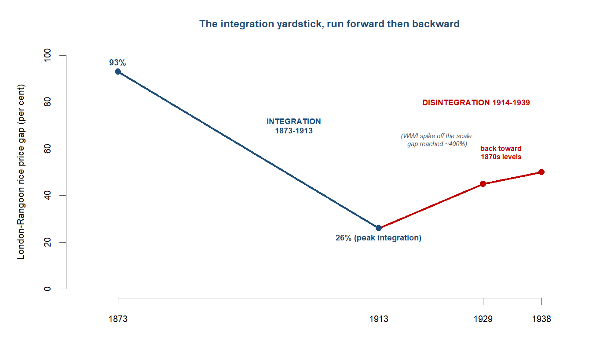{#fig-yardstick09 width=72%}

::: {.callout-note}
## Research in focus --- Hynes, Jacks & O'Rourke (2012): commodity-market disintegration
*Aim.* To measure interwar deglobalisation directly, by running the price-convergence yardstick of the first global economy in reverse. *Question.* Did the integration of commodity markets achieved before 1914 actually unwind between the wars, and by how much? *Data and method.* Reconstruction of long-run intercontinental commodity-price gaps (such as the London-Rangoon rice spread), tracking whether the differentials that had narrowed before 1914 re-opened after it. *Findings.* Intercontinental price gaps blew back open, reversing a half-century of integration and signalling a genuine disintegration of world markets rather than merely a fall in trade volumes. *Caveats.* The precise magnitude --- how far back toward pre-1870 levels the gaps reverted --- is sensitive to which price series and routes are used, so the qualitative point (integration undone) is firmer than any single point estimate.
:::

## Threads forward

The chapter ends in ruins, and on a turn. By 1945 the European-centred order lay shattered: two wars, the Depression, deglobalisation and the imperial blocs had broken it; financial leadership had passed to the United States; and the colonial empires were crumbling. The next chapter picks up as a new US-led order --- the Bretton Woods system designed in 1944 --- rebuilds globalisation on different terms, decolonisation runs its course, and the centre of gravity at last begins its long return to Asia: the East Asian miracles, China after 1978, India after 1991. The disintegration of this chapter was the turning point between the peak of European dominance and the Asian rebalancing that the book closes on.^[**Sources:** the brief's hand-off to the post-1945 US-led Bretton Woods order and the centre's return to Asia. **Read more:** Findlay & O'Rourke (2007), *Power and Plenty*; James (2002), *The End of Globalization*.]

The chapter also hands forward an unresolved question. If the Asian re-rise began here --- in India's interwar industrialisation, in Japan's displacement of Lancashire, in the first intra-Asian substitution behind the broken trade ties --- then 1945 may be an arbitrary place to divide the story, and the real arc of the rebalancing may run continuously from the rupture of 1914 to the East Asian miracles of the 1970s, China's opening in 1978 and India's in 1991. The book parks the periodisation question here deliberately, to be settled when the final chapter takes up the rebalancing and the whole arc can be seen at once. What this chapter establishes is only that the turn began in the wreckage --- that disintegration, for the periphery this book follows, was paradoxically the beginning of the end of subordination.^[**Sources:** the brief and story spine on the parked periodisation question (1945 versus a 1914-to-1970s/90s arc); Bonfatti & Brey (2023) on disintegration loosening colonial subordination. **Read more:** Bonfatti & Brey (2023); Findlay & O'Rourke (2007), *Power and Plenty*.]

---

## Classic research: the foundations {.unnumbered}

The interwar collapse generated a literature whose central frame remains the gold standard, set against the historians who complicated the simple story of uniform ruin. The works below are the paradigm-setters this chapter argues with.

- **Eichengreen (1992)**, *Golden Fetters: The Gold Standard and the Great Depression, 1919--1939* --- the paradigm account: a reconstructed interwar gold standard, stripped of pre-war credibility and central-bank cooperation, transmitted deflation worldwide and turned a downturn into a depression.
- **Eichengreen & Sachs (1985)**, "Exchange Rates and Economic Recovery in the 1930s" --- the sharpest classroom datum: no country recovered while still on gold, and recovery came in the order in which countries left it (*Journal of Economic History*; via JSTOR).
- **Friedman & Schwartz (1963)**, *A Monetary History of the United States, 1867--1960* --- the rival pole of the debate: the Depression as a domestic US-monetary-policy failure, a passive Federal Reserve allowing the money supply to collapse, rather than a gold-standard one.
- **Feinstein, Temin & Toniolo (2008)**, *The World Economy between the World Wars* --- the standard interwar-macro synthesis, framing the Depression as a regime problem and supplying the headline measure of the Western shift (Western Europe's export share falling from 60.1 per cent in 1913 to 41.1 per cent by 1950).
- **James (2002)**, *The End of Globalization: Lessons from the Great Depression* --- the three-flows framing this chapter uses: deglobalisation as the simultaneous unwinding of goods, capital and people, not trade alone.
- **Brown (2005)**, *A Colonial Economy in Crisis: Burma's Rice Delta and the World Depression of the 1930s* --- the periphery-revision: the slump's effects varied by region, actor and over time, and the "victims" adapted (through indebtedness, foreclosure and the passage of land to moneylenders), the case against any uniform-devastation account.
- **Polanyi (1944)**, *The Great Transformation* --- the endogenous "double movement": the self-regulating market and the gold standard failed of their own logic, putting the system rather than mere policy error on trial.

## At the research frontier: recent cliometric work {.unnumbered}

The discipline's action for this period sits in three places: measuring the rise and fall of trade with new long-run series, treating the gold standard as the transmission mechanism through which the slump spread, and identifying where disintegration empowered the periphery. The recent-first work below maps onto those threads.

- **Bolt & van Zanden (2024)**, "Maddison-style estimates of the evolution of the world economy: A new 2023 update," *Journal of Economic Surveys* --- the latest Maddison Project GDP series, used here to size the contraction and the within-West centre-of-gravity shift. [DOI 10.1111/joes.12618](https://doi.org/10.1111/joes.12618)
- **Bonfatti & Brey (2023)**, "Trade Disruption, Industrialisation, and the Setting Sun of British Colonial Rule in India," *Journal of the European Economic Association* --- the periphery-empowerment mechanism identified: wartime and interwar trade disruption raised Indian industrialisation, which in turn fed anti-colonial nationalism; the chapter's strongest interior evidence. [DOI 10.1093/jeea/jvad054](https://doi.org/10.1093/jeea/jvad054)
- **Mitchener, O'Rourke & Wandschneider (2022)**, "The Smoot-Hawley Trade War," *The Economic Journal* --- new disaggregated evidence that Smoot-Hawley did trigger measurable foreign retaliation, concentrated among democracies and trading partners, reviving the tariff-spiral channel against the constrained-macro reading. [DOI 10.1093/ej/ueac006](https://doi.org/10.1093/ej/ueac006)
- **Accominotti & Eichengreen (2016)**, "The mother of all sudden stops: capital flows and reversals in Europe, 1919--32," *Economic History Review* --- the capital-flow leg of the unwind: US lending surged and then sharply reversed, transmitting the crisis to Europe in a classic boom-and-sudden-stop. [DOI 10.1111/ehr.12128](https://doi.org/10.1111/ehr.12128)
- **Hynes, Jacks & O'Rourke (2012)**, "Commodity market disintegration in the interwar period," *European Review of Economic History* --- the integration yardstick run in reverse: intercontinental commodity-price gaps blew back open, undoing a half-century of convergence. [DOI 10.1093/ereh/her009](https://doi.org/10.1093/ereh/her009)
- **Eichengreen & Irwin (2010)**, "The Slide to Protectionism in the Great Depression: Who Succumbed and Why?," *Journal of Economic History* --- tariffs as a constrained-macro response rather than autonomous folly: countries that stayed on gold, and so could not devalue, turned instead to trade restriction. [DOI 10.1017/s0022050710000756](https://doi.org/10.1017/s0022050710000756)
- **Estevadeordal, Frantz & Taylor (2003)**, "The Rise and Fall of World Trade, 1870--1939," *Quarterly Journal of Economics* --- the canonical gravity-model decomposition: the pre-1914 boom and its interwar collapse explained by transport costs, the gold standard and commodity-market integration, with rising tariffs and the gold standard's demise driving much of the fall. [DOI 10.1162/003355303321675419](https://doi.org/10.1162/003355303321675419)
- **Bordo, Choudhri & Schwartz (2002)**, "Was Expansionary Monetary Policy Feasible during the Great Contraction? An Examination of the Gold Standard Constraint," *Explorations in Economic History* --- a counterfactual test of whether the US Fed could have reflated within the gold standard's constraints, staging the Friedman-Schwartz versus Eichengreen-Temin debate on the gold standard's own terms. [DOI 10.1006/exeh.2001.0778](https://doi.org/10.1006/exeh.2001.0778)


---

### Questions for consideration {.unnumbered}

*Essay / exam style --- reward the four-questions toolkit and the live debate, not recall.*

1. "Integration is not a ratchet." Use the interwar evidence on commodity-price gaps and trade volumes to assess how far, and how fast, the first globalisation could be undone.
2. Was the Great Depression caused by the gold standard (Eichengreen, Temin) or by domestic monetary-policy failure (Friedman & Schwartz)? What turns on the answer?
3. "Countries recovered in the order they left gold." Explain the mechanism, and what it implies about the gold standard's role in the slump.
4. Did deglobalisation devastate the colonial periphery uniformly? Assess Brown's revision against the orthodoxy of single-commodity ruin.
5. In what sense did the disintegration of 1914--45 *empower* the Asian periphery? How far should the claim be pressed?
6. Is 1945 the right place to divide the story of the twentieth-century world economy, or does the Asian rebalancing begin in this chapter?

::: {.callout-tip}
## Cross-cutting questions (collected at the end of the book)
The book closes with a bank of questions spanning several chapters. Those this chapter feeds:

- When does the "centre of gravity" shift, and can it shift *within* a region (London $\to$ New York) without moving between them? (Chapters 8, 9, 10.)
- Was integration into the world economy a ratchet, or could it run backwards? (Chapters 8, 9.)
- Did the disruption of colonial trade ties help or hinder the periphery's long-run rise? (Chapters 9, 10.)
:::

### Data exercise {.unnumbered}

```{r}
#| label: ch-09-exercise
#| eval: false
# Disintegration: the integration yardstick run in reverse (datasets_by_topic.md, Topic 9).
# 1. Take an intercontinental commodity-price-gap series (e.g. London-Rangoon rice) for
#    benchmark years 1913, 1918, 1929, 1933, 1938.
# 2. Plot it together with the pre-1914 convergence from the previous chapter, on one axis.
# 3. Overlay the dates countries left gold (Japan 1930; Britain 1931; US 1933; gold bloc 1936)
#    and the recovery dates; does departure predict recovery?
# 4. Discuss: integration ran forward 1870-1913 and backward 1914-39. What does the round trip
#    imply about whether globalisation is a ratchet or a reversible policy outcome?
```

### Key data {.unnumbered}

| Figure | Value | Source |
|---|---|---|
| Western Europe's share of world exports, 1913 -> 1950 | 60.1% -> 41.1% | Feinstein, Temin & Toniolo |
| Global GDP, 1929--32 | fell ~15% | Eichengreen / Maddison |
| US industrial production, 1929--32 | fell ~48% (German ~39%) | Eichengreen |
| Commodity-price collapse, 1929--31 | rubber -84%; tea -62%; coffee -53%; China exports -75 to -80% | Findlay & O'Rourke |
| London-Rangoon rice gap, peace -> WWI | ~27% -> ~400% | Findlay & O'Rourke |
| Britain returns to gold | April 1925, at $4.86 | Eichengreen |
| Britain leaves gold | 19--20 Sept 1931 (sterling -20%; ~20 follow) | Eichengreen |
| Smoot-Hawley tariff on dutiable imports, 1930 | 38% -> 45% | Eichengreen |
| World trade, 1929--33 | fell ~65% | Findlay & O'Rourke |
| Japan: 1932 real GDP (off gold Dec 1930) | +7% | Eichengreen |
| Japan's share of India's cotton-yarn imports, 1913 -> 1923 | 2% -> 46% | Roy |
| 1918--19 influenza deaths, India | ~12--18 million (worst-hit country) | Mills (1986) |

### Further reading {.unnumbered}

- **Core:** Eichengreen (1992), *Golden Fetters*; Findlay & O'Rourke (2007), *Power and Plenty*, ch. 8; Feinstein, Temin & Toniolo (2008), *The World Economy between the World Wars*.
- **Supplementary:** Eichengreen (2008), *Globalizing Capital*; James (2002), *The End of Globalization*; Tooze (2014), *The Deluge*; Roy (2012), *India in the World Economy*; Tomlinson (1993), *The Economy of Modern India*.
- **The debate:** Eichengreen (1992) vs Friedman & Schwartz (1963) on the gold standard versus the Fed; Polanyi (1944), *The Great Transformation*; Brown (2005), *A Colonial Economy in Crisis* on the uneven periphery; Bonfatti & Brey (2023) on disintegration and Indian industrialisation.
