# The Asian rebalancing: the arc comes home {#sec-ch10}

::: {.callout-important appearance="simple"}
**Preliminary draft --- under review.** Published for review; content, figures and citations may still change.
:::

> *"It does not matter whether a cat is black or white, so long as it catches mice."* --- Deng Xiaoping, on reform pragmatism.
>
> *"The West first bought itself a third-class seat on the Asian economic train, then leased a whole railway car, and only in the nineteenth century managed to displace Asians from the locomotive."* --- Andre Gunder Frank, *ReORIENT*, 1998.

::: {.chapter-subtitle}
The centre returns east --- partially, recently, and within a Western-built order.
:::

## Follow one thing {.unnumbered}

Follow the box. For nine chapters the thing to follow has been a good or a coin --- Roman pepper, the silver real, Lancashire cloth, the price of rice in two distant ports. This last chapter follows a plain corrugated-steel container, eight feet by eight by forty, because that dull object is the mechanism of the period. Before it, loading a ship was slow, costly and theft-ridden, and an ocean was an expensive thing to put between a factory and its market; after it, a manufacturer in Shenzhen could place a good on a shelf in Ohio for a few cents on the dollar of its value, and distance stopped deciding where things were made. The container did to the twentieth-century ocean what the steamship and the telegraph had done to the nineteenth: it collapsed the cost of connection, and in doing so it let production move to wherever labour was cheapest and most plentiful --- which, with the two demographic giants reopening, meant Asia. The box is how the workshop of the world came home. But it is also a warning against a simple story, because the box was an American invention, sailing under an American-anchored order, carrying goods bought above all by American consumers and paid for, in the end, with Asian savings lent back to the West. Follow the box and you find the chapter's double lesson at once: the centre of production swung back to Asia, and it did so inside a system the West had built.^[**Sources:** Levinson (2006) on containerisation slashing shipping costs and reorganising world trade, "paving the way for Asia to become the world's workshop"; Baldwin (2016) on cheap shipping and information technology relocating production to a handful of Asian economies. **Read more:** Levinson (2006), *The Box*; Baldwin (2016), *The Great Convergence*.]

## Where we are on the arc {.unnumbered}

This is the final chapter, and the module's payoff. For six chapters the centre of economic gravity sat in Asia; the seventh was the turning point at which it moved west; the eighth was the peak of European dominance, resting on a colonial Indian-Ocean periphery; the ninth was the order cracking, with leadership passing within the West from London to New York. This chapter asks whether the weight now swings back to Asia --- and if so, how far, and in what sense. The answer is the spine's resolution: the aggregate centre is measurably returning east. A US-led order rebuilt globalisation after 1945; the colonial empires dissolved; and the two demographic giants, China and India, rejoined the world economy, until by the 2010s China was the world's largest manufacturer and the computed centre of gravity had begun drifting back toward where it had sat in 1500. That vindicates the long-run reading --- Asia central, a European interruption, the return --- but it comes with three honest qualifications that keep the framing calibrated rather than triumphalist: the return is partial (aggregate weight, not yet income per head), it is recent, and it was built on a Western-anchored order. The workshop returns; the income gap persists.^[**Sources:** Quah (2011) on the computed economic centre of gravity drifting from the mid-Atlantic (1980) toward India--China (about 2050); Maddison (2007) on the long-run shares (China and India between a half and three-fifths of world output to about 1700). **Read more:** Quah (2011), "The Global Economy's Shifting Centre of Gravity"; Maddison (2007), *Contours of the World Economy*.]

{#fig-cog10 width=85%}

## The stage and the cast

The return did not run in a straight line. It ran in two phases with a turning point between them, and getting the turning point right is half of understanding the period. First came closure: in the quarter-century after 1945 the newly independent periphery turned inward, reaching for import-substituting industrialisation to build behind tariff walls the industries empire had suppressed, while the rich economies opened to one another --- the exact inverse of the nineteenth century, when Europe had forced free trade on a protected Asia. India is the cleanest measure of the closure: its share of world exports fell from 2.6 per cent in 1948 to 0.7 per cent by 1970. Then came the turning point of 1971--73 --- the dollar's gold link cut, the oil price quadrupled, the major currencies floated, the container spread --- and after it the comeback: reglobalisation, China's opening in 1978, India's in 1991, and the measurable return of Asian weight. The cast below runs east to west, from the giants whose reopening is the story, through the oil pole that re-centred the Indian Ocean, to the Western cores whose relative descent is the period's other half. India, the book's vantage throughout, is profiled most fully.^[**Sources:** Roy (2012) on India's world-export share falling from 2.6 per cent (1948) to 0.7 per cent (1970) under import substitution; Garten (2021) and Frankopan (2015) on the 1971--73 cluster (the gold window, the float, the oil shock). **Read more:** Frieden (2006), *Global Capitalism*; Roy (2012), *India in the World Economy*.]

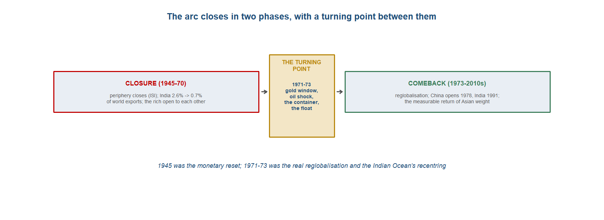{#fig-hinge10 width=92%}

::: {.callout-tip}
## Dramatis personae
The economic actors of 1945--2010s, east to west, and what changed since the last chapter. **India appears in every chapter, profiled most fully.**

- **China** --- the silent giant: closed under Mao, opened in 1978, the world's largest manufacturer by 2010.
- **Japan and the Four Tigers** --- the export-led industrialisers; the developmental-state versus market-friendly debate.
- **India** --- the deepest retreat (export share 2.6 per cent $\to$ 0.7 per cent) and a knowledge-led return after 1991.
- **The Gulf** --- oil makes the Indian Ocean an energy-and-capital pole again; South Asian labour migrates there.
- **Western Europe** --- no longer the centre: reconstruction, then integration; one of several cores.
- **The United States** --- the hegemon-anchor of the new order, and the debtor core underwritten by Asian savings.
:::

::: {.callout-tip collapse="true"}
## China --- the silent giant that becomes the workshop

China spent the first three decades of this chapter outside the world economy almost entirely. Under Mao the People's Republic was a closed, planned economy, its foreign trade thin and bilateral, its development model autarkic in spirit even where it imported Soviet machinery; the country that had been the production-centre of the pre-modern world was, in the 1950s and 1960s, a bystander to the long boom going on around it. Richard von Glahn's account of the long arc of Chinese economic history reads the Maoist decades as a deep trough in China's external engagement, the low point of a country that had once supplied silk and porcelain to the whole of Eurasia. The silent giant was silent by choice of policy, and the silence is what makes the opening that follows so abrupt.^[**Sources:** von Glahn (2016) on the closed, planned Maoist economy and its place in the long arc of Chinese external engagement. **Read more:** von Glahn (2016), *The Economic History of China*.]

The turn came in 1978. Under Deng Xiaoping the leadership began to dismantle the planned model from the edges inward --- decollectivising agriculture, admitting market prices, and, decisively for the world economy, opening the coast to foreign trade and investment through the special economic zones, the fenced enclaves in which export manufacturing could operate on near-world terms behind the wall of the wider closed system. Jeffrey Frieden's history of twentieth-century global capitalism treats the Chinese opening as one of the great events of the period's reglobalisation: the world's most populous economy choosing, after thirty years out, to rejoin the international division of labour as a maker of goods. The reopening was gradual and controlled, a market economy grown inside one-party rule rather than imposed in a single stroke, but its direction never reversed.^[**Sources:** Frieden (2006) on the 1978 Chinese opening under Deng, the special economic zones and the rejoining of the world economy. **Read more:** Frieden (2006), *Global Capitalism*.]

What made the opening into a transformation was the engine underneath it: an extraordinary rate of saving and investment poured into export capacity. At its peak China was saving and investing on the order of half of its national income, and it sustained growth of roughly 10 per cent a year over a span no large economy had matched. Barry Eichengreen, surveying the modern monetary order, set the Chinese figures against the rest of the system, with labour productivity rising about 6 per cent a year while the currency was held near-static --- the combination that made Chinese manufactures cheap and Chinese export volumes vast. The container made the rest possible: cheap, reliable shipping turned the coastal zones into the assembly floor of the world, and the saving rate built the factories that filled the ships.^[**Sources:** Eichengreen (*Globalizing Capital*, Loc 1415, 1418, 1328) on China saving and investing roughly half of GDP, growth sustained near 10 per cent a year, and labour productivity rising about 6 per cent annually with a near-static currency; Eichengreen (*Hall of Mirrors*, Page 86, 87) on the Chinese saving rate; Levinson (2006) on the container behind the export take-off. **Read more:** Eichengreen (2008), *Globalizing Capital*; Levinson (2006), *The Box*.]

By the measures of the 2010s the return was no longer a forecast but a fact. China became the world's largest manufacturer in 2010, and by 2019 it produced 28.7 per cent of global manufacturing output against 16.8 per cent for the United States --- the single most legible piece of evidence that the centre of production had swung back to East Asia. The workshop of the pre-modern world was the workshop again, on a scale that dwarfed anything in its own past. This is the chapter's payoff in one statistic, and it carries the chapter's main qualification with it: the share is of output, not of income per head, and on that second measure the gap to the West remained wide.^[**Sources:** Maddison (2007) and Quah (2011) on the long-run aggregate return; the modern manufacturing shares (China the largest manufacturer from 2010; 28.7 per cent of global output by 2019 against the United States at 16.8 per cent). **Read more:** Maddison (2007), *Contours of the World Economy*; Quah (2011).]

The financial side of the rise bound China to the very system it was overtaking in production. Running chronic trade surpluses, China and the rest of saving Asia recycled the proceeds into United States Treasury debt, a pattern Eichengreen and others labelled "Bretton Woods II": a financial co-dependency in which a global savings glut centred on Asia met a savings drought centred on America, and the surplus economies of the East funded the deficits of the West. The image inverts the colonial drain of the earlier chapters, where the periphery had financed the core; here the rising East underwrote the established core, and did so inside a dollar order it had not built. The return of the workshop, on this reading, ran on rails laid by the United States, which is why the chapter calls it a return within a Western-anchored system rather than a simple restoration of the old one.^[**Sources:** Eichengreen (*Globalizing Capital*, Loc 4219, 4223, 4229) on "Bretton Woods II," the recycling of Asian surpluses into US Treasuries and the savings-glut/savings-drought co-dependency. **Read more:** Eichengreen (2008), *Globalizing Capital*.]

**Trade profile**

- **Main exports** --- manufactures across the range, from the labour-intensive goods of the early opening to electronics and machinery, made in the coastal special economic zones and shipped in containers; by 2019 some 28.7 per cent of world manufacturing output.
- **Main imports** --- raw materials, energy, and the components and capital goods feeding an assembly economy: the inputs of the world's workshop.
- **Export markets** --- the consumer markets of the developed world, the United States above all, whose demand pulled in the surplus that China then recycled.
- **Capital flows** --- the mirror of the trade surplus: chronic current-account surpluses recycled into US Treasury debt under "Bretton Woods II," the East funding the deficits of the West inside a dollar order.^[**Sources:** Eichengreen (*Globalizing Capital*, Loc 4219, 1328) on the surplus recycling and the held currency; Levinson (2006) on the containerised export base. **Read more:** Eichengreen (2008), *Globalizing Capital*; Levinson (2006), *The Box*.]
:::

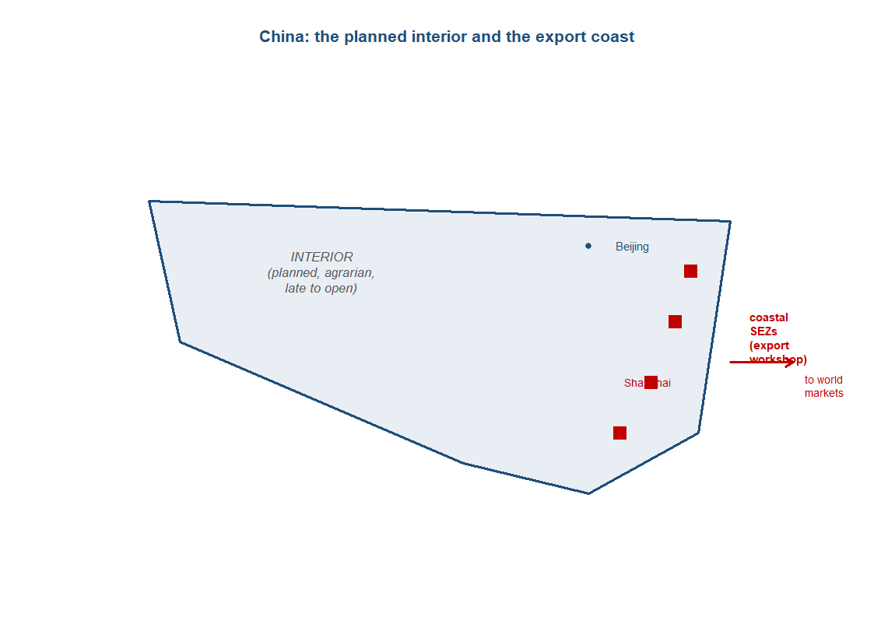{#fig-china10 width=58%}

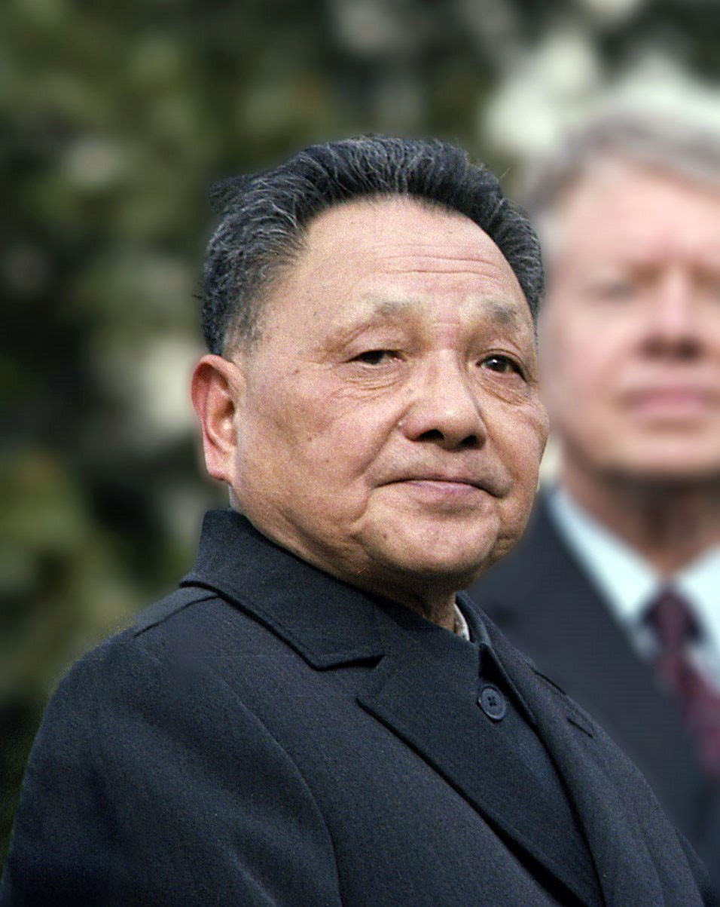{#fig-deng10 width=62%}

::: {.callout-tip collapse="true"}
## Japan and the Four Tigers --- the export-led industrialisers

Japan was the first of the Asian miracles and the template for the rest. Out of postwar reconstruction it built, across the 1950s and 1960s, a high-growth, export-oriented industrial economy that by the 1970s and 1980s was challenging the West in steel, cars and electronics --- the proof of concept that a poor Asian economy could industrialise into the front rank within a working lifetime. Frieden's account places Japan at the head of the postwar Asian rise, the economy whose success the others studied and copied. What made Japan matter for the chapter is less its own ascent than the model it demonstrated: industrialisation driven by manufactured exports rather than by the primary commodities the colonial order had assigned to Asia.^[**Sources:** Frieden (2006) on Japan as the first and exemplary postwar Asian industrialiser. **Read more:** Frieden (2006), *Global Capitalism*.]

Behind Japan came the "Four Tigers" --- South Korea, Taiwan, Hong Kong and Singapore --- which compressed the same transition into a few decades from the 1960s. They were not uniform: Hong Kong and Singapore were entrepot city-states that grew rich on trade and finance as much as on factories, while Korea and Taiwan built deep industrial bases behind active state direction. But the common thread was the export orientation, and across the high-growth East Asian economies the structural shift showed in the workforce, with manufacturing's share of employment rising over the long postwar boom as labour moved off the land and into the factory. The Tigers turned the Japanese demonstration into a regional pattern, and the pattern was the seed of the wider rebalancing that China would later carry to scale.^[**Sources:** Frieden (2006) on the Four Tigers' export-led industrialisation; World Bank (1993) on the rise of manufacturing in the high-performing East Asian economies. **Read more:** Frieden (2006), *Global Capitalism*; World Bank (1993), *The East Asian Miracle*.]

How these economies actually worked inside is the chapter's headline debate, and it has two camps. The market-friendly reading, associated with the World Bank's 1993 study and with Justin Yifu Lin's later work on China, held that the miracles succeeded by getting the fundamentals right --- macroeconomic stability, high saving, openness to trade, and a development path that followed the economy's comparative advantage rather than fighting it. On this view the state's role was to provide the environment, not to pick the industries, and the lesson was broadly liberal. It is the reading that treats the East Asian record as a vindication of opening to the world market.^[**Sources:** World Bank (1993) on the market-friendly, fundamentals-and-openness reading of the miracle; Lin (2012) on comparative-advantage-following development. **Read more:** World Bank (1993), *The East Asian Miracle*; Lin (2012).]

Against it stands the developmental-state reading, which holds that the state did far more than set the stage. Alice Amsden's study of Korea argued that late industrialisers succeed precisely by getting prices "wrong" on purpose --- subsidising and protecting chosen industries to push them up the technological ladder faster than the market alone would allow. Robert Wade made the parallel case for Taiwan with the idea of the "governed market," in which the state steered investment and credit toward strategic sectors. Joe Studwell drew the threads into a sequence: land reform first, to wring a surplus from a smallholder agriculture; then export discipline, forcing favoured firms to prove themselves in foreign markets rather than feed on a captive domestic one; and financial repression, bending the banking system to fund the whole project. On this reading the miracle was made, not merely allowed.^[**Sources:** Amsden (1989) on "late industrialisation" and getting prices wrong; Wade (1990) on the "governed market"; Studwell (2013) on the land-reform, export-discipline, financial-repression sequence. **Read more:** Amsden (1989), *Asia's Next Giant*; Wade (1990), *Governing the Market*; Studwell (2013), *How Asia Works*.]

The chapter does not settle the contest, and the honest course is to teach it as live. The market and the developmental-state readings each fit part of the record --- the city-states lean toward the first, Korea and Taiwan toward the second --- and the post-1997 reassessment of the model, after the Asian financial crisis exposed the costs of directed credit and close state-business ties, complicated both. What is not in dispute is the outcome the debate is arguing over: a clutch of East Asian economies that moved, in two or three decades, from poor and agrarian to industrial and rich, and in doing so reopened the question of where the world's manufacturing belonged.^[**Sources:** the contending readings of the East Asian miracle, with the post-1997 reassessment after the Asian financial crisis (Stiglitz & Yusuf 2001); Amsden (1989), Wade (1990), Studwell (2013), World Bank (1993) and Lin (2012). **Read more:** Studwell (2013), *How Asia Works*; World Bank (1993), *The East Asian Miracle*.]

**Trade profile**

- **Main exports** --- manufactures up the value chain over time: textiles and light goods first, then steel, ships, cars, electronics and semiconductors, sold into the world market on price and, later, quality.
- **Main imports** --- energy and raw materials (these are resource-poor economies) and, early on, the capital goods and technology licences that built the industrial base.
- **Export markets** --- the developed-world consumer markets, the United States foremost, whose demand absorbed the export drive.
- **Policy regime** --- the contested engine: market-friendly fundamentals and openness (World Bank 1993; Lin) versus the developmental state's land reform, export discipline and financial repression (Amsden; Wade; Studwell).^[**Sources:** Frieden (2006) on the export orientation and markets; Amsden (1989), Wade (1990), Studwell (2013), World Bank (1993) on the policy debate. **Read more:** Frieden (2006), *Global Capitalism*; Studwell (2013), *How Asia Works*.]
:::

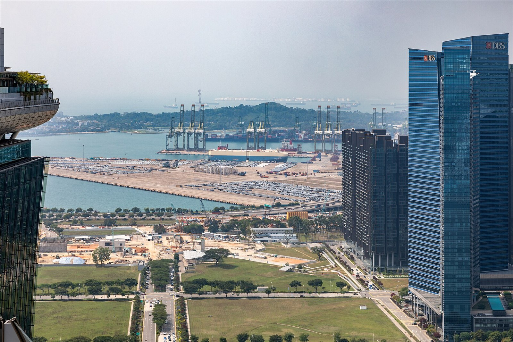{#fig-singapore10 width=68%}

::: {.callout-tip collapse="true"}
## India --- retreat then return

India entered independence in 1947 and promptly turned away from the world economy that had subordinated it. The development regime built from the 1950s was statist and inward-looking: planning, public-sector heavy industry, and import substitution behind high protection, on the conviction that a country bled by colonial trade should grow by making for itself rather than by selling abroad. Tirthankar Roy's long-run account of India in the world economy captures the priorities of the early plans --- in the first fifteen years roughly two-thirds of net foreign aid went into industry and the rest into infrastructure, the spending of a state betting on a self-sufficient industrial base. The bet was deliberate, and its cost was an economy that progressively cut itself off from the trade that had made and unmade it.^[**Sources:** Roy (Page 224, 225) on the statist development regime and the allocation of early aid (roughly two-thirds into industry in the first fifteen years). **Read more:** Roy (2012), *India in the World Economy*.]

The cost shows starkly in the trade figures. India's share of world exports fell from 2.6 per cent in 1948 to 1.5 per cent by 1953 and to 0.7 per cent by 1970 --- a withdrawal so steep that the country that had once been among the world's great exporters became, within a generation, a marginal presence in world trade. Roy reads the years 1955 to 1970 as the outright closure phase, the deepest point of the retreat, and the export staples tell the same story; India's tea export share, once commanding, slid toward the historic low it reached in 2003 as Sri Lanka, Kenya and China took the market. The retreat was the mirror image of the nineteenth-century opening: where Europe had once forced India into the world market, independent India walked out of it.^[**Sources:** Roy (Page 240) on the 1955--1970 outright-closure phase; Roy (Page 232) on the collapse of India's tea export share toward its 2003 historic low; the 2.6 per cent to 0.7 per cent fall in world-export share (1948--1970). **Read more:** Roy (2012), *India in the World Economy*.]

The inward turn was tested by shocks the closed economy was ill-placed to absorb. The worst came in 1965, the most severe crop failure since independence, which exposed how thin the margin was in an economy that had subordinated agriculture and trade to industrial planning. Trade, where it ran at all, ran increasingly through politics rather than markets: by the late 1960s about a quarter of India's exports were servicing debts to the Soviet Union under a rupee-trade arrangement in which Soviet oil was paid for in Indian goods. The pattern was emblematic of the regime --- bilateral, state-managed, walled off from the convertible world market --- and it tied a large slice of India's external trade to a single non-market partner.^[**Sources:** Roy (Page 227) on the 1965 crop failure, the worst since independence; Roy (Page 228) on a quarter of India's exports servicing USSR debts through rupee trade (Soviet oil paid in Indian goods) by the late 1960s. **Read more:** Roy (2012), *India in the World Economy*.]

The return, when it came, was forced by crisis. A balance-of-payments crisis in 1991 --- reserves all but exhausted --- pushed India into the liberalisation that dismantled much of the licensing regime, opened the economy to trade and investment, and ended four decades of inward development. Arvind Panagariya's study of the reform reads 1991 as the decisive break, the moment the second demographic giant rejoined the world economy on terms closer to the market; the export composition shifts accordingly, with Roy dating a labour-intensive revival across 1970 to 2000 and then a knowledge-industry-led revival across 2000 to 2010. The crisis did what four decades of argument had not: it reopened the economy.^[**Sources:** Panagariya (2008) on the 1991 balance-of-payments crisis and liberalisation; Roy (Page 240) on the labour-intensive revival (1970--2000) and the knowledge-industry-led revival (2000--2010). **Read more:** Panagariya (2008), *India: The Emerging Giant*.]

What distinguished India's return was its shape: services and knowledge as much as factory manufactures, and behind that, a long investment in human capital that finally paid off. The engineering-education base, near-zero at independence in 1947, rose to about thirty graduates per million by 1980; then, with the education revolution that gathered from around 1990, it passed three hundred per million by the end of the 1990s --- the supply of trained engineers behind the software and services export boom of the 2000s. As the economy reopened, old markets re-emerged in new guise: post-liberalisation, Britain --- the metropole of the colonial era --- returned as India's fourth-largest market, now a trading partner among many rather than an imperial centre. The retreat had been deep and the closure long, but the return was real, and it ran on a different export base from the one the colonial period had left behind.^[**Sources:** Roy (Page 246, 231) on engineering graduates rising from near-zero in 1947 to about thirty per million by 1980 and above three hundred per million by the end of the 1990s; Roy (Page 240) on the knowledge-industry-led export revival (2000--2010); Roy (Page 241) on Britain re-emerging as India's fourth-largest market after liberalisation. **Read more:** Roy (2012), *India in the World Economy*; Panagariya (2008), *India: The Emerging Giant*.]

**Trade profile**

- **Main exports** --- in the closure phase, a shrinking and politically managed trade (tea and traditional staples, a quarter of it servicing Soviet debt); after 1991, a labour-intensive then a knowledge- and services-led export base --- software and business services prominent.
- **Main imports** --- capital goods and, critically, energy: Soviet oil under rupee trade in the closed era, and oil from the Gulf as the economy reopened.
- **Export markets** --- the Soviet bloc and bilateral partners under the statist regime; after liberalisation the wider world market, with Britain re-emerging as the fourth-largest market.
- **Human-capital base** --- the engineering-education revolution: near-zero graduates in 1947, about thirty per million by 1980, above three hundred per million by the end of the 1990s --- the supply behind the services-led revival.^[**Sources:** Roy (Page 228, 240, 241, 246) on the USSR rupee trade, the export-composition phases, Britain's re-emergence and the engineering graduates; Panagariya (2008) on the post-1991 opening. **Read more:** Roy (2012), *India in the World Economy*; Panagariya (2008), *India: The Emerging Giant*.]
:::

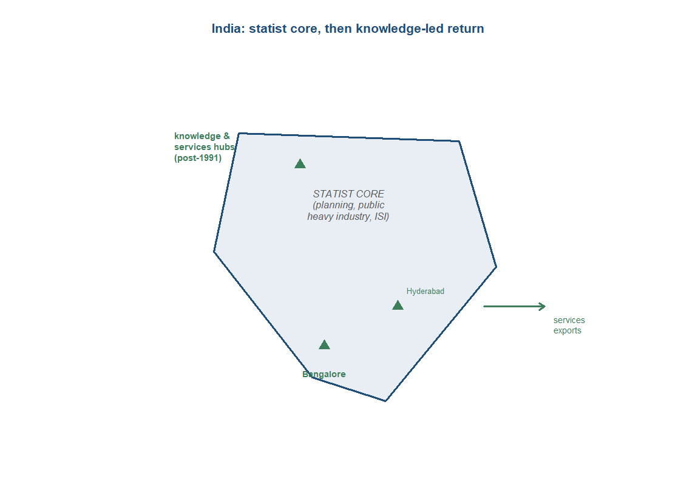{#fig-india10 width=58%}

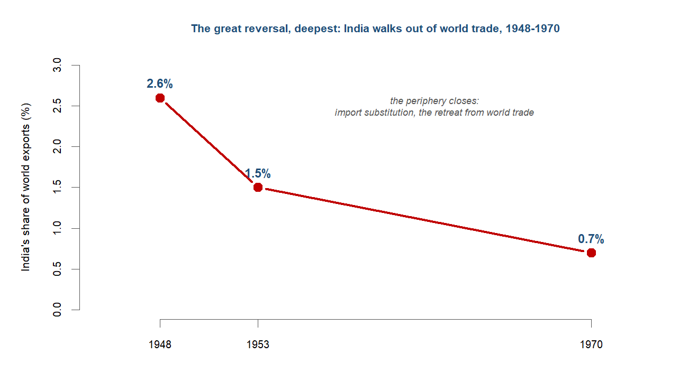{#fig-indiashare10 width=68%}

::: {.callout-tip collapse="true"}
## The Gulf --- oil makes the Indian Ocean an energy-and-capital pole

The Gulf entered this chapter as a producing periphery and left it as one of the poles of the world economy, and the turning point was the oil shock of 1973. In a matter of months the price of crude was transformed: the figure in Peter Frankopan's account of the Silk Roads moves from $2.90 to $11.65 a barrel in six months, and the revenue swing that followed was larger still --- producer revenues rising from $23 billion in 1972 to some $140 billion five years later. The Gulf states had been selling a cheap commodity into a market priced elsewhere; with the price seized by the producers, the terms of the trade reversed, and a vast flow of wealth ran into a handful of desert economies on the rim of the Indian Ocean.^[**Sources:** Frankopan (*The Silk Roads*, p.444--446) on the 1973 oil shock --- crude from $2.90 to $11.65 a barrel in six months, producer revenues from $23 billion (1972) to about $140 billion five years later. **Read more:** Frankopan (2015), *The Silk Roads*.]

The lecture frame this book follows draws the parallel deliberately. Before the sixteenth century the Middle East had sat astride the trade between Asia and Europe, taxing and channelling the goods that passed through it --- a monopoly of position that the Cape route had broken. The oil age restored something of that position in a new form: the Gulf again controlled a flow on which the wider world depended, and again the Indian Ocean ran energy and wealth through Middle Eastern hands. The recurrence is one of the chapter's longest echoes, a region returning to centrality through a different commodity along the same sea lanes.^[**Sources:** the parallel between the Gulf's oil-era centrality and the pre-sixteenth-century Middle Eastern position astride Asia--Europe trade; Findlay & O'Rourke (2007) on the long-run geography of the Indian Ocean trade. **Read more:** Findlay & O'Rourke (2007), *Power and Plenty*.]

The new centrality was strategic as much as commercial, and it rested on geography. The world's oil moved by sea through a small number of choke points --- the Strait of Hormuz at the mouth of the Gulf, the Strait of Malacca on the route to East Asia --- narrow passages through which a disproportionate share of global energy and trade had to pass, and whose vulnerability gave the Indian Ocean a military weight it had not carried since the age of sail. The sea lanes that the container had made the arteries of global supply now carried, along the same routes, the energy on which the whole system ran, and the Gulf sat at the source of it.^[**Sources:** the Hormuz and Malacca choke points and the renewed strategic centrality of the Indian Ocean in the oil age; Findlay & O'Rourke (2007) on the maritime geography. **Read more:** Findlay & O'Rourke (2007), *Power and Plenty*.]

The oil wealth also moved people and money in two directions, binding the Gulf to South Asia in particular. Northward and westward came labour: millions of South Asians migrated to the Gulf to build and run the boom economies, sending home the remittances that became a major external income for India, Pakistan and Bangladesh and reviving, in modern form, the old labour links across the Arabian Sea. Outward went capital: the petrodollar surpluses too large for the producing economies to absorb were recycled through the Western banking system, funding deficits and lending across the world much as Asian savings would later do. The Gulf had become an energy-and-capital pole --- exporting oil, importing workers, and exporting the financial surplus that the oil created.^[**Sources:** the South Asian labour migration to the Gulf and petrodollar recycling through the Western financial system; Findlay & O'Rourke (2007) and Frankopan (2015) on the oil-era flows. **Read more:** Findlay & O'Rourke (2007), *Power and Plenty*; Frankopan (2015), *The Silk Roads*.]

**Trade profile**

- **Main exports** --- crude oil above all, the commodity whose 1973 repricing (from $2.90 to $11.65 a barrel in six months) made the Gulf a pole of the world economy.
- **Main imports** --- almost everything else: food, manufactures and capital goods for economies built on a single resource, and, decisively, labour.
- **Labour flows** --- millions of South Asian migrants drawn into the boom, sending home the remittances that reconnected the Gulf to India, Pakistan and Bangladesh across the Arabian Sea.
- **Capital flows** --- the petrodollar surplus recycled through the Western banking system, the Gulf exporting financial capital as well as energy; its strategic leverage resting on the Hormuz and Malacca choke points.^[**Sources:** Frankopan (*The Silk Roads*, p.444--446) on the oil price and revenue surge; the South Asian migration, petrodollar recycling and the choke points. **Read more:** Frankopan (2015), *The Silk Roads*; Findlay & O'Rourke (2007), *Power and Plenty*.]
:::

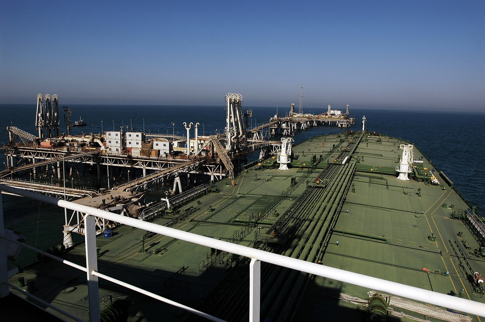{#fig-gulf10 width=70%}

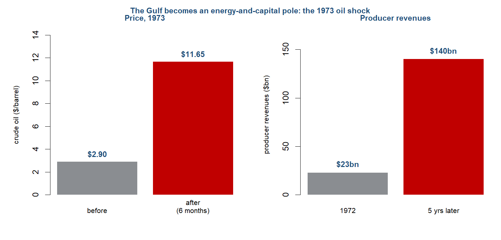{#fig-oil10 width=82%}

::: {.callout-tip collapse="true"}
## Western Europe --- one of several cores again

Western Europe came out of the Second World War devastated and dependent, and its postwar story is one of reconstruction rather than restored centrality. The recovery was underwritten from outside: the United States extended Marshall aid of some $13 billion over four years, the transfer that financed Europe's deficits and rebuilt its industry while the dollar shortage of the late 1940s was at its worst. Eichengreen's account of the modern monetary order sets the aid against the scale of the problem --- Europe's external deficits running at $6 to $7 billion in 1946--47 --- and the rescue worked: by the long boom of the 1950s and 1960s Western Europe was prosperous again. But it had been rebuilt as a recovering region inside an American-led system, not re-established as the hub it had been before 1914.^[**Sources:** Eichengreen (*Globalizing Capital*, Loc 786, 749, 750) on Marshall aid of $13 billion over four years and Europe's 1946--47 deficits of $6--7 billion. **Read more:** Eichengreen (2008), *Globalizing Capital*.]

The relative decline registers in the trade figures across the long war-and-recovery span. Western Europe's share of world exports, 60.1 per cent in 1913, had fallen to 41.1 per cent by 1950 --- the measure Feinstein, Temin and Toniolo use to mark the shift of the centre of the world economy away from Western Europe. The fall was not collapse: 41 per cent of world exports was still an enormous share, and Europe remained one of the heaviest economic regions on earth. But it was no longer the singular core. The continent that had run the first global economy was now one weight among several, its pre-eminence ended by two wars and the rise of cores on either side of it.^[**Sources:** Feinstein, Temin & Toniolo (Loc 304) on Western Europe's share of world exports falling from 60.1 per cent (1913) to 41.1 per cent (1950) and the centre of the world economy shifting away from Western Europe. **Read more:** Feinstein, Temin & Toniolo (2008), *The World Economy between the World Wars*.]

Europe's response to its reduced standing was to integrate. The European Economic Community, founded by the Treaty of Rome in 1957, began the project of binding the continent's economies together into a single market large enough to compete with the United States and, later, with Asia --- a pooling of weight to recover, collectively, an influence no single European state could hold alone. The monetary side followed: the European Monetary System from 1979 stabilised exchange rates within the bloc, and the project ran on toward the single currency, the euro introduced in 1999 to remove exchange-rate risk across the member economies. Integration was Europe's way of remaining a core in a world it no longer centred --- a deliberate construction of scale to offset relative decline.^[**Sources:** Eichengreen (*Globalizing Capital*, Loc 1052, 1451) on the European Monetary System (1979) and the introduction of the euro (1999); the founding of the EEC in 1957 by the Treaty of Rome. **Read more:** Eichengreen (2008), *Globalizing Capital*.]

The honest reading of postwar Europe, then, is of a region that recovered fully without recovering its old position. It was rich, integrated and central to world trade, and the European project gave it collective heft. But the leadership of the international system had passed to the United States during the wars and would, over this chapter, begin to be shared with a rising Asia; Europe's part in the rebalancing was to be one core among several rather than the centre against which the others were measured. The continent that this book had tracked from peripheral entrant to global hub ended the arc back among the cores --- prosperous, consequential, but no longer singular.^[**Sources:** Feinstein, Temin & Toniolo (Loc 304) on the shift of the centre away from Western Europe; Maddison (2007) on the long-run relative weights. **Read more:** Maddison (2007), *Contours of the World Economy*.]

**Trade profile**

- **Main exports** --- the manufactures and high-value goods of an advanced industrial region: machinery, vehicles, chemicals and, increasingly, services, traded heavily within an integrating European market.
- **Main imports** --- energy (Gulf and other oil), raw materials, and a rising volume of manufactures from a re-industrialising Asia.
- **Export markets** --- above all one another, within the EEC and its single market, plus the United States and the wider world economy.
- **Structural position** --- one of several cores, not the centre: world-export share down from 60.1 per cent (1913) to 41.1 per cent (1950), recovery underwritten by Marshall aid ($13 billion) and consolidated through the EEC (1957), the EMS (1979) and the euro (1999).^[**Sources:** Feinstein, Temin & Toniolo (Loc 304) on the export-share fall; Eichengreen (*Globalizing Capital*, Loc 786, 1052, 1451) on Marshall aid, the EMS and the euro. **Read more:** Feinstein, Temin & Toniolo (2008), *The World Economy between the World Wars*; Eichengreen (2008), *Globalizing Capital*.]
:::

::: {.callout-tip collapse="true"}
## The United States --- hegemon-anchor of the new order

The United States built the postwar order and sat at its centre. At Bretton Woods in 1944 the Allied powers designed a system around the dollar: the dollar was fixed to gold at $35 an ounce, and other currencies pegged to the dollar within a narrow band, so that the American currency became the anchor to which the rest of the system was tied. The arrangement made the United States the hub of international money in a way Britain had once been, but on terms America itself wrote, and it rested on a position of overwhelming financial strength. In 1948 the United States held more than two-thirds of the world's monetary reserves --- the gold and credit that gave the dollar its standing as the world's anchor currency.^[**Sources:** Garten (*Three Days at Camp David*, Loc 13, 119) on the 1944 Bretton Woods design (dollar fixed to gold at $35 an ounce, other currencies pegged within a narrow band); Eichengreen (*Globalizing Capital*, Loc 859) on the United States holding more than two-thirds of world monetary reserves in 1948. **Read more:** Garten (2021), *Three Days at Camp David*; Eichengreen (2008), *Globalizing Capital*.]

That dominance was a high-water mark, and it ebbed even as the system it underpinned spread. The same reserve share that stood above two-thirds in 1948 had fallen to about half within a decade, as Europe and Japan recovered and dollars accumulated abroad. The structural strain followed: by the mid-1960s and after, American gold holdings no longer covered the foreign claims on the dollar that the system had generated. By mid-1969 a policy memorandum could set United States gold at roughly $11.2 billion against foreign official dollar holdings of about $40 billion --- a fourfold mismatch between the metal the dollar promised and the claims outstanding against it. The anchor of the system was visibly losing the cover that backed it.^[**Sources:** Eichengreen (*Globalizing Capital*, Loc 859) on the reserve share falling from above two-thirds to about half within a decade; Garten (*Three Days at Camp David*, Loc 376) on the mid-1969 mismatch (US gold about $11.2 billion against foreign official dollar holdings about $40 billion). **Read more:** Eichengreen (2008), *Globalizing Capital*; Garten (2021), *Three Days at Camp David*.]

The contradiction was resolved by abandoning the gold link. On 15 August 1971, at Camp David, Nixon closed the gold window, suspending the dollar's convertibility into gold, and added a 10 per cent import surtax and a domestic wage-and-price freeze --- the unilateral act that ended the system the United States had built in 1944. Jeffrey Garten's account treats the decision as the turning point it was: the anchor currency cut loose from the metal, and after a brief attempt to hold fixed parities the major currencies floated by March 1973, Bretton Woods over. The hegemon had remade the monetary order once at its peak and dismantled it once its position no longer fit, and the float that followed was the world the rest of the chapter would run in.^[**Sources:** Garten (*Three Days at Camp David*, Loc 793) on the 15 August 1971 closure of the gold window, the 10 per cent import surtax and the wage-price freeze; Garten (Loc 823) on the major currencies floating by March 1973 and the collapse of Bretton Woods. **Read more:** Garten (2021), *Three Days at Camp David*.]

Through and beyond the monetary turn, the deeper American role was as the consumer market that pulled the Asian rebalancing along. The export-led economies of East Asia, and then China, sold into United States demand above all; the American consumer was the destination that made export-led industrialisation pay, and the trade deficits that this demand generated were the counterpart of the Asian surpluses. The relationship closed a circle the book has tracked across its length. Under "Bretton Woods II" the saving economies of Asia recycled their surpluses into United States Treasury debt, so that the rising East financed the deficits of the established core --- the exact inversion of the colonial drain of the earlier chapters, where the periphery had financed the centre. Here the core was the debtor, underwritten by the savings of the economies it was buying from.^[**Sources:** the United States as the consumer market pulling in Asian exports; Eichengreen (*Globalizing Capital*, Loc 4219, 4223, 4229) on "Bretton Woods II," the recycling of Asian surpluses into US Treasuries and the savings-glut/savings-drought co-dependency. **Read more:** Eichengreen (2008), *Globalizing Capital*.]

**Trade profile**

- **Main exports** --- manufactures, capital goods, services and, decisively, the dollar itself: the anchor currency of the postwar order and the debt the rest of the world held as reserves.
- **Main imports** --- the manufactured goods of the export-led Asian economies, drawn in by the American consumer market whose demand the rebalancing turned on; energy and raw materials.
- **Monetary role** --- hub of the Bretton Woods system (dollar fixed to gold at $35 an ounce, 1944; more than two-thirds of world reserves in 1948), then the unilateral architect of its end (gold window closed, 15 August 1971; float by March 1973).
- **Capital flows** --- the debtor core of "Bretton Woods II," its trade deficits financed by Asian surpluses recycled into US Treasuries --- the mirror of the colonial drain, the centre now underwritten by the periphery's heirs.^[**Sources:** Garten (*Three Days at Camp David*, Loc 13, 119, 793, 823) on the Bretton Woods design and its 1971--73 unwinding; Eichengreen (*Globalizing Capital*, Loc 859, 4219) on the 1948 reserve share and "Bretton Woods II." **Read more:** Garten (2021), *Three Days at Camp David*; Eichengreen (2008), *Globalizing Capital*.]
:::

{#fig-bw10 width=66%}

::: {.callout-note}
## How we know
This chapter is the mirror image of the first, and not only in its argument. Chapter 1 worked from the scraps that happened to survive --- seals, potsherds, a few clay tablets --- and the central methodological warning there was survival bias: what endured framed what we could conclude. Here the problem inverts. For the post-war decades every economy keeps rich official statistics --- national accounts, trade returns, censuses, balance-of-payments tables compiled to international standards --- so the survival-and-availability bias that haunted the early chapters largely dissolves. The spine becomes, for the first time, directly measurable: you can literally compute the centre of gravity and watch it move.

But abundance brings a bias of its own, and it is a subtler one. When the data are plentiful, the framing work passes from what survived to what we choose to measure. Two choices do most of it. The first is purchasing-power-parity versus market-exchange-rate GDP: measured at PPP, Asia looms larger and its return looks earlier and fuller; measured at market rates, the West stays larger longer. The second is aggregate versus per-capita: by total output China overtook the United States; by income per head it remained far behind. Neither choice is the "true" one, and surfacing the choice is the analytical act. A third caution is specific to the production side of this story. The corpus underpinning this book is heavy on money, finance and crisis --- the monetary spine (Bretton Woods, the 1971 break, "Bretton Woods II") can be shown from the sources in detail, whereas the production-side return (the East Asian miracles, China in 1978, India in 1991, the container) rests on external and synthetic reads. The honest position is that this chapter can demonstrate the monetary backbone and assert, on good authority, the production-side payoff. Read the abundant numbers, then, knowing that with abundance the danger is no longer what was lost but what the measure was built to show.

*Sources: Maddison (2007) and Quah (2011) on the measurability of the long-run shares and the centre-of-gravity computation; the standing PPP-versus-market and aggregate-versus-per-capita measurement choices in the comparative-development literature. Read more: Maddison (2007), *Contours of the World Economy*; Quah (2011).*
:::

## The period on its own terms

The years from 1944 to the 2010s ran in five phases, closure to comeback, with a turning point in the middle. First a US-led order rebuilt globalisation on a dollar anchor; then the great reversal of the previous century deepened, as the periphery closed itself off while the rich opened; then, around 1971--73, the dollar order broke, the oil price quadrupled, the shipping container spread, and the system reglobalised in earnest; then the two demographic giants reopened, China in 1978 and India in 1991; and finally the return became measurable, as Asia's weight in world output climbed back toward where it had sat before 1800.

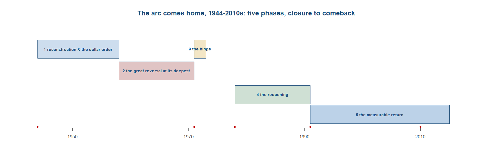{#fig-timeline10 width=92%}

**Phase 1 --- reconstruction and the dollar order (1944--58).** The new order was designed before the war it followed had ended. In July 1944, about a month after the Normandy landings, delegates met at Bretton Woods in New Hampshire and built a payments system around a single anchor: the dollar was fixed to gold at $35 an ounce, and every other currency pegged to the dollar within a one per cent band. It was a fixed-rate world again, as the classical gold standard had been, but with the dollar standing where gold once had and the United States standing behind the dollar. The arithmetic of the moment made the arrangement plausible. In 1948 the United States held more than two-thirds of the world's monetary reserves, a concentration of financial power without precedent, and that hoard was what let the rest of the trading world rebuild while running deficits against it.^[**Sources:** Steil, *The Battle of Bretton Woods* (Page 12) and Garten, *Three Days at Camp David* (Loc 13, 119) on the July 1944 conference fixing the dollar to gold at $35 an ounce with other currencies pegged within one per cent; Eichengreen (Loc 859) on the United States holding more than two-thirds of world monetary reserves in 1948. **Read more:** Steil (2013), *The Battle of Bretton Woods*.]

The United States underwrote the recovery directly. Through the European Recovery Program it extended about $13bn of aid over four years, dollars that let a continent short of everything buy the imports it could not yet pay for, and the long expansion that followed --- the golden age of rapid growth from 1950 to 1973 --- vindicated the design. The recovery was not even, however, and it was not global. Trade rebuilt within the Western bloc but collapsed across the new political divide: East--West trade, strangled by the early Cold War, fell to a fraction of its prewar level. The reconstruction was the reknitting of half a world, not the whole one.^[**Sources:** Eichengreen (Loc 786) on Marshall aid of about $13bn over four years; Feinstein, Temin & Toniolo (Loc 236) on the golden age of rapid growth, 1950--73; the collapse of East--West trade under the Cold War division. **Read more:** Eichengreen (2008), *Globalizing Capital*.]

The dollar's dominance, so overwhelming in 1948, was already eroding by design, and that erosion was the system working as intended. As Europe and Japan recovered and ran surpluses, dollars flowed outward, and the American share of world reserves fell from above two-thirds toward roughly a half within a decade. The capstone of the recovery came at the end of 1958, when the major European economies restored current-account convertibility, so that their currencies could once again be freely exchanged for the purposes of trade. That was the moment the Bretton Woods system became fully operational --- and, paradoxically, the moment its central tension came into view, because a world that needed ever more dollars for trade was being supplied them by an America whose gold backing for those dollars was, relatively, shrinking.^[**Sources:** Eichengreen (Loc 859, 503) on the United States' reserve share falling from above two-thirds toward about a half within a decade, and on European current-account convertibility restored on 31 December 1958. **Read more:** Eichengreen (2008), *Globalizing Capital*.]

**Phase 2 --- the great reversal at its deepest (1950s--60s).** The defining pattern of this stretch was the exact inverse of the nineteenth century, and it is worth stating as the mirror it was. In the Victorian decades Europe had forced free trade on Asia while protecting its own industries behind tariffs; now the rich economies opened to one another while the newly independent periphery closed itself off, reaching for import-substituting industrialisation as the route out of colonial subordination. The logic was understandable --- build behind tariff walls the industries that empire had suppressed --- but the cost in world-market position was steep, and India is the cleanest measure of it. Its share of world exports fell from 2.6 per cent in 1948 to 1.5 per cent in 1953 and on to 0.7 per cent by 1970, a withdrawal from the trading world that the country would spend the next generation reversing.^[**Sources:** Roy (2012) on India's world-export share falling from 2.6 per cent (1948) to 1.5 per cent (1953) and 0.7 per cent (1970) under import-substituting industrialisation, the inversion of the nineteenth-century pattern in which Europe imposed free trade on a protected Asia. **Read more:** Roy (2012), *India in the World Economy*; Panagariya (2008), *India: The Emerging Giant*.]

While the periphery turned inward, the first engine of the comeback fired quietly, off to the east. Japan, defeated and occupied, rebuilt around an export-led, state-guided model that would become the template for the region: a developmental state that steered credit toward favoured industries, disciplined firms by their performance in export markets, and grew by selling to the world rather than walling itself off from it. This was the road not taken by the import-substituters, and it worked. The Japanese miracle was the proof of concept that the later East Asian industrialisers --- the Four Tigers, then Southeast Asia, eventually China --- would follow, and it meant that even at the deepest point of the great reversal, the seed of the return was already growing.^[**Sources:** Frieden (2006) on Japan's export-led, state-guided industrialisation as the first comeback engine and the template for the later East Asian miracles; the developmental-state reading (Amsden 1989; Wade 1990) of export discipline and steered credit against the market-friendly reading (World Bank 1993). **Read more:** Studwell (2013), *How Asia Works*; World Bank (1993), *The East Asian Miracle*.]

**Phase 3 --- the turning point (1971--73).** The tension built into Bretton Woods came due at the turn of the 1970s, and the numbers had been flashing for years. By the middle of 1969 a policy memorandum could set the American gold stock at about $11.2bn against foreign official dollar holdings of roughly $40bn --- nearly four claims on the metal for every dollar of metal actually held. The system rested on the promise that dollars could be redeemed for gold at $35 an ounce, and that promise was now, plainly, unbackable. Through the first half of 1971 speculative money fled the dollar and central banks queued to convert, until in the second week of August some $4bn left the United States in a single week. The arithmetic of 1948 had inverted: the country that had held two-thirds of the world's reserves could no longer honour the convertibility on which its own order stood.^[**Sources:** Garten, *Three Days at Camp David* (Loc 376) on the mid-1969 memorandum putting United States gold at about $11.2bn against roughly $40bn in foreign official dollar holdings; Garten (Loc 539) on about $4bn fleeing the United States in the week of 9 August 1971. **Read more:** Garten (2021), *Three Days at Camp David*.]

The break came at Camp David. On 15 August 1971 Nixon closed the gold window --- ending the dollar's convertibility into gold --- and bundled the move with a ten per cent surcharge on imports and a freeze on wages and prices. The fixed-rate world did not collapse at once; it was dismantled in stages. The Smithsonian Agreement that December devalued the dollar by something just under eight per cent and tried to hold a new set of parities; a second devaluation followed in February 1973; and by March 1973 the major currencies were floating against one another and Bretton Woods was over. The monetary anchor that had held since 1944 was gone, and exchange rates would now be set by markets rather than fixed by treaty.^[**Sources:** Garten, *Three Days at Camp David* (Loc 793, 584, 787) on the 15 August 1971 announcement closing the gold window, the ten per cent import surcharge and the wage-price freeze; Garten (Loc 739, 820, 823) on the Smithsonian devaluation of just under eight per cent (December 1971), the second devaluation (February 1973) and virtually all Western Europe floating by March 1973. **Read more:** Garten (2021), *Three Days at Camp David*.]

Two further shocks clustered at the same turning point and gave it its weight. The first was oil. In the closing months of 1973 the price of crude went from about $2.90 to $11.65 a barrel in six months, and producer revenues rose from some $23bn in 1972 to about $140bn five years later, turning the Gulf into an energy-and-capital pole and pulling the Indian Ocean back toward the centre of the world's strategic map. The second was quieter and slower but in the long run larger: the shipping container, spreading across the world's ports through these decades, with flags of convenience rising from about 5 to 45 per cent of tonnage between 1950 and 1995 as shipping reorganised around the steel box. This is why the periodisation matters. 1945 was the monetary reset, the rebuilding of an order; but 1971--73 was the real reglobalisation and the genuine recentring of the Indian Ocean --- the float, the oil price, and the container arriving together to remake how the world traded.^[**Sources:** Frankopan, *The Silk Roads* (p.444--446) on crude rising from $2.90 to $11.65 a barrel in six months in 1973 and producer revenues climbing from $23bn (1972) to about $140bn five years later; the container's spread and flags of convenience rising from about 5 to 45 per cent of tonnage, 1950--95, and 1971--73 rather than 1945 as the real reglobalisation. **Read more:** Levinson (2006), *The Box*; Findlay & O'Rourke (2007), *Power and Plenty*.]

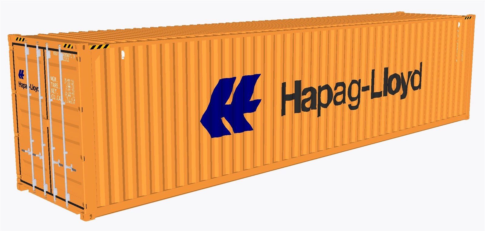{#fig-box10 width=55%}

**Phase 4 --- the reopening (1978--91).** With the system reglobalising, the closed giants began to open, and the larger of the two moved first. In 1978 Deng Xiaoping turned China outward, opening special economic zones along the coast and inviting the foreign capital and export demand that Mao's autarky had refused. The timing was not accidental. The container had made long-distance manufacturing trade cheap and reliable enough to relocate production itself, and that cheap, dependable shipping was what paved the way for Asia to become the world's workshop --- China's coastal opening was predicated on the containership service that the previous decade had built. Around China the Four Tigers were already industrialising hard, and the structural shift showed in the labour data: manufacturing's share of East Asian employment rose from roughly 8 per cent to about 15 per cent between 1960 and 2000 as the region moved off the land and into the factories.^[**Sources:** Frieden (2006) on China's 1978 opening under Deng and the special economic zones; Levinson (2006) on the container slashing shipping costs and "paving the way for Asia to become the world's workshop"; the rise of manufacturing's share of East Asian employment from about 8 to 15 per cent, 1960--2000. **Read more:** Frieden (2006), *Global Capitalism*; Levinson (2006), *The Box*; Baldwin (2016), *The Great Convergence*.]

India came later and by a harder road. Its turn inward had run deepest of all the large economies, and the reckoning arrived in 1991 as a balance-of-payments crisis that nearly exhausted the country's reserves and forced a wholesale liberalisation --- the dismantling of the licensing regime and the reopening to trade and investment that ended four decades of import substitution. The second giant rejoined the world economy, and its comeback took a distinctive, knowledge-led shape. The country that had produced almost no engineers at independence built, over two generations, a deep stock of technical human capital: engineering graduates ran at near zero per head in 1947 and exceeded 300 per million by about 2000, the foundation of the software and services export revival that became India's signature in the world market.^[**Sources:** Panagariya (2008) on India's 1991 liberalisation following a balance-of-payments crisis and the dismantling of the licensing regime; Roy (Page 231, 246) on engineering graduates rising from near zero per head in 1947 to more than 300 per million by about 2000, underpinning a knowledge-led export revival. **Read more:** Panagariya (2008), *India: The Emerging Giant*; Roy (2012), *India in the World Economy*.]

**Phase 5 --- the measurable return (1990s--2010s).** By the new century the rebalancing had stopped being a forecast and become a fact you could count. China passed the United States to become the world's largest manufacturer in 2010, and by 2019 it produced 28.7 per cent of global manufacturing output against the American 16.8 per cent --- a single statistic that reversed a century and a half of Western industrial primacy. The aggregate told the same story: Asia's share of world GDP rose from about 21 per cent in 1990 to roughly 39 per cent by 2023. Danny Quah's computation of the world economy's economic centre of gravity, the population-and-output-weighted average location of global activity, made the movement literal: the centre drifted from the middle of the Atlantic in 1980 toward a point between India and China projected for around 2050 --- close to where it had sat in 1500, before the European interruption began.^[**Sources:** Quah (2011) on the computed economic centre of gravity drifting from the mid-Atlantic in 1980 toward India--China by about 2050; Maddison (2007) on China and India's share of world output to about 1700. The modern manufacturing shares (China the largest manufacturer from 2010; 28.7 per cent of global output by 2019 against the United States at 16.8 per cent) and Asia's GDP share rising from about 21 per cent (1990) to 39 per cent (2023). **Read more:** Quah (2011), "The Global Economy's Shifting Centre of Gravity"; Maddison (2007), *Contours of the World Economy*.]

The financial architecture of the return carried an irony the previous chapter would have recognised. Where the high age of European dominance had run on a drain of resources from the colonial periphery to the core, the new arrangement ran the other way: China and the other surplus economies of Asia recycled their chronic trade surpluses into United States Treasury securities, lending their savings to the consumers who bought their exports. The pattern earned the label Bretton Woods II --- a financial co-dependency in which Asia, saving on the order of half its income and growing at roughly ten per cent a year at the peak, underwrote the deficits of the very Western order inside which it was rising. The centre of production was moving east, but it was doing so within, and partly by financing, a dollar-anchored system the West still ran.^[**Sources:** Eichengreen (Loc 4219) on "Bretton Woods II," China and Asia recycling chronic surpluses into United States Treasuries; Eichengreen, *Hall of Mirrors* (Page 86) and Eichengreen (Loc 1415) on China saving and investing about half of GDP at the peak and growth sustained near ten per cent a year. **Read more:** Eichengreen (2008), *Globalizing Capital*.]

The fragility that integration always carries returned with the connection. In September 2008 the failure of Lehman Brothers, a crisis born in the American mortgage market, transmitted around the world in days rather than years --- proof that the dense financial network knitting Asia to the West carried shocks as efficiently as it carried capital. The Asian markets fell on the news with the rest: Singapore down 2.9 per cent, Taiwan 4.1 per cent, India 5.4 per cent, the contagion arriving almost instantly across an ocean that finance had made small. The episode closed the arc on a sober note. The East's return was real and measurable, but it had been built on a system whose interdependence made every node vulnerable to every other --- the same integration that carried the workshop back to Asia carried the panic of 2008 there in an afternoon.^[**Sources:** Eichengreen, *Hall of Mirrors* (Page 198) on the Lehman bankruptcy of September 2008 transmitting worldwide within days, with Asian markets falling on the news --- Singapore down 2.9 per cent, Taiwan 4.1 per cent, India 5.4 per cent. **Read more:** Eichengreen (2015), *Hall of Mirrors*.]

::: {.callout-note}
## Research in focus --- Bernhofen, El-Sahli & Kneller (2016): the container revolution and world trade
*Aim.* To measure how much of the post-war boom in world trade can be attributed to containerisation, the technology this chapter follows as its central object. *Question.* Did the shift to container shipping raise trade between countries, and by how much, relative to other liberalising forces such as tariff cuts and trade agreements? *Data and method.* A difference-in-differences design exploiting the staggered adoption of container ports across countries, estimating the effect of containerisation on bilateral trade flows in a gravity framework. *Findings.* Containerisation had a large, positive and economically significant effect on trade among adopting economies --- on their estimates, an impact on trade growth larger than that of the major trade-liberalisation agreements of the same decades, consistent with the chapter's claim that the box was a, perhaps the, mechanism behind Asia becoming the world's workshop. *Caveats.* The estimated magnitudes are sensitive to specification and to disentangling the container's effect from the broader fall in transport and communication costs with which it coincided.
:::

## Reading the period: the four questions

The same four questions that organised the previous chapters organise this one, for the last time --- and this time each resolves, because the disintegration of the last chapter has reversed and the long arc closes.

On direction, the period reglobalised, in the upswing of a century-long U. Capital mobility traced the cleanest version of the shape: high before 1914, suppressed between the wars and under early Bretton Woods, and high again from the 1970s, by the 2000s arguably above its 1913 level. Trade told the same story at a faster clip. World trade grew about 5.9 per cent a year in the late twentieth century against roughly 3.5 per cent before 1913, and the trade-cost barrier fell hard, with the tariff-equivalent of trade costs on manufactures dropping from around 32 per cent in 1950 to about 9 per cent by 1998. The direction is not in doubt: after the interwar reversal the world reintegrated, and reintegrated further and faster than the first globalisation had managed. The same lesson the disintegration taught in reverse holds here too --- integration is a policy outcome, not a ratchet --- but in this period the policy ran toward openness.^[**Sources:** Eichengreen (Loc 208) on the U-shaped century of capital mobility (high pre-1914, suppressed mid-century, high again since the 1970s); Findlay & O'Rourke (p.505, 499) on late-twentieth-century world trade growing about 5.9 per cent a year against 3.5 per cent pre-1913, and the manufactures trade-cost tariff-equivalent falling from about 32 per cent (1950) to 9 per cent (1998). **Read more:** Eichengreen (2008), *Globalizing Capital*; Findlay & O'Rourke (2007), *Power and Plenty*.]

On channels, the sea was supreme and transformed. The maritime channel that had carried the story since the first chapter remained the artery of world trade, but the container remade it: port turnaround fell from weeks to hours, shipping costs collapsed, and the sea lanes became the physical infrastructure of global supply chains rather than merely the routes between finished markets. And the Indian Ocean reclaimed the strategic centrality it had held before the European centuries --- Gulf oil flowing east and west, intra-Asian and Asia--Europe trade thickening, and the Hormuz and Malacca choke points giving a handful of narrow passages a weight in world affairs out of all proportion to their size. The overland channel, by contrast, returned only faintly and late: the Belt and Road revival of the Silk Road land routes lay largely beyond this period, and the durable artery remained, as it had been since the maritime age opened, the sea.^[**Sources:** Levinson (2006) on containerisation cutting port turnaround from weeks to hours and remaking maritime trade; the renewed centrality of the Indian Ocean (Gulf oil, intra-Asian trade, the Hormuz and Malacca choke points), with the overland Belt and Road revival largely beyond the period. **Read more:** Levinson (2006), *The Box*; Findlay & O'Rourke (2007), *Power and Plenty*.]

On where the centre lay --- the module's organising question, now literally computed --- the answer is the chapter's verdict, and it belongs before the modes because the modes lead to it. The aggregate centre of economic gravity was returning to Asia. Quah's calculation puts it in the middle of the Atlantic in 1980, east of Helsinki and Bucharest by 2008, and on its projection between India and China by about 2050 --- roughly where it had sat in 1500, when China and India together made up perhaps half to three-fifths of world output. Asia's share of world GDP rose from about 21 per cent in 1990 to 39 per cent by 2023, and China became the world's largest manufacturer. The weight was unmistakably moving east. The qualification, taken up in the verdict, is that this was a return in aggregate weight and not yet in income per head, and that it ran inside a Western-anchored order rather than restoring the pre-1800 world.^[**Sources:** Quah (2011) on the computed centre of gravity (mid-Atlantic 1980, east of Helsinki by 2008, India--China by about 2050); Maddison (2007) on China and India's roughly half of world output to about 1700; Asia's GDP share rising from about 21 per cent (1990) to 39 per cent (2023). **Read more:** Quah (2011); Maddison (2007), *Contours of the World Economy*.]

On modes --- how exchange was settled --- all four flows of globalisation ran again, but the one that led, and the one to follow, was capital. Goods, services, people and money all moved at scale, yet the dominant and most measurable flow was financial, bullion's modern heir. And following it gives the chapter its sharpest single twist. The financial core of the world economy was still the West --- the dollar was still the anchor, New York and London still the markets --- but it was now underwritten by Asian savings. The surplus economies of the East lent their savings to the deficit economies of the West, financing the very consumers who bought their exports. This is the exact mirror of the colonial drain of the eighth chapter, where the periphery had financed the core through an imperial transfer; here the rising East financed the established core through the bond market, by choice and for a return. The direction of the capital flow had reversed, but the dependence it created bound the two ends of the world economy as tightly as the drain once had.^[**Sources:** Eichengreen (Loc 4219, 4223, 4229) on "Bretton Woods II," the recycling of Asian surpluses into US Treasuries and the savings-glut/savings-drought co-dependency, read against the colonial "drain" of the high-imperial period. **Read more:** Eichengreen (2008), *Globalizing Capital*.]

::: {.callout-important}
## Follow the money
In the first chapters "follow the money" meant follow the silver, from the New World mines to the Chinese tax rolls. In this last one it means follow the capital --- and the surprise is the direction it runs. The financial core of the world economy is still Western: the dollar is the anchor currency, the United States the borrower of first resort, New York and London the markets that price the world's risk. But the savings that fund that core now come, in large part, from Asia. Under the arrangement Eichengreen and others call "Bretton Woods II," China and the other surplus economies of the East run chronic trade surpluses and recycle the proceeds into United States Treasury debt, so that the rising East lends to the established West and finances the consumers who buy its exports. Set this against the eighth chapter and the symmetry is exact and reversed: there, the colonial periphery financed the imperial core through the drain, an extraction imposed from above; here, the rising periphery's heirs finance the core through the bond market, a flow chosen from below for a yield. The bullion that once moved east to settle Europe's deficits has become the savings that move west to fund America's --- the same channel, the same dependence, the arrow turned around.

*Sources: Eichengreen (2008), *Globalizing Capital* (Loc 4219) on "Bretton Woods II" and the recycling of Asian surpluses into US Treasuries; the deliberate inversion of the colonial "drain" of the high-imperial chapter. Read more: Eichengreen (2008), *Globalizing Capital*.*
:::

On Europe --- the fourth question, asked every chapter --- the answer completes a staged arc the whole book has been building. Western Europe was no longer the centre. Its share of world exports had fallen from 60.1 per cent in 1913 to 41.1 per cent by 1950, and the post-war story was reconstruction and integration rather than restored primacy: Marshall aid, the EEC, the single market, the euro --- a deliberate pooling of weight to remain consequential in a world Europe no longer centred. Across the ten chapters Europe moved through four positions: a peripheral entrant buying its way onto the Asian trade routes; a rising dominant power as the divergence and the colonial centuries ran; the cracked former hegemon of the disintegration; and now one of several cores. The continent whose dominance the book set out to weigh ends the arc important but no longer singular --- exactly the trajectory that lets the European centuries be read as a bounded interruption rather than the natural order of things.^[**Sources:** Feinstein, Temin & Toniolo (Loc 304) on Western Europe's share of world exports falling from 60.1 per cent (1913) to 41.1 per cent (1950); the staged arc of Europe from peripheral entrant to one of several cores. **Read more:** Feinstein, Temin & Toniolo (2008), *The World Economy between the World Wars*; Maddison (2007), *Contours of the World Economy*.]

The forces behind the rebalancing rank in a clear order. Technology led: the container and, with it, the information-and-communications revolution that Richard Baldwin called the "second unbundling," which let not just goods but the know-how of production relocate to a handful of Asian economies, driving what he termed the Great Convergence. Policy mattered too --- the Bretton Woods and GATT-to-WTO architecture, the swing from import substitution to liberalisation, the developmental state --- as did the 1973 oil shock that re-poled the Indian Ocean. But underneath all of them sat demography. The reason the aggregate centre could swing so far east is that the east is where most people live; Asia's sheer population weight was the base on which the technology and the policy worked, and the deepest reason the rebalancing in aggregate output ran ahead of any rebalancing in income per head.^[**Sources:** Baldwin (2016) on the "second unbundling" of information technology and cheap shipping relocating production know-how to Asia (the Great Convergence); the Bretton Woods/GATT-to-WTO and import-substitution-to-liberalisation policy sequence, the 1973 oil shock, and demography as the base of the aggregate rebalancing. **Read more:** Baldwin (2016), *The Great Convergence*.]

## The verdict: the centre returns --- partial, recent, system-dependent

The verdict of this chapter, and of the book, is that the aggregate centre of economic gravity is measurably returning to Asia, and that the return vindicates the long-run reading --- but in a calibrated, qualified form rather than a triumphant one. On the aggregate return the confidence is high, because for once the spine is computed rather than inferred. Quah's centre-of-gravity calculation drifts unambiguously east; Asia's share of world GDP rose from about 21 to 39 per cent in a single generation; China became the world's largest manufacturer. Set against the long run --- China and India perhaps half to three-fifths of world output to about 1700, Western Europe and North America about half by 1950 --- the arc reads cleanly: Asia central, a European interruption of roughly two centuries, and now the return. That is the strongest aggregate support the book can offer for treating European dominance as, in the long view, an anomaly.^[**Sources:** Quah (2011) on the computed centre of gravity; Maddison (2007) on the long-run output shares (China and India about half to three-fifths of world output to about 1700, Western Europe and North America about half by 1950). **Read more:** Quah (2011); Maddison (2007), *Contours of the World Economy*.]

Three qualifications keep the framing honest, and they are why the book settles on "defensible but qualified" rather than a clean restoration. The first is that the return is partial. It is a return in aggregate weight --- manufacturing, total output, the computed centre --- and not, or not yet, in income per head, where China and India remained well below the Western level. The aggregate is large in good part because the populations are large; the workshop has returned, but the income gap has not closed. The second is that the timing rests on the contested divergence debate of the seventh chapter: how anomalous the European interruption looks depends on whether the divergence was late and contingent, which makes the interruption short and the anomaly strong, or early and structural, which makes it longer and the anomaly weaker. The third is that the re-rise was system-dependent. It happened inside the US-anchored order --- Bretton Woods, the GATT and WTO, the container, and above all American consumer demand financed in the end by Asian savings --- so it was a return within a Western-built system, not a simple resumption of the pre-1800 world.^[**Sources:** the three qualifications on the partial (aggregate-not-per-capita), timing-dependent (the divergence-dating debate) and system-dependent (built on the US-led Bretton Woods/WTO/containerisation order) character of the return; Hsieh & Klenow (2009) on the per-capita/productivity gap; Quah (2011) and Maddison (2007) on the aggregate measures. **Read more:** Hsieh & Klenow (2009); Quah (2011).]

The book's organising contrast --- aggregate weight against income per head, quantity against quality --- closes here, on the second qualification. The thread was set in the first chapter, made central in the silver age when "thriving" Asian empires turned out to be big rather than rich, and sharpened at the divergence, which was precisely the moment the West switched from extensive to intensive growth. The rebalancing returns the first kind of success and not, so far, the second. Asia is again the heaviest part of the world economy by total output; it is not yet the richest by output per head. Whether the aggregate return will pull a per-capita convergence behind it --- whether the workshop's return is the leading edge of an income catch-up or the limit of it --- is the open question the book hands to its reader, and the honest answer in the period covered here is that it is genuinely undecided.^[**Sources:** the quantity-versus-quality (aggregate-versus-per-capita) thread closing at the rebalancing; Hsieh & Klenow (2009) on misallocation and the manufacturing-productivity gap between China and India and the advanced economies. **Read more:** Hsieh & Klenow (2009).]

::: {.callout-warning}
## The debate: return to the norm, or a new thing? And what made the miracle?
Two controversies frame the period. The first is the chapter's --- and the book's --- meta-question. One reading, associated with Andre Gunder Frank, treats the Asian rebalancing as a restoration: Asia was the centre of the world economy for most of history, the European interlude was a temporary deviation, and the weight is simply returning to where it belongs. The opposing reading insists the modern rise is a new phenomenon occurring inside a Western-built order --- conditional on Bretton Woods, the WTO, the dollar, the container and American demand --- and so not a resumption of the old order but a different thing wearing its outline. The discriminating position separates the metrics: the aggregate weight returns (the norm), but the institutional form is new (system-dependent), and a strong answer says which evidence supports which claim rather than choosing one wholesale.

The second controversy is about how the East Asian miracle was achieved. The market-friendly reading (the World Bank's 1993 study; Lin) credits fundamentals and openness --- stability, high saving, comparative advantage, trade. The developmental-state reading (Amsden's "late industrialisation," Wade's "governed market," Studwell's land-reform-then-export-discipline-then-financial-repression sequence) credits deliberate state direction. The Asian financial crisis of 1997 sharpened the dispute by exposing the costs of directed credit, and Rodrik's work on the limits of hyper-globalisation set against the gains from openness frames the wider stakes. Both readings fit part of the record; the contest is live, and the chapter teaches it as such.

*Sources: Frank (1998), *ReORIENT* on the restoration reading against the system-dependence reading; World Bank (1993) and Lin versus Amsden (1989), Wade (1990) and Studwell (2013) on the miracle; Rodrik (2006, 2011) on the limits of globalisation. Read more: Frank (1998), *ReORIENT*; Studwell (2013), *How Asia Works*; Rodrik (2011), *The Globalization Paradox*.*
:::

::: {.column-page}
**Data exhibit --- the spine, computed.** For nine chapters the centre of gravity had to be inferred --- from bullion flows, city sizes, wage ratios, trade shares. In this one it can be calculated outright. Danny Quah's economic centre of gravity is the point on the Earth's surface that minimises the distance-weighted dispersion of global economic activity --- the average location of world output, in effect. Computed back and projected forward, it sat near East Asia in 1500, drifted west to the middle of the North Atlantic by 1980 as the European centuries ran their course, and has since swung back east, reaching east of Helsinki and Bucharest by 2008 and projected to lie between India and China by about 2050. The whole argument of the book is, on this measure, one line on a map: out west, then back east. *What you could do with this:* take Maddison Project GDP by world region and compute the longitudinal centre of gravity at benchmark years (1500, 1820, 1913, 1950, 1980, 2008, 2023); plot the path, and set the modern eastward leg directly against the early-modern westward one.

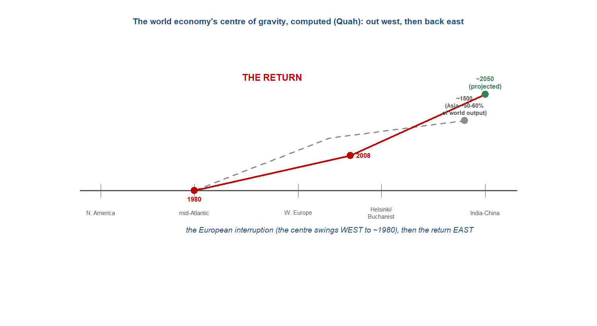{#fig-cogdrift10 width=78%}
:::

::: {.callout-note}
## Research in focus --- Quah (2011): the world economy's shifting centre of gravity
*Aim.* To locate, quantitatively and over time, the centre of gravity of world economic activity, and to track its movement across the late twentieth and early twenty-first centuries. *Question.* Where is the average location of global economic activity, and in what direction and how fast is it moving? *Data and method.* Computation of the economic centre of gravity as the point minimising the GDP-weighted sum of distances to the world's economies, applied to national GDP data across nearly 700 locations, with the path traced from 1980 and projected forward to about 2050 on growth assumptions. *Findings.* The centre of gravity sat in the mid-Atlantic around 1980 and drifted markedly east over the following three decades --- to east of Helsinki and Bucharest by 2008 --- with projection placing it between India and China by about 2050, a swing the paper attributes chiefly to the rise of China and India. *Caveats.* The forward projection depends on assumed growth rates and is sensitive to them; and the measure is one of aggregate location, not of income per head, so it captures the return of weight, not of relative prosperity --- precisely the distinction this chapter insists on.
:::

::: {.callout-note}
## Research in focus --- Hsieh & Klenow (2009): why the income gap persists
*Aim.* To quantify how much of the gap in manufacturing productivity between China and India and the advanced economies comes from the misallocation of resources across firms rather than from technology as such. *Question.* If capital and labour were allocated as efficiently within China and India as within the United States, how much would their manufacturing total factor productivity rise? *Data and method.* Firm-level manufacturing data for China, India and the United States, with a model that infers the output lost when inputs are distributed across plants in proportions that depart from the efficient benchmark. *Findings.* Reallocating inputs to the US benchmark would raise manufacturing TFP substantially --- on the order of 30 to 50 per cent in China and 40 to 60 per cent in India --- implying that a large part of the income gap reflects how resources are used, not only how much technology is available. *Caveats.* The estimates are specific to manufacturing and to the modelling assumptions about the efficient benchmark, but they illustrate the chapter's central qualification: the aggregate workshop can return while the per-capita gap, rooted in how efficiently the workshop runs, persists.
:::

## Threads forward

There is no eleventh chapter; the arc ends here, and the threads run not forward to another period but inward, to the book's conclusion. Several close in this one. The centre of gravity, tracked chapter by chapter, is complete and can be walked end to end: no centre, then Asia the production-core of a multipolar system, then Asia central and Europe peripheral, then Asia central but with the first northwest-European seed, then Asia the silver sink, then Asia still the workshop but Europe armed, then the turning point as the centre moves west, then peak Western dominance on an Indian-Ocean base, then the order cracking within the West, and now the return to Asia. The quantity-to-quality thread closes too: the workshop returns, the income gap persists. And "follow the bullion" closes inverted as "follow the capital" --- the rising East underwriting the established core, the drain run backwards.^[**Sources:** the centre of gravity tracked across the ten chapters; the closing of the quantity-to-quality thread (aggregate return, not per-capita) and the inversion of the silver/bullion thread into capital flows ("Bretton Woods II"). **Read more:** Maddison (2007), *Contours of the World Economy*; Eichengreen (2008), *Globalizing Capital*.]

What the book hands its reader is a set of open questions rather than a closed verdict. Will the aggregate return pull a per-capita convergence behind it, or will the income gap prove the limit of the rebalancing rather than a stage in it? Will the overland channel, faint and late in this period, thicken into something that matters --- the Belt and Road revival of the old Silk Road land routes lying largely beyond the years covered here? And is the next century multipolar, with several cores and no single centre, as in the world of the first chapters --- or does the weight settle into a new single centre, as it did under Europe and then America? The book's final task, taken up in the conclusion, is to set against the full body of evidence the framing it has tested throughout: how strong a version of "European dominance as anomaly" the evidence will bear. The answer it reaches is the calibrated one --- a real but bounded interruption, the return measurable but partial and system-dependent --- and the long arc, viewed from the Indian Ocean, is best read as closing rather than simply repeating.^[**Sources:** the book's closing questions (per-capita convergence; the faint overland return / Belt and Road; multipolarity versus a new single centre) and the final calibration of the "European dominance as anomaly" framing to defensible-but-qualified. **Read more:** the [Conclusion](11-conclusion.qmd); Maddison (2007), *Contours of the World Economy*.]

---

## Classic research: the foundations {.unnumbered}

The literature on the post-war rebalancing splits between the syntheses that frame the whole arc and the development economics that argues over how the East Asian miracle was made. The works below are the reference points this chapter builds on and argues with.

- **Maddison (2007)**, *Contours of the World Economy, 1--2030 AD* --- the quantitative backbone of the long-run reading: the GDP-and-population estimates that let Asia's pre-1800 weight, the European interruption, and the modern return be put on a single scale.
- **Frieden (2006)**, *Global Capitalism: Its Fall and Rise in the Twentieth Century* --- the narrative frame: the twentieth century as a fall and rise of globalisation, with the post-war reconstruction and the Asian re-entry as its closing movement.
- **Levinson (2006)**, *The Box: How the Shipping Container Made the World Smaller and the World Economy Bigger* --- the mechanism: containerisation as the transport revolution that cut shipping costs and "paved the way for Asia to become the world's workshop."
- **World Bank (1993)**, *The East Asian Miracle: Economic Growth and Public Policy* --- the market-friendly reading: stability, high saving, openness and broadly correct fundamentals as the engine of the high-performing Asian economies.
- **Amsden (1989)**, *Asia's Next Giant: South Korea and Late Industrialization* --- the developmental-state case: late industrialisers succeed by "getting prices wrong" on purpose, subsidising and disciplining chosen industries.
- **Wade (1990)**, *Governing the Market: Economic Theory and the Role of Government in East Asian Industrialization* --- the "governed market": the state steering investment and credit toward strategic sectors, the Taiwanese counterpart to Amsden's Korea.
- **Studwell (2013)**, *How Asia Works* --- the synthesis of the developmental-state reading into a sequence: land reform, then export discipline, then financial repression, as the recipe the successful Asian economies followed.
- **Rodrik (2011)**, *The Globalization Paradox* --- the limits frame: the "trilemma" of deep globalisation, national sovereignty and democracy, and the case that hyper-globalisation can be self-undermining.

## At the research frontier: recent cliometric work {.unnumbered}

The discipline's action for this period sits in three places: computing the return (long-run GDP series and the centre-of-gravity calculation), identifying its mechanisms (the container, trade integration), and explaining why the per-capita gap persists even as the aggregate returns (misallocation and convergence dynamics). The recent-first work below maps onto those threads; every entry was citation-verified before listing.

- **Bolt & van Zanden (2024)**, "Maddison-style estimates of the evolution of the world economy: A new 2023 update," *Journal of Economic Surveys* --- the latest Maddison Project GDP series, the data behind the long-run shares and the computed centre-of-gravity path. [DOI 10.1111/joes.12618](https://doi.org/10.1111/joes.12618)
- **Bernhofen, El-Sahli & Kneller (2016)**, "Estimating the effects of the container revolution on world trade," *Journal of International Economics* --- the container's trade effect identified from the staggered adoption of container ports, larger than that of the era's trade agreements: the mechanism behind the workshop's move east. [DOI 10.1016/j.jinteco.2015.09.001](https://doi.org/10.1016/j.jinteco.2015.09.001)
- **Storesletten & Zilibotti (2014)**, "China's Great Convergence and Beyond," *Annual Review of Economics* --- a synthesis of the growth-theory account of China's catch-up, its drivers and its limits, framing whether the aggregate rise will carry a per-capita convergence. [DOI 10.1146/annurev-economics-080213-041050](https://doi.org/10.1146/annurev-economics-080213-041050)
- **Brandt, Ma & Rawski (2014)**, "From Divergence to Convergence: Reevaluating the History Behind China's Economic Boom," *Journal of Economic Literature* --- the long-run framing of China's fall and rise, linking the post-1978 boom to the institutional history that preceded it. [DOI 10.1257/jel.52.1.45](https://doi.org/10.1257/jel.52.1.45)
- **Pascali (2017)**, "The Wind of Change: Maritime Technology, Trade, and Economic Development," *American Economic Review* --- the deep-history counterpart on shipping and trade, a caution that integration's gains were unevenly distributed and conditional on institutions, relevant to the system-dependence reading. [DOI 10.1257/aer.20140832](https://doi.org/10.1257/aer.20140832)
- **Quah (2011)**, "The Global Economy's Shifting Centre of Gravity," *Global Policy* --- the computation that makes the module's organising question literal: the centre of gravity drifting from the mid-Atlantic toward India--China. [DOI 10.1111/j.1758-5899.2010.00066.x](https://doi.org/10.1111/j.1758-5899.2010.00066.x)
- **Rodrik (2006)**, "Goodbye Washington Consensus, Hello Washington Confusion?," *Journal of Economic Literature* --- the reassessment of the market-friendly development orthodoxy after the mixed record of liberalisation, framing the market-versus-state debate. [DOI 10.1257/jel.44.4.973](https://doi.org/10.1257/jel.44.4.973)
- **Hsieh & Klenow (2009)**, "Misallocation and Manufacturing TFP in China and India," *Quarterly Journal of Economics* --- the productivity-gap evidence: how much of the income gap reflects the misallocation of resources, the chapter's anchor for "the workshop returns, the income gap persists." [DOI 10.1162/qjec.2009.124.4.1403](https://doi.org/10.1162/qjec.2009.124.4.1403)

::: {.callout-note}
## Keeping this current (verification gate)
Sweep date 2026-06: repositories searched include NBER, CEPR, RePEc/IDEAS, the *Journal of Economic Literature*, the *Quarterly Journal of Economics*, the *American Economic Review*, the *Journal of International Economics*, the *Annual Review of Economics* and *Global Policy*; every entry above was citation-verified (Crossref) before listing. Refresh before publication; never list an unverified working paper. Note the corpus caveat carried through the chapter: the monetary spine is corpus-grounded, while the production-side return rests on the externally verified works listed here. For this period the discipline's action sits in long-run GDP measurement and the centre-of-gravity computation, the identification of containerisation's trade effect, and the analysis of why aggregate convergence has outrun per-capita convergence.
:::

---

### Questions for consideration {.unnumbered}

*Essay / exam style --- reward the four-questions toolkit and the live debate, not recall.*

1. "The workshop returns; the income gap persists." In what sense has the centre "returned" to Asia --- aggregate weight or income per head --- and why does the distinction matter for the module's framing?
2. Is the Asian rebalancing a return to the long-run norm, or a new phenomenon inside a Western-built order? Argue for separating the metrics rather than choosing one answer.
3. "1945 was the monetary reset; 1971--73 was the real reglobalisation." Assess the case for dating the turning point of the post-war world economy to the early 1970s rather than to the war's end.
4. What explains the East Asian miracle --- market-friendly fundamentals (World Bank 1993; Lin) or the developmental state (Amsden, Wade, Studwell)? What turns on the answer?
5. "Follow the capital." How far does "Bretton Woods II" --- Asia financing the Western core --- invert the colonial drain of the high-imperial period, and how far is the analogy misleading?
6. How strong a version of "European dominance as anomaly" can the full centre-of-gravity evidence support? *(The book's final adjudication.)*

::: {.callout-tip}
## Cross-cutting questions (collected at the end of the book)
The book closes with a bank of questions spanning several chapters. Those this chapter feeds:

- How bounded was the European interruption? Hold the divergence-timing debate (Chapter 7) against the partial return (Chapter 10). *(The spine's final adjudication.)*
- "Follow the bullion" and "follow the capital": compare the eastward silver flow (Chapters 5--6) and the colonial drain (Chapter 8) with the modern recycling of Asian savings into the Western core (Chapter 10). When does "follow the money" locate the same kind of centre?
- Quantity versus quality: across Chapters 2, 6, 7 and 10, when is it legitimate to call a heavy economy a *rich* one, and when only a *big* one?
:::

### Data exercise {.unnumbered}

```{r}
#| label: ch-10-exercise
#| eval: false
# The Asian rebalancing: compute the spine (datasets_by_topic.md, Topic 10).
# 1. Take Maddison Project GDP by world region for benchmark years
#    (1500, 1820, 1870, 1913, 1950, 1980, 2008, 2023).
# 2. Assign each region a representative longitude; compute the GDP-weighted
#    mean longitude (a one-dimensional economic centre of gravity) at each year.
# 3. Plot the path: it should run east (1500) -> west (toward 1950-80) -> east again.
# 4. Repeat using PPP rather than market-exchange-rate GDP, and using GDP per
#    capita rather than total GDP. How much does each choice move the path, and
#    which "return" (aggregate vs per-capita) does each measure show?
# 5. Discuss: how much of the framing is done by the measurement choice itself?
```

### Key data {.unnumbered}

| Figure | Value | Source |
|---|---|---|
| Computed centre of gravity | mid-Atlantic (1980) -> east of Helsinki (2008) -> India-China (~2050) | Quah (2011) |
| Asia's share of world GDP, 1990 -> 2023 | ~21% -> ~39% | Quah / Maddison |
| China's share of global manufacturing, 2019 | 28.7% (vs US 16.8%); largest manufacturer since 2010 | chapter sources |
| India's share of world exports, 1948 -> 1970 | 2.6% -> 1.5% (1953) -> 0.7% | Roy |
| India engineering graduates, 1947 -> ~2000 | near-zero -> >300 per million | Roy |
| Marshall aid to Europe | ~$13bn over four years | Eichengreen |
| US share of world monetary reserves, 1948 | >2/3 (-> ~1/2 within a decade) | Eichengreen |
| US gold vs foreign dollar claims, mid-1969 | ~$11.2bn vs ~$40bn | Garten |
| Gold window closed | 15 Aug 1971; float by March 1973 | Garten |
| 1973 oil shock | $2.90 -> $11.65/barrel (6 months); revenues $23bn -> $140bn (5 yrs) | Frankopan |
| Western Europe's share of world exports, 1913 -> 1950 | 60.1% -> 41.1% | Feinstein, Temin & Toniolo |
| World trade growth, late-20C vs pre-1913 | 5.9%/yr vs 3.5%/yr | Findlay & O'Rourke |
| Manufactures trade-cost tariff-equivalent, 1950 -> 1998 | 32% -> 9% | Findlay & O'Rourke |

### Further reading {.unnumbered}

- **Core:** Maddison (2007), *Contours of the World Economy*; Frieden (2006), *Global Capitalism*; Levinson (2006), *The Box*; Findlay & O'Rourke (2007), *Power and Plenty*, ch. 9.
- **Supplementary:** Eichengreen (2008), *Globalizing Capital*; Garten (2021), *Three Days at Camp David*; Baldwin (2016), *The Great Convergence*; Roy (2012), *India in the World Economy*; Panagariya (2008), *India: The Emerging Giant*; Frankopan (2015), *The Silk Roads*.
- **The debate:** World Bank (1993), *The East Asian Miracle* and Lin (2012) versus Amsden (1989), *Asia's Next Giant*, Wade (1990), *Governing the Market*, and Studwell (2013), *How Asia Works* on the miracle; Frank (1998), *ReORIENT* versus the system-dependence reading on return-to-norm; Rodrik (2011), *The Globalization Paradox* on the limits of globalisation.
